# MAS Health 和 Predict 概述任务指南

本任务指南基于 MAS v8.11 早期计划环境。请按照本任务指南中的步骤操作。任何偏离任务指南的操作以及您对系统所做的更改也会出现,并可能影响其他用户。由于这是一个实时系统,某些更改是不可避免的,您可能会发现任务指南的某些细节与系统不匹配。

对于本概述,需要以下内容,并且已由您的讲师创建。

| 功能                | 所需数据                     |
|---------------------|------------------------------|
| 组(带评分)          | EUORG1_EUDEMO_ST_A           |
| 组(带评分)          | ST_EFFICIENCY                |
| 评分类型            | 变电站效率                   |
| 自定义矩阵          | 效率和健康                   |
| 投资项目            | ST 投资项目                  |
| 计划模板            | SUBSTATION_TRANSFORMER       |

如果您的讲师尚未添加数据,请让他按照[构建 MAS Health 和 Predict 演示](build_demo.md)中的步骤操作

## 简介
在本演示中,您将扮演可靠性工程师的角色。您的职责是维护电网的可靠性。您的主要责任是确保电网保持正常运行。您还负责制定推动维护和更换政策的短期、中期和长期投资决策。您使用资产状况和运营数据来深入了解资产健康、故障概率和风险,包括今天和未来。

幸运的是,您拥有来自 IBM 的 Health 和 Predict 解决方案,该解决方案具有高级分析功能,可帮助您高效、自信地工作,而无需依赖电子表格或仅考虑 1 或 2 个数据源的点解决方案。Health 和 Predict 整合了多个数据源,例如来自 Manage 的 `资产主数据`、`工单` 数据、历史 `故障` 数据、`地理空间` 数据、`检查` 和 `测试` 日志、`IoT` 和 `传感器` 数据。Health 和 Predict 提供了一个灵活的资产状况框架,用于挖掘资产状况数据。Health 和 Predict 帮助您识别在不同电路/馈线、变电站和区域中面临最大故障风险的资产。风险评估帮助您推动 Maximo Manage 或其他 EAM 系统中的资产和工作管理活动,以保持电网正常运行、降低运营费用、优化和保护资本支出,从而获得更好的结果。

Maximo Health 和 Predict 是 Maximo Application Suite (MAS) 中针对可靠性工程师的应用程序,提供企业资产当前状态和未来状态的视图。IBM Maximo Models for Electrical Distribution 是一个加速器,它扩展了 Health 和 Predict,专为了解公用事业行业使用的配电资产类别的状况而设计。

##  识别

在"应用程序"选项卡上,有管理员从 Maximo Application Suite (MAS) 加载的每个应用程序的磁贴。在"行业解决方案"选项卡上,有一个 Health and Predict – Utilities 的磁贴。

!!! note "价值"
     Health 和 Predict 为您这位可靠性工程师提供 AI 驱动的洞察,以采取行动延长公用事业资产的使用寿命、降低维护成本并消除计划外停机时间。

!!! attention "操作"
    按照以下操作项进行操作。
    
1. 从 MAS 主页面,选择 `应用程序` 选项卡

2. 点击 `Health` 磁贴上的 `启动` 链接。

3. 显示 `资产表视图`,默认查询为所有资产。

###  资产表视图

在主屏幕上,有一个熟悉的表视图,显示所有托管资产。从此页面,您可以快速选择反映您负责的资产的资产查询。您可以过滤这些资产,通过对资产进行排序或使用关键字搜索资产来快速识别评分较差的资产,以便获取单个资产的最新资产详细信息。

!!! note "价值"
    这特别有价值,因为它在单个视图中同时显示 IT 数据(来自 Manage)和 OT 数据(来自 Monitor)的混合。

此资产数据来自 Maximo Manage,但 MAS 可以通过 App Connect、API 或使用 Monitor 连接器连接到其他 EAM 系统。

可以生成不同的数据视图,以便更轻松地识别关键资产。在此网格上,您可以添加和移动列、过滤、搜索和排序。

!!! attention "操作"
    按照以下操作项进行操作。

1. 选择放大镜上方的 `汉堡包` 图标以显示左侧导航菜单。这显示了如何导航到其他视角,例如 `位置` 以了解位置健康状况。还有其他菜单选项可用于设置健康评分、资产投资分析或预测功能。
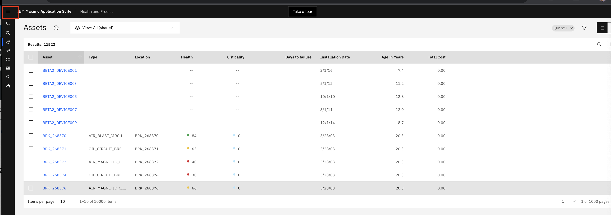

2. 再次点击 `汉堡包` 菜单图标以关闭菜单滑块。

    
有一个选项可以创建私有视图和对所有人可用的公共视图。
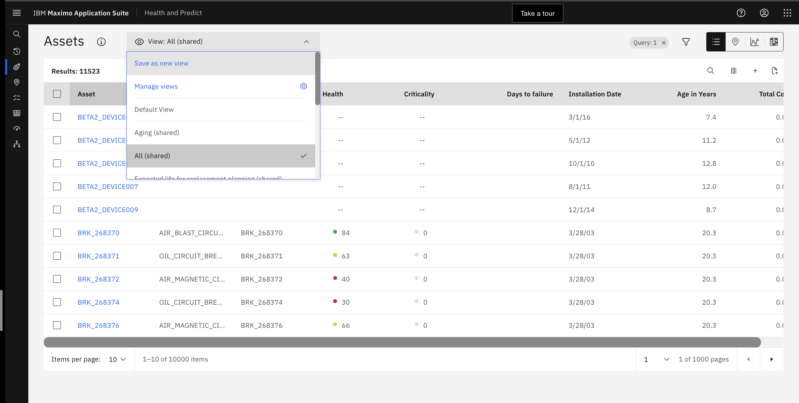

!!! note "价值"
    保存的视图允许您返回到特定视图,这样他们就不必每次都重新开始。此视图过滤我的变电站变压器。

!!! attention "操作"
    使用选择框显示您保存的视图。

1. 点击选择框以显示保存的视图,然后点击 `变电站变压器` 视图。
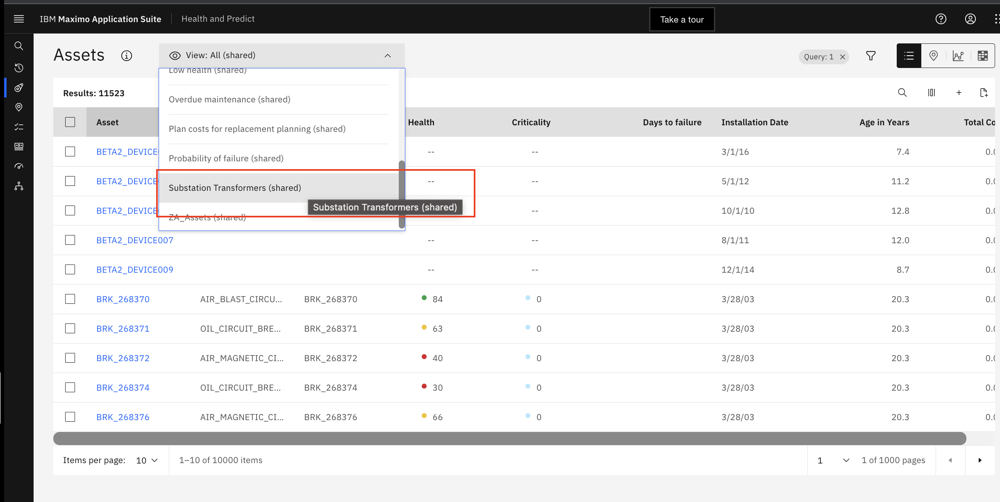

在表视图中,有包含计算数据的列。有健康评分,这些评分是从 `评分设置` 菜单为资产组创建的。这些指定了计算评分的组。要使用的 notebook 查询以及评分应该计算的频率。

!!! note "价值"
    您不必花时间创建自己的模板,而是可以使用包含的 notebook 模板,其中包含预定义的行业标准公式来计算资产的健康、关键性、风险、寿命终止和有效年龄评分。

!!! attention "操作"
    按照以下操作进行

1. 您可以在表视图中显示对您最重要的数据。使用选择框选择要在表中显示的资产数据列。
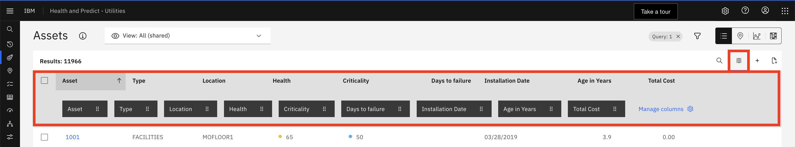
2. `故障天数` 列来自在 `Predict 设置` 选项卡中定义和计划的预测模型。
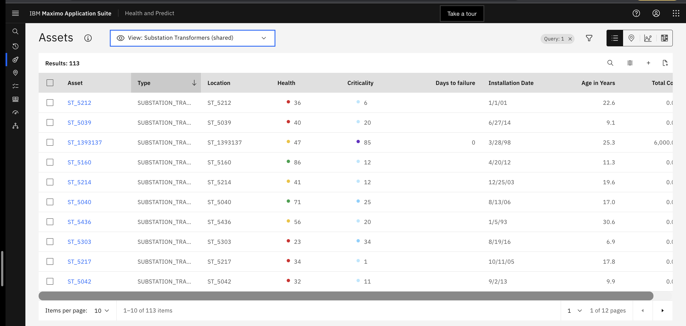

IBM Maximo Models for Electrical Distribution 包括以下模型模板:

- 变电站变压器/变电站电源(IBM 变压器分接开关)

- 断路器

    - 空气断路器(IBM 断路器空气断路)

    - 空气磁性断路器

    - 断路器

    - 油断路器(IBM 断路器油)

    - SF6 断路器

    - 真空断路器

- 配电变压器(IBM 变压器分接开关)

    - 架空(多个)

    - 地下(多个)

- 仪表变压器

    - 干式电流互感器

    - 充油电容式电压互感器

    - 充油电流互感器(IBM 仪表充油 CT)

    - 充油电压互感器

    - SF6 填充电流互感器

- 开关设备/气体绝缘开关设备(IBM 气体绝缘开关设备)

###  地图视图

另一个帮助识别有问题资产的视图是地图视图。使用聚焦于容器的地图视图是了解地图视图功能和优势的好方法。容器使您能够反映资产的地理位置和业务区域的地理围栏。它可以是您负责服务的区域、城镇、服务订户区域。

我们将查看一个包含变压器、断路器、电缆 (OTW) 和开关混合的区域。选择一组资产或容器,其中包含变压器、断路器、电缆 (OTW) 和开关的混合。

!!! note "价值"
    查看资产的空间分布可能有助于识别和调查有风险的资产。这在具有互连性、天气或责任区域的地理位置依赖性的公用事业行业中尤其如此。

!!! attention "操作"
    按照以下操作项进行操作。

1. 您过滤要关注的资产组。重置 `视图` 以显示 `所有共享` 资产。如果您忘记了如何执行此操作,请参考早期说明。
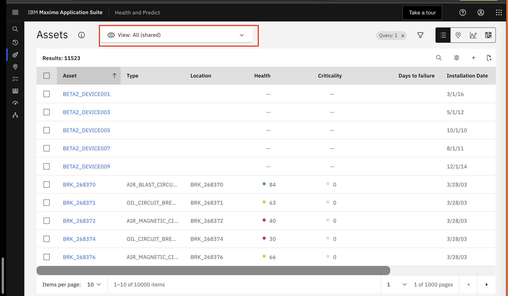
2. 点击看起来像漏斗的 `过滤器` 图标。
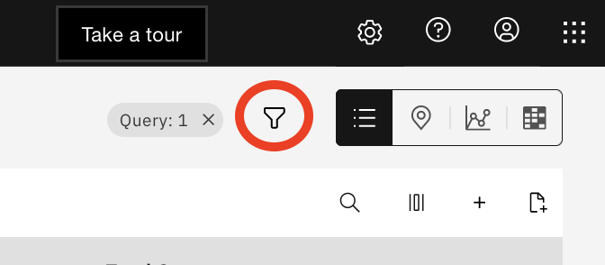
3. 选择容器的 `铅笔` 符号
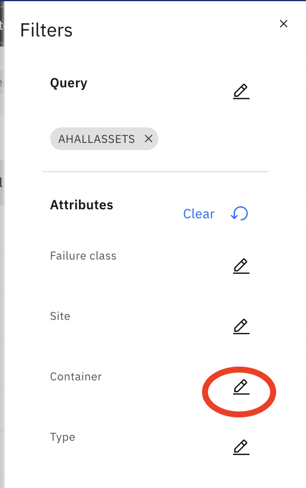
4. 选择 `NIXON9098`
5. 点击 `确定`
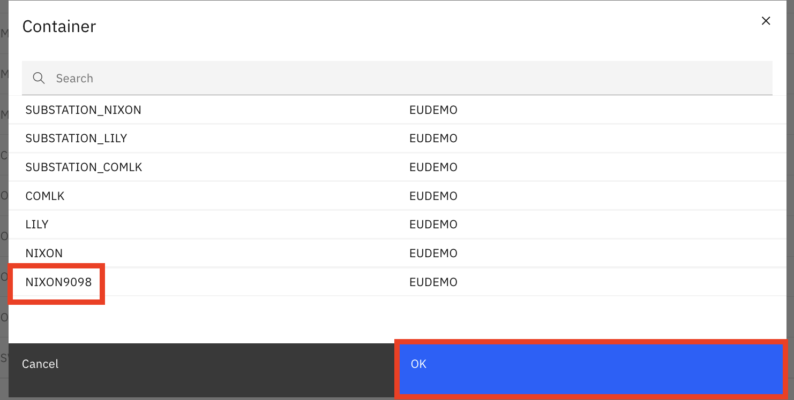
6. 点击 `应用`

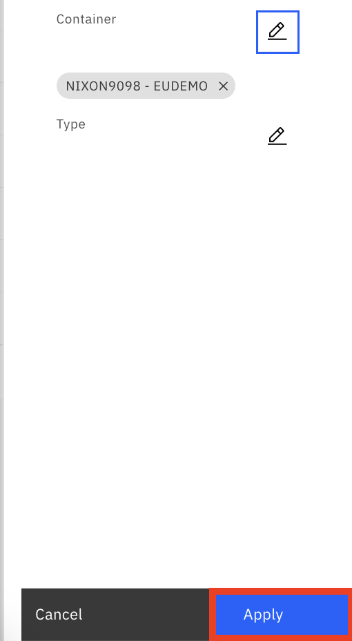

您可以看到此容器中有 261 个资产。当我们按健康评分从低到高排序时,我们发现有许多资产的 `健康` 评分处于不良健康状态,其中许多资产的 `关键性` 评分为 0。这令人担忧。可以使用多个列标题进行排序,以帮助以不同方式可视化数据。按最关键的资产和健康状况最差的资产排序。

!!! note "价值"
    能够快速关注您负责的需要采取行动的资产。

!!! attention "操作"
    Follow the action items below.

1. On the `Assets Table` view, click `Health` column title to sort assets by the `Health` score.  
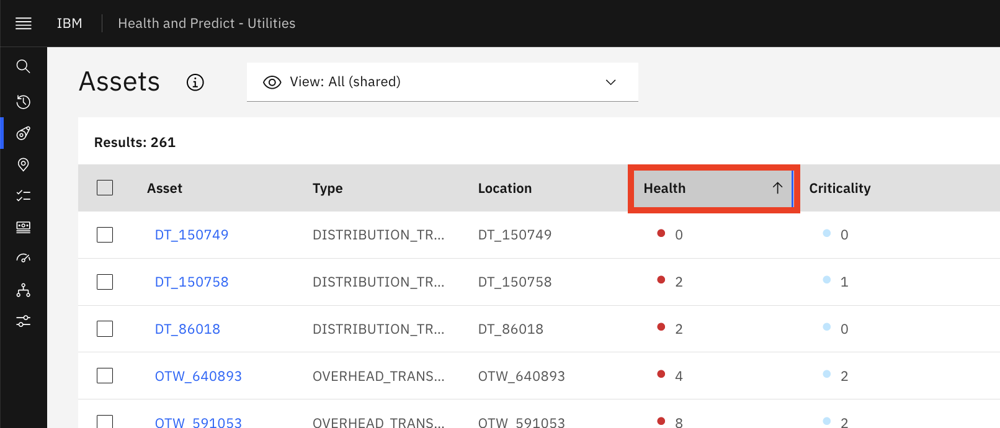

2.  Asset `Criticality` can be measured by understanding the importance an asset has to the grid performing it's job of providing 
electricity to customers.   Asset `End of Life` is important to know so that assets can be planned to be replaced before they reach 
their end of life.  On the `Assets Table` view, click `Criticality` column title to sort assets by the `Criticality` score. 

You need to understand the relative position of the assets with the worst health and most critical in reference to the service are you are responsible for.  

!!! note "Value"
    `Maps` provide a way to understand an asset condition scores relative to position, connectivity and condition of the impacted service areas using `Containers`. 

!!! attention "Actions"
    Follow the action items below.

1. Click `Map` button.  Selecting the `pin` icon in the upper right of the screen shows the selected assets on a map view.
The different `pin` colors and icons represents the health of the assets, according to the legend at the bottom left of 
the screen.  This is a quick way to understand which assets are in poor health.

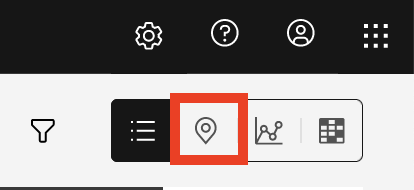

3. Adjust the map using the controls and mouse.  You can expand a two finger pinch press on the touch pad to zoom in.   
To move the map push one finger and move with the other finger on the touch pad
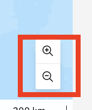
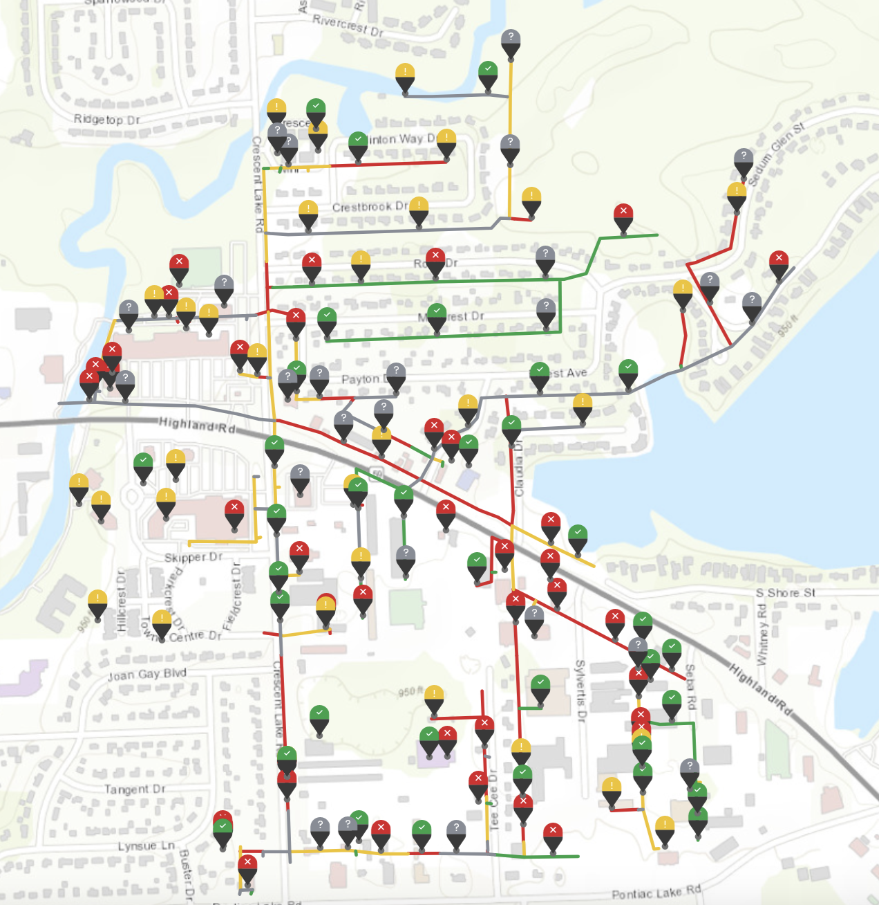

    按照以下操作项进行操作。

1. 在 `资产表` 视图上,点击 `健康` 列标题以按 `健康` 评分对资产进行排序。

2. 资产 `关键性` 可以通过了解资产对电网执行向客户提供电力的工作的重要性来衡量。资产 `寿命终止` 对于了解很重要,以便可以计划在资产达到其寿命终止之前更换资产。在 `资产表` 视图上,点击 `关键性` 列标题以按 `关键性` 评分对资产进行排序。

您需要了解健康状况最差和最关键的资产相对于您负责的服务区域的相对位置。

!!! note "价值"
    `地图` 提供了一种使用 `容器` 了解资产状况评分相对于位置、连接性和受影响服务区域状况的方法。

!!! attention "操作"
    按照以下操作项进行操作。

1. 点击 `地图` 按钮。选择屏幕右上角的 `图钉` 图标会在地图视图上显示所选资产。不同的 `图钉` 颜色和图标代表资产的健康状况,根据屏幕左下角的图例。这是了解哪些资产健康状况不佳的快速方法。

3. 使用控件和鼠标调整地图。您可以在触控板上展开两指捏合按压以放大。要移动地图,请用一根手指按下并用另一根手指在触控板上移动

4. 通过打开 `容器` 选择,将在容器中的资产周围出现一个多边形。容器的颜色将反映容器的整体健康状况。

5. 点击 `容器` 图标,并切换打开 `容器`

6. 缩小以查看容器颜色。您可以在触控板上减少两指捏合按压以缩小。
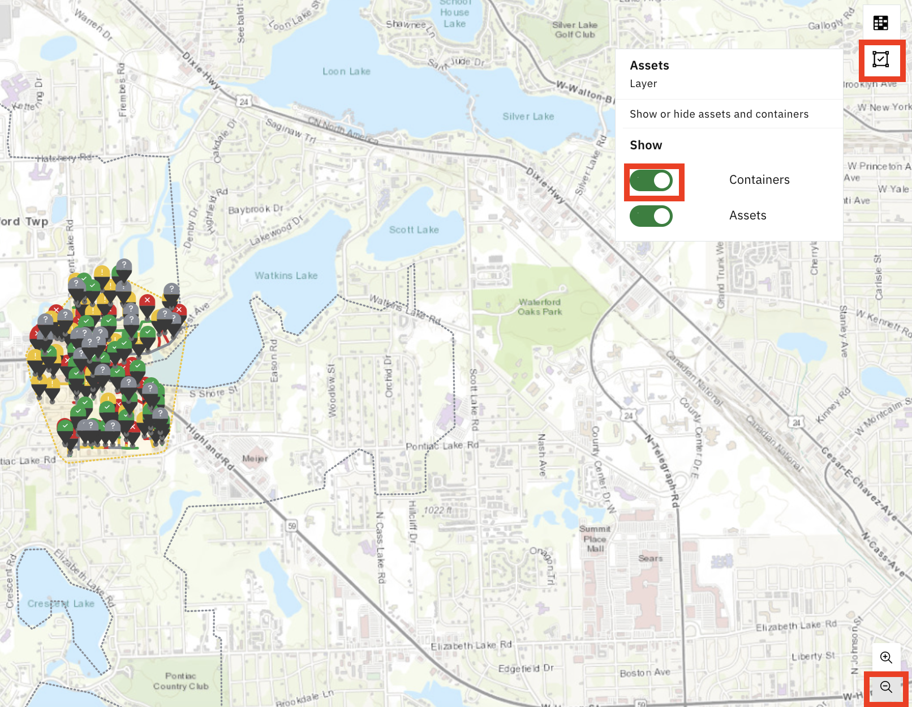

7. 点击 `评分` 图标并选择另一个评分将切换视图到不同的评分。资产颜色和容器颜色将相应更改。

8. 选择另一个评分,如 `寿命终止`
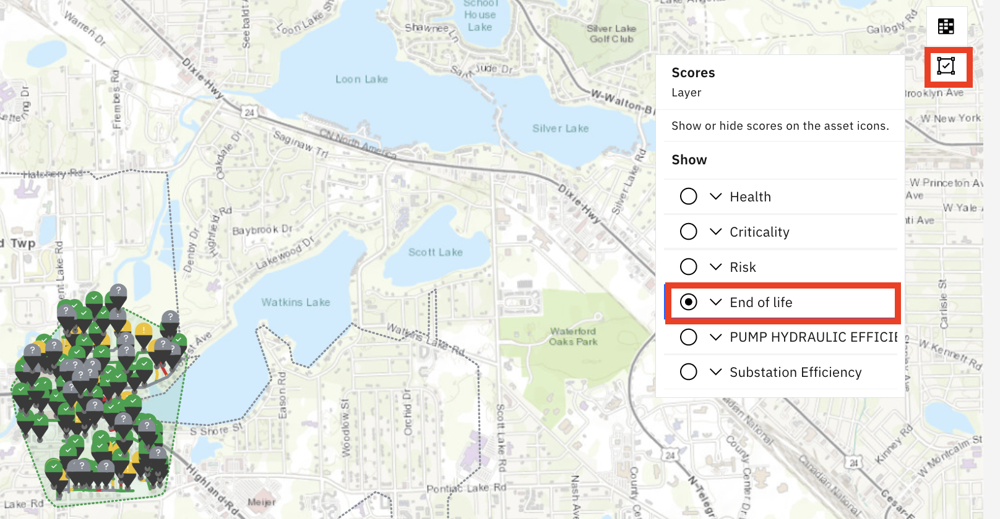

9. 您可以返回健康评分视图,将鼠标悬停在不同的资产和容器上会显示健康评分。点击 `健康` 按钮返回原始视图。

10. 放大或缩小,直到您看到容器轮廓颜色从黑色变为另一种颜色。您可以在触控板上两指捏合按压并将手指挤压在一起以放大,展开以缩小。或者您可以使用右下角的缩放 `加号` 和 `减号` 图标。

11. 将鼠标悬停在 `容器` 轮廓上以显示 `容器` 的 `健康` 评分。
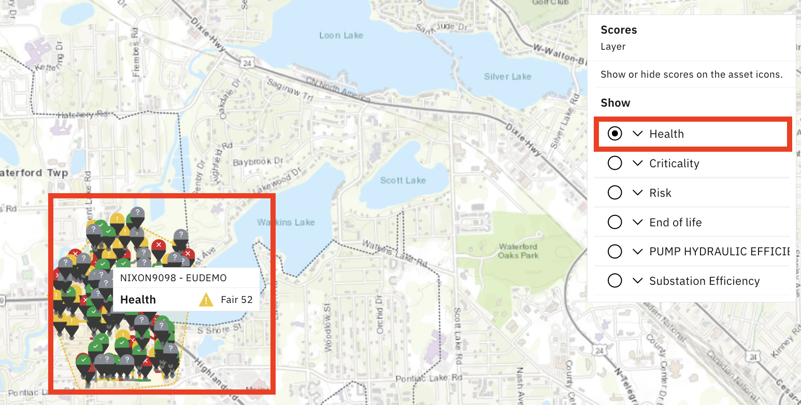

12. 点击容器 `NIXON9098`,它是地图上资产周围的虚线,以在单个卡片上显示该容器中所有资产的平均评分。
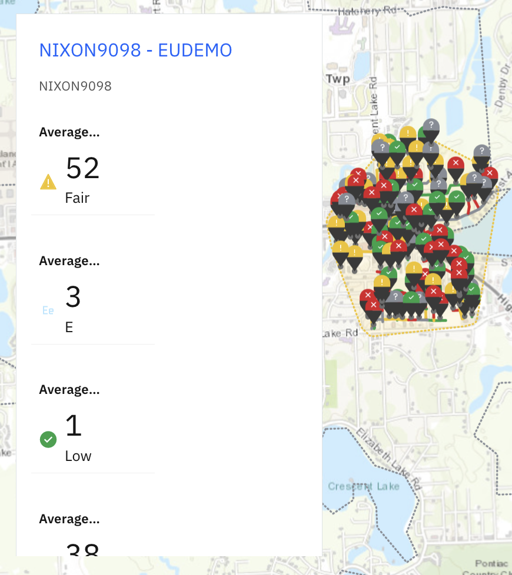

您可以放大以查看每个资产图钉位置。通过点击图钉,您可以查看该资产的关键资产 KPI。您可以通过点击 `操作` 按钮在地图视图中对资产执行操作,例如创建 `计划`、添加 `标记` 以进行跟进或 `提交工单`。工单将发送到 Maximo Manage,以便技术人员可以维修或检查资产。

!!! attention "操作"
    按照以下操作项进行操作。

1. 放大。点击 `ST_1400518` 的 `图钉` 以查看卡片。这是可能需要注意的变电站变压器。
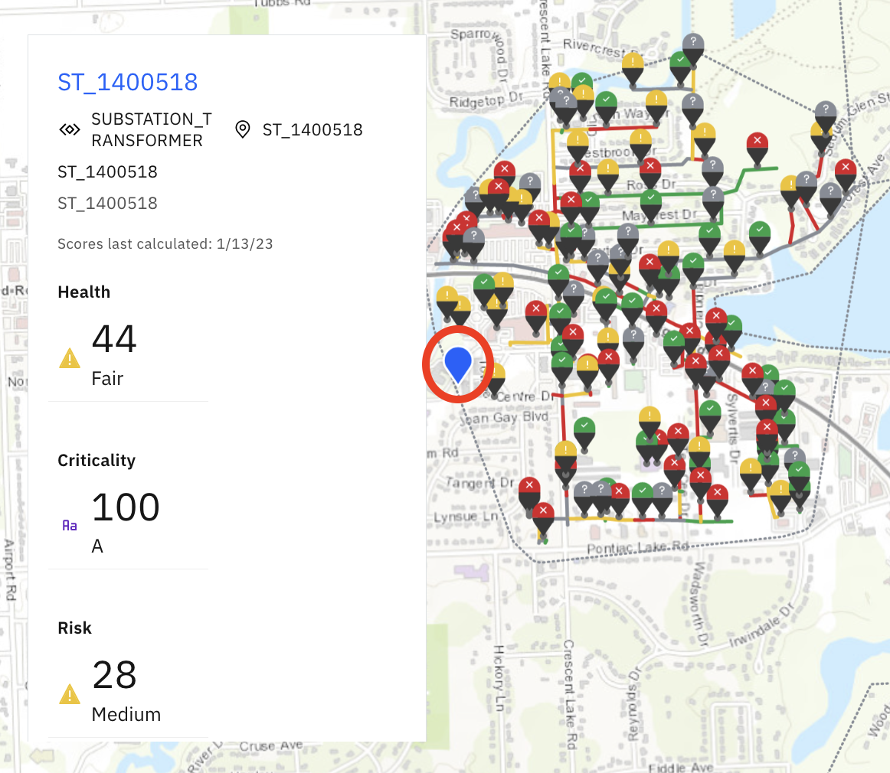
2. 点击 `操作` 下拉选择框按钮以查看可用选项。
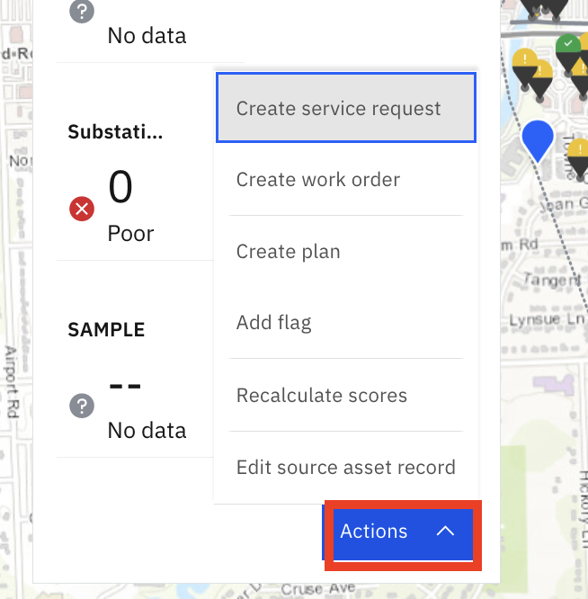

   
请注意,您可以点击 `资产名称` 以打开 `资产详细信息` 页面,稍后将对此进行说明。但是,还有其他方法可以识别健康状况不佳的资产。在下一节中,您将关注您负责的变电站变压器。

###  图表视图

`图表视图` 页面提供了另一种识别相对于彼此表现不佳的资产的方法。有四个开箱即用的图表可用,用于计算特定类别或状况范围内的资产数量。

1. 导航到 `图表视图` 页面。点击图表图标。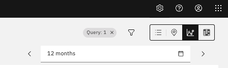
2. 选择一个"视图",例如从视图下拉选择框中选择 `带状态的泵`。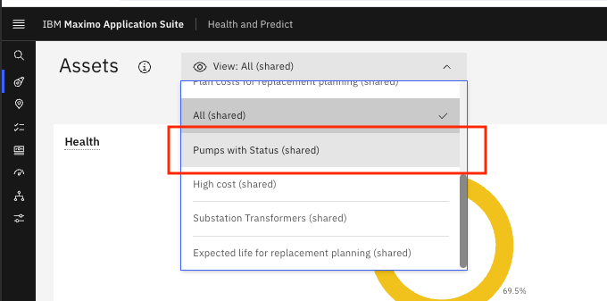
3. 查看总结当前选定视图资产性能计数(按范围)的四个图表 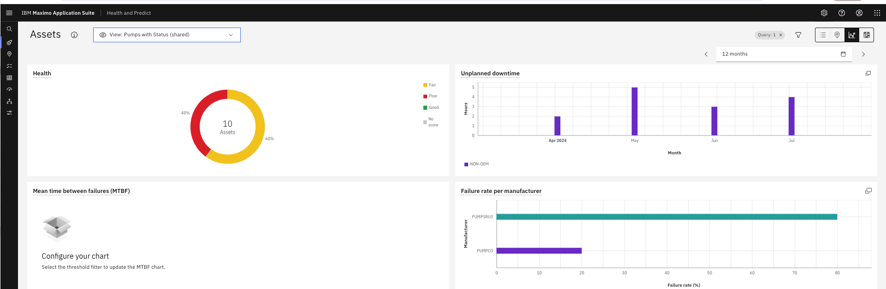

`图表视图` 显示 3 个图表:

- 按健康状况对所有资产进行分类的健康轮图。
- 计划外停机时间图表视图,显示按月的停机小时数。
- 按制造商划分的故障率图表
- 平均故障间隔时间,显示满足平均故障时间持续时间性能阈值的资产计数。

您将深入了解每个图表,以查看每个类别的资产详细信息。

!!! note "价值"
    按健康分布、按计划外停机时间或按制造商划分的故障率分类查看多资产的关键 KPI 可以帮助您了解资产故障趋势。

!!! attention "操作"
    按照以下操作项进行操作。

####  故障率图表

1. 在按制造商划分的故障率上,点击制造商 `PUMPSRUS` 以查看该制造商的故障。点击制造商 Boggs 显示 100% 的故障率。因此,Boggs 的所有资产都已失败。
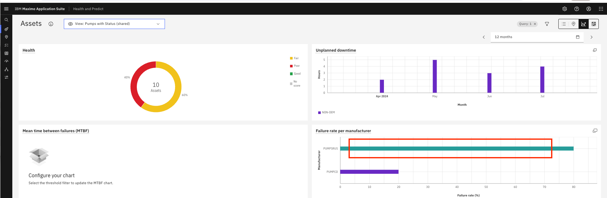
2. 在按制造商划分的故障率上,点击制造商 `PUMPCO` 以查看该制造商的故障。
3. 使用页面顶部的面包屑导航返回图表页面。点击 `资产` 面包屑导航返回图表页面。

####  平均故障间隔时间图表
 
1. 注意平均故障间隔时间图表未配置。每次导航到图表页面时,您必须选择要在当前图表上使用的阈值。点击过滤器 `漏斗图标` 以查看阈值选项以创建或选择现有的 `阈值` 值。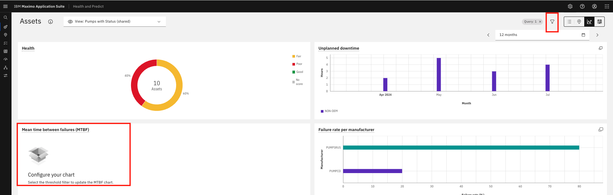 apm_9.0/img/mtbf_results.png
2. 点击 `阈值铅笔` 图标。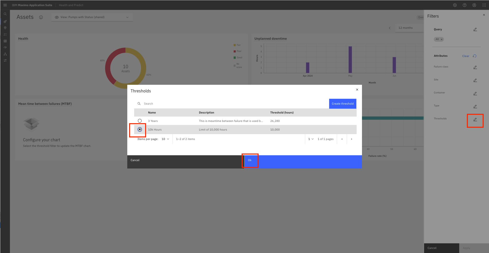
3. 点击 10k 小时的 `阈值` 单选框,以指示资产在进行计划外维护之前必须运行超过 10k 小时。
3. 点击 `确定` 按钮和 `应用` 按钮。[configure_chart_funnel](img/configure_chart_funnel.png)
4. 注意平均故障间隔时间图表显示一个条形图,其中包含资产计数:
      - 满足阈值。在进行计划外工单之前运行时间超过 10k 小时的资产的计数和列表。
      - 不满足阈值。在进行计划外工单之前无法达到 10k 小时的资产的计数和列表。
      - 缺少数据。缺少阻止计算 MTBF 的数据的资产的计数和列表。
      - 没有定义资产类别定义的资产。
5. 将鼠标悬停在 `红色` 条上以查看不满足平均故障间隔时间阈值的资产计数。
6. 点击 `红色` 条以查看不满足平均故障间隔时间阈值的资产列表。[mtbf_results](img/mtbf_results.png)
7. 点击 `资产名称` 以查看资产详细信息,以查看资产在进行计划外维护之前经过了多少平均故障间隔时间小时。[mtbf_assets_notmeeting_mtbf](img/mtbf_assets_notmeeting_mtbf.png)
8. 点击 `面包屑导航` 返回深入的资产列表。或点击下一个按钮以查看在进行计划外维护之前未达到平均故障间隔时间小时阈值的下一个资产。[mtbf_asset_details](img/mtbf_asset_details.png)

###  矩阵视图

另一个帮助您识别不同状况范围内资产数量的视图是 `矩阵视图`。

!!! note "价值"
    将时间花在调查和处理表现出满足您的评分范围标准的多种状况的资产上。

!!! attention "操作"
    按照以下操作项进行操作。

现在选择您想要关注所有变电站变压器,通过更改 `类型` 过滤器,并选择 `图表视图` 以了解资产相对状况和性能。

!!! attention "操作"
    按照以下操作项进行操作。

1. 使用以下说明返回 `表视图`。
2. 通过点击 `容器` 过滤器上的 `X` 重置视图以显示 `所有(共享资产)`
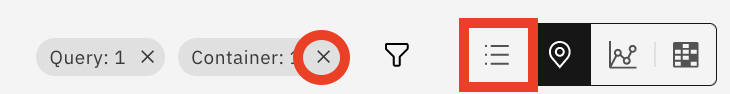
3. 点击 `漏斗` 符号
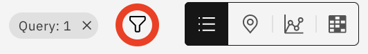
4. 选择 `查询` 的 `铅笔` 符号
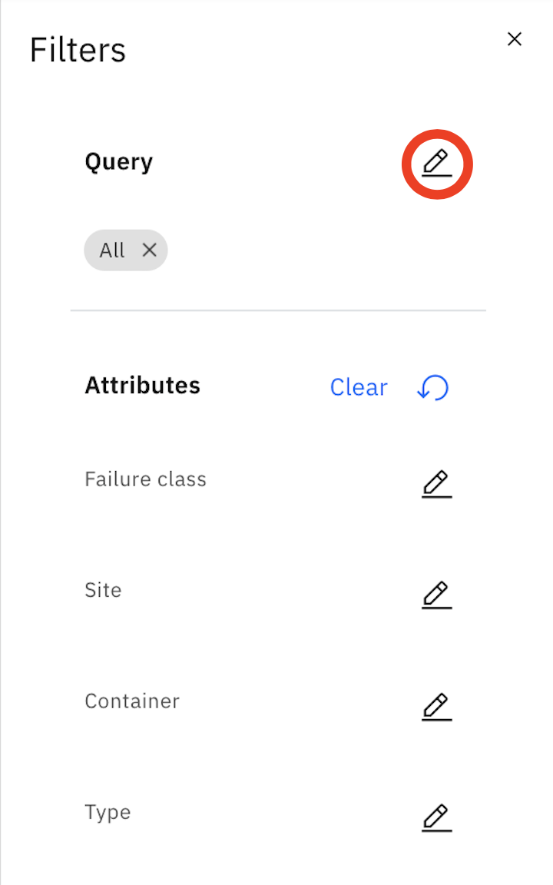
5. 从列表中选择 `ST_EUDEMO_A`
6. 点击 `确定`
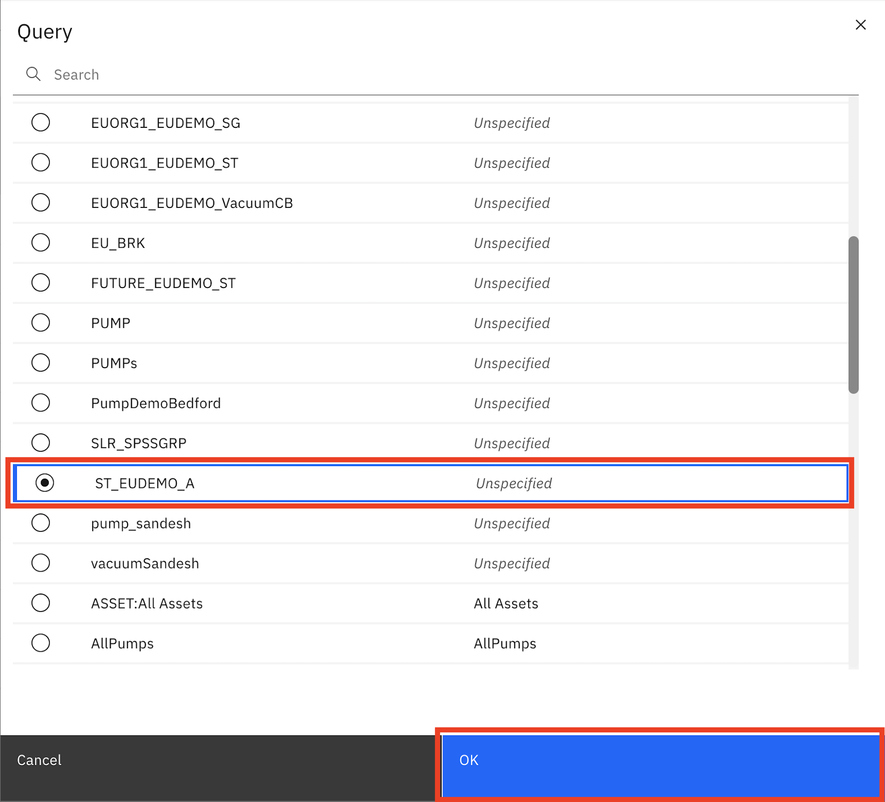
7. 点击 `应用`

8. 您现在将看到所有变电站变压器的结果。
9. 选择屏幕右上角看起来像矩阵的第 4 个图标。
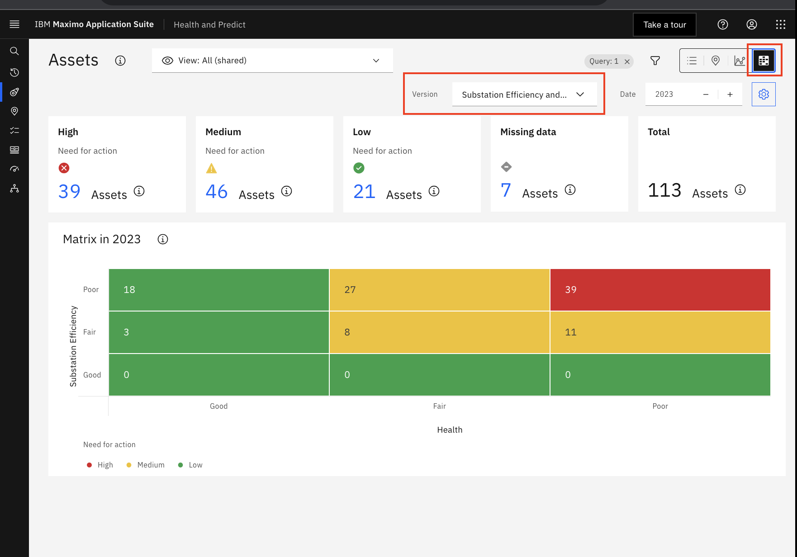
10. 您可以在矩阵视图上看到分类的资产数量。
11. 将矩阵版本设置为 `关键性` 和 `寿命终止`,以查看 X 和 Y 轴更改以及评分范围更改为不同的评分范围类别。注意有多少资产是 `需要采取行动的高需求`,这意味着它们需要采取行动。
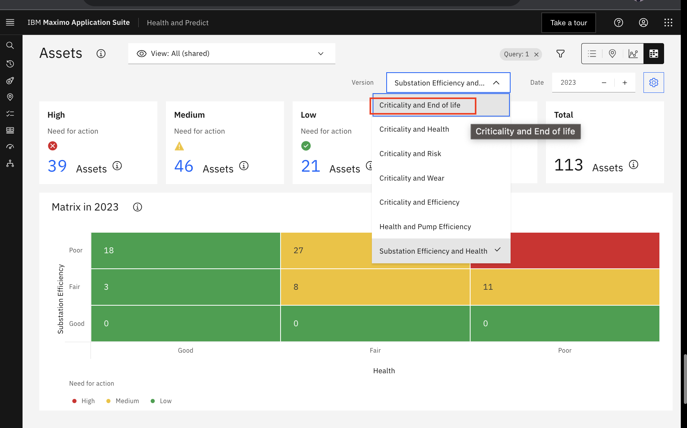
12. 点击 `资产` 面包屑导航以导航回 `矩阵` 视图。
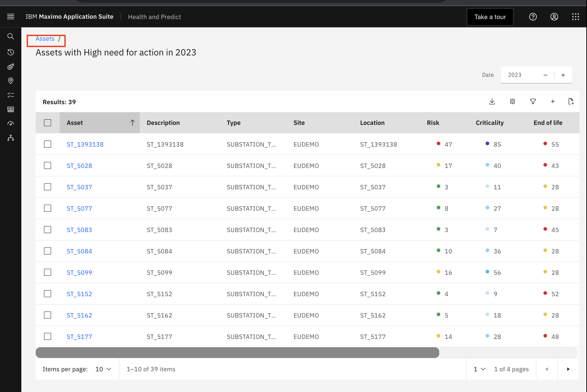
13. 将矩阵版本设置为 `关键性` 和 `寿命终止`。

14. 您可以深入到 `关键性` A 和 `寿命终止` 高的红色单元格,以查看哪些资产接近其寿命终止。点击资产数量 `#`。
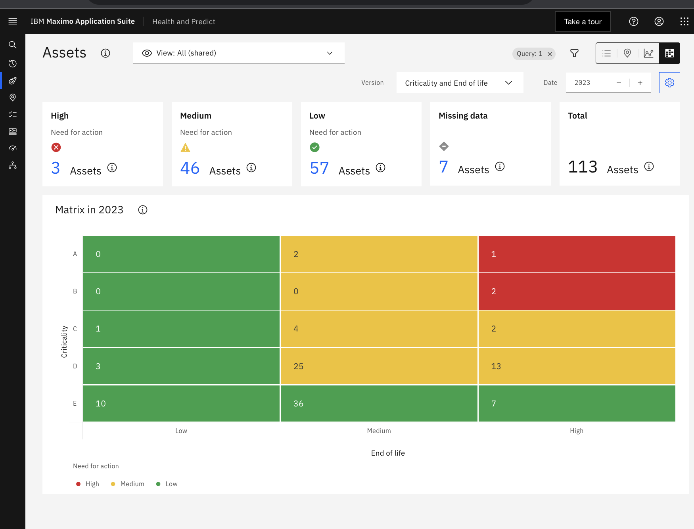
15. 如果您已配置预测评分 notebook,您还可以在未来几年查看矩阵中的资产数量。

###  工作队列视图

使用 `工作队列视图` 是识别有问题或需要您注意的资产的另一种方法,以便您可以采取行动以确保能够计算 KPI 并避免资产计划外停机时间,并在维护计划中更加主动。

Health 和 Predict 包含许多 `工作队列`。以下是一些示例 `工作队列`

- 预测具有 `高故障概率` 的资产
- 识别 `健康状况不佳的资产`
- 识别 `缺少数据的资产`

工作队列是预配置的视图,旨在帮助查找满足特定条件的资产。可靠性工程师可以使用它们依次系统地处理列表中的每个资产,并"处理"列表。

!!! note "价值"
    允许您确定工作的优先级并专注于解决特定问题,例如公用事业,试图避免计划外停机时间。

!!! attention "操作"
    按照以下操作项进行操作。

1. 将鼠标悬停在左侧导航栏上以展开它
2. 选择左侧导航栏上的 `工作队列` 部分
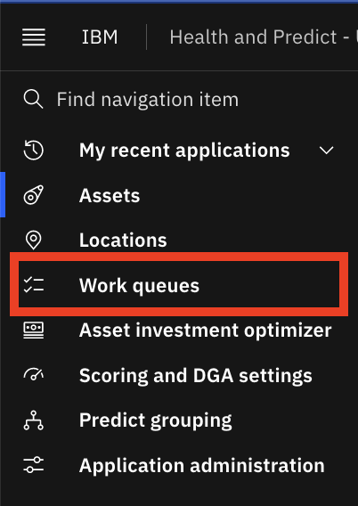
3. 选择 `PM 之前失败` 工作队列
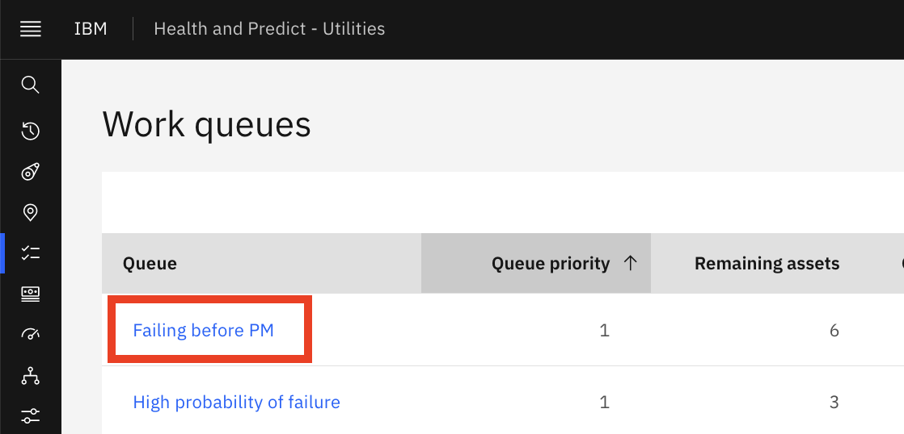

   

## 调查

`PM 之前失败` 工作队列显示该工作队列中具有评分的所有资产。作为公用事业工厂的可靠性工程师,避免故障至关重要。请注意,对于此 `工作队列`,有几个泵和变电站变压器在其下一个计划维护日期之前预测会发生故障。其中两个变压器位于之前查看的容器中。您将在队列中选择 `ST_1400518`,通过调查和处理工作队列中的所有资产来开始管理当天的工作负载。您将使用资产详细信息视图更好地了解 `ST_1400518` 的整体资产状况,以便您可以更好地评估和选择纠正措施。

!!! note "价值"
    缺少数据 `工作队列` 对于可靠性工程师识别创建健康评分或预测故障日期模型所需的数据差距很有用。

!!! attention "操作"
    按照以下操作项进行操作。

1. 选择 `ST_1400518`,这将打开 `资产详细信息` 视图。此页面上的详细信息会有所不同,因为这是一个实时演示环境系统。
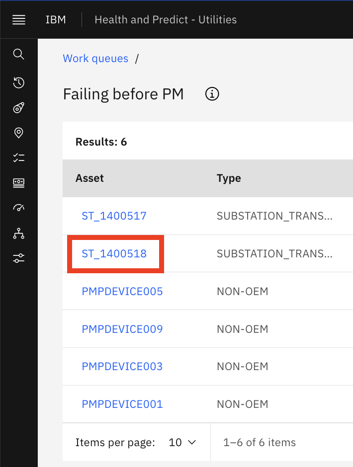

###  资产详细信息视图

在 `资产详细信息` 页面的顶部,有来自此变电站变压器的预定义 notebook 的结果评分。这些是健康、关键性、风险、寿命终止和有效年龄评分。请注意,有效年龄是使用实际年龄和健康评分的计算。健康状况不佳的资产的有效年龄将大于其实际年龄。

在第二行,有自定义评分,如 `变电站效率` 评分。
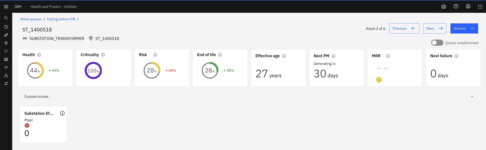

下一个 `预防性维护` 日期和 `MRR` 直接来自 Maximo Manage。

!!! note "价值"
    资产详细信息页面对于调查资产很有用。资产状况信息以易于阅读的表格、图表和图形呈现在单个页面上。

- 在页面顶部,有关于资产的详细信息和提供其当前状态快照的 KPI。
- 对于此资产,`健康评分` 为 44,处于中等 `一般` 区域。
- 此资产还具有高 `关键性` 和低 `风险评分`。
- 基于 `安装日期` 和制造商推荐的寿命,此资产即将发生 `故障` 的 `概率` 百分比较低。
- 该资产预计将在接下来的 0 天内失败,但下一次维护计划在 30 天后。

在调查开始时,您怀疑资产将在其计划维护之前失败。但是,仅通过查看 KPI,其他证据表明此资产可能有问题,需要立即采取一些行动。此资产的 `健康历史` 小部件位于 `评分小部件` 下方。使用历史健康图表,您可以看到此资产的健康状况长期以来一直很低。这是此资产需要注意的另一个迹象。

!!! note "价值"
    查看贡献者和历史健康评分可以深入了解特定评分为何朝一个方向或另一个方向发展的原因。

!!! attention "操作"
    按照以下操作项进行操作。

1. 向下滚动页面以了解有关资产健康状况的更多信息,转到 `评分详细信息` 小部件。
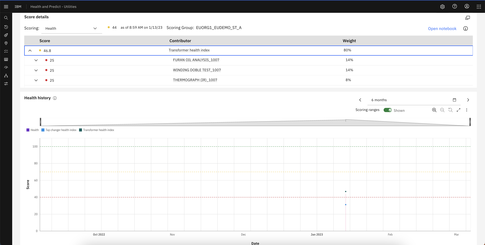
2. 了解导致资产健康状况不佳的因素,以了解如何解决问题。
3. 通过点击 `V 形符号` 展开视图以查看贡献者,以查看导致资产健康状况不佳的贡献者。
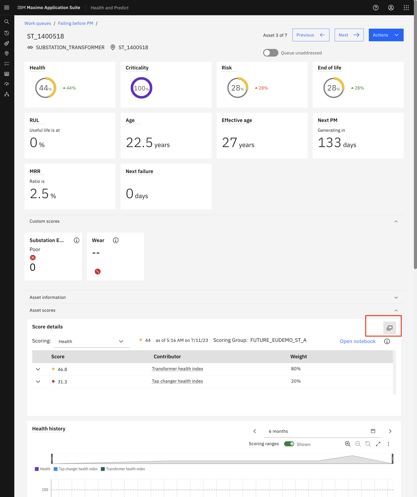
4. 查看并排序贡献者的完整列表,以帮助了解问题的根本原因可能是什么。点击 `权重` 以了解对 `评分` 贡献最大的因素
5. 从 `评分` 下拉框中,您还可以看到使用自定义评分模板创建的其他 `自定义评分` 贡献者。

Health 应用程序支持特定于资产的计算和可视化,例如变压器的 `溶解气体分析`。有两种类型的可视化小部件可用于使用检查或传感器数据读数了解变压器气体状况。

!!! note "价值"
    了解气体水平可以是潜在资产变压器问题的早期指标,如果不进行检查或维修,可能会导致计划外维护或故障。

!!! attention "操作"
    按照以下操作项进行操作。

1. 向下滚动 `资产详细信息` 页面,直到到达 `溶解气体分析` 磁贴。
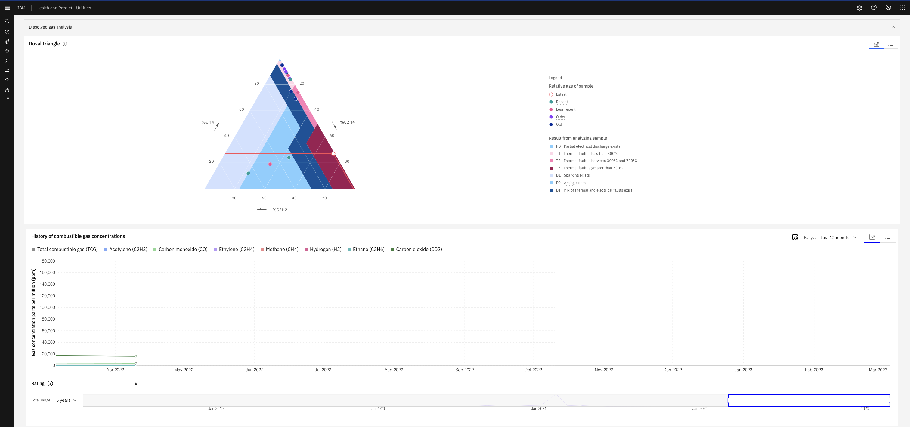
2. 点击每个 `点` 以获取有关这些类型气体量的详细信息。
3. 点击磁贴右上角的 `切换器` 图标,以在表视图中查看结果。
4. 另一个小部件是可燃气体浓度的历史记录。它显示了可燃气体趋势和随时间的评级。评级表示检测到的气体浓度的平均可接受性。评级由总体因素确定。
5. 将鼠标悬停在每个评估日期上以获取详细的资产状况信息。

Predict 附带了几个预测模型模板。您的数据科学家已经训练和部署了这些使用 Cloud Pack for Data 和 Watson Studio 构建的模型,这些模型包含在 Maximo Application Suite 中。IBM Predict 包括以下模板:

- 预测故障天数
- 计算故障概率
- 检测异常
- 根据组资产部署和退役日期生成资产生命曲线

这些模板包括大量算法,可以自动选择最适合数据的算法以获得最佳结果。这些模型旨在检测每个资产问题和故障模式的特定问题。它们可以使用 Maximo Asset Monitor 摄取的历史资产传感器数据或使用 Maximo Application Suite 附带的 App Connect 流式传输到 Health 的数据来检测问题并预测资产的未来状况。

!!! note "价值"
    了解未来可能发生的潜在问题使您能够在不影响客户服务或生产的情况下安排资产维护或更换。

!!! attention "操作"
    按照以下操作项进行操作。

1. 向下滚动 `资产详细信息` 页面,直到到达 `预测` 磁贴。
2. 双击 `预测` 磁贴以展开磁贴并查看预测卡。
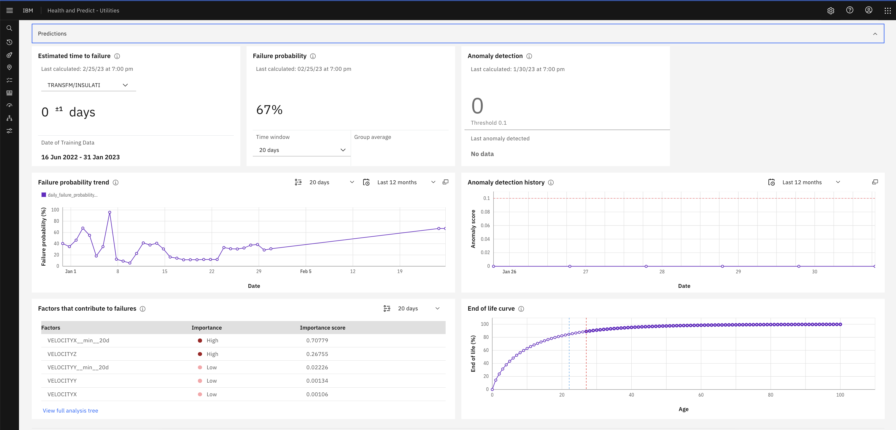

   
请注意,MAS 还包括 Watson Studio 和 Watson Machine Learning,数据科学家可以使用它们来构建、训练和维护预测模型。对于此资产,模型告诉我们它预计将在 0 天正负 1 天内失败。

如果您有故障历史数据,数据科学家可以使用 Predict 附带的模板为特定故障模式构建预测模型。

可靠性工程师可以在卡片中选择这些故障模式,以查看每种故障模式的预测。

故障训练数据用于帮助计算故障概率。可以计算不同的故障模式,并且确实会影响预测。

`故障概率` 是资产在特定时间段内可能发生故障的机会。对于此资产,由于过热,在接下来的 2 个月内有 20% 的故障概率。

数据科学家必须为时间段构建特定模型,就像故障模式一样。您可以通过在卡片中进行不同的选择来查看预测结果。

`故障概率历史` 显示每种模式的故障概率以及它如何随时间变化。

`导致故障的因素` 显示训练数据中哪些因素对故障的影响最大,从而指示可能导致未来故障的因素。
异常检测模型基于历史记录创建阈值,并在卡片中显示资产何时超过该阈值。

`寿命终止曲线` 是基于已退役资产的训练数据构建的。通过应用 notebook 中的有效年龄计算,此曲线可用于估计寿命终止故障的概率。

变压器的 `有效年龄` 为 27 年。该曲线产生 89% 的寿命终止概率。这是此资产需要立即处理的另一个迹象。

!!! note "价值"
    了解此资产的 `有效年龄` 和 `寿命终止曲线` 相对于所有资产,使您能够根据其运行和状况历史而不是其日历年龄来了解其可能的剩余寿命。

!!! attention "操作"
    按照以下操作项进行操作。

1. 将鼠标悬停在 `有效年龄` 与曲线相交的点附近。
2. 此资产相对于类似类别的其他资产的表现如何,以及它应该处于其年龄的什么位置?

`资产时间线` 卡在同一图表中显示有关资产的几条关键信息。例如,时间线显示预测的故障(在图表的顶行),该故障将在下一次预防性维护(在图表的第二行)之前发生。
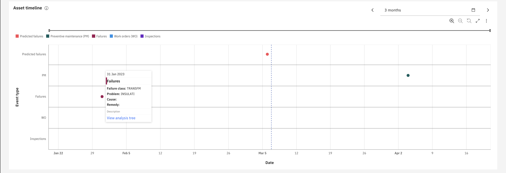

!!! note "价值"
    `资产时间线` 图表上的信息,如过去的工单和检查,提供了对资产历史的宝贵见解,可能有助于您更好地制定要采取的行动类型。

!!! attention "操作"
    按照以下操作项进行操作。

1. 向下滚动页面
2. 将鼠标悬停在时间线上的某个点上

此页面上还有其他几个部分,包括:

- `运营状态`,显示最近的仪表读数、维护历史,显示此资产的工单。
- `更换计划`,显示为此特定资产创建的任何更换或翻新计划。

!!! note "价值"
    虽然每条信息或卡片都提供了对我们资产状态的洞察,但所有信息放在一起,提供了更丰富的视图,并有助于就如何处理此资产做出数据驱动的决策。

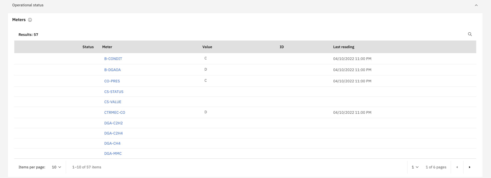
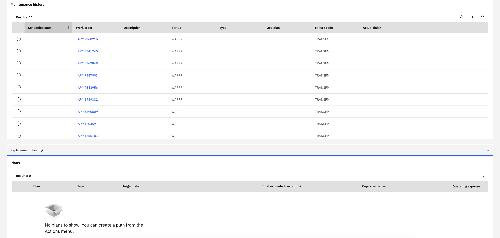

### 采取行动

从调查中有足够的证据对此资产采取一些行动。滚动到页面顶部并点击 `操作` 下拉选择框按钮以查看选项。

!!! attention "操作"
    按照以下操作项进行操作。

!!! note "价值"
    可以通过直接从资产详细信息页面点击几下来完成解决资产问题的纠正措施。

1. 滚动到页面顶部。
2. 点击 `操作` 按钮。
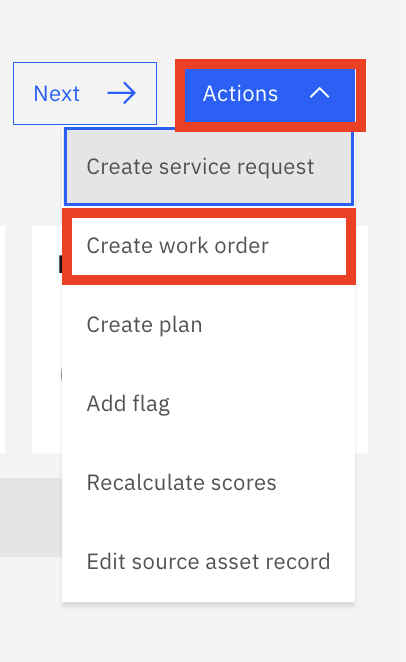

您可以:

- `添加标记`,在此资产上设置更换标记,以确保在下一轮更换计划中将其标记为要更换。
- `创建计划` 以更换或维修此资产。
- `重新计算评分`,如果有新信息或您的评分 notebook 已更改,您可以请求重新计算评分以反映这些更改。
- `编辑源资产记录` 以导航到资产记录以进行资产更改。在这种情况下,可能调整预防性维护计划。
- `创建服务请求`,以便技术人员可以进行资产维修、检查或更换。

但是,此资产需要紧急维护。通过选择 `创建工单` 选项并完成表单,为此资产创建紧急维护工单。

!!! attention "操作"
    按照以下操作项进行操作。

1. 选择 `创建工单` 选项
2. 显示表单
3. 点击 `取消` 返回资产详细信息页面
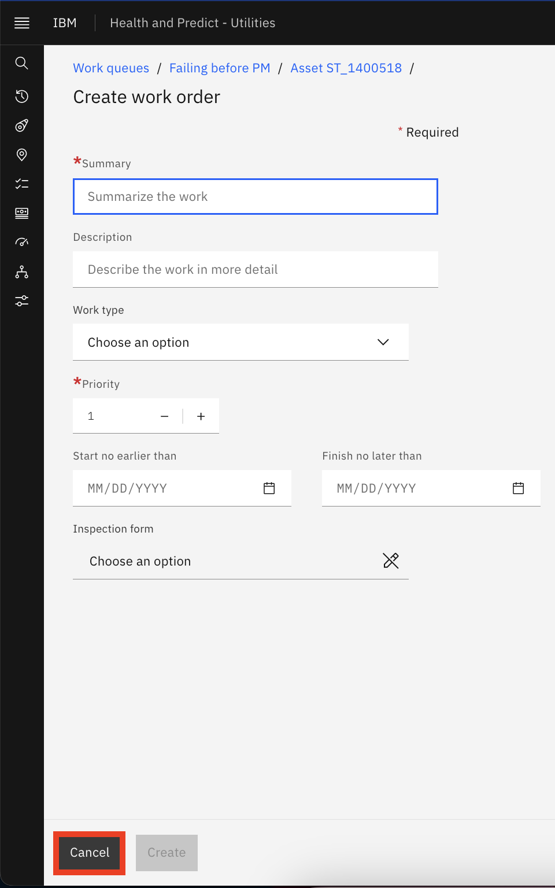

Health 和 Predict 提供了许多选项,可以使用表、地图、图表和资产详细信息视图识别有风险的资产。

此外,您可以使用预定义的 `工作队列` 来帮助系统地处理表现出相同问题或缺少数据以计算其评分的风险资产。

有一个单一页面可以进行调查并采取行动。在这种情况下,提交紧急工单以防止变电站变压器即将发生的故障。

在 Health and Predict – Utilities 中,还可以使用矩阵(自定义或 OOTB)并根据风险承受能力和可用预算进行长期更换计划。

### 使用地图识别/调查

从矩阵视图开始构建投资项目。

!!! attention "操作"
    按照以下操作项进行操作。

### 使用矩阵识别/调查

从矩阵视图开始构建投资项目。

!!! attention "操作"
    按照以下操作项进行操作。

1. 将鼠标悬停在左侧导航栏上以展开它
2. 选择左侧导航栏上的 `资产` 部分

3. 通过使用过滤器符号或保存的视图确保资产视图是 `变电站变压器`。如有必要,清除过滤器以从管理下的完整资产集开始
4. 点击"矩阵"图标以移动到矩阵视图

在这种情况下,默认矩阵视图设置为"变电站效率和健康"。这是一个自定义矩阵。开箱即用的矩阵有:
- 关键性和寿命终止
- 关键性和健康
- 关键性和风险

此自定义矩阵使用通过使用变电站变压器 notebook 生成的健康评分。变电站效率评分是自定义评分。在矩阵上,它们可以一起代表可持续性的代理。

!!! note "价值"
    查看资产如何按颜色分布以及针对两个变量,提供了一种识别有风险资产的简单方法。

要获得资产的不同视图,请使用下拉菜单更改矩阵的轴。

还可以通过点击设置齿轮来调整颜色模式。通过这样做,我们正在调整我们的风险承受能力。

!!! note "价值"
    更改矩阵的能力进一步允许您专注于特定资产。

!!! attention "操作"
    按照以下操作项进行操作。

1. 点击下拉菜单以显示其他矩阵选项
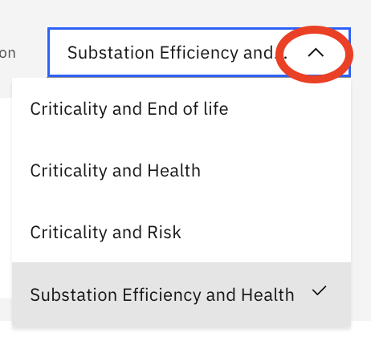
2. 点击设置齿轮以简要进入设置页面以显示该页面是可自定义的
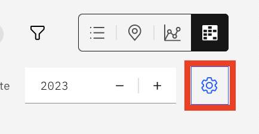
3. 点击 `关闭` 返回矩阵视图
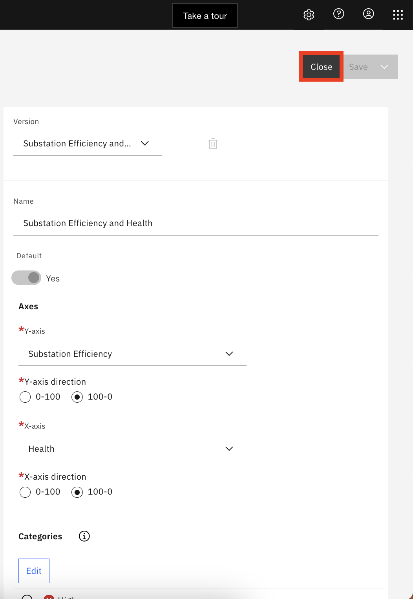

此视图显示有 35 个资产处于红色或高类别。点击摘要框或矩阵中的框,以在表视图中查看资产的详细信息。

此表视图提供了一个完美的示例,说明如何将资产添加到新的或现有的投资项目中。

!!! note "价值"
    向下钻取的能力允许您专注于有问题的资产,并仅对这些资产采取行动。

!!! attention "操作"
    按照以下操作项进行操作。
    
1. 点击包含 35 个资产的"高"框
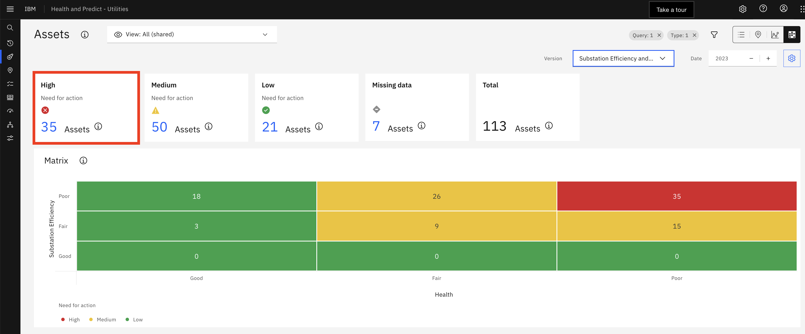
2. 从表视图中,演示如何通过点击顶部的选择框来选择所有资产
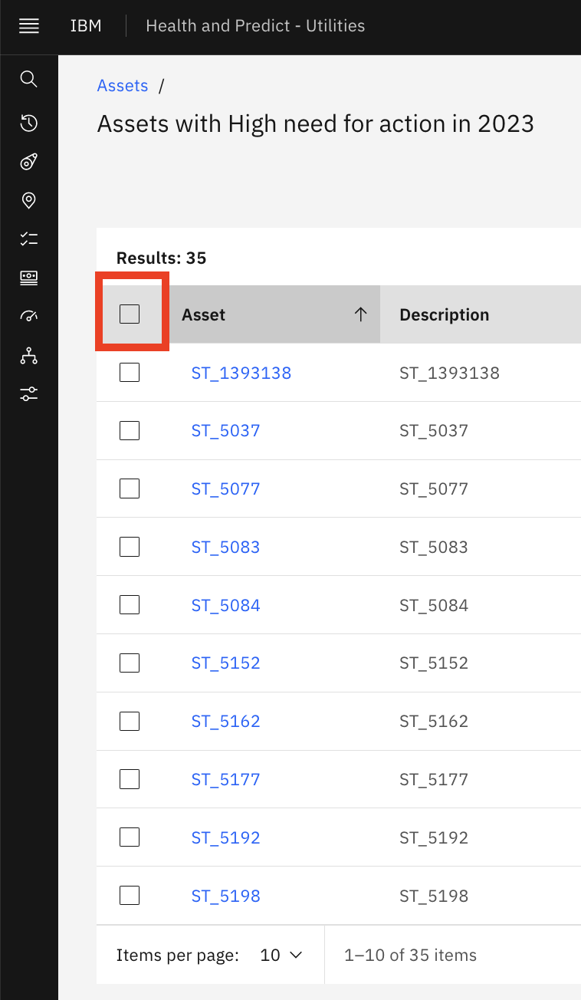
3. 显示将资产添加到新的或现有投资项目的选项
4. 点击 `取消`

5. 点击 `资产` 面包屑导航返回矩阵
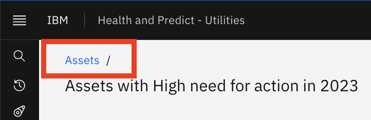

### 使用 AIO 采取行动

在 Health and Predict – Utilities 中,有一个构建资产投资优化器 (AIO) 项目的功能。

AIO 流程从构建资产项目开始,为项目分配长度和开始日期,然后运行多个策略以确定在项目生命周期内应该更换哪些资产以及何时更换。

!!! note "价值"
    利用高级数据驱动分析从各个维度全面优化运营支出和资本支出。

在这种情况下,已经使用"红色"单元格中的 35 个资产和旁边"黄色"单元格中的 26 个资产构建了一个项目。

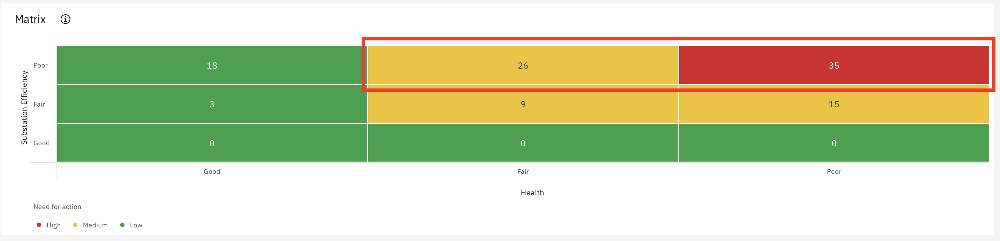

!!! attention "操作"
    按照以下操作项进行操作。

1. 将鼠标悬停在左侧导航栏上以展开它
2. 选择左侧导航栏上的 `资产投资优化器` 部分

3. 从 `项目` 选项卡,点击 `ST 投资项目`
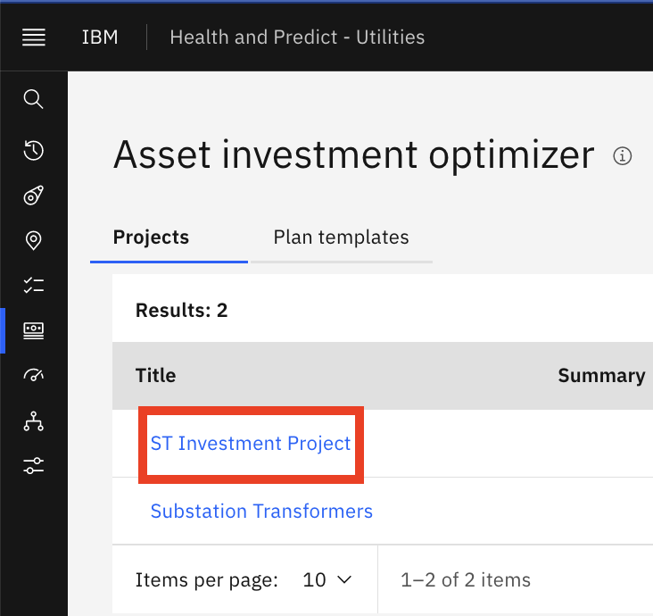

"ST 投资项目"中构建了 3 个策略。

第一个策略是在 25 年项目中为 61 个变电站变压器维持 8.2 的平均风险。

第二个是将风险降低到 7.0。

第三个是保持在 216 万美元的预算内。

每个场景都使用为变电站变压器特定更换成本和故障成本构建的计划模板。

!!! note "价值"
    可以运行多个场景以确定满足企业风险承受能力和项目可用预算的最佳策略。

!!! attention "操作"
    按照以下操作项进行操作。

1. 点击 `维持风险` 场景
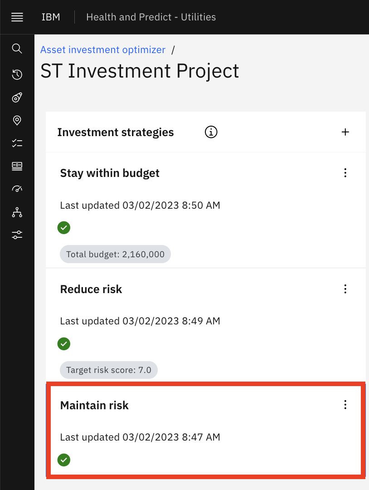
2. 使用 2 个"详细信息"按钮在场景成本和特定更换计划之间切换来查看场景
3. 对"保持预算"和"降低风险"场景重复该过程以查看每个场景
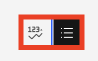

最多可以并排比较三个策略,并且可以导出详细信息。

!!! attention "操作"
    按照以下操作项进行操作。

1. 点击 `比较策略` 按钮
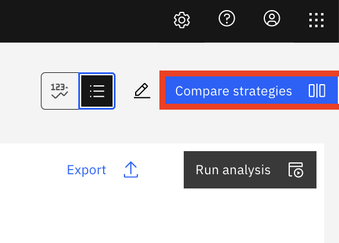
2. 从弹出窗口中,点击所有三个场景
3. 点击 `比较`
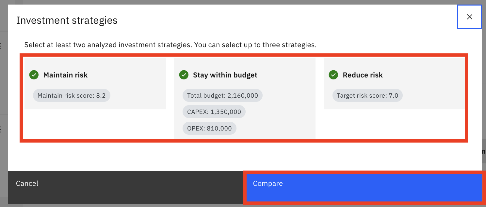
4. 查看输出,注意每个策略的结果
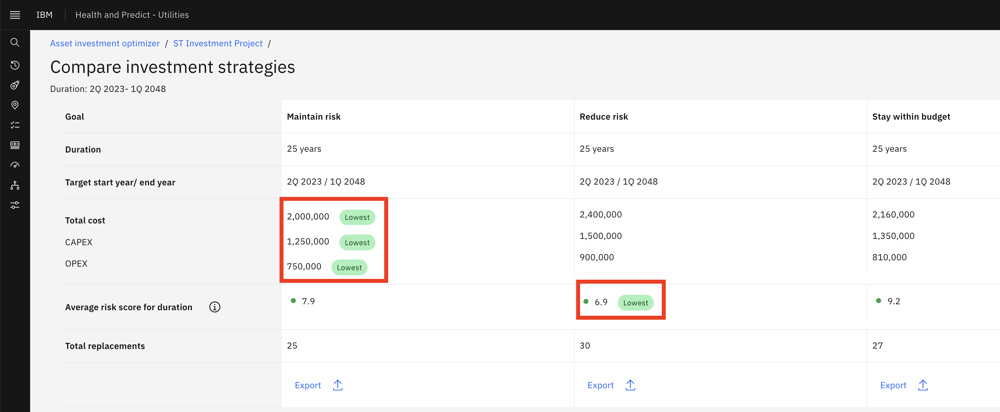

## 总结

作为维护电网的可靠性工程师,我能够使用 IBM Maximo Health 和 Predict 识别有风险的资产,调查这些资产,并最终采取行动以防止故障和计划外停机...节省数千美元,并维护电网的完整性。

我的行动还将有助于推动维护和更换政策的短期、中期和长期投资决策。