# Health - Predict 实验
!!! note
    此实验正在开发中。并非所有步骤都完整或准确。

## Health 概览

现在已经确定一个资产产生了多个警报,运营经理要求可靠性经理更深入地研究所有类似的泵,以确保在计划维护之前没有预测会发生任何故障。

Maximo Health 和 Predict 面向可靠性工程师。它们共同提供企业资产当前状态的视图,并预测这些资产的未来状况。 

在本练习中,您将了解资产的健康状况。

1. 在右上角选择 Health Application。 
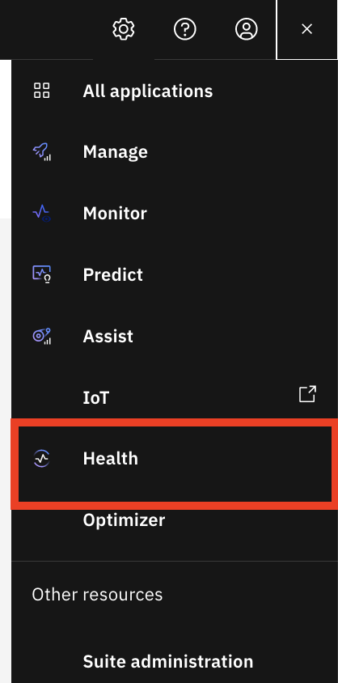

2. 在 health 中显示资产的网格视图。 
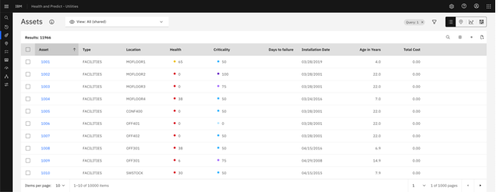

<b>价值:</b>

Health 和 Predict 为可靠性工程师提供 AI 驱动的洞察,以采取行动延长资产寿命、降低维护成本并消除计划外停机。您可以对资产属性进行排序和选择,以便对应该关注的资产进行排名和评级。

作为可靠性工程师,我将识别需要关注的资产,调查这些资产,最后采取行动以避免计划外停机。

## 查看资产的健康状况

从主 MAS 屏幕,点击 Health 磁贴以在 Maximo Health 和 Predict 中显示资产的网格视图。

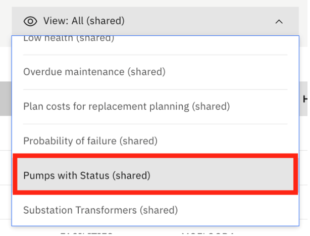

在主屏幕上,我可以在熟悉的网格视图中看到我的托管资产的通用视图。

<b>价值:</b> 

这对我作为可靠性工程师特别有价值,因为我可以在单个视图中同时看到 IT 数据(来自 Manage)和 OT 数据(来自 Monitor)的混合。 

这些资产来自 Maximo Manage,但我们可以连接到其他 EAM 系统。 

可以生成数据的不同视图,以便更容易识别我们的关键资产。在此网格上,我可以添加和移动列、筛选、搜索和排序。 

<b>价值:</b> 
您已创建了一个保存的视图,这样我就不必每次都重新开始。此视图包括状态列,筛选我的泵,并按 OEM 和非 OEM 对它们进行排序。  

在本练习中,您将了解如何使用保存的视图根据查询和筛选器定义快速访问资产。

1. 选择"Pump"视图,演示中可能有所不同。 
 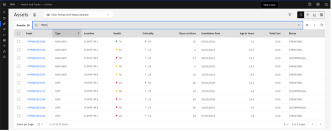

在此视图中,我可以看到两列计算数据。您可以看到健康分数,这些分数是在 Health 应用程序中从评分选项卡为资产组创建的。 

2. 在健康列下显示健康分数,并在左侧选项卡视图上显示评分选项卡。 

<b>价值:</b>
风险容忍度可能因行业、资产类型和企业而异。我可以定义特定于我的容忍度级别的评分范围。我甚至可以分配自己的颜色。 

 3.  在左侧选项卡菜单上显示 Predict Grouping 选项卡。同样,"故障天数"列中的信息来自 Predict Grouping 选项卡的预测模型。 
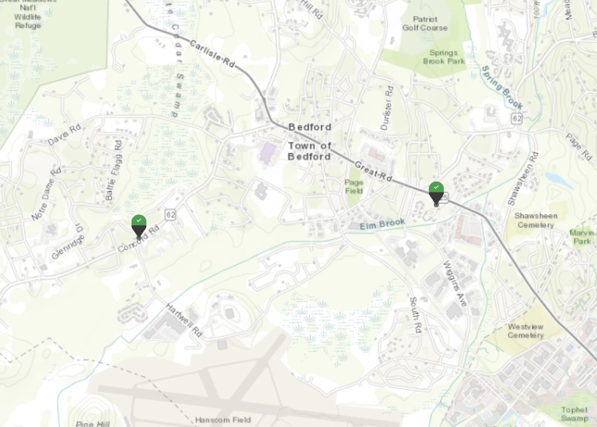

4. 搜索 `pmpd` 并点击地图图标。我可以看到我的泵处于各种健康状态,但总的来说,我的 OEM 泵健康状况更好。根据我从运营经理那里收到的信息,我怀疑我所有的非 OEM 泵都存在 O 型圈问题。 
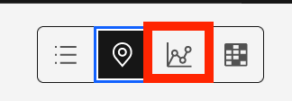

4. 选择屏幕右上角的地图图标。我还可以在地图视图上看到我选择的资产,其中包含类似的信息。 
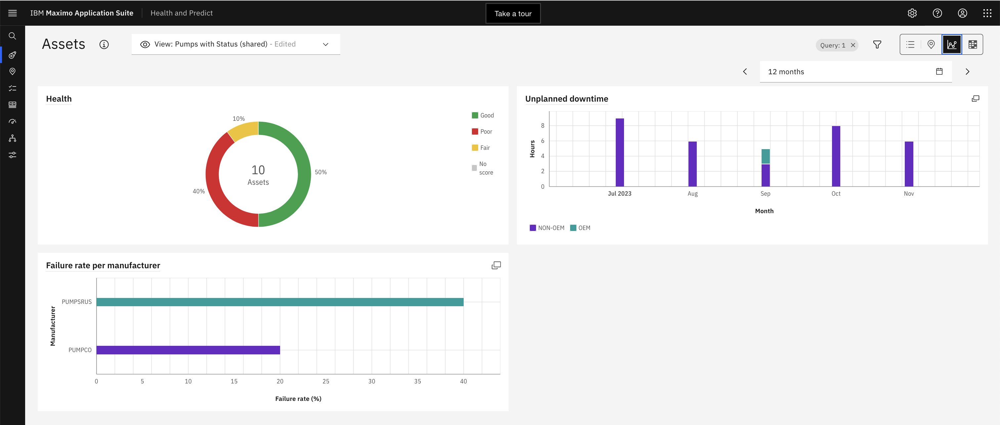

查看资产的空间分布可能有助于可靠性工程师识别和调查有风险的资产。这在公用事业行业尤其如此。

## 工作队列
我将继续调查以确定哪些资产预计很快会失败,但没有维护计划来解决故障。我想这样做以避免计划外停机,并在维护计划中更加主动。最简单的方法是使用工作队列功能。   

1.  在左侧选项卡菜单上选择工作队列选项卡,并显示工作队列。
 

工作队列是预配置的视图,旨在帮助您找到所需内容...并管理日常活动。   

这些对于需要解决特定问题的可靠性工程师特别有价值,例如水处理厂,试图避免计划外停机。在本练习中,您将了解 OOTB Health 工作队列。这使您能够专注于识别缺失数据的特定工作流任务,以便您可以计算重要的关键性能指标,然后找到需要关注和采取行动的资产。

2. 将鼠标悬停在 `Missing Data` 工作队列上。Health 和 Predict 包含许多工作队列。 
 
 有特定于 Predict 的工作队列,例如具有 `High Probability of Failure` 的资产。 

3. 将鼠标悬停在 `Low Health` 工作队列上。还有一个用于识别健康状况不佳的资产的工作队列。 

4. 将鼠标悬停在 `Missing Data` 工作队列上。还有显示缺少数据的资产的工作队列。`Missing Data` 工作队列对可靠性工程师非常有用,因为它们可以帮助识别计算健康分数或预测故障模型所需的数据差距。 
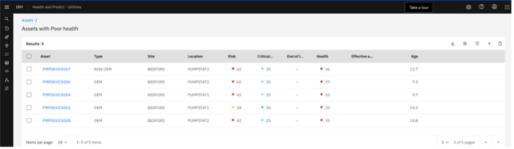

4. 将鼠标悬停在 `Failing Before PM` 工作队列上。我可以深入到 `Failing Before PM` 工作队列,查看该工作队列中具有分数的所有资产。作为水处理厂的可靠性工程师,避免泵故障对我来说至关重要。 
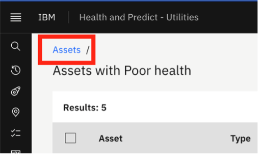

5. 深入到 `Failing Before PM` 工作队列。我们可以看到有 4 个泵在下次计划维护日期之前预测会发生故障,它们都是非 OEM 泵。 
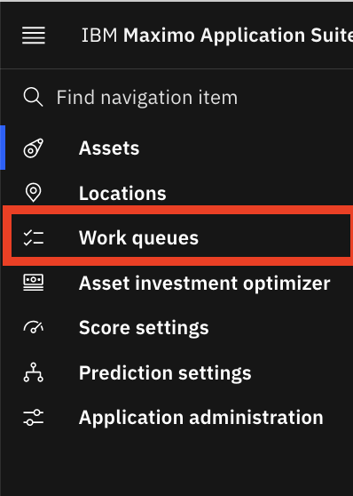

!!! note
    记录于之前的日期。

您可以在这里看到泵,我们的技术人员发现的那个有坏 O 型圈的泵。 

在队列中选择不同的泵,因为我们开始管理当天的工作量,调查和处理队列中的所有资产。 

## 资产详细信息

您可以了解更多有关资产健康分数的贡献者和有关资产的信息。

1. 点击 `pump 1`,这将打开资产详细信息页面 [此页面上的详细信息将有所不同,因为这是一个实时演示系统] 
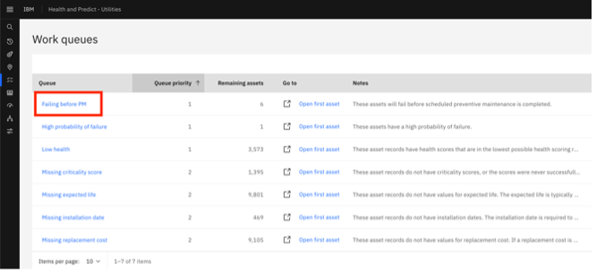

资产详细信息页面是调查资产的非常有用的工具。我们可以在单个页面上找到所有资产信息,以易于阅读的表格、图表和图形呈现。 

在页面顶部,我看到有关我的资产的详细信息,以及为我提供其当前状态快照的 KPI。 

对于此资产,我们的健康分数为 xx,处于黄色区域。我们还可以看到自上次计算以来它下降了 xx 点 

2. 在顶部显示健康分数和健康分数旁边的小数字。 

此资产还具有关键性和风险分数。这些也可以以类似于健康分数的方式计算。 

我们可以看到此资产基于安装日期和制造商推荐的寿命,具有其预期剩余使用寿命的 xx%。 

3. 在顶部显示 'RUL' 卡。我们可以看到我们的资产预计在接下来的 x 天内失败,但我们的下次维护计划在 x 天后。 

4. 在顶部显示 'Next Failure' 卡和 'Next PM' 卡。当我们开始调查时,我们知道资产预计在其计划维护之前失败。但是,仅通过查看 KPI,我们就有额外的证据表明此资产处于困境,需要采取一些行动 

在 KPI 部分下方,我们可以看到有关我们资产的更多信息,这些信息直接来自我们的 EAM 系统...在这种情况下,Maximo Manage,也包含在 Maximo Application Suite 中。

5. 滚动到健康详细信息并点击箭头以显示指标。有健康分数驱动因素和因素的细分,让我们深入了解导致其健康状况不佳的原因。 
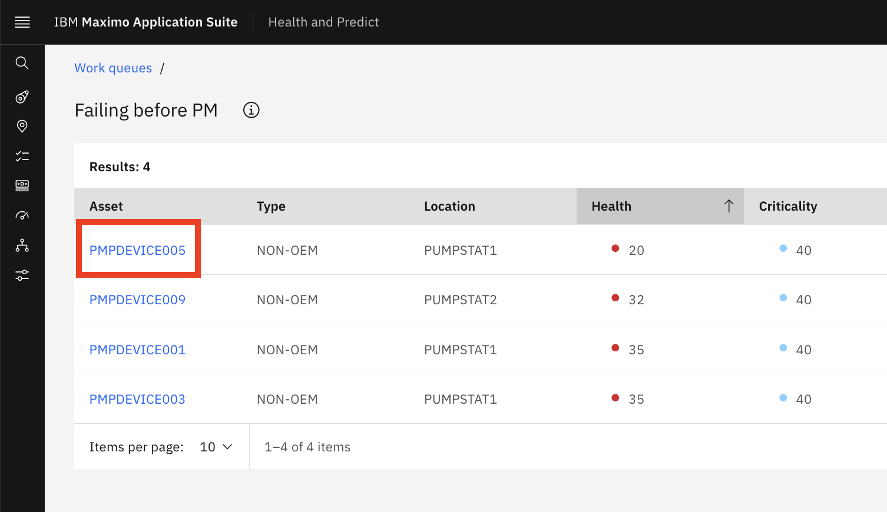

对于此资产以及同一组中的资产,我们可以看到健康分数是未完成工作订单、剩余使用寿命和仪表健康状况的加权平均值。

## Predict 概览

1. 从资产健康向下滚动到预测选项卡并打开选项卡。有几个预测模型构建用于对我们资产的传入传感器数据进行评分。 
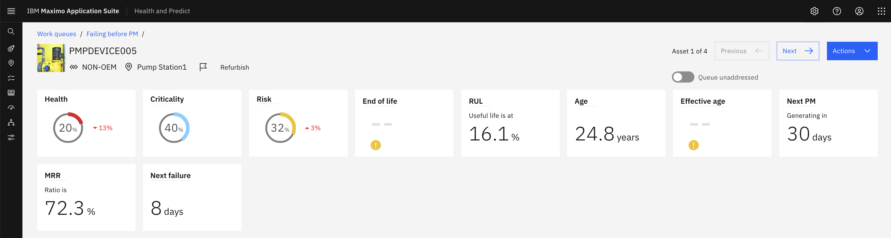

IBM Predict 包含模板,可帮助我们的数据科学家开始构建模型以预测故障天数、计算故障概率、检测异常,并根据组资产部署和退役日期生成资产生命曲线。这些模板包括大量算法,可以自动选择最适合我们数据的算法以获得最佳结果。
 
请注意,Maximo Application Suite 还包括 Watson Studio 和 Watson Machine Learning,我们的数据科学家可以使用它们来构建、训练和维护预测模型。 
 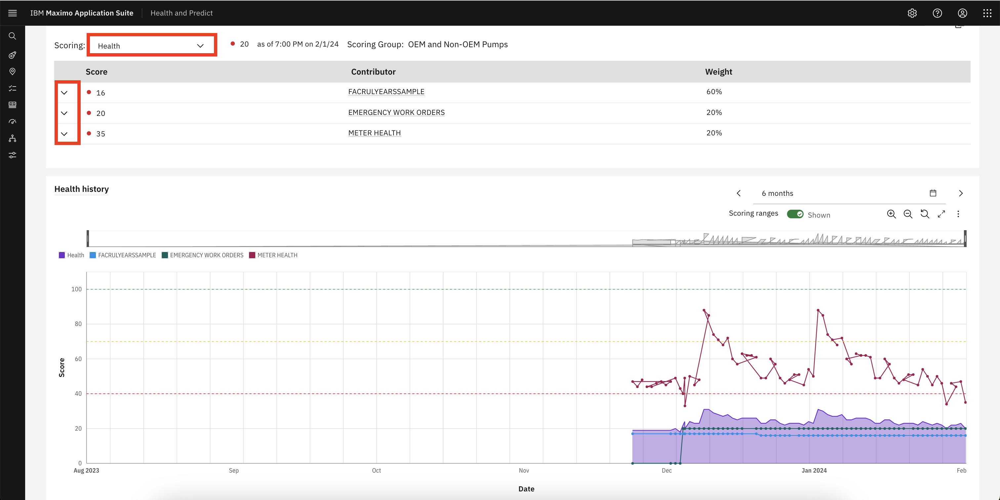

## 预测故障模型

就我们的资产而言,我们的模型告诉我们它预计在 xx 天内失败...正负 xx 天。根据我们故障历史的丰富程度,我们的数据科学家可以为特定故障模式构建预测模型。我们可以在小部件中选择这些故障模式以查看每个模式的预测。 

1. 为故障模式选择 `drop down arrow`。                   

2. 点击 `info` 图标以了解有关该字段的更多信息。同样在小部件中,我们获得有关小部件中训练数据的信息,以帮助我们决定何时应该重新训练模型。 
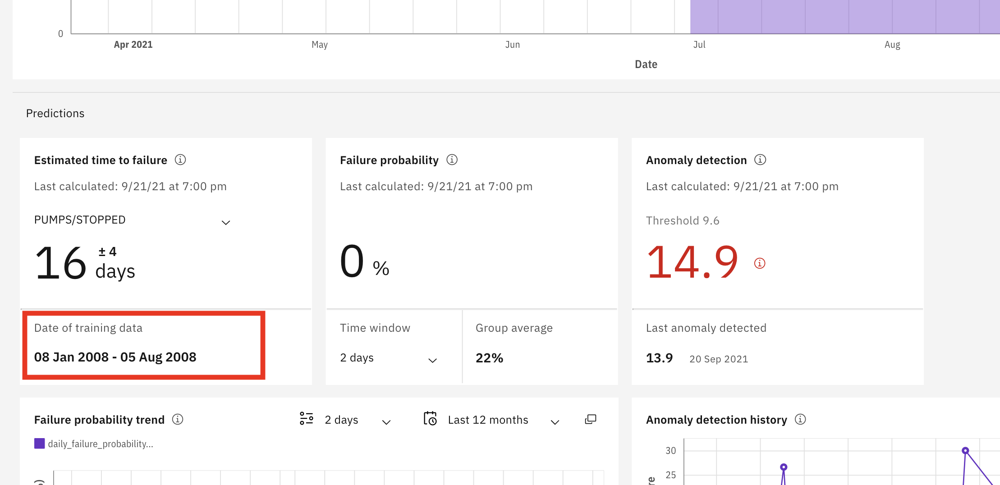

3. 查看 `Failure probability` 小部件以了解不同故障模式如何影响我们的预测。例如,它可能向我们显示我们的资产在接下来的 xx 个月内由于 xx 而有 xx% 的故障概率 
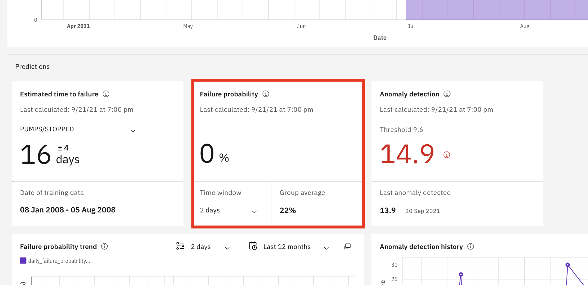

我们的数据科学家可以为时间段构建特定模型。就像故障模式一样,我们可以通过在小部件中进行不同的选择来查看结果。  

4.  查看 `Failure probability history` 小部件。故障概率历史显示每种模式的故障概率如何随时间变化。 
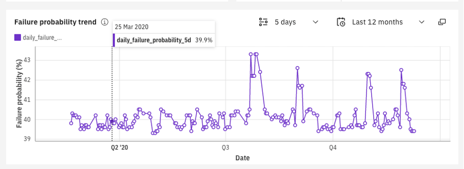

5. 滚动到导致故障的 `Factors` 卡。
导致故障的因素显示我们训练数据中的哪些因素对故障影响最大,让我们了解可能导致未来故障的原因。 
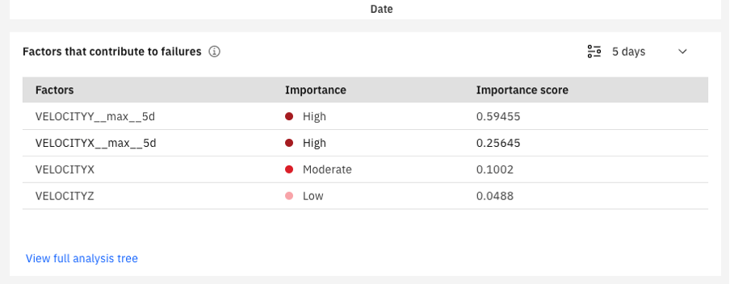

6. 滚动到 `Anomaly detection history` 卡。我们的异常检测模型基于历史记录创建阈值,我们可以在小部件中看到我们的资产何时超过该阈值。 
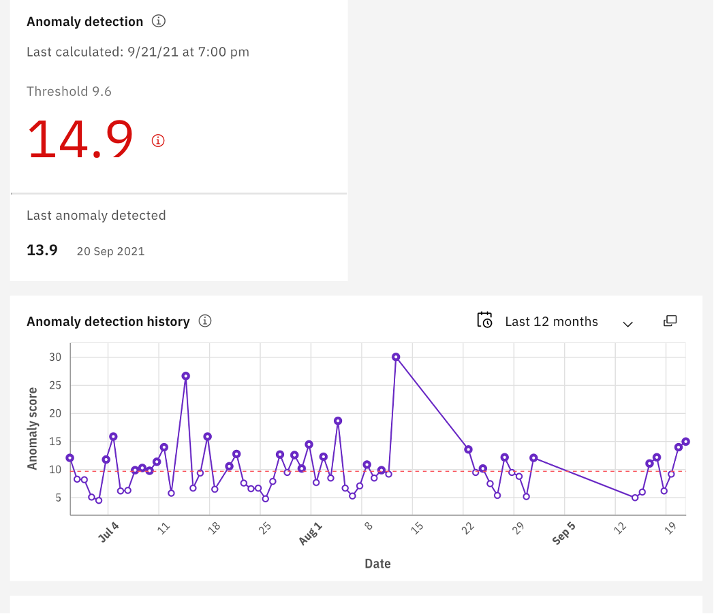

## 资产时间线
在页面底部,是一个资产时间线,它在同一图表中向我们显示有关我们资产的几条关键信息。 

1. 打开资产时间线选项卡。 
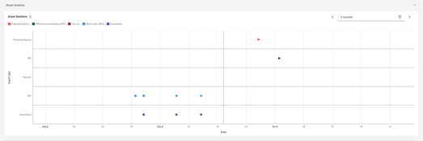

例如,我们可以看到我有一个预测故障(在图表的顶行),它将在我们的下次计划维护(在图表的第二行)之前发生。 

图表上的其他信息,如过去的工作订单和检查,提供了对我们资产历史的宝贵见解,并可能支持我们采取的行动类型。 

2. 将鼠标悬停在预测故障上。 
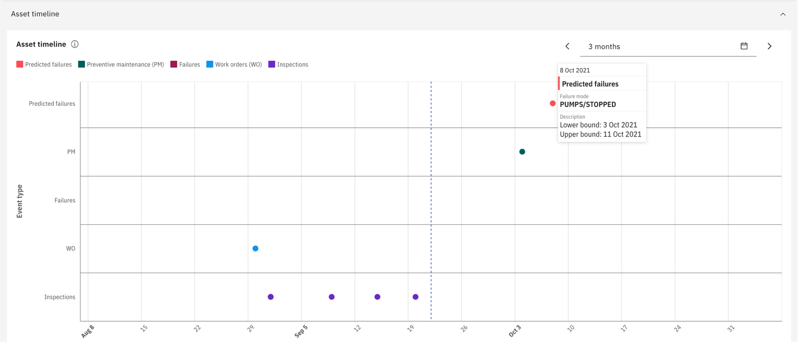

虽然每条信息或小部件都让我们深入了解资产的状态,但所有信息放在一起,为我们提供了更丰富的视图,并帮助我们就如何处理此资产做出数据驱动的决策。

## 采取行动

1.  滚动回页面顶部并选择右上角的 `Action` 按钮。一旦我决定采取什么行动,我可以立即从资产详细信息页面顶部执行。 

2. 将鼠标悬停在 `Create Service Request` 上,但不要点击它。我可以创建 `service request`、`work order`、`recalculate a health score` 或 `edit source asset record`。

3. 点击 `edit source record`。在这种情况下,我将编辑源资产记录以调整下次计划维护,以避免潜在故障...和计划外停机。 

!!! note
    不要创建或修改源记录。

4. 标记我的资产已处理,并移至我的下一个资产,确信我们将避免水处理厂的计划外停机。`[不要保持选中状态]` 取消选中它。 
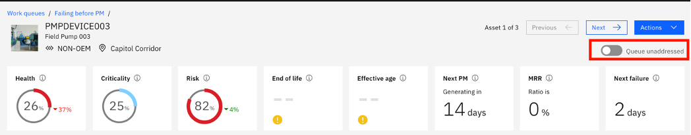{:style="height:200px;width:800px"}

## 总结

作为可靠性工程师,管理跨多个位置的水和废水处理设施的短期和长期资产规划,我能够使用 `IBM Maximo Health` 来:
- 通过更换低成本的 O 型圈来解决短期资产需求,可以节省数千美元的资本成本,防止泵因振动而失败。我还可以在风险矩阵上使用此类信息,以确保我们在未来几年不会过度维护其资产,我将在单独的练习中介绍。由于我们处理了工作队列中的所有泵,我们可以减少 Monitor 中的警报和服务请求。此信息对于资本规划目的也很有价值。
