# Manage 实验(建设中)

如果您在 Monitor 中创建了服务请求 (SR),它将自动转换为工作订单 (WO)。但是,该自动升级不会在工作订单中包含作业。

对于本节,您需要针对 `PMPDEVICE005` 复制模板 `WO12345` 并 `批准`。您可能希望更改日期以使演示更加真实。

`WO12345` 应该在 `Work Order Tracking` 应用中处于 `canceled` 状态。
 

## 工作订单跟踪

在本练习中,主管通过复制和批准工作订单在 Manage 中计划工作。要查找工作订单:

1. 在 Manage 中转到 `Work Order Tracking`。 
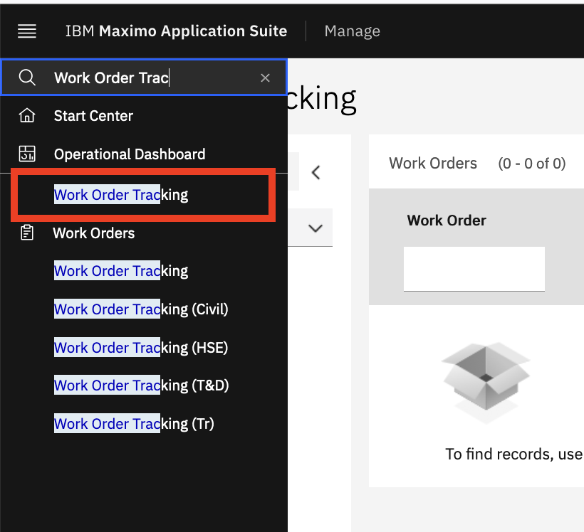

2. 使用垂直 `⋮` 菜单转到 `More search fields`。 
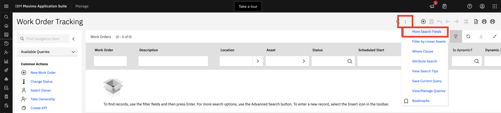

3. 清除 `History?` 值,然后点击 `Find`。 
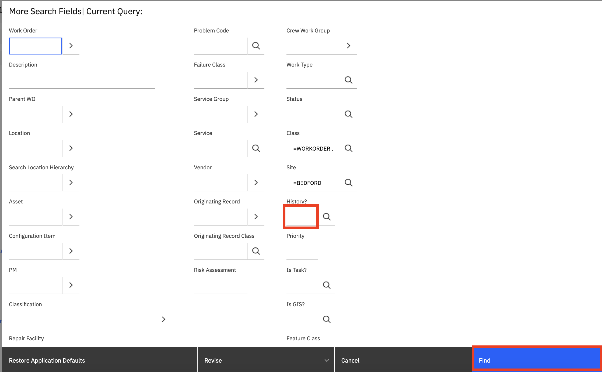

4. 在 `Work Order` 字段中输入 `12345`,然后按回车键。 
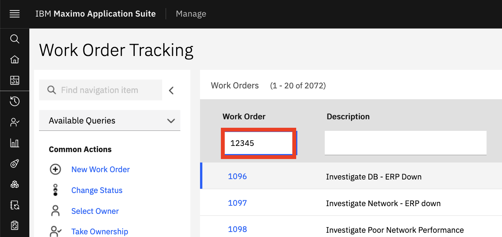

5. 通过从列表中选择 `12345` 打开工作订单。 
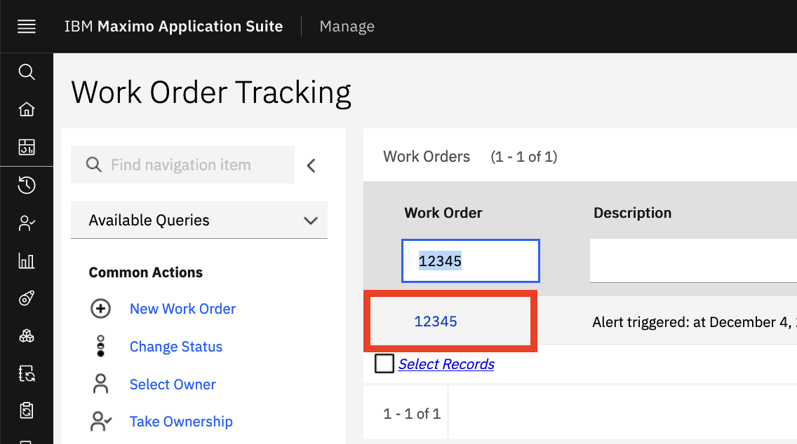。 

6. 从左侧导航栏中,选择 `Duplicate Work Order`。 
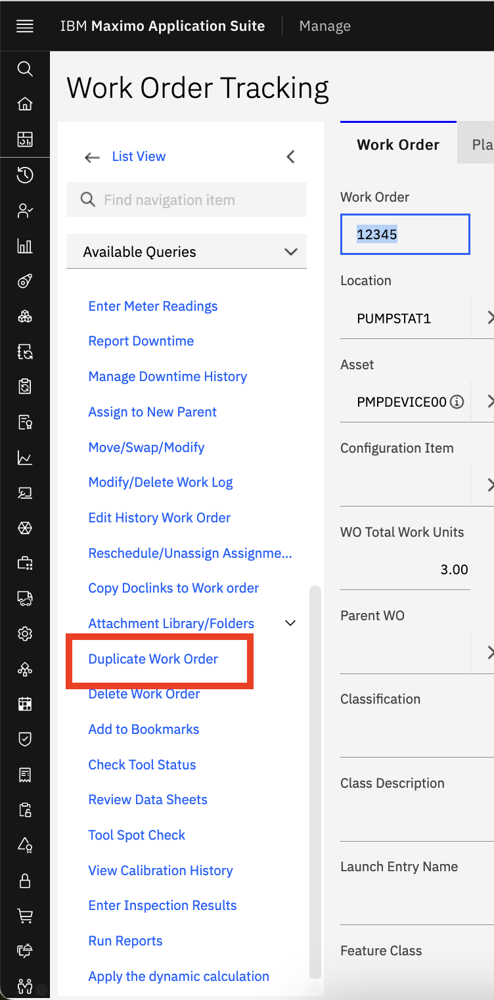

7. 在弹出窗口中,选择 `Duplicate Work Order with its Tasks`,然后按 `OK`。 
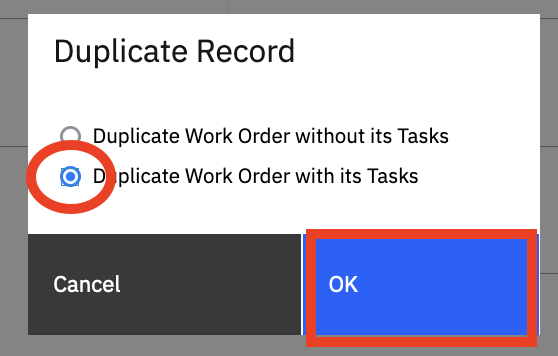

您的新 `WO` 将自动移至 `Approved` 状态。

## Manage - Mobile

### 执行检查和维修的技术人员

在本练习中,您将成为使用 Manage、Maximo Mobile 和 Assist 执行检查和维修的技术人员。如果您尚未下载移动应用程序,可以使用桌面并登录 Manage 来演示。TECHNICIAN 应用程序可以在工作订单模块的基于角色的应用程序子菜单下找到。从浏览器设置中选择 `MORE TOOLS` 和 `RESPONSIVE` 设计视图或模式,使屏幕看起来更像移动设备。

在 Manage EAM 中,新创建的服务请求可以自动转换为工作订单,分配任务和劳动力,并将状态更改为已批准。在没有人工干预的情况下处理记录有利于提高吞吐率,并允许这些资源从事更多增值活动。

在某些情况下,主管可能会进行人工审查,他们可以深入了解与泵相关的历史记录,还可以直接链接到监控仪表板以查看异常/警报的详细信息。评估的一部分可能会或可能不会提供足够的信息来确切了解需要解决什么问题,因此在这种情况下应该进行检查。主管可以批准工作订单并分配适当的资源。

1. 在 Maximo Mobile 中,点击 `My Schedule`。或者在桌面上登录 Manage,并从左侧导航菜单的工作订单模块、基于角色的应用程序中打开技术人员应用程序。

2. 作为技术人员,我可以登录 Maximo Mobile,从导航页面点击 `My Schedule` 查看分配给我的工作,无论我是在休息室、工厂的另一侧,甚至是离线状态。 
{: style="height:400px;width:250px;} 

3. 突出显示右上角的列表和地图图标选项。我看到分配给我的新工作订单,它按优先级顺序呈现给我,以便我在轮班期间的任何给定时间专注于正确的工作。我可以在列表中查看所有工作,或使用地图视图查看附近的工作并执行路线优化等其他任务,以便以最有效的方式到达正确的位置。位置信息可以帮助我在工厂内找到正确的资产以执行工作订单任务。   
{: style="height:400px;width:250px;}   
{: style="height:400px;width:250px;}  

4. 点击从 Monitor 中的警报生成的工作订单中的 `Start arrow`。我打开新分配的工作订单,并按照指示的触摸点 `Start the Work`。这将开始记录在这些任务上花费的时间。在 Mobile 中,下一个逻辑操作始终突出显示,以帮助引导用户进行下一步。 
{: style="height:400px;width:250px;} 

5. 点击 `alert-based work order`,显示工作订单的长描述,其中显示了导航到 Monitor 中设备仪表板中原始警报的 URL。 
{: style="height:400px;width:250px;} 

6. 在 `WO` 的详细信息中,我可以看到其他信息,包括长描述中的链接,这些链接可以带我回到监控器以查看异常的详细信息。  
{: style="height:400px;width:250px;} 

此外,我可以看到资产的图像,如果有条形码或二维码可用,我可以通过使用条形码扫描仪验证我正在处理正确的设备。第二个图标将显示仪表读数历史记录。我还可以通过点击日历图标查看工作订单历史记录。最后,双箭头将带我到资产状态,无论它是 UP 还是 DOWN。

7. 点击退出长描述并向下滚动到图像。描述并可选地打开每个图标。   
{: style="height:400px;width:250px;}  

按照应用程序的指导,我点击蓝色突出显示的 `TASK` 图标,它还向我显示与此工作相关的任务数量。现在我可以看到并标记完成各个步骤,以及在任务级别管理任何单独的状态。

重要的是,作为一名新技术人员,我有清晰的说明可供我使用,以确保我执行正确的步骤并收集完成此工作所需的适当信息。在 Maximo Mobile 中,一切都是关于在正确的时间、正确的地点呈现正确的信息。

8. 点击 `blue task` 图标。可选地完成一些任务。通过检查每个任务并点击 `DONE` 返回主工作订单。 
{: style="height:400px;width:250px;}  
{: style="height:400px;width:250px;} 

可能有与整体工作订单或特定任务相关的检查步骤。此工作订单有一个与之关联的检查表单。点击检查图标以打开检查步骤。
 
9. 点击中心带有复选框的圆圈图标以打开检查表单。

10. 点击 `blue icon` 开始检查过程。 
{: style="height:400px;width:250px;} 

查看检查问题并回答。除了振动和噪音较高表明存在问题外,其他一切正常。添加高于 100 的温度。请注意,温度已设置了验证,使其在 0-100 范围内。检查表单还可以设置条件问题和答案。例如,仅在振动较高时询问温度。

11. 点击 `Blue` 复选框完成检查。

我正在检查可能导致振动的原因。滑架中似乎没有任何东西导致不稳定,但我怀疑 O 型圈可能磨损或老化。应该更换它,但由于我不熟悉如何执行此操作,因此我使用 Maximo Assist 查看是否有其他有用的步骤或说明。
{: style="height:400px;width:250px;} 

### 技术人员使用 Assist 查找说明

在主工作订单视图的底部,有一个 `Launch Assist` 操作。Assist 是 Mobile 权利的一部分的一组附加功能(不需要额外的预约)。

!!! note
    Assist 不能通过 Web 浏览器使用,只能在移动设备上使用。

                                                                                                                   
1. 从 Mobile 导航器,您可以点击 `Assist` 打开搜索页面,我 	
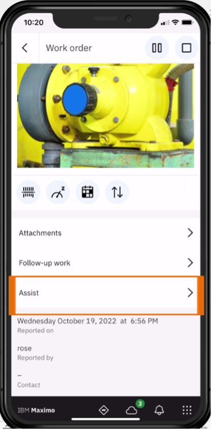{: style="height:400px;width:250px;} 

此外,可选地从 `Mobile navigator`,您可以点击 `Assist` 打开搜索页面,您可以在其中启动 Assist。 
{: style="height:400px;width:250px;}  

2. 选择右上角的 `Contact Expert` 选项 – 在搜索字段中输入 replace O-ring(您需要什么建议?)。似乎 O 型圈不容易脱落,我不想冒损坏它的风险。我可以使用一些额外的说明来执行修复,因此我选择联系远程专家寻求帮助。 
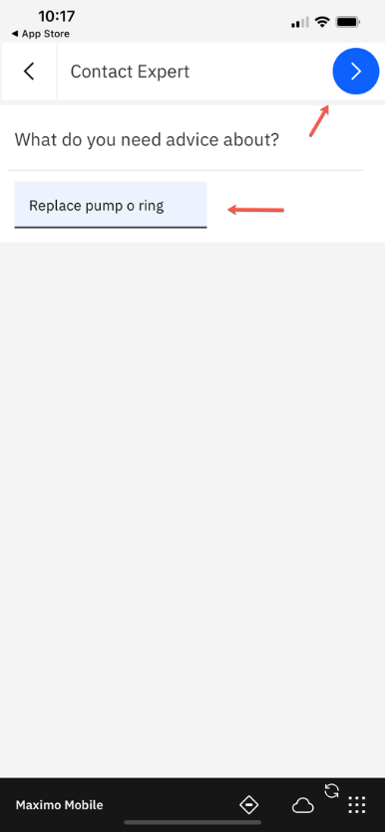{: style="height:400px;width:250px;} 

在这里,我可以看到按专业领域组织的在线专家,还可以根据工作上下文看到具有最高技能匹配的专家。我看到泵组中有人在线,所以我使用蓝色触摸点向他们发起协作请求。很快,我收到他们接受请求的通知,我启动会话,现在可以使用我的移动设备摄像头向他们展示我看到的内容。

!!! note
    这是您的第二台设备将发挥作用的地方。

3. 点击 `Pump Expert`。 
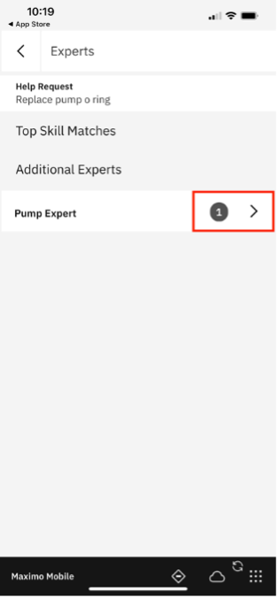{: style="height:400px;width:250px;}  

4. 点击 `Pump Expert` 选项卡上的 `Right arrow`。 
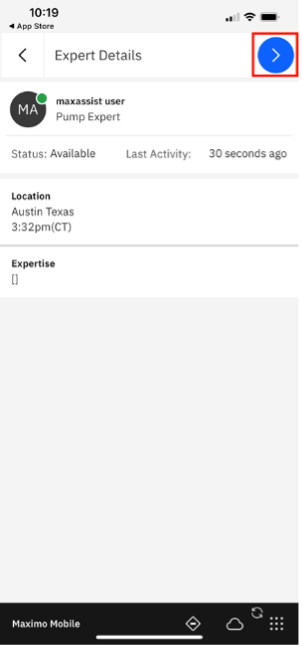{: style="height:400px;width:250px;}   
{: style="height:400px;width:250px;}   

5. 选择 `Pump Group` 接受请求。 
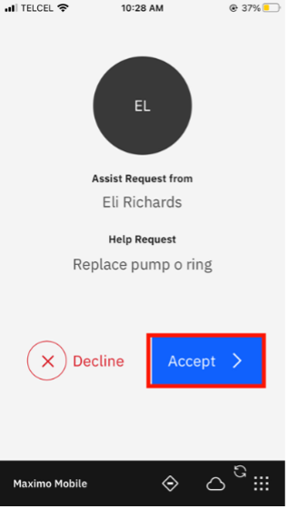{: style="height:400px;width:250px;}  

6. 选择 `START` 接受请求。 
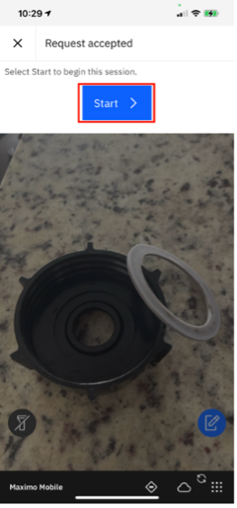{: style="height:400px;width:250px;}  

7. 在两台设备上 `关闭音频`,以免干扰。在这种情况下,我们不需要音频,但有使用语音的选项,或者如果我们处于嘈杂的环境中,我们可以使用文本进行通信。   
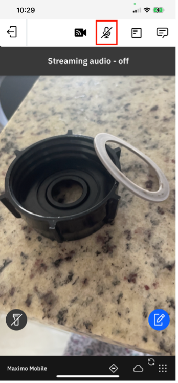{: style="height:400px;width:250px;}  

8. 选择右下角的 `blue` 按钮 - 技术人员添加注释 - `this is stuck`(红色箭头仅指向刚刚做出的注释,不是 Assist 的一部分)

9. 当我展示我的手机时,专家在他们那边查看视频流和图库中的图像,并可以选择其中一个来提供我应该采取的操作。我将指出我卡在哪里,以便专家可以提供一些指导。专家可以使用增强现实直接在屏幕上输入指向注释或草图。注释还有一些选项可以将它们标记为安全隐患,以便技术人员在执行建议的操作时小心。
{: style="height:400px;width:250px;}     
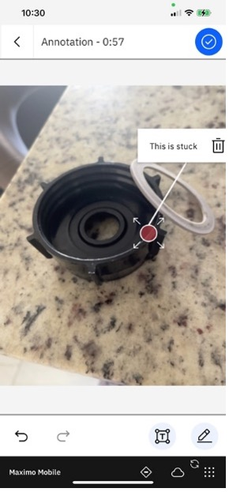{: style="height:400px;width:250px;}     
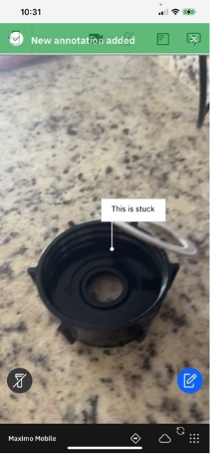{: style="height:400px;width:250px;}     

10. 专家添加任何指令 `pry here`,在聊天中或使用草图绘制。 
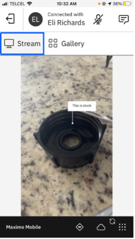{: style="height:400px;width:250px;}   
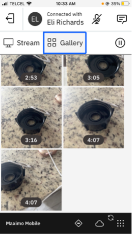{: style="height:400px;width:250px;}   
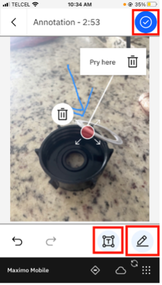{: style="height:400px;width:250px;}  

11. 这现在显示在技术人员的视图中,正好在专家标记的位置,这与两人彼此相邻时的体验相同。     
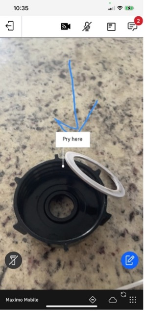 

12. 将手机从注释处移开。您会注意到,即使我的手机指向不同的方向,绿色箭头也会引导我到新的注释,这样我就不会错过它。    

13. 选择左上角的结束会话图标,然后选择 `Yes`。提供杠杆以移除 O 型圈的操作有效,我现在能够完成更换零件所涉及的其余任务。

14. 我将结束协作会话,这将创建一个会话摘要,其中包含所有聊天记录和提供的指导。现在可以将其添加到 AI 知识库以供将来参考。 
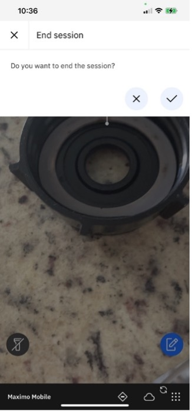

### 技术人员返回分配的工作订单以完成工作

现在我已经完成了此工作订单的所有任务,我还在工作订单工作日志的注释中添加了 `Replaced O-Ring`

1. 技术人员通过点击工作日志触摸点打开工作日志并输入描述。 
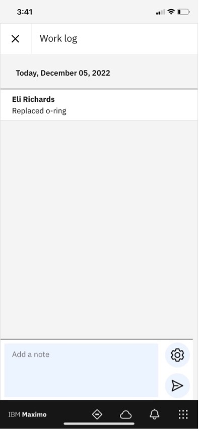

2. 打开剪贴板图标以报告工作。

3. 添加 `Failure Class`: "PUMPS"、`Problem`: "LEAK"、`Cause`: "SEAL LEAKING" 和 `Remedy`: "REPLACE"

4. 然后,我需要记录故障信息,以便提供有关此问题的原因和补救措施的准确数据以支持未来的分析。这种信息收集对于 Health 和 Predict 来说是无价的,因为它提供了来自人在回路中的丰富定性数据,以补充来自 Monitor 的定量数据,以准确确定故障发生的方式、原因和时间。这些过度振动的故障代码现在可以用于稍后由可靠性工程师更新健康和故障预测日期。 
{: style="height:400px;width:250px;}    
{: style="height:400px;width:250px;}   

5. 要报告使用的工作和材料,请点击 3 个按钮并选择添加项目。准确记录作为维修一部分使用的材料或项目也很重要。这将保持库存余额准确,并提供针对工作订单/资产的完整成本信息。   
{: style="height:400px;width:250px;}    
     
6. 在 `Materials` 部分添加 `+` 使用的密封件,数量 1。我需要记录在工作期间使用的零件,并添加我使用材料 `SEAL` 到工作订单实际值。 
{: style="height:400px;width:250px;}   	 

7. 点击 `Eli` 旁边的 `+` 以报告执行的小时数和工作类型。花费在工作上的时间也是此维修的总成本和工作量的一个组成部分。清楚记录花费的时间量很重要,对于某些组织来说,这用作工资单活动的一部分。它还用于更准确地定义作业任务,并可能在比较计划与实际值时导致调整。 
{: style="height:400px;width:250px;}    	 

8. 选择 `Work Type`。能够将工作时间分类为 `Travel Time`、`waiting on Materials` 或 `Actual work time`。 
{: style="height:400px;width:250px;}     
{: style="height:400px;width:250px;}    
      
9. 添加时间并点击 `OK`。我还想记录执行工作订单步骤和完成工作订单所花费的时间。这些数据将帮助未来的计划人员和调度人员估计此类工作通常需要多长时间,并更有效地计划和分配这些类型的工作。我还添加了我使用的计划外零件和材料。 
{: style="height:400px;width:250px;}  
{: style="height:400px;width:250px;}   

## 总结

作为技术人员,维护配送和水处理资产或其他关键基础设施资产,我可以在执行工作之前、期间和之后访问所需的信息。我可以获得额外的信息和帮助来完成工作,使我能够一次完成工作订单。
      
MAS Mobile 功能:它可以在本地或任何云环境中部署,具有灵活的选项,并且可以在线或离线工作。IBM Maximo Mobile 因集成基于 AI 的远程专家协助以及来自可穿戴设备和传感器的实时数据而脱颖而出,增强了数字孪生体验。其跨各种平台的单一可下载应用程序确保快速部署和无缝导航,即使在断开连接的模式下也能优化运营生产力。

在下一个实验中,可靠性工程师将进行进一步分析,因为技术人员只负责处理他们负责的特定资产,而可靠性工程师正在查看所有站点/泵。

<b>过渡:</b> 我现在将把它交给可靠性工程师进行一些进一步的分析,因为技术人员只负责处理他们负责的特定资产,而可靠性工程师正在查看所有站点/泵。
