# Manage - Mobile 实验

!!! note
    此实验正在开发中。并非所有步骤都完整或准确。

## 服务请求到工作订单

在 Manage EAM 中,新创建的服务请求可以自动转换为工作订单,分配任务和劳动力,并将状态更改为已批准。在没有人工干预的情况下处理记录有利于提高吞吐率,并允许这些资源从事更多增值活动。
在某些情况下,主管可能会进行人工审查,他们可以深入了解与泵相关的历史记录,还可以直接链接到监控仪表板以查看异常和警报的详细信息。评估的一部分可能会或可能不会提供足够的信息来确切了解需要解决什么问题,因此在这种情况下应该进行检查。主管可以批准工作订单并分配适当的资源。

## 执行工作订单

作为技术人员,我可以登录 Maximo Mobile,从导航页面点击"我的日程"查看分配给我的工作,无论我是在休息室、工厂的另一侧,甚至是离线状态。 

1.  进入 `Maximo Mobile`,点击 `My Schedule`。 
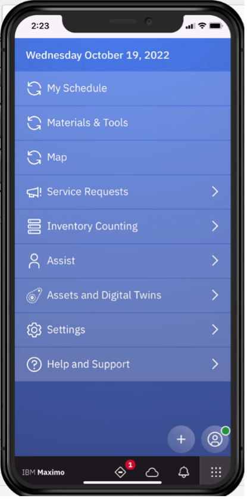{: style="height:400px;width:250px;margin-left:40px"}

!!! note
    主屏幕可能看起来像磁贴或选项卡,具体取决于您选择的显示设置。此主屏幕当前使用选项卡。

我看到分配给我的新工作订单,它按优先级顺序呈现给我,以便我在轮班期间的任何给定时间专注于正确的工作。

2. 关注: 
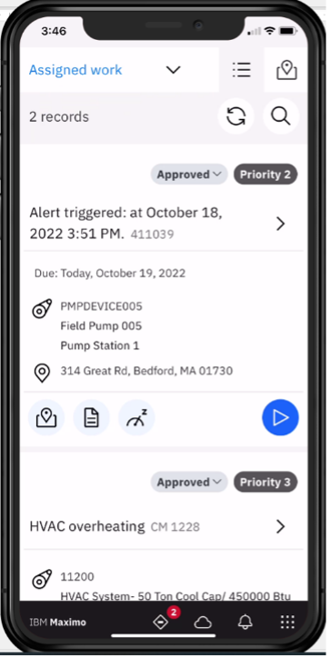{: style="height:400px;width:250px;margin-left:40px"}

我可以在列表中查看所有工作,或使用地图视图查看附近的工作并执行路线优化等其他任务,以便以最有效的方式到达正确的位置。位置信息可以帮助我在工厂内找到正确的资产以执行工作订单任务。 

3. 点击右上角的 `map view` 图标,然后使用 `Map` 图标旁边的 `List` 菜单返回 `My Schedule`。 
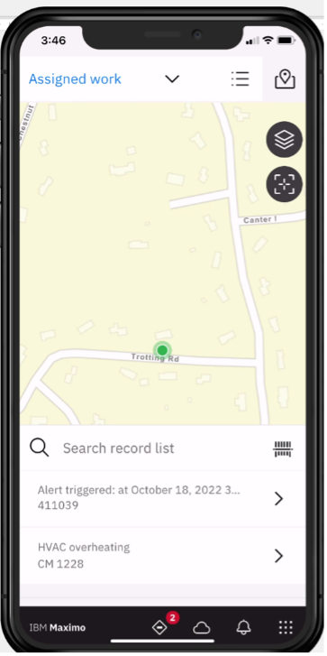{: style="height:400px;width:250px;margin-left:40px"}

当我到达下一个工作订单的现场时,我与安全官员签到,以便他们知道我的位置。

我打开新分配的工作订单,并按照指示的触摸点开始工作。这将开始记录在这些任务上花费的时间。

4. 在从 `Monitor` 生成的工作订单中点击 `Start Work`,然后进入 `Work Order`。 
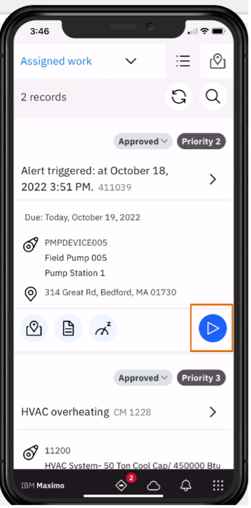{: style="height:400px;width:250px;margin-left:40px"}
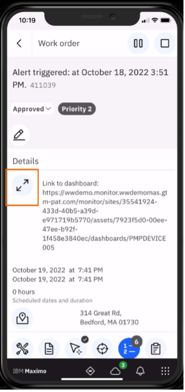{: style="height:400px;width:250px;margin-left:40px"}

在 `Work Order` 的详细信息中,我还可以看到其他信息,包括长描述中的链接,这些链接可以带我回到监控器以查看异常的详细信息。

5. 点击 `alert-based work order`,显示工作订单的 `long description`,其中包括返回 `Monitor` 的超链接。 
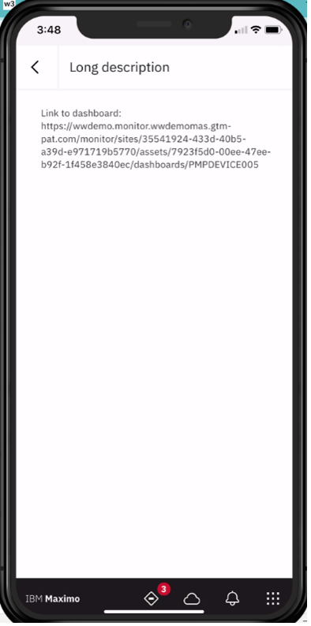{: style="height:400px;width:250px;margin-left:40px"}
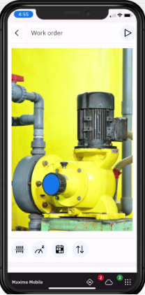{: style="height:400px;width:250px;margin-left:40px"}

此外,我可以看到资产的图像,如果有条形码可用,我可以通过使用条形码扫描仪验证我正在处理正确的设备。点击 `barcode` 图标。我还可以通过点击右侧的 `calendar` 图标查看工作订单历史记录。   
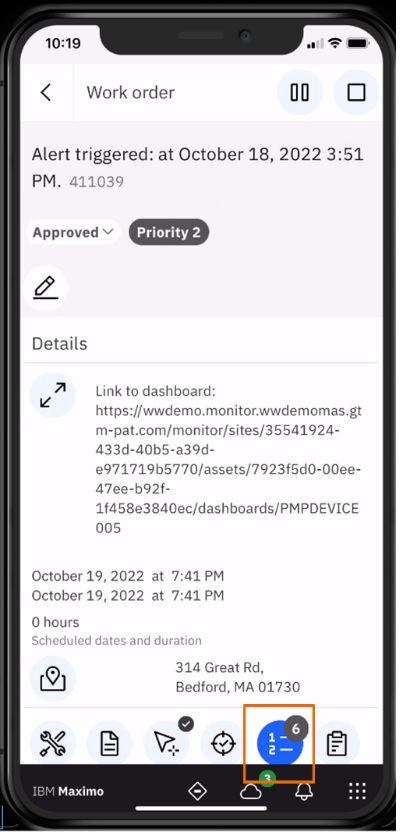{: style="height:400px;width:250px;margin-left:40px"}

6. 按照应用程序的指导,点击 `TASK` 图标。在这里我可以看到完成检查所需的各个步骤。  
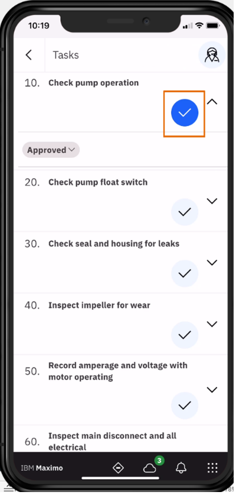{: style="height:400px;width:250px;margin-left:40px"}

重要的是,作为一名新技术人员,我有清晰的说明可供我使用,以确保我执行正确的步骤并收集完成此工作所需的适当信息。在 Maximo Mobile 中,一切都是关于在正确的时间、正确的地点呈现正确的信息。

## 执行检查

我现在可以开始检查过程:  

1. 点击 `Start` 按钮。点击 `information` 按钮将显示执行检查所需的相关文档。 
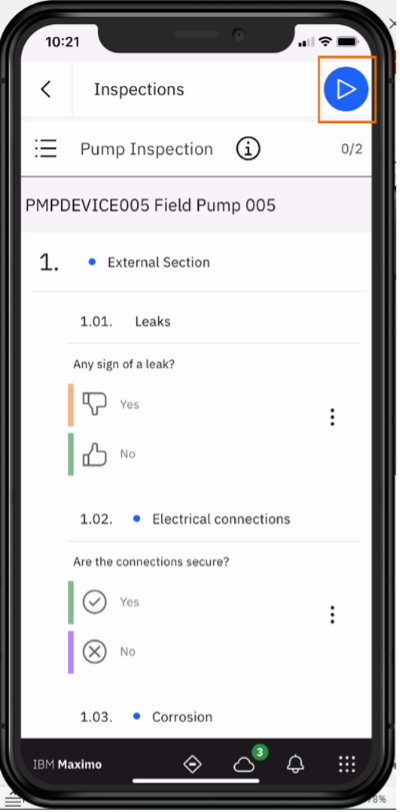{: style="height:400px;width:250px;margin-left:40px"}
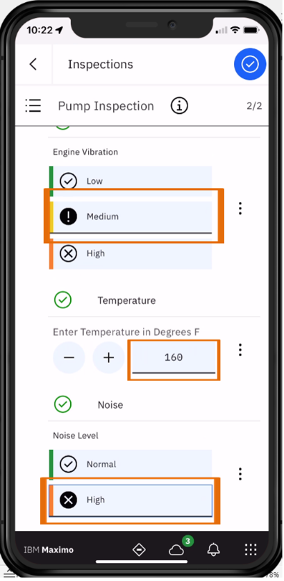{: style="height:400px;width:250px;margin-left:40px"} 
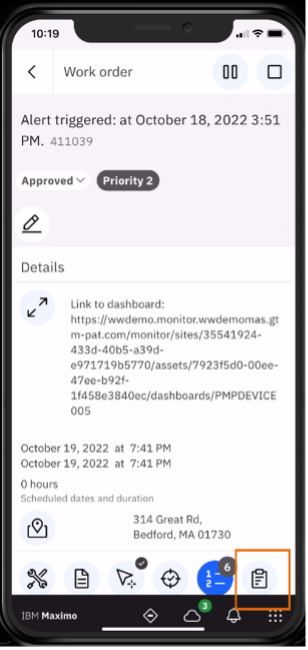{: style="height:400px;width:250px;margin-left:40px"}

2. 查看检查问题并回答 `All` 正常,除了振动和噪音较高表明存在问题。点击 `Blue` 复选框完成检查。
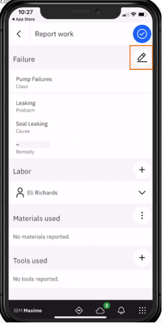{: style="height:400px;width:250px;margin-left:40px"}
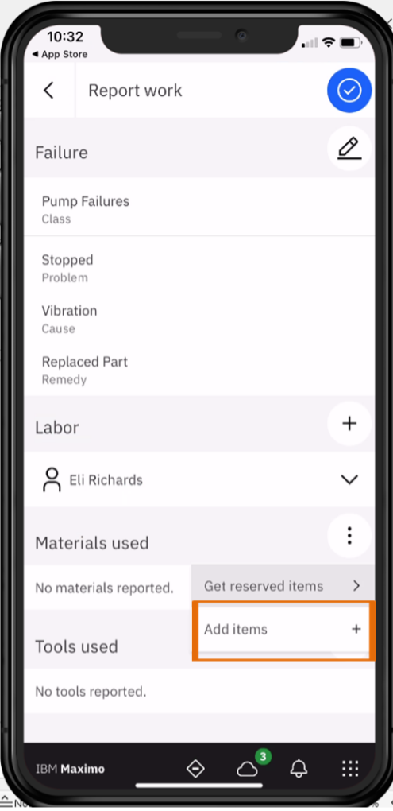{: style="height:400px;width:250px;margin-left:40px"}

我正在检查可能导致振动的原因。滑架中似乎没有任何东西导致不稳定,但我怀疑 O 型圈可能磨损或老化。

应该更换它,但由于我不熟悉如何执行此操作,因此我使用 `Maximo Assist` 查看是否有其他有用的步骤或说明。

## Assist 查询

有多种导航到 Assist 的选项。如果有与工作订单关联的任务,则在任务详细信息中有一个启动 Assist 的选项。

1. 显示: 
{: style="height:400px;width:250px;margin-left:40px"}

2. 从工作订单主详细信息屏幕的图像下方记录底部,有一个 `Launch Assist` 图标。
显示 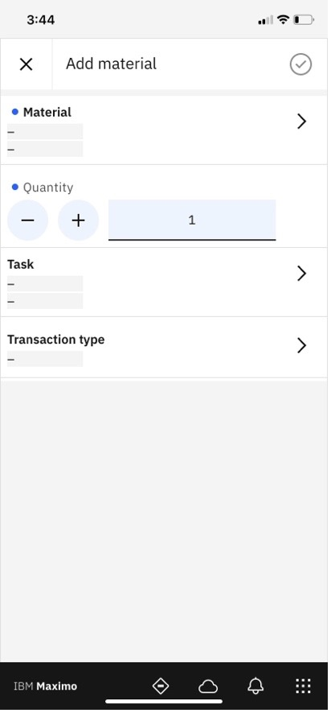{: style="height:400px;width:250px;margin-left:40px"}

3. 从 `Mobile navigator`,我点击 `Assist` 打开搜索页面,我可以在其中输入搜索条件。打开 Maximo Mobile 应用并输入 `Replace Pump O-Ring`,然后选择 `return`。  
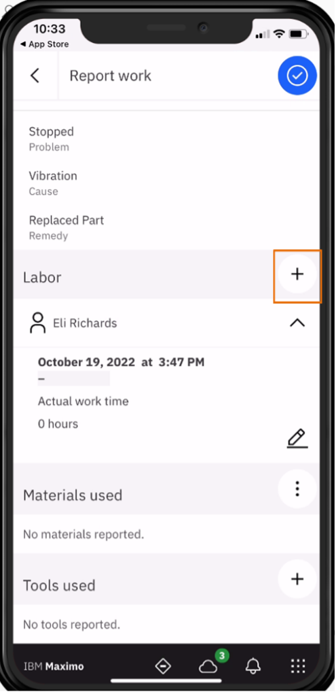{: style="height:400px;width:250px;margin-left:40px"}
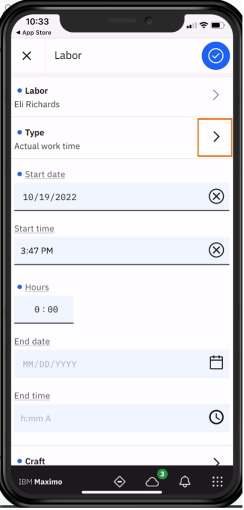{: style="height:400px;width:250px;margin-left:40px"}

在这里,我看到 AI 驱动的搜索结果按最相关的建议排列在顶部,并按置信度降序组织。AI 向我展示了来自手册、历史工作订单、以前的协作会话、培训内容的建议 – 所有这些不同类型的数据源都可供我搜索。

如果有历史工作订单,我还可以查看其他详细信息,例如任务、日志、故障报告,或者我可以选择它以查看过去完成的确切工作。

4. 显示历史工作订单。  
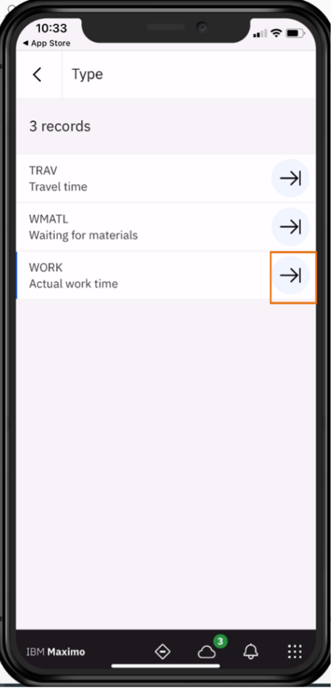{: style="height:400px;width:250px;margin-left:40px"}

5. 我还可以通过选择筛选器选项进一步细化搜索结果。打开资产类型 (`PUMP`) 和制造商 (`Goulds`) 的筛选器,然后选择完成。  
{: style="height:400px;width:175px;margin-left:40px"}
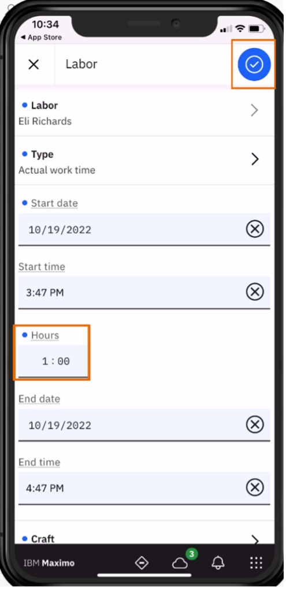{: style="height:400px;width:175px;margin-left:40px"} 
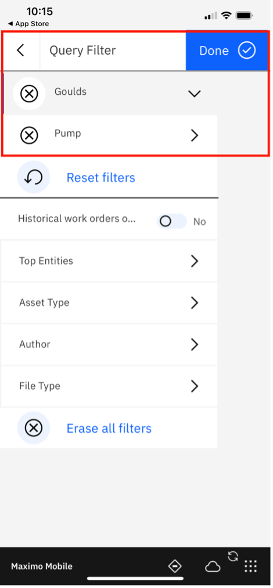{: style="height:400px;width:175px;margin-left:40px"}
 
我现在看到更精细的搜索结果,顶部结果现在是维护手册。通过为建议提供 AI 模型反馈并将它们标记为相关或不相关,我正在实时持续训练 AI 模型并改进建议。

6. 显示搜索结果。  
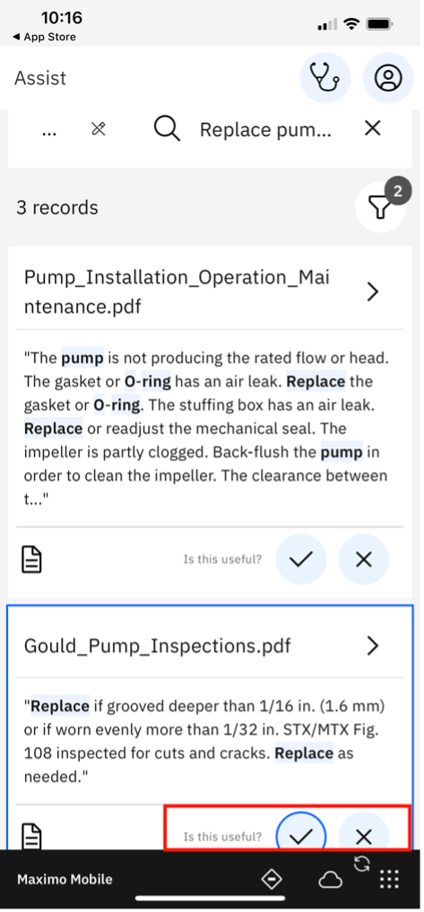{: style="height:400px;width:250px;margin-left:40px"}

7. 在搜索结果中选择 `Yes` 选项,打开顶部结果。  
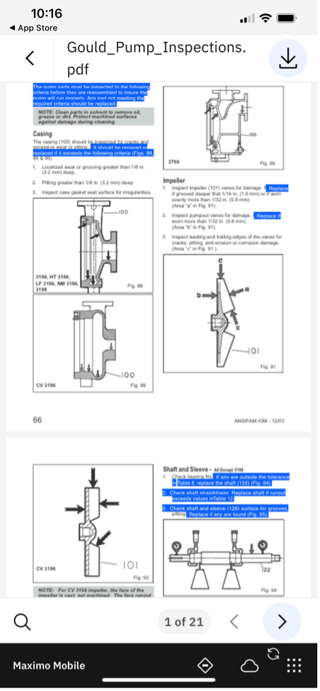{: style="height:400px;width:250px;margin-left:40px"}

选择搜索结果中的顶部建议会显示打开的手册,并向下滚动到 AI 检测到最相关段落的位置,该段落以蓝色突出显示。这非常有用,尤其是在故障排除场景中,周围有图像,这可以进一步帮助我获得有关要采取的操作的视觉辅助。

 
## 联系远程专家

在这种情况下,我可以看到带有视觉效果的 O 型圈更换说明。我能够遵循它们,直到我尝试移除 O 型圈。即使遵循这些说明,似乎 O 型圈也不容易脱落,我不想冒损坏它的风险。我可以使用一些额外的说明来执行修复,因此我选择联系远程专家寻求帮助。  
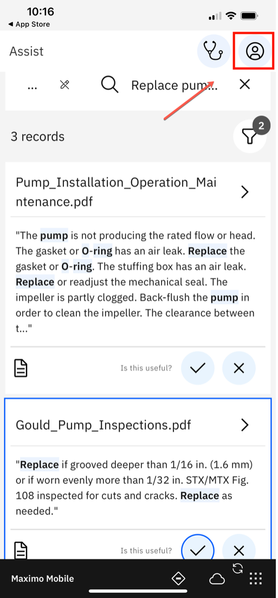{: style="height:400px;width:250px;margin-left:40px"}
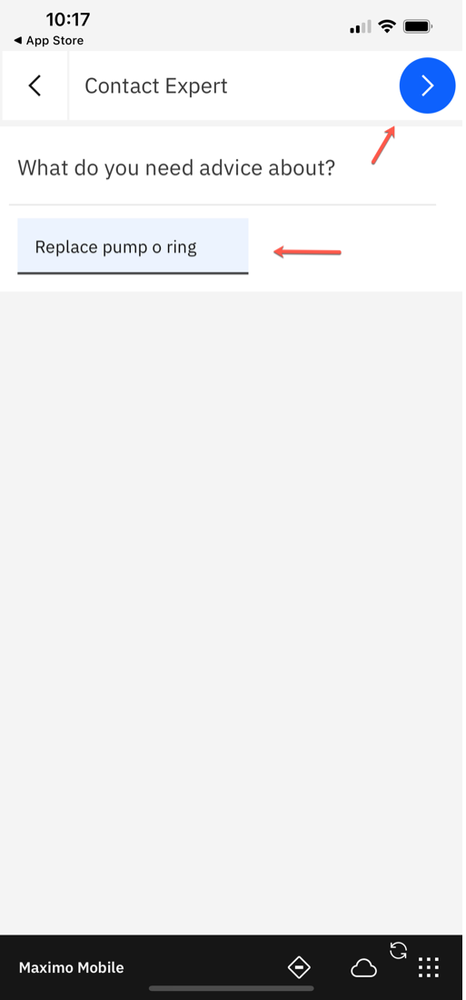{: style="height:400px;width:250px;margin-left:40px"}

1. 选择右上角的 `Contact Expert` 选项 – 在搜索字段中输入 `replace O-ring`(您需要什么建议?)   
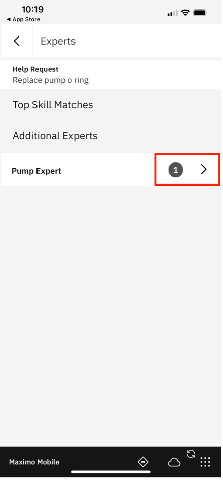{: style="height:400px;width:175px;margin-left:40px"}
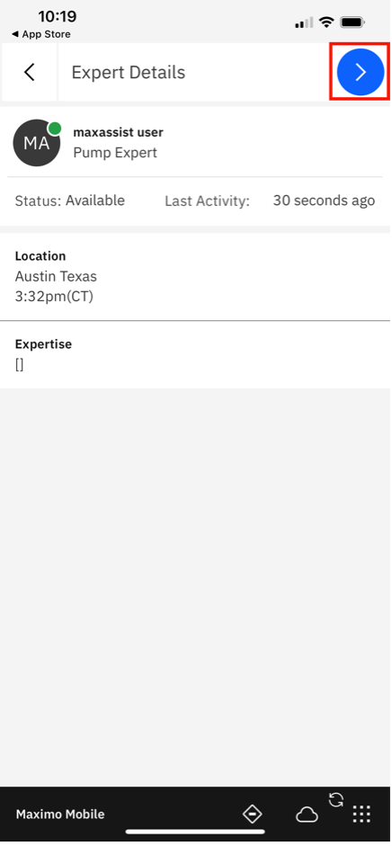{: style="height:400px;width:175px;margin-left:40px"}  
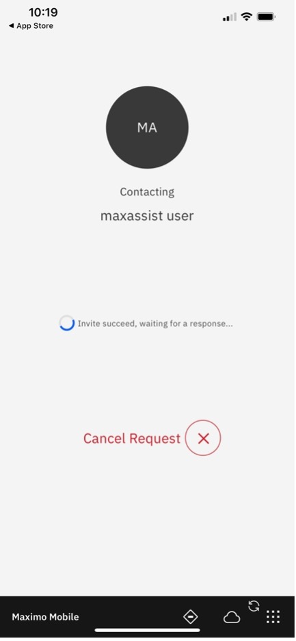{: style="height:400px;width:175px;margin-left:40px"}

在这里,我可以看到按专业领域组织的在线专家,还可以根据工作上下文看到具有最高技能匹配的专家。我看到泵组中有人在线,所以我使用蓝色触摸点向他们发起协作请求。很快,我收到他们接受请求的通知,我启动会话,现在可以使用我的移动设备摄像头向他们展示我看到的内容。

!!! note
    这是您的第二台设备将发挥作用的地方。

2. 选择 `Pump Group` 接受请求。  

<b>专家视图(第二台设备):</b>
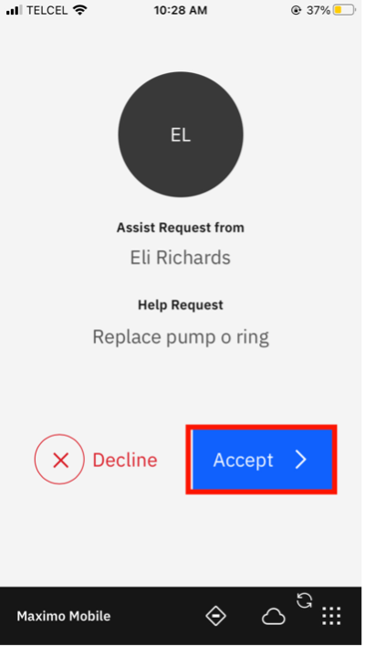{: style="height:400px;width:250px;margin-left:40px"}

<b>技术人员视图:</b>
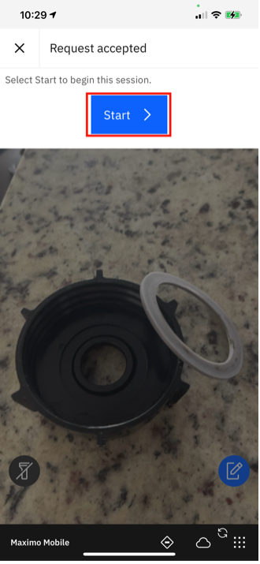{: style="height:400px;width:250px;margin-left:100px"}

3. 选择 `START` 接受请求。  

在这种情况下,我们不需要音频,但有使用语音的选项,或者如果我们处于嘈杂的环境中,我们可以使用文本进行通信。

4. 在两台设备上关闭音频,以免干扰。
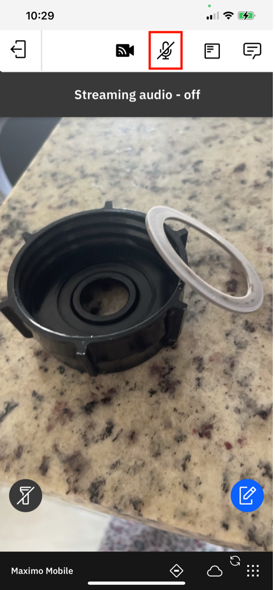{: style="height:400px;width:250px;margin-left:40px"}

当我展示我的手机时,专家在他们那边查看视频流和图库中的图像,并可以选择其中一个来提供我应该采取的操作。我将指出我卡在哪里,以便专家可以提供一些指导。专家可以使用增强现实直接在屏幕上输入指向注释或草图。注释还有一些选项可以将它们标记为安全隐患,以便技术人员在执行建议的操作时小心。

<b>技术人员视图:</b>

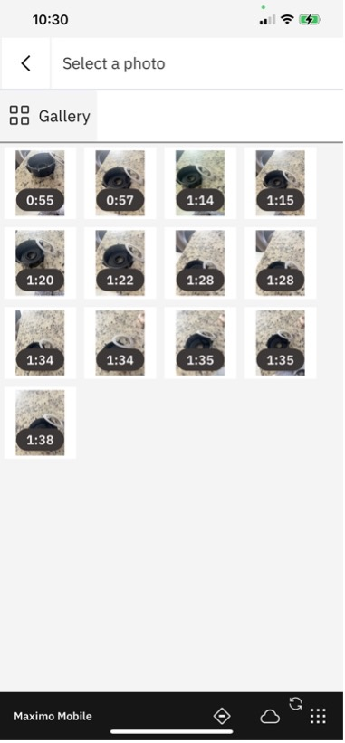{: style="height:400px;width:175px;margin-left:40px"}
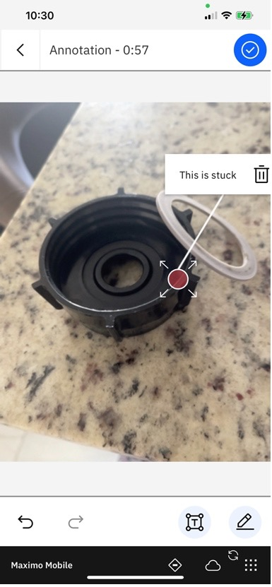{: style="height:400px;width:175px;margin-left:40px"} 
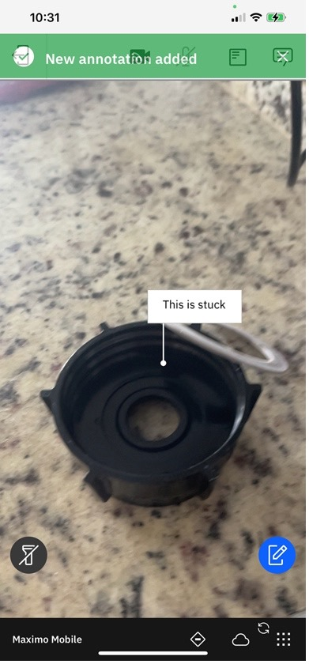{: style="height:400px;width:175px;margin-left:40px"}

5. 选择右下角的 `blue` 按钮 - 技术人员添加注释 - `this is stuck`(红色箭头仅指向刚刚做出的注释,不是 Assist 的一部分)

<b>专家视图(第二台设备):</b>

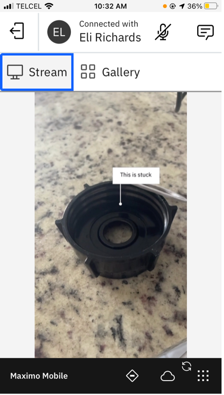{: style="height:400px;width:175px;margin-left:40px"}
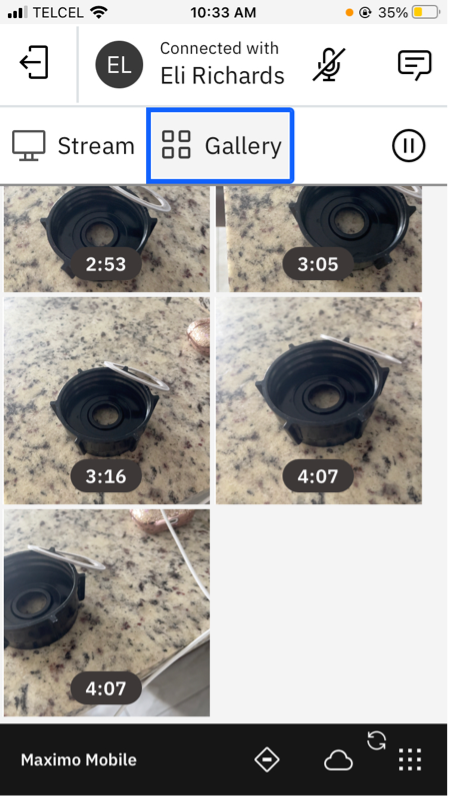{: style="height:400px;width:175px;margin-left:40px"} 
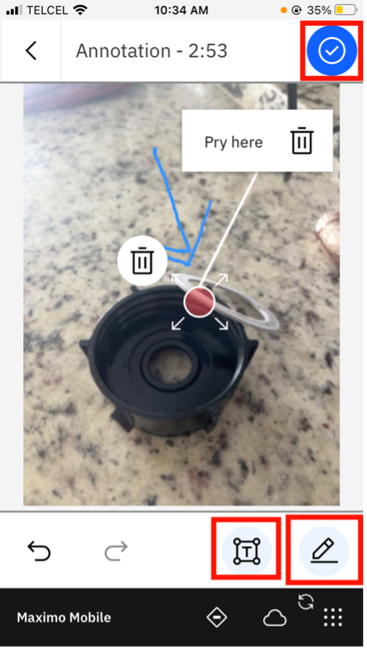{: style="height:400px;width:175px;margin-left:40px"}

6. 专家添加任何指令"pry here",在聊天中或使用草图绘制。

这现在显示在技术人员的视图中,正好在专家标记的位置,这与两人彼此相邻时的体验相同。

<b>技术人员视图:</b>

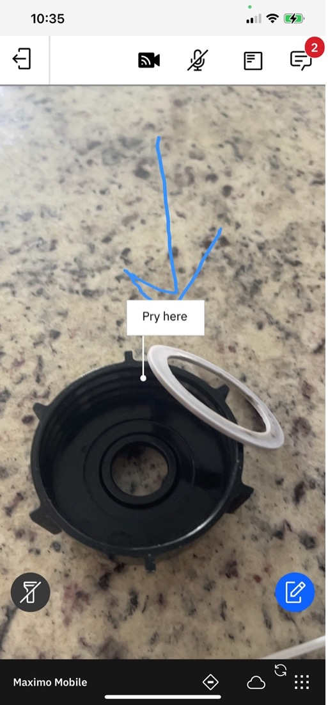{: style="height:400px;width:250px;margin-left:40px"} 

您会注意到,即使我的手机指向不同的方向,绿色箭头也会引导我到新的注释,这样我就不会错过它。

7. 将手机从注释处移开。

<b>技术人员视图:</b>

{: style="height:400px;width:250px;margin-left:40px"}  
提供杠杆以移除 O 型圈的操作有效,我现在能够完成更换零件所涉及的其余任务。我将结束协作会话,这将创建一个会话摘要,其中包含所有聊天记录和提供的指导。现在可以将其添加到 AI 知识库以供将来参考。

8. 选择左上角的结束会话图标,然后选择 `Yes`。  
{: style="height:400px;width:250px;margin-left:40px"}

## 使用 AI 识别零件

现在 O 型圈组件已经脱落,技术人员意识到支架底部的损坏。他们在设施中的不同泵上看到过许多像这样的支架。为了确保他们从正确的储藏室抓取正确的零件来更换这个部件,技术人员使用 Parts Identifier 拍摄损坏部件的照片。 

1.  在移动应用上打开 `Parts Identifier`
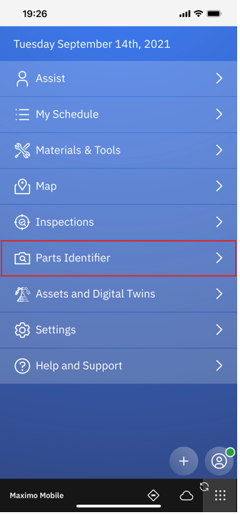{: style="height:400px;width:250px;margin-left:40px"}

技术人员拍摄支架的照片,并看到几个与损坏的支架相似的不同支架部件。Parts Identifier 使用 AI 显示可能与技术人员的零件匹配的不同零件。 

2.  选择相机并拍摄零件照片 
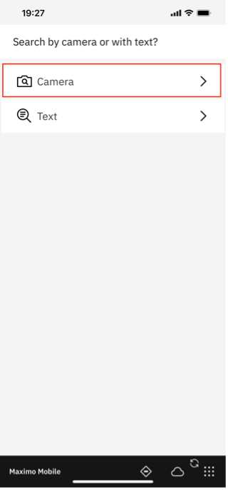{: style="height:400px;width:250px}
{: style="height:400px;width:250px}
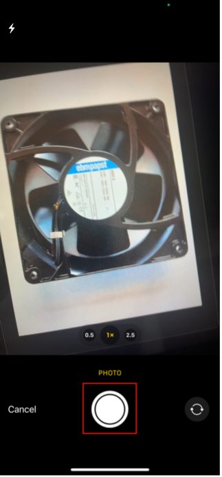{: style="height:400px;width:250px} 
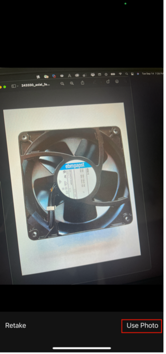{: style="height:400px;width:250px}

技术人员选择最相似的部件并查看有关此零件的信息。技术人员可以准确看到此零件的存储位置和项目描述。这节省了技术人员搜索整个储藏室以查找和匹配正确的更换零件或打电话给朋友的时间。 

3. 选择 `part`,然后选择 `blue` 复选标记。 
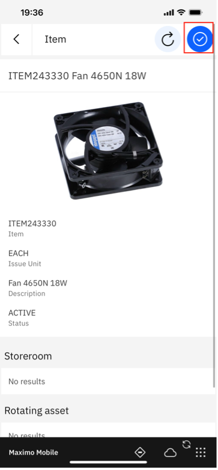{: style="height:400px;width:250px;margin-left:40px"}

如果序列号没有完全磨损,他也可以通过文本完成这些步骤。然后,AI 将在几秒钟内将确切的零件与序列号匹配。这允许更多的首次修复。

4. 返回分配的工作订单。

## 关闭工作订单

现在我已经完成了此工作订单的所有任务,我还在工作订单工作日志的注释中添加了"Replaced O-Ring"

1. 通过点击工作日志触摸点打开工作日志并输入描述。

然后,我需要记录故障信息,以便提供有关此问题的原因和补救措施的准确数据以支持未来的分析。这种信息收集对于 Health 和 Predict 来说是无价的,因为它提供了来自人在回路中的丰富定性数据,以补充来自 Monitor 的精确定量数据,以准确确定故障发生的方式、原因和时间。这些过度振动的故障代码现在可以用于稍后由可靠性工程师更新健康和故障预测日期。

2. 在其他图标的同一视图中选择 `Report Work` 图标。添加 `Failure Class`,"Pump Failures",Problem "Stopped",Cause "Vibration" 和 Remedy "Replaced Part"。 
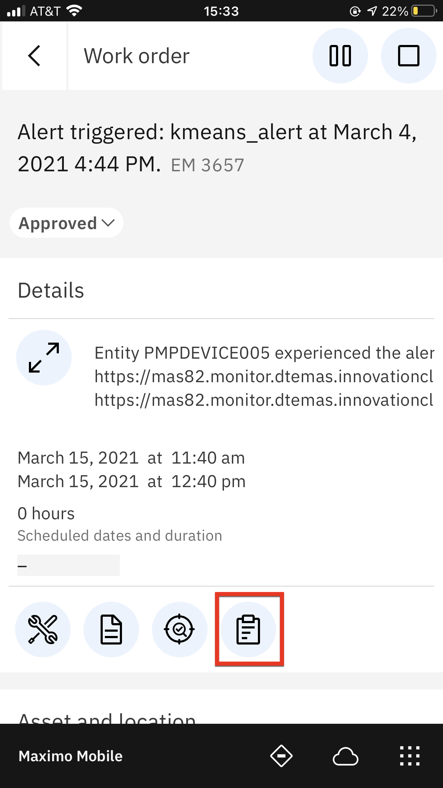{: style="height:400px;width:175px;margin-left:40px"}
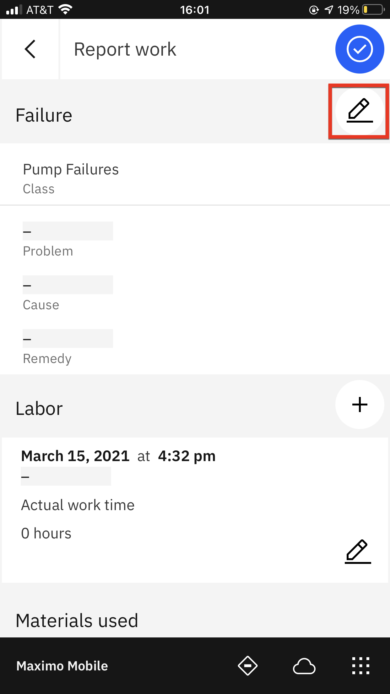{: style="height:400px;width:175px;margin-left:40px"}
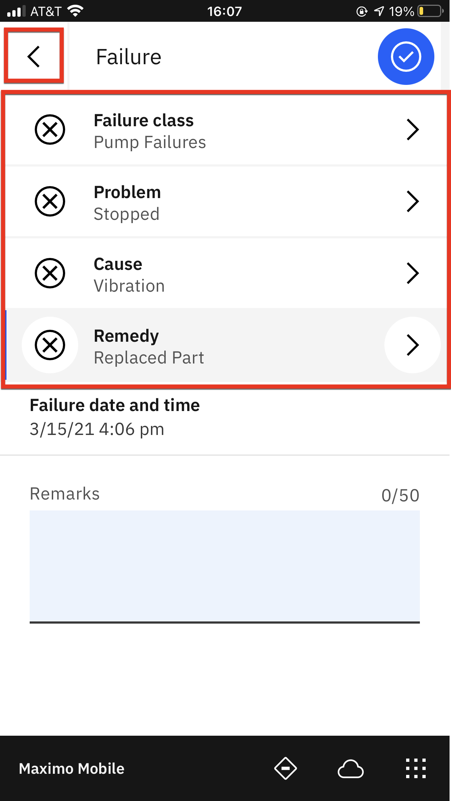{: style="height:400px;width:175px;margin-left:40px"}

我需要记录在工作期间使用的零件,并添加我使用材料 `o-ring` 到工作订单实际值。 

3. 在材料部分添加 +,O-ring,数量 1。 

我还想记录执行工作订单步骤和完成工作订单所花费的时间。这些数据将帮助未来的计划人员和调度人员估计此类工作通常需要多长时间,并更有效地计划和分配这些类型的工作。我还添加了我在更换 O 型圈时使用的计划外零件和材料。

4. 添加时间或停止时钟,并通过选择完成工作来关闭工作订单。 
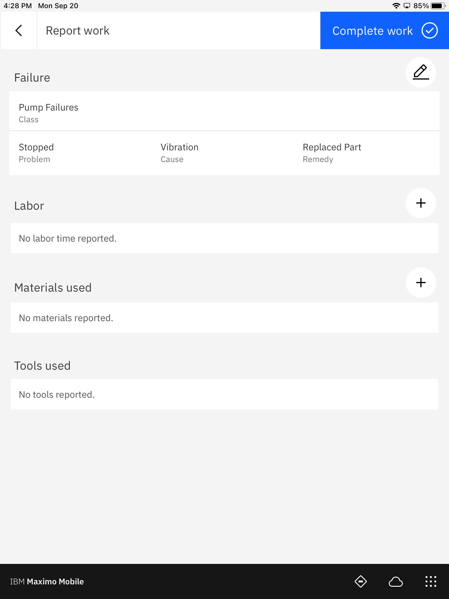{: style="height:400px;width:250px;margin-left:40px"}
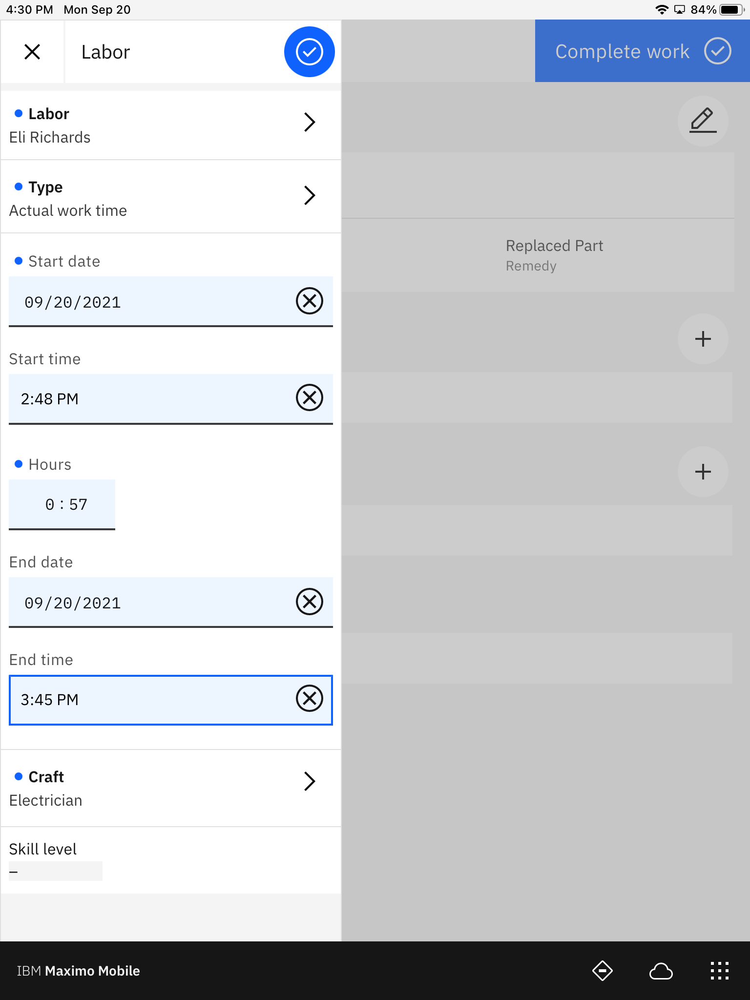{: style="height:400px;width:250px;margin-left:40px"}

## 总结

作为监控跨多个站点的水和废水处理设施和资产的现场技术人员,我能够使用 `IBM Maximo Monitor` 来:
- 第一次去现场的资产时就解决问题。
- 获得远程支持的帮助

作为远程运营支持工程师,监控跨多个站点的水和废水处理设施和资产,我能够使用 `IBM Maximo Monitor` 来:
- 为现场技术人员提供帮助。