# 远程资产监控

!!! note
    此实验正在开发中。并非所有步骤都完整或准确。

作为需要监控跨多个站点的数百个资产的远程运营支持经理。Monitor 提供了一个可扩展的单一位置来摄取传感器数据,计算关键性能指标,以便我可以从单个仪表板监控所有关键任务资产。

## 查看高严重性异常

我是需要查看全球多个城市资产的远程运营支持经理。使用 `Monitor`,我可以从设备收集数据,并按层次结构、位置、资产和设备在仪表板中组织它们,以便我可以收到需要关注的问题的警报。运营支持可以在 Monitor 中查看通过 SCADA 的历史记录器或连接到 IOT 平台的设备收集的资产信息。

水资源管理局在贝德福德有一个水处理设施,该设施有沉淀池和泵的资产组。我将使用汇总仪表板快速评估所有位置和每种资产类型的运营状况。我还可以查看单个资产实例仪表板。

1. 打开 `Maximo Application Suite` 并选择 `Monitor Application`。
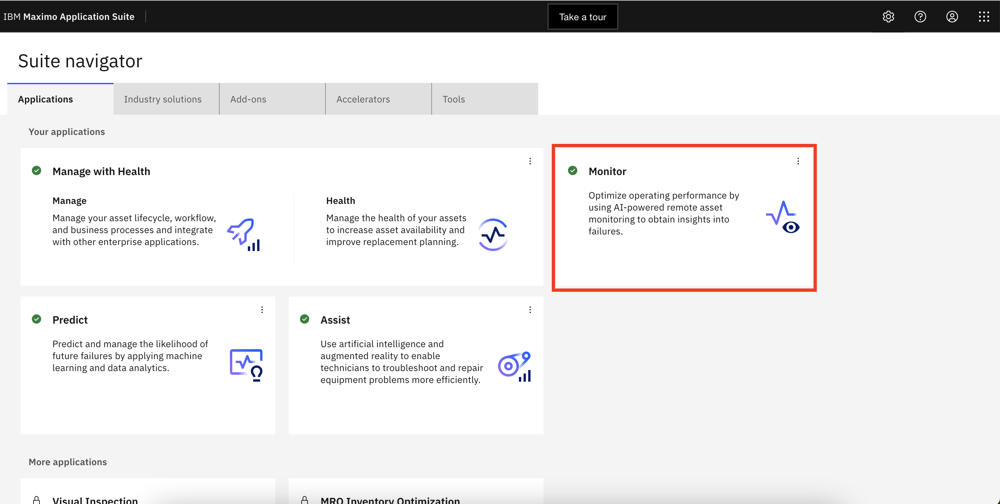
2. 打开 `Monitor` 选项卡
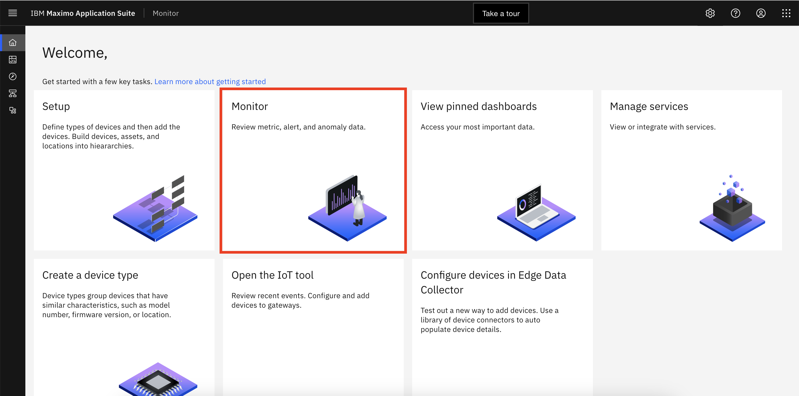
3. 导航到 `Device types` 选项卡并找到名为 `SED_TANK_SIM_DEMO` 的组。
2. 选择顶级组
3. 选择 `Sedimentation Tanks Demo Summary` 选项卡
4. 关闭侧边栏以查看整个 `summary dashboard`
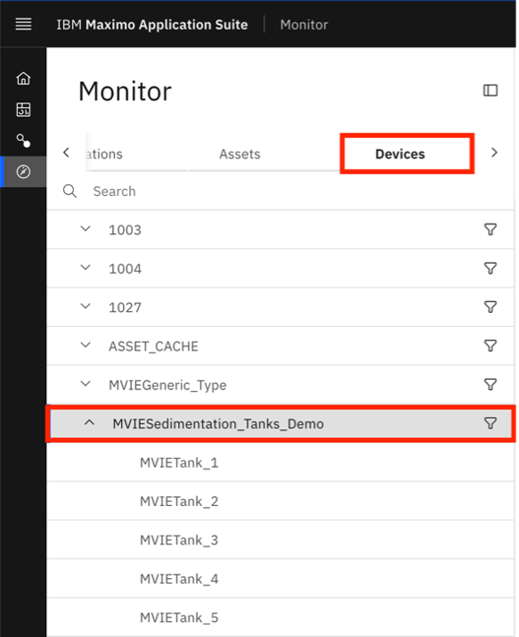{:style="height:500px;width:350px"}
5. 根据需要调整时间范围以查看汇总仪表板上的警报
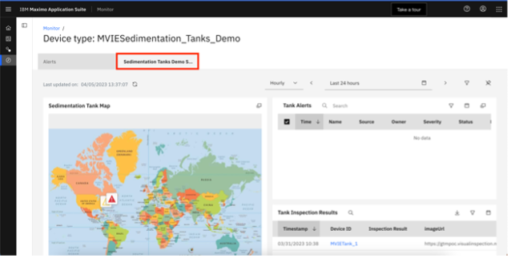{:style="height:300px;width:500px"}

## 储罐监控和检查

我需要检查设施中沉淀池的清洁度。随着时间的推移,储罐可能会滋生真菌或从环境中收集碎片。已知有动物意外掉入我们的储罐的案例。

我们设施中的每个储罐都由摄像头持续监控。摄像头的馈送每小时由 `Maximo Visual Inspection` 的 AI 模型分析一次,并作为 IoT 事件上传。`Maximo Monitor` 将这些详细信息映射并绘制在仪表板上作为资产。触发规则以生成警报。`Monitor` 提供单个仪表板来查看和处理设施周围所有储罐的警报。`summary dashboard` 告诉我 Tank 1 显示警报。

1. 通过单击警报表、储罐检查结果表中的 `Tank 1` 或从侧边栏导航到 `Tank1 instance` 仪表板,选择显示警报的储罐。
2. 选择 `Metrics Dashboard` 选项卡,隐藏侧边栏(如果需要)。
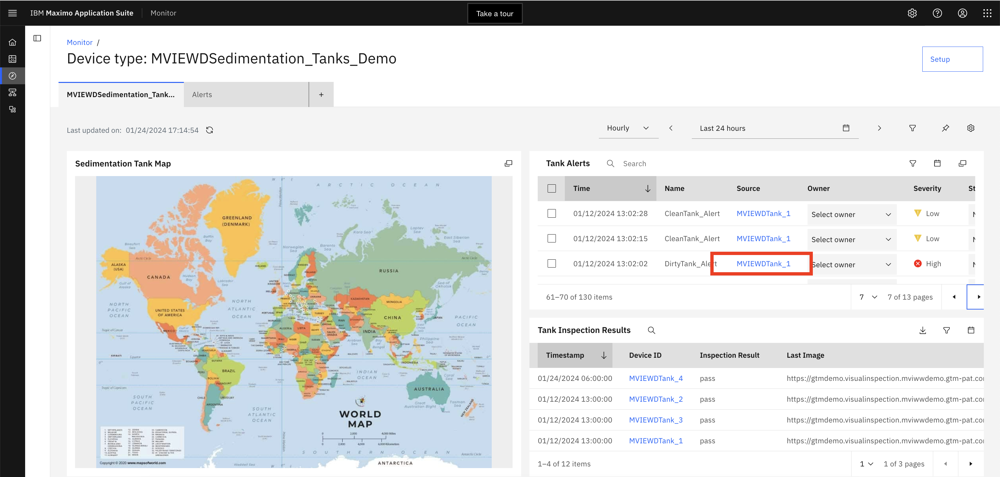
3. 在 `alert card` 中筛选 `severity of alerts`。根据需要调整时间范围以查看 `Summary Dashboard` 上任何时间段的警报。
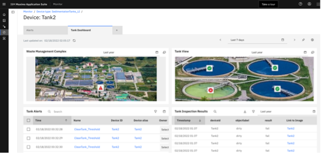

## 储罐警报

我可以导航到单个资产 `Tank1 instance` 仪表板以查看和处理储罐的警报。我可以从警报中看出储罐正在达到临界状态。`table card` 显示与指定储罐的事件相关的行列表,其中包含标识清洁或脏污储罐的属性。您可以检查 `Tank Inspection Results` 表中 `Link to Image` 列中的置信度分数以证实发现。

1. 单击被描述为 `dirty` 且有警报的 `tank inspections results` 链接
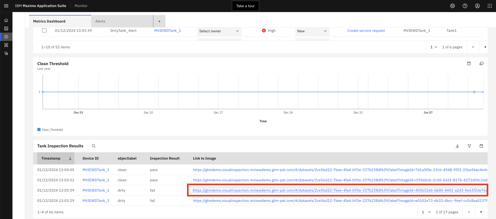
2. 调查储罐视觉检查结果。
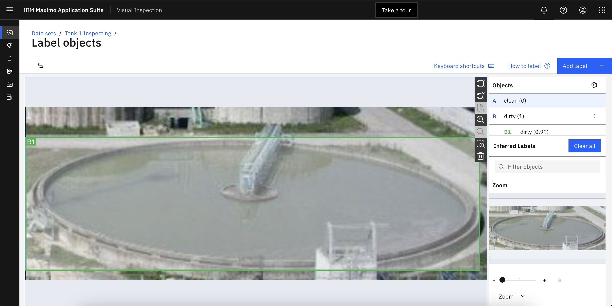
3. 您得出结论,需要维护来解决储罐中的浑浊度。为了确保,您还调查是否存在可能导致问题的泵问题。

!!! note
    导航到 `Maximo Visual Inspection` 时,使用您在电子邮件中收到的 `MVI Edge` 凭据登录,按继续,然后关闭选项卡,然后从 `Inspection Results` 表再次单击。

## 泵警报

现在我想调查我的泵,看看这是否是浑浊度的原因  

1. 从侧边导航栏中选择 `Monitor`。
2. 选择 `Hierarchies` 选项卡。
3. 选择 `EAGLENA`。
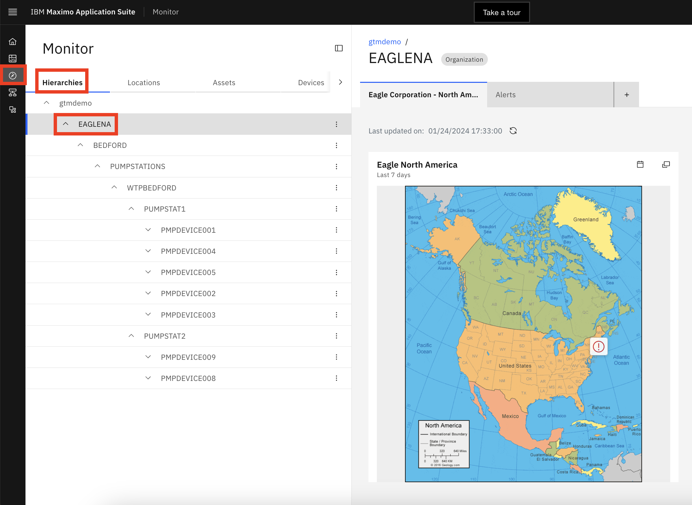 
4. 您可以关闭 `sidebar` 以增加仪表板的查看区域。

这向我展示了有关我的资产问题的实时洞察地图。层次结构表示我的业务中资产的组织方式。

仪表板完全可定制,允许运营经理在单个仪表板中跨多个站点进行扩展,以识别最紧急和最关键的问题。我从地图上看到贝德福德位置的资产有警报。

5. 通过展开层次结构中的节点直到到达贝德福德站点,向下导航到贝德福德站点的层次结构。
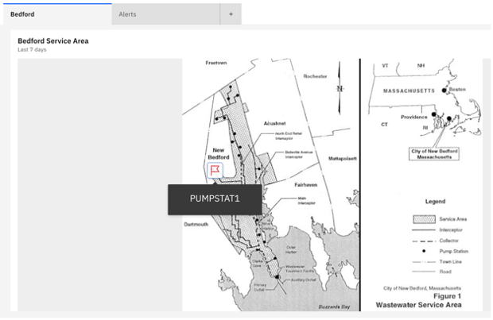 
6. 单击 Beford 节点以查看贝德福德站点的仪表板。
7. 贝德福德服务区的地图显示 `PUMPSTAT1` 存在问题。向下滚动并查看警报。

汇总仪表板向我展示了泵站点和指标的全球地图,并提供有关我的资产问题的实时洞察。仪表板完全可定制,允许运营经理在单个仪表板中跨多个站点进行扩展,以识别最紧急和最关键的问题。

8 从地图上看到该位置的一个泵有警报。

9. 向下滚动并查看 `PUMPSTAT1` 的 `Alert` 选项卡上的警报。我可以在 `PUMPSTAT1` 的警报仪表板上看到 `PMPDEVICE005` 的警报
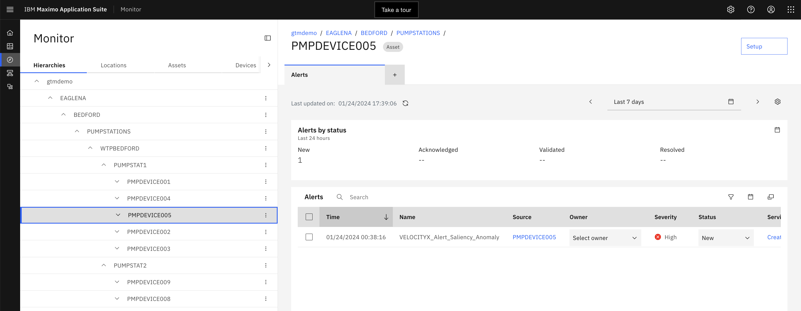
10. 滚动到泵: PMPDEVICE005 仪表板(打开最低级别的仪表板)
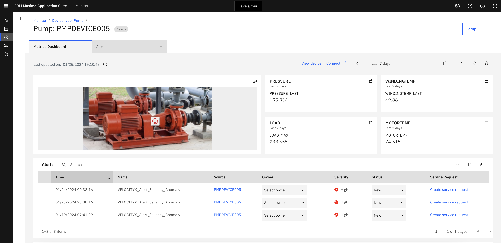
11. 展开警报卡并筛选高严重性警报。
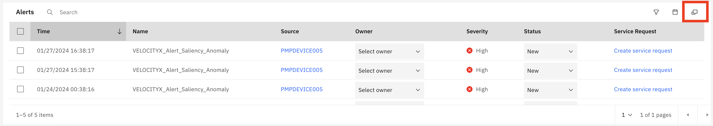
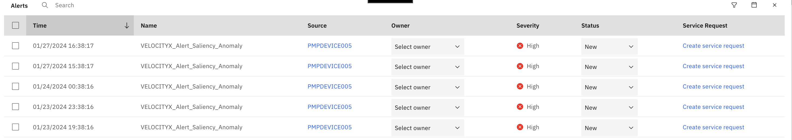

我将筛选高严重性警报,并看到泵 005 最近有警报。

12. 关闭 `alert` 卡。
13. 向下滚动到 `Asset Information` 卡
14. 单击 `PMPDEVICE005`。
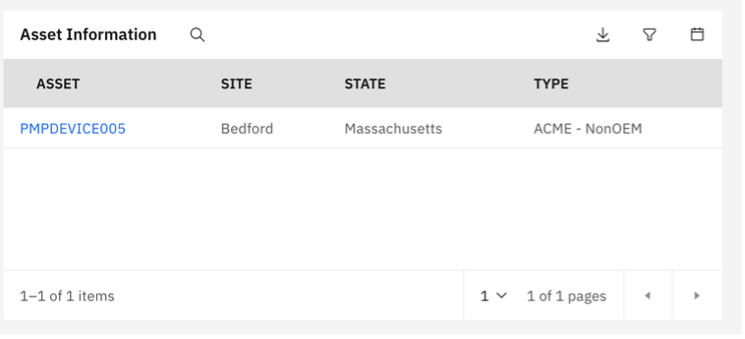

## 了解资产历史

我可以轻松地从表卡中查看 Maximo 中的资产历史记录,并查看对此泵进行了哪些服务。也许,它的维修不当现在导致了振动。
1. 单击 `Asset Information` 卡中的 `PMPDEVICE005`。
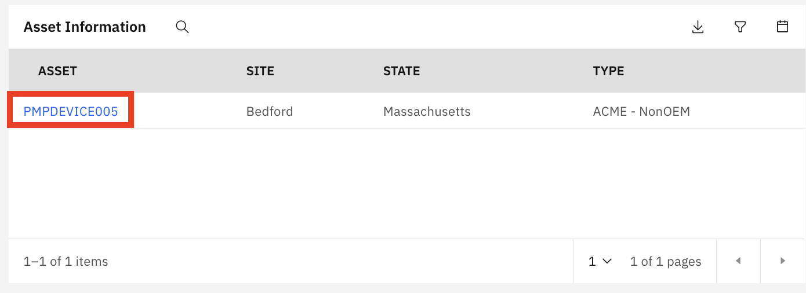
2. 在 `Maximo Manage` 中单击 `Work` 选项卡
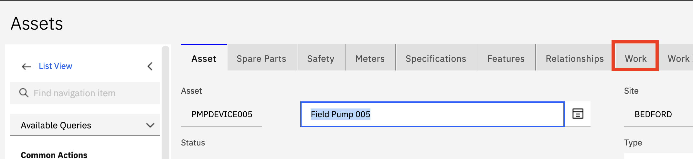
3. 筛选状态 `COMP` 以查看最新完成的工作订单。
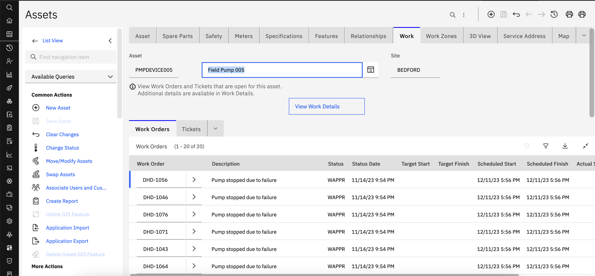

看起来水泵轴承座和密封件已更换。泵正常运行,但随后又开始振动。掌握这些数据,使运营工程师能够深入了解资产的历史记录,从而就如何进行维护做出明智的决策。我通过查看警报更深入地调查问题。这个泵上有很多警报要查看。Monitor 提供了从传统的基于阈值的警报(变得令人不知所措)到 AI 驱动的异常警报的范式转变,以帮助消除误报。我筛选高严重性警报,看到只有几个异常警报。

1. 返回 Monitor 中的设备仪表板并转到 `Alerts` 仪表板。
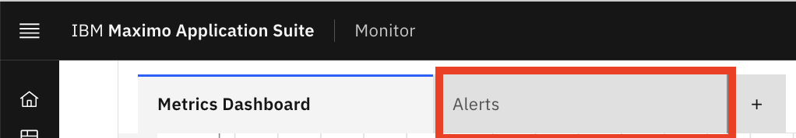
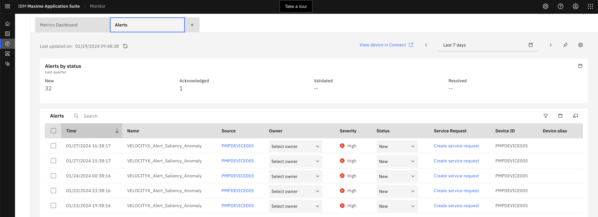
2. 单击 `Create service request`
3. 通过单击 `Create` 完成表单。
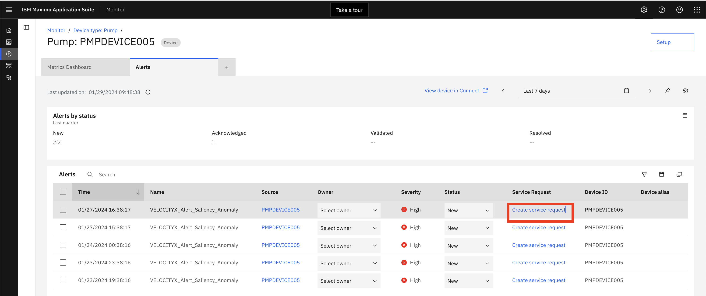
4. 您也可以单击已创建的 `service request` 以在 `Manage` 中简单查看它。
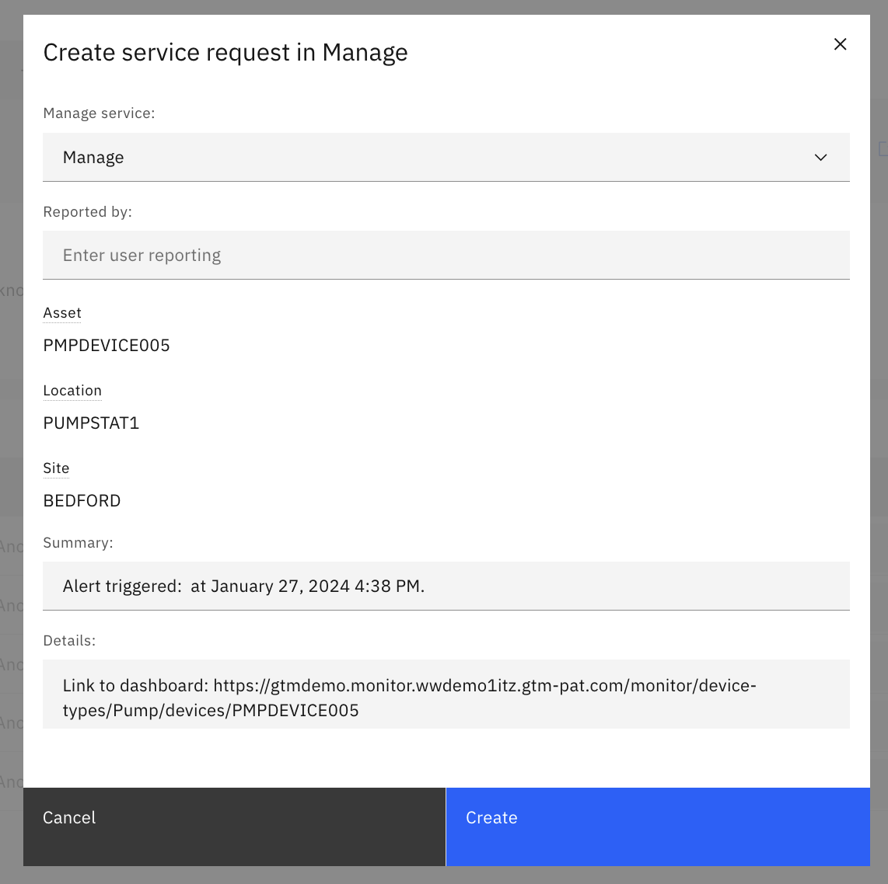

在对 `Pump 005` 的警报进行详细调查后,我直接从 `Monitor` 警报仪表板在 `Manage` 中创建了一个新的服务请求,供维护主管查看,以了解为什么自最近更换密封件以来振动又回来了。技术人员将重新检查泵,因为他认为上次处理时已经解决了振动问题。

在 `Manage` 中,我可以查看服务请求详细信息、相关工作订单、服务地址、分配劳动力以及在 Manage 中验证和/或更新服务请求状态。

## 数据摄取和 KPI 管道

让我们转到资产类型 `Setup`,我们可以看到有实时指标流入 Monitor,例如分析的 `Velocity vector`。

1. 在 Monitor 中,导航到左侧导航中的 `Setup`。
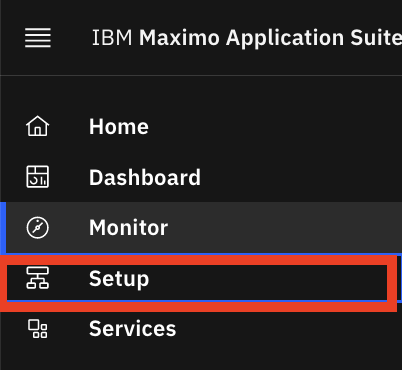
2. 在 `Devices types` 选项卡下选择 Pump。
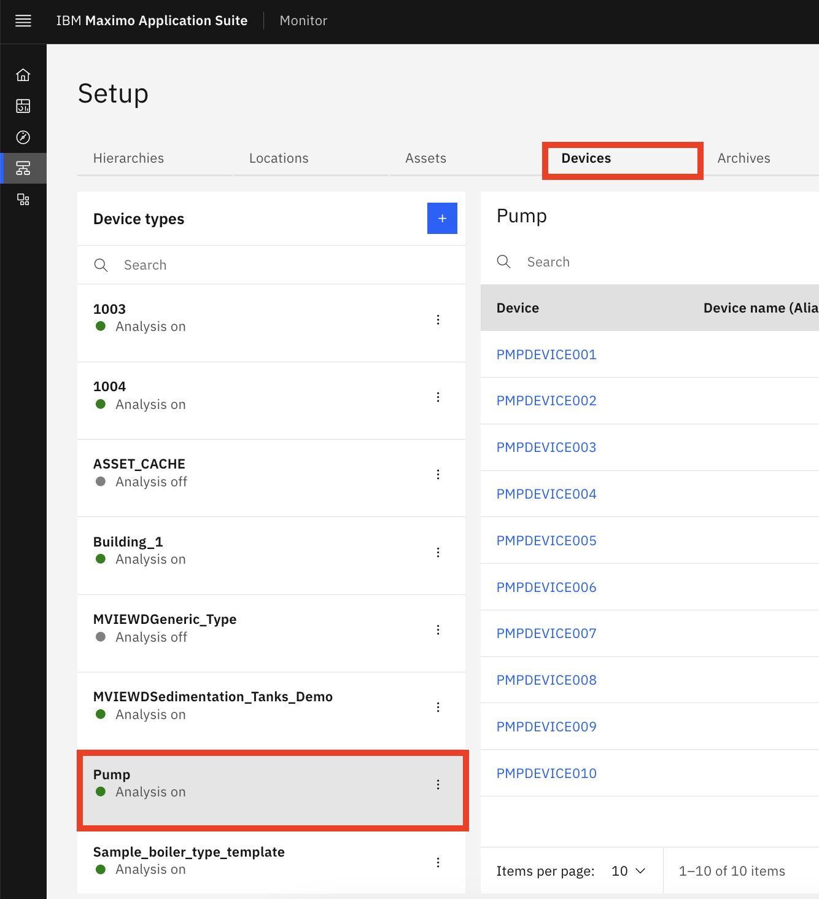
3. 单击 `pencil/edit` 图标
4. 展开 `Metric` 部分并单击泵上的 `VELOCITYX`。
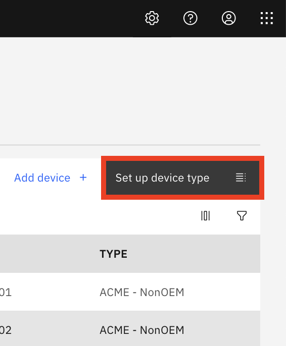
5. 单击 `Batch data metric` 部分旁边的 `create metric`,以了解如何使用 AI 模型分析来自资产的传入时间序列数据。
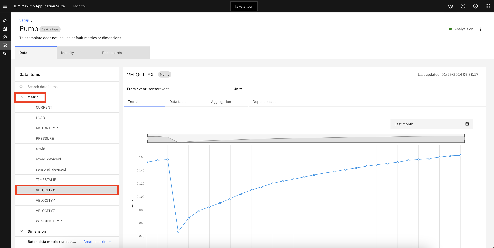

Monitor 提供各种开箱即用的时间序列和统计函数,允许非数据科学家对资产设备传感器数据进行实时流式传输或历史分析。在 `Metric` 部分,我们可以看到来自泵的每个传感器(如 `vibration` 和 `temperature`)的数据流入。在 `Batch data metric` 部分,内置的 AI 模型或函数可以在 Monitor 中只需点击几下即可应用,无需数据科学或开发经验。还可以使用 `Watson Studio` 创建新的异常检测模型,并使用由 `Monitor` 函数管道调用的 `Watson Machine Learning` 服务进行推理。

## 总结

作为远程运营支持工程师,监控跨多个站点的水和废水处理设施和资产,我能够使用 `IBM Maximo Monitor` 摄取传感器数据,计算关键性能指标,使用 AI 模型分析这些数据,而无需数据科学家。通过使用可扩展的汇总仪表板,我能够快速识别资产高严重性异常警报,调查这些资产,最后采取行动防止故障和计划外停机,节省数千美元,并维护水处理和分配系统的完整性。

接下来让我们看看资产分析师如何使用 `Maximo Application Suite` 管理视觉检查模型。
