# 以可靠性为中心的维护

!!! note
    此实验正在开发中。并非所有步骤都完整或准确。

资产维护是业务运营的重要方面,它影响运营费用的很大一部分。维护任务可能是预防性的、预测性的,或涉及检查以识别或监控缺陷。预防性维护方法通常不太有选择性,并基于行业最佳实践或 OEM 的固定时间表。通过应用有效的可靠性策略,这些维护和检查任务可以更加集中,并围绕提高资产的效率、可靠性和安全性。

RCM 是一种基于分析的方法,专注于识别资产功能、故障原因、故障模式和单个资产的影响分析 (FMEA)。RCM 帮助您以最具成本效益的方式优先考虑、优化和分配维护活动,以延长资产寿命并减少功能故障。

实施 RCM 需要团队执行 RCM 分析,以识别关键资产功能、所需性能标准、可能的故障场景、这些故障场景的原因以及单个资产的每个故障场景的后果,这需要大量的时间、成本和资源。

Maximo Application Suite 提供了一个专用的 RCM / FMEA 应用程序,其中包括可靠性策略库,可以轻松选择和应用关键资产的可靠性策略,并加快实现价值的时间。

## 可用的资产策略

作为水处理厂的可靠性工程师,我想实施 RCM 以提高资产可用性和效率,并维护我的业务关键资产,如离心泵。我注意到润滑油往往会随着时间的推移而降解。我想制定一个策略来定期监控润滑油,以防止泵磨损。

在本练习中,您将了解 Maximo Reliability Strategies 中可用的资产类别和维护策略。
 
1.	登录 MAS 并选择 `Manage with Health` 应用程序。
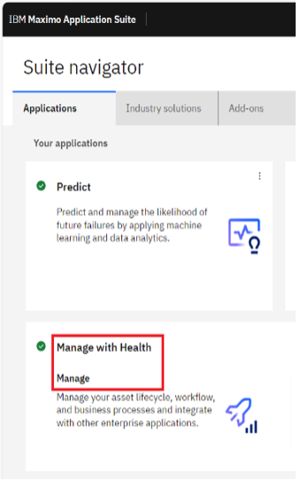 

2. 从左侧导航栏导航到 `Assets`。 
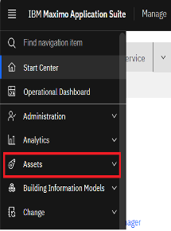

3. 选择 `Reliability Strategies` 重定向到 `Reliability Strategies` 应用程序。 
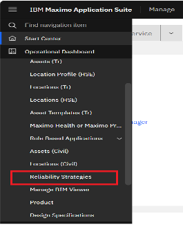

`Reliability Strategy` 库通过已为单个资产定义的 58,000 多个故障模式和相应的缓解活动列表加速 RCM 的应用。我可以使用这些来创建预防性维护任务和作业计划。 
 
4. 点击 `Asset` 框,将提供资产列表供选择。 
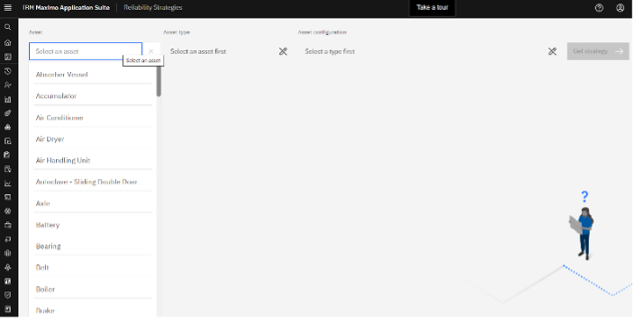

## 筛选泵资产策略

使用 `MAS Reliability Strategies` 应用程序,我有一个预构建的资产库,我可以从中筛选和选择资产进行 RCM 分析,基于资产类型和资产配置来识别和选择业务关键资产。

在本练习中,您将了解可用于预防性维护的泵资产类别维护策略。

1. 选择资产: `Pump`
2. 选择资产类型: `Centrifugal`
3. 选择资产配置: `Pump - Horizontal - Multistage - Axially Split Case - Mechanical Seal - Radial Bearings-Oil Lubed`(列表中的第 2 个)。 
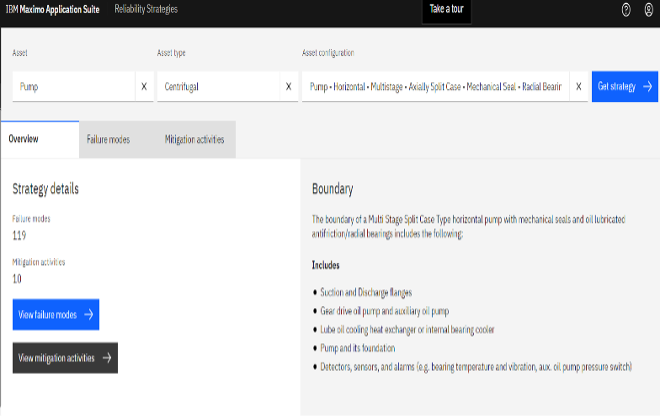

## 选择策略

此操作从库中返回 `failure modes` 和相应的缓解活动,以获取所选资产的 `FMEA / PM` 和 `Job plans`,这消除了与技术人员、操作员和主管一起分析 RCM 策略的数周工作,并加快了实现价值的时间。

在这种情况下,`Get strategy` 操作提供了离心泵的故障模式和相应缓解活动的列表,我可以进一步分析以优化我们的预防性维护任务。

1. 导航到 `Failure modes` 选项卡以查看离心泵所有可能故障模式的列表。
2. 展开 `Lube Oil` 以查看相应的故障机制。
3. 展开 `Degraded` 故障机制以查看相应的故障影响。
4. 选择 `Normal Wear` 故障影响。选择此作为 `Pump Asset Strategy`
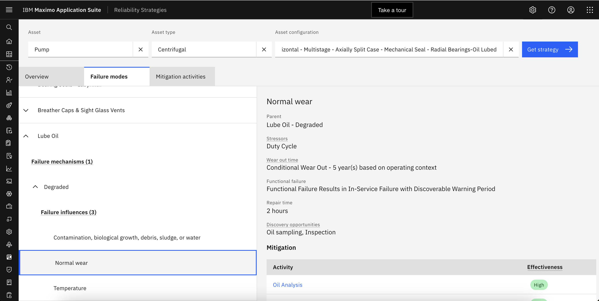

## 选择运营环境

所需的预防性维护级别取决于资产的利用率及其位置。这种运营环境是决定预防性维护计划时要考虑的重要因素。这也帮助我识别应该为我的资产监控的关键影响。可能导致或加剧故障的压力源、通用或条件降解时间、故障影响、维修时间以及检测功能故障的发现机会。

1. 通过滚动到页面右下方选择泵运营环境,以查看所有缓解活动及其针对 `failure influence` 的 `Normal Wear` 列出的有效性。
2. 导航到 `Mitigation activities` 选项卡。这将列出我的资产的所有 `mitigation activities`。
3. 滚动到 `mitigation activities` 列表底部并选择 `Oil Analysis`
4. 导航到页面右侧,其中提供了 `preventive maintenance` 和 `job plan` 详细信息以及 `Oil Analysis` 缓解活动的 `frequency and labor hours`。
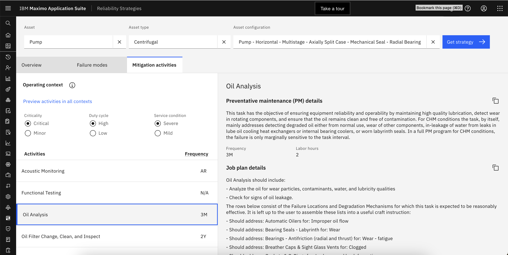

这些活动是我可以应用来缓解各自故障模式的可靠性策略。

## 自定义运营环境
我还可以根据所选资产的关键性、工作周期和服务条件,根据我们的运营环境微调这些缓解活动。

1. 点击 `Operating context` 图标右侧的圆圈 `i` 图标,然后点击弹出窗口中的 `View details for this asset` 链接。
2. 关闭对话框并点击 `Preview activities in all contexts` 选项。
3. 关闭对话框并将 `Duty Cycle` 单选按钮从 High 切换到 Low。
4. 在页面右侧向下滚动到 `Effectiveness` 部分。
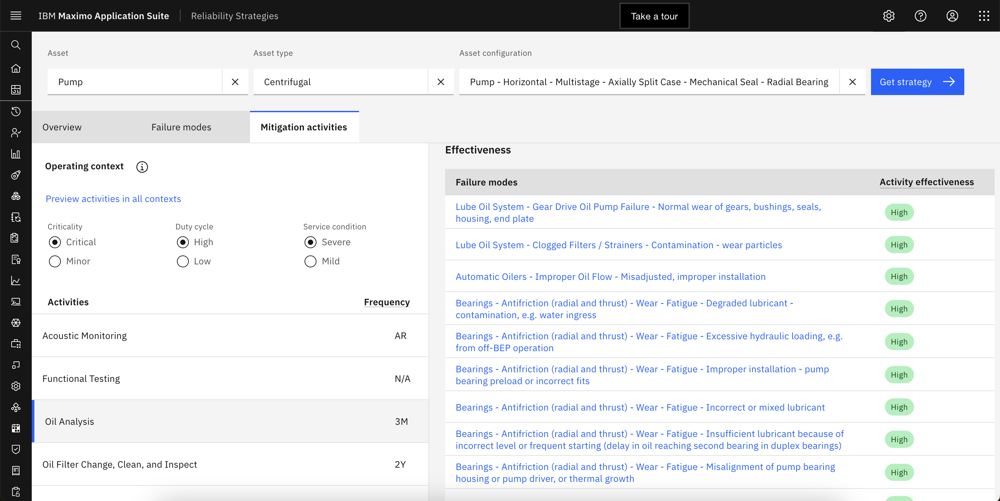

根据 `duty cycle` 的变化,建议更改 `Oil Analysis` 活动的频率。

`Criticality`、`Duty cycle` 和 `Service condition` 是可选择的,它们共同构成 `Operating context`,以确定维护我的资产的最佳可靠性策略。

这列出了 `Oil Analysis` 缓解活动可以解决的所有故障模式,提供了有关如何将多个故障模式和缓解活动联系在一起的全面详细信息。

## 应用维护计划

!!! note
    以下练习可能已经完成。跳过这些步骤,只需查看已完成的作业计划和 PM。

我可以复制作业计划和预防性维护详细信息,并直接从 `Mitigation activities` 选项卡导航,为我的资产创建各自的 `job plans` 和 `PM tasks`。

1. 通过点击 `Job plan details` 右侧的 `copy icon` 复制 `Maintenance Plan`。
2. 点击弹出窗口中的 `Open Job Plans` 链接。
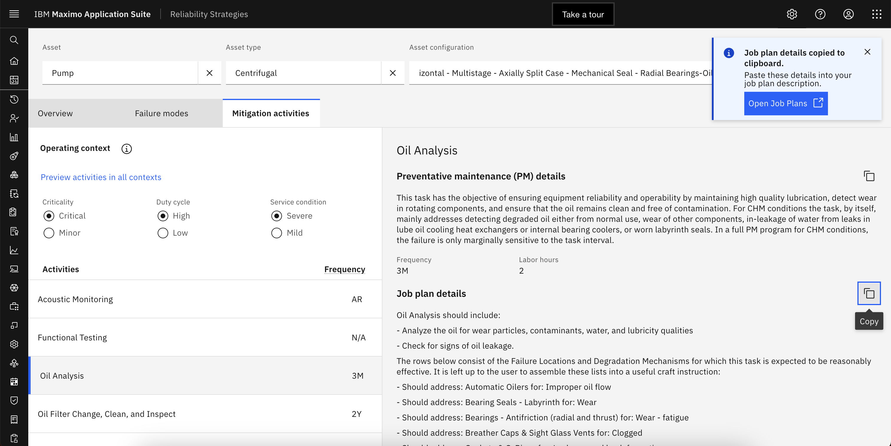
3. 应用 `job plan "57899"` 的筛选器以列出为泵设备创建的作业计划。
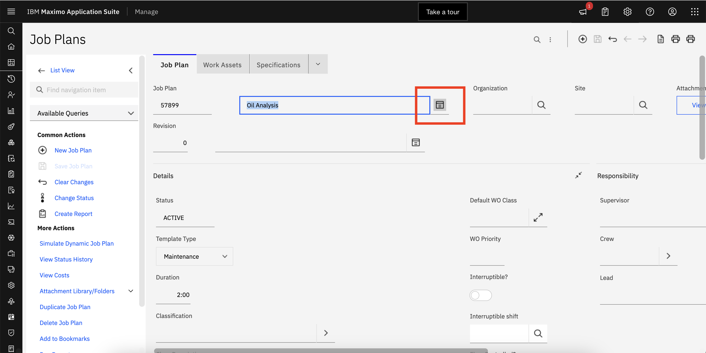
4. 点击 `long description` 图标以查看从 `Reliability Strategies` 粘贴的文本
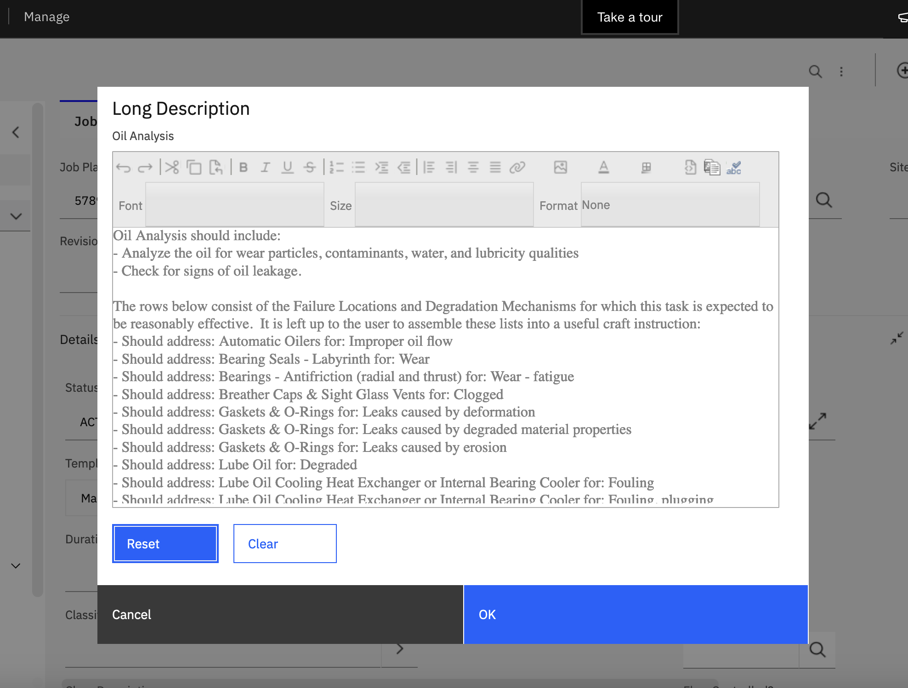

作业计划详细信息将被复制,并显示弹出窗口,其中包含导航到 Manage 中 `Job Plans` 的链接。我可以粘贴复制的作业计划详细信息以创建新的作业计划。我已使用 `Reliability Strategies` 为离心泵详细任务创建了作业计划 `57899`。

5. 通过点击 `Mitigation activities` 选项卡中 `Preventative maintenance (PM) details` 右侧的 `copy` 图标粘贴 `Maintenance Plan`。
6. 点击弹出窗口中的 `Open Preventative Maintenance` 链接。
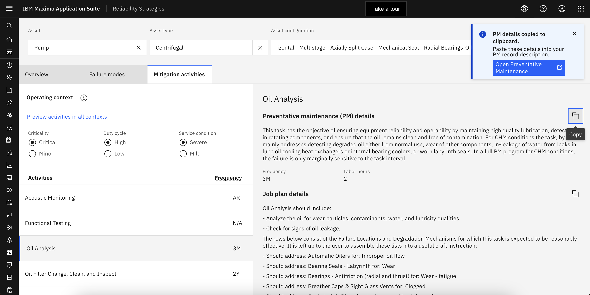
7. 应用资产 `PMPDEVICE` 的筛选器以列出为泵设备创建的所有 PM。
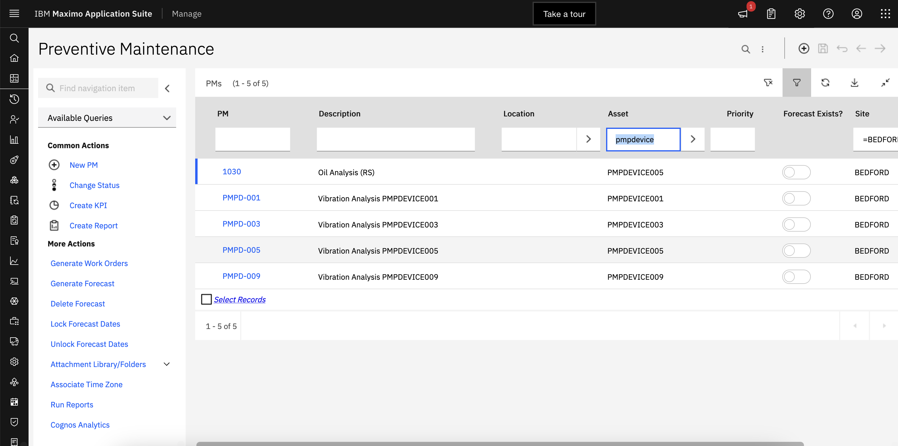
8. 打开 `PM "1030"` 并点击 `long description` 图标以查看从 `Reliability Strategies` 粘贴的文本。
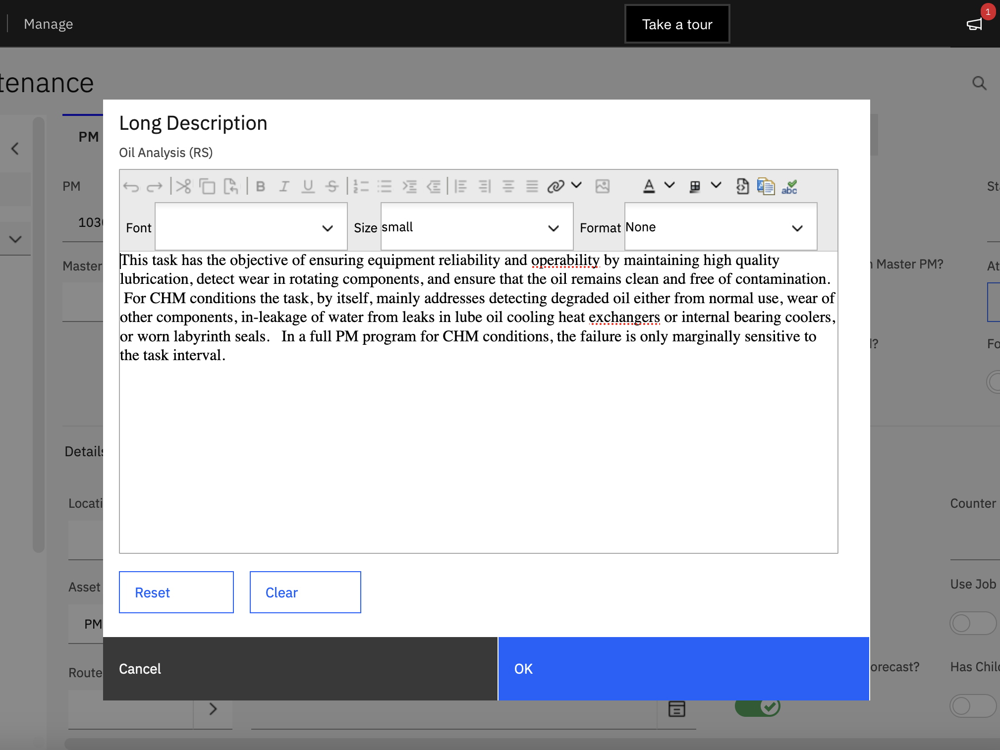
9. 粘贴复制的 `Preventive Maintenance details` 以为我的资产创建 PM 任务。
10. 预防性维护详细信息将被复制,并显示弹出窗口,其中包含导航到 Manage 中 `Preventive Maintenance` 菜单的链接

通过 RCM 分析,我创建了多个预防性维护任务,具有正确的频率和缓解离心泵设备每种故障模式所需的精确劳动小时数。实施基于 RCM 的 PM 和作业计划可优化整体资产可靠性和效率,并使我们的现场技术人员执行 PM 任务变得更快、更简单。

## 总结

作为可靠性工程师,维护电网或其他关键基础设施资产,我能够使用 `IBM Maximo Application Suite Reliability Strategies` 来识别资产故障模式,识别要测量以监控我的资产性能的影响,并识别反映我的业务需求的特定资产类别和运营环境的最佳预防性维护计划。这将帮助我稍后设置和计算资产健康和风险,以便更容易识别然后调查和处理这些资产,以防止故障和计划外停机,节省数千美元,并维护电网的完整性。

现在我已经使用 Reliability Strategies 实施了作业计划和预防性维护工作订单模板,我将把它交给运营支持工程师,他可以监控我们所有的业务关键资产,作为 RCM 的一部分。