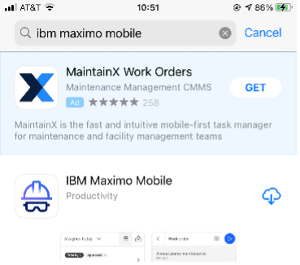
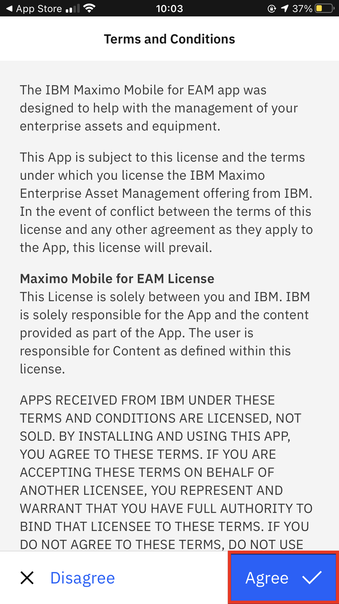
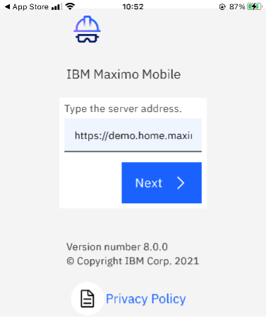
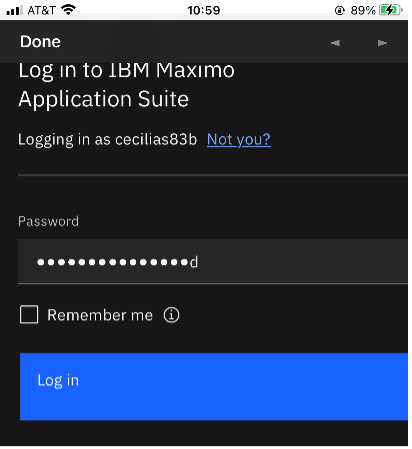
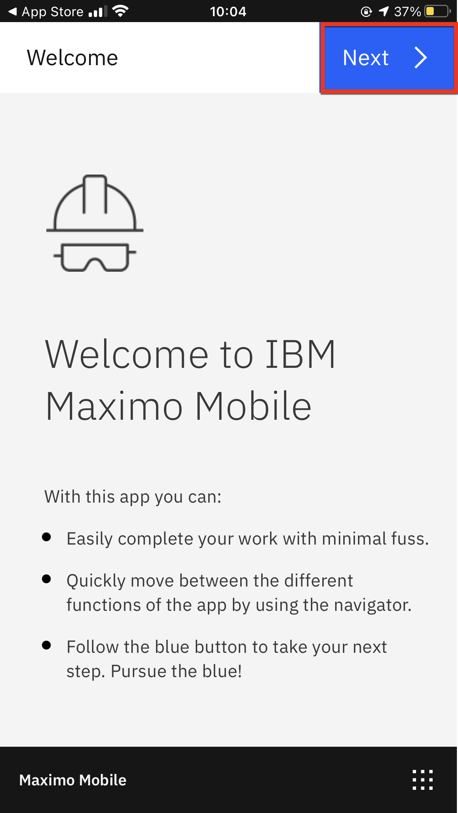
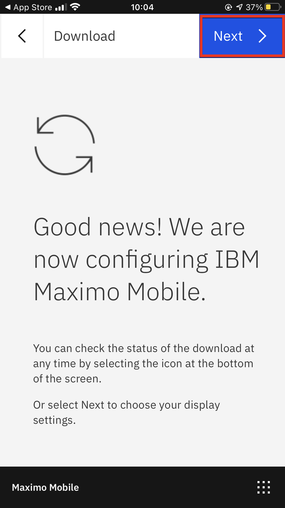
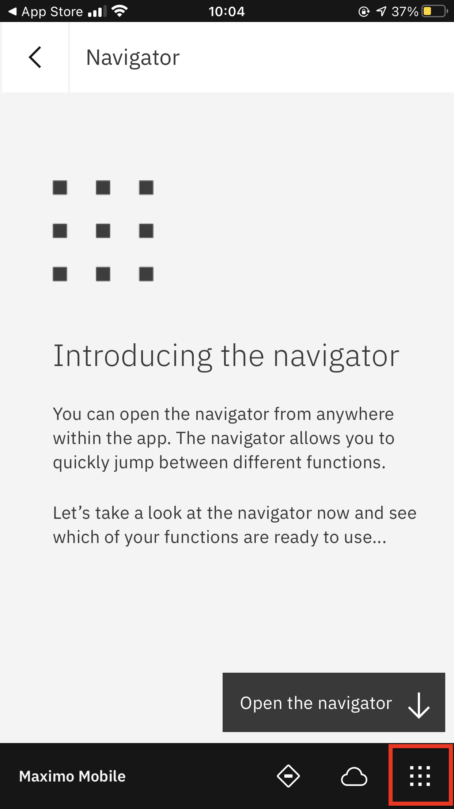
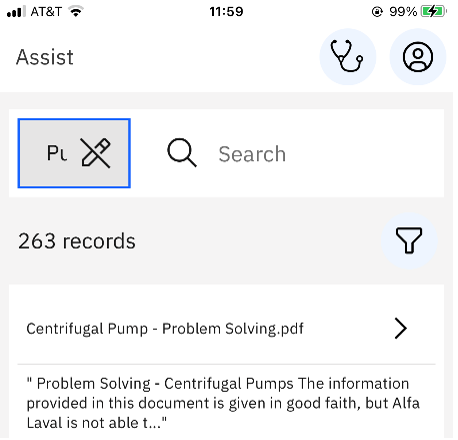
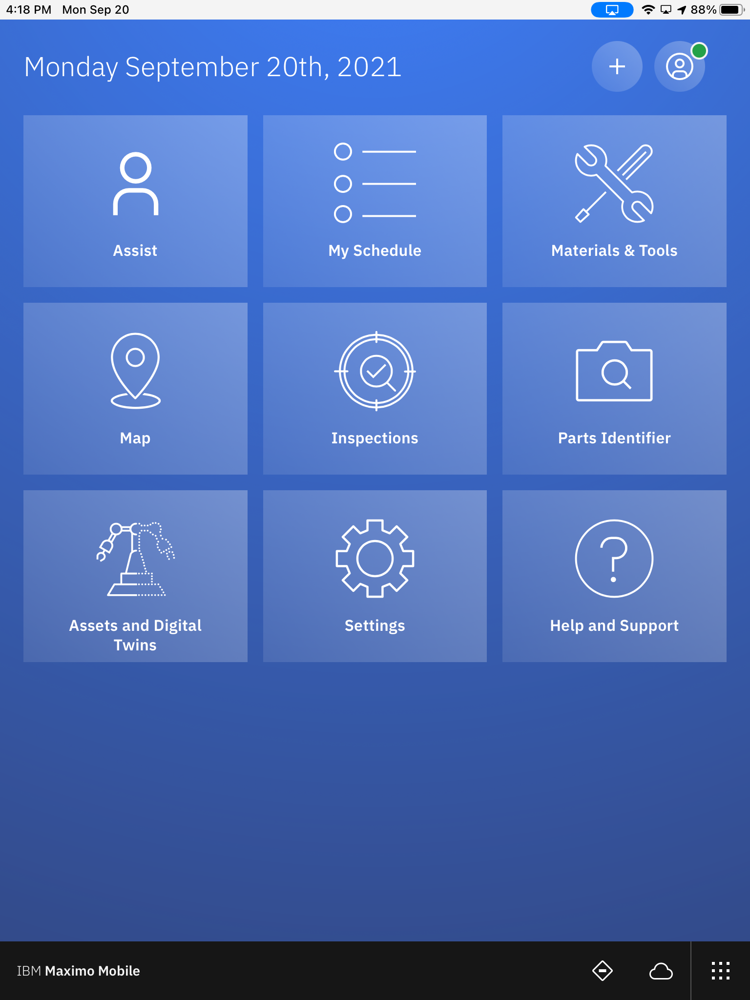
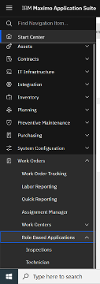

# 先决条件说明

以下是 Maximo 练习所需的先决条件。

## 所有练习

所有练习都要求您具备:

1.  一台带有 Chrome 浏览器和互联网连接的计算机。

2.  访问 Maximo Application Suite 环境的用户权限。 
您的协调员应该已经向您提供了有关访问权限的信息。

3.  IBM ID。如果您没有 IBM ID,可以在[这里](https://www.ibm.com/account/reg/signup?)获取: 
- 点击 `Login to MY IBM` 按钮 
- 点击 `Create an IBM ID` 链接

4.  测试您对 Maximo Application Suite 环境的访问权限。

5.  访问 [Maximo 演示环境](https://gtmdemo.home.masdemoevents.gtm-pat.com/),其中包括
- Maximo App Suite 用户 – 包括访问 Manage、Monitor、Visual Inspection、Health、Predict。      
- Mobile 技术人员用户 – 包括访问 Assist 和 Parts Identifier。

## Mobile

<b>获取以下内容:</b>

1. 在您的应用商店中下载 <b>Maximo Mobile</b> 应用程序,接受所有条款和条件,并允许应用向您发送通知。

    {: style="height:200px;width:250px;margin-left:40px"}

     
2. 从应用商店完成下载应用后,选择 `Agree` 接受条款和条件。

    {: style="height:400px;width:250px;margin-left:40px"}

      
3. 将 URL 和凭据上传到应用中。上传 URL 后,MAS 的登录界面将弹出。

    {: style="height:200px;width:250px;margin-left:40px"}
    {: style="height:200px;width:250px;margin-left:40px"}

      
4. 在接下来的两个屏幕上选择 `Next`。

    {: style="height:400px;width:250px;margin-left:40px"}
    {: style="height:400px;width:250px;margin-left:40px"}

      
5. 打开导航器。

    {: style="height:400px;width:250px;margin-left:40px"}

      
6. 在左上角选择 Pump Demo 项目。

    {: style="height:200px;width:250px;margin-left:40px"}

      
7. 等待数据加载完成。磁贴将构建,标签将在数据加载时从灰色变为白色。在继续之前,请等待所有磁贴显示为白色。

    {: style="height:350px;width:250px;margin-left:40px"}

      
8. 使用 Assist Expert 凭据在第二台设备上重复上述步骤。这是您可以进行协作会话的第二个用户。 
9. 当您第一次进行协作会话时,您必须授予应用使用麦克风和摄像头的权限。 
10. 对于 Parts Identifier,请确保下载照片或准备好模型训练所用的零件,以便您可以使用它们拍照。图像[在这里](https://ibm.box.com/s/o5pve4eh3y60e8j668h3ssjcfx3u9nqd)。

!!! note
    如果您想在计算机上展示此演示,可以使用 [Quicktime for macOS](https://support.apple.com/guide/quicktime-player/welcome/mac) 或 [Reflector](https://www.airsquirrels.com/reflector) 作为软件来镜像您的手机屏幕。或者,使用 Webex...从您的手持设备登录到 Webex 会话并共享您的屏幕。

另请注意,ELI 可以通过登录 Manage 并在工作订单跟踪模块下选择基于角色的应用程序来通过桌面访问移动体验。

{: style="height:400px;width:150px;margin-left:40px"}
