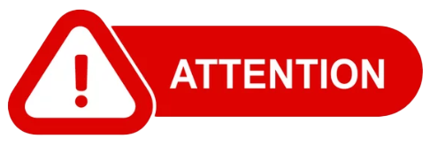

# 欢迎来到  MAS Techzone 认证基础镜像动手实验

!!! danger "受众"
    
    **本动手实验仅适用于 IBM 业务合作伙伴和 IBM 员工， 因为它需要访问 IBM Technology Zone（又名 TechZone）。**  
    如果您无法访问 TechZone，您可以通过遵循 [MAS Devops Ansible Collection](https://ibm-mas.github.io/ansible-devops/){target=_blank} 来配置 OpenShift 集群并安装各种 Maximo Application Suite 应用程序。

---

您将学习如何使用 MAS Techzone 认证基础镜像。

练习将涵盖：

* 实例化/预留 MAS Techzone 认证基础镜像
* 准备 MAS 实例以供使用
* 将 MAS 升级到最新版本
* 尽情享受

!!! note
    运行完整实验所需的预计时间取决于所选择的 MAS Techzone 认证基础镜像：2+ 小时

---

**更新时间：2025-05-30**

---