# 目标
在本练习中，您将学习如何：

* 预留 MAS Techzone 认证基础镜像的实例

---
*开始之前：*  
本练习要求您已经：

1. 完成[所有练习](prereqs.md)所需的前置条件

---

使用您的 IBMid 登录 [IBM Technology Zone](https://techzone.ibm.com/){target=_blank}（又名 TechZone）。

!!! note "请记住"
    请记住，TechZone 仅适用于拥有 IBMid 的 IBM 业务合作伙伴和 IBM 员工。

搜索 `TechZone Certified Base Images`，您将找到此页面： 

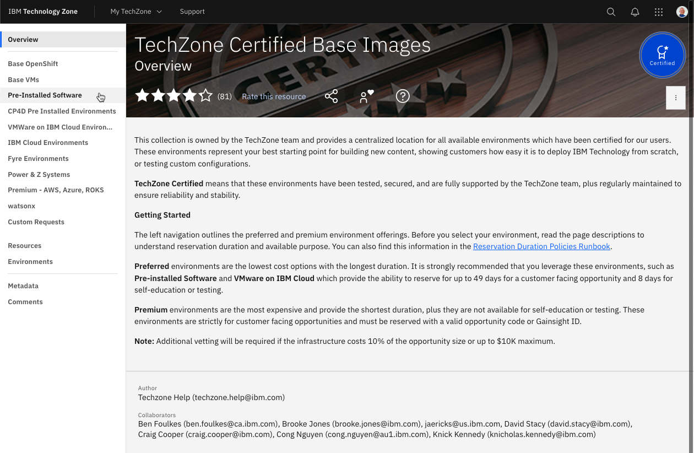  

选择 `Pre-Installed Software` 选项卡。 
向下滚动直到找到 Maximo Application Suite 镜像。 
目前（2025年5月30日）9.0.x 版本存在以下两个镜像： 

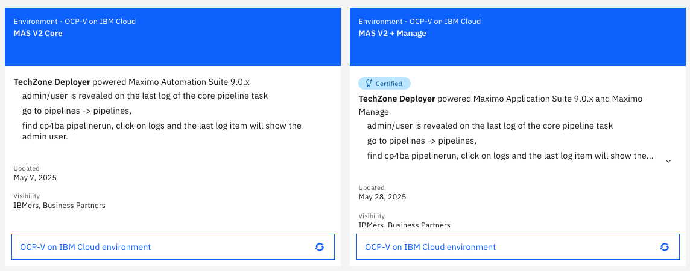  

点击 `OCP-V on IBM Cloud environment` 以实例化其中一个。本实验中使用了 `MAS V2 Core` 镜像，因为它的部署时间要短得多。点击 `Reserve a environment`：

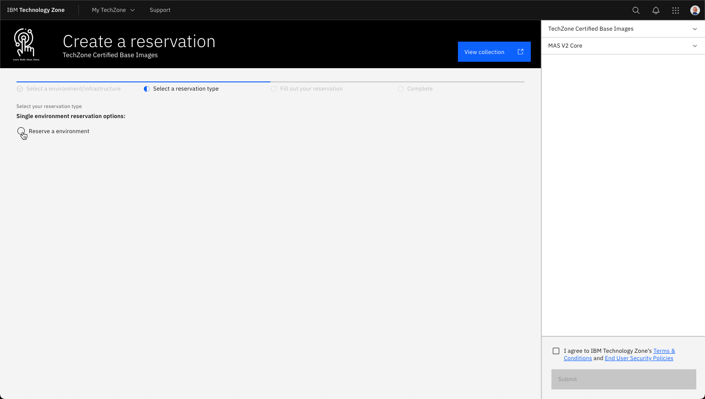  

要了解四种不同用途的持续时间，请点击 `Reservation Duration Policy`： 

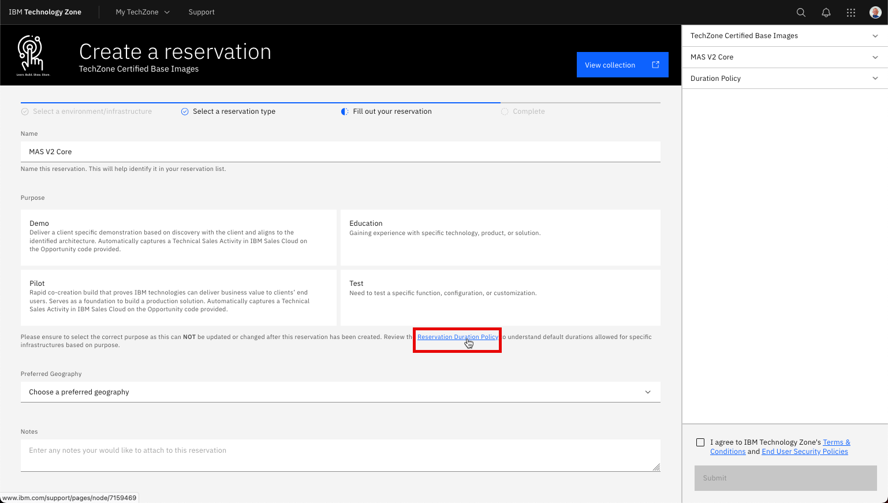  

演示和试点用途需要在 IBM Sales Cloud 中有一个开放的机会。教育和测试只需要用途描述： 

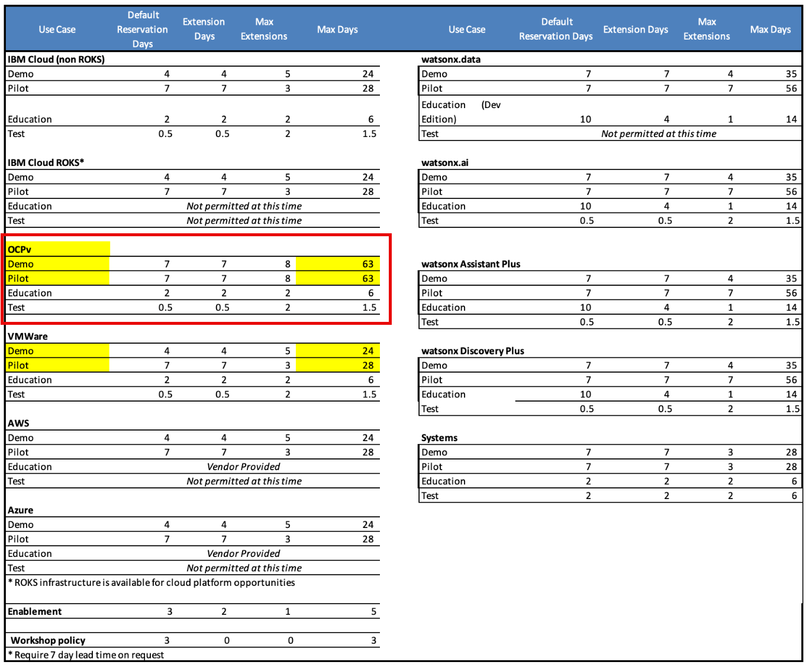  

在本例中选择了 `Education`，因此需要用途描述并且必须选择地理位置。名称也可以选择性地更改： 

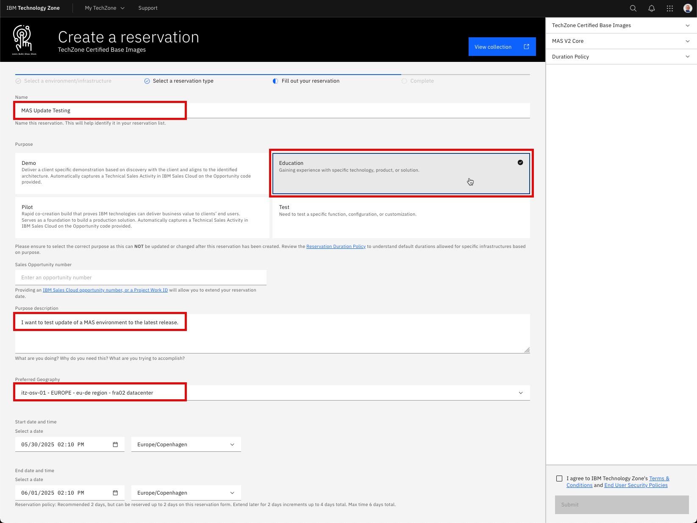  

同意 IBM 条款和条件并点击 Submit： 

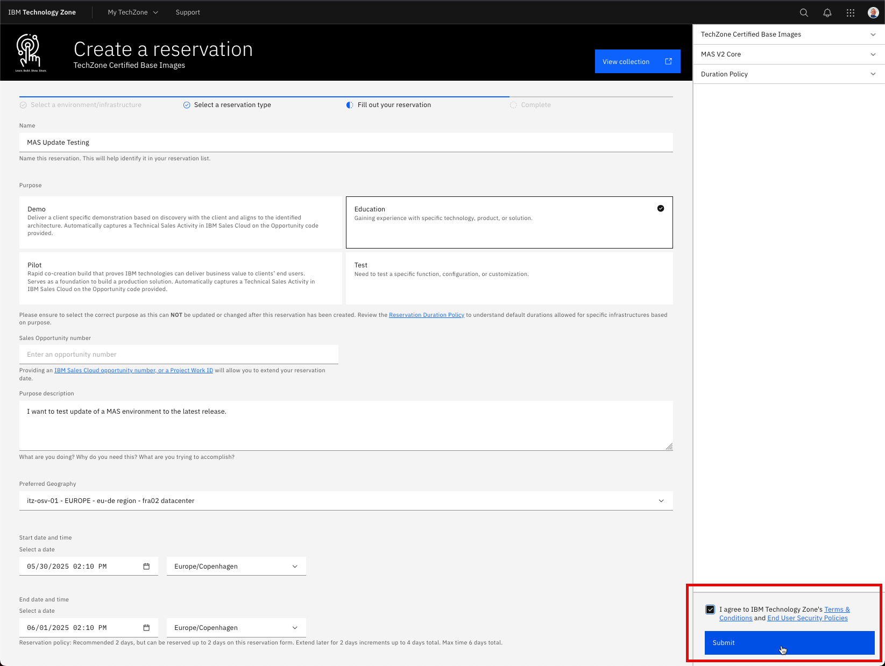  

您将看到感谢页面。点击 `My reservations`： 

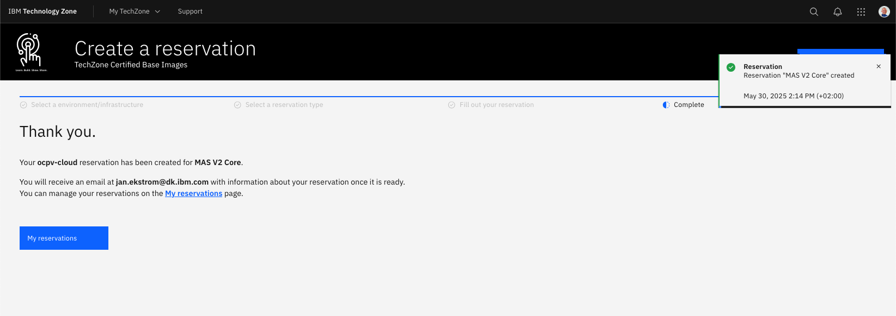  

您可能会在 TechZone 的 `My reservations` 页面中看到初始状态为 `Scheduled`： 

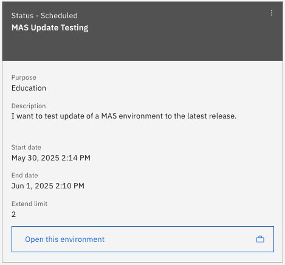  

稍后它将变为 `Provisioning`：

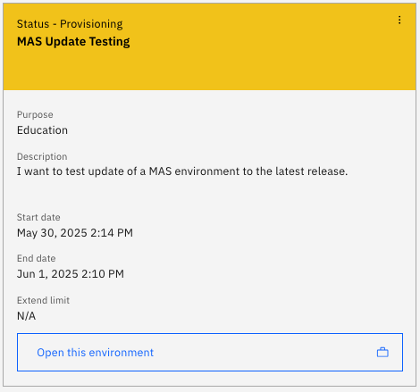  

一段时间后，它将变为 `Ready`： 

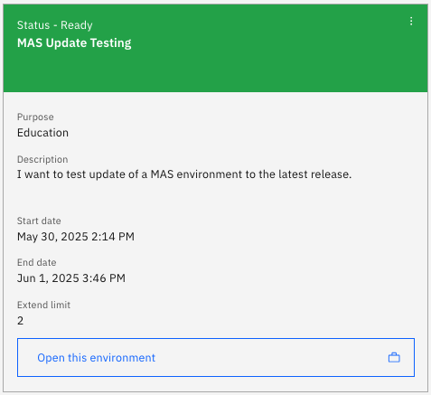  

在本例中，实例化 `MAS V2 Core` 镜像只花了大约 1.5 小时： 

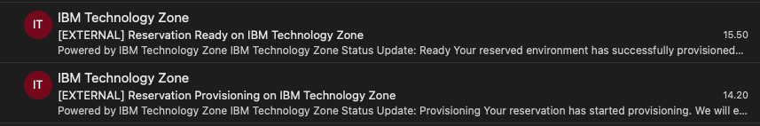  

现在您拥有了一个安装了 MAS Core 的 OpenShift 集群。 
点击预留，您将找到 OCP 集群的链接以及登录所需的凭据： 

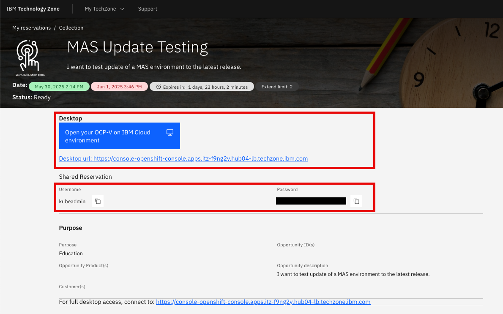  

点击链接打开 IBM Cloud 环境。选择 `kube:admin`： 

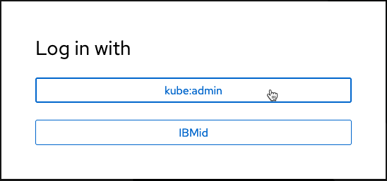  

输入预留页面中的凭据并点击 `Log in`： 

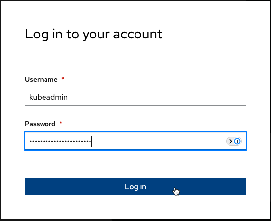  

导航到 `Pipelines` 选项卡，您应该看到 `mas-devops-deploy` 管道已成功： 

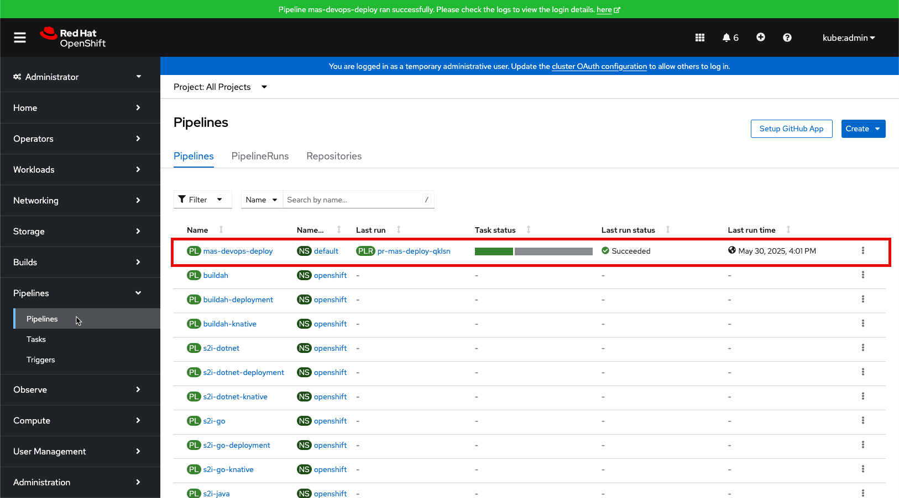  

!!! tip
    如果管道未成功，请尝试重新运行 PipelineRun。如果仍然失败，请打开预留并向 TechZone 支持报告问题：  
    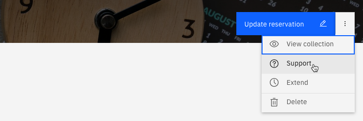

---
恭喜您已成功实例化 MAS Techzone 认证基础镜像。 
