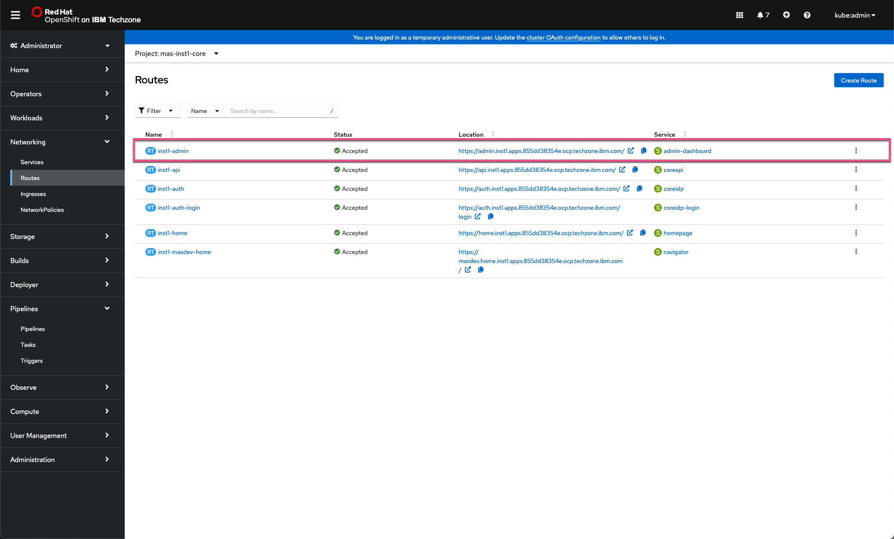
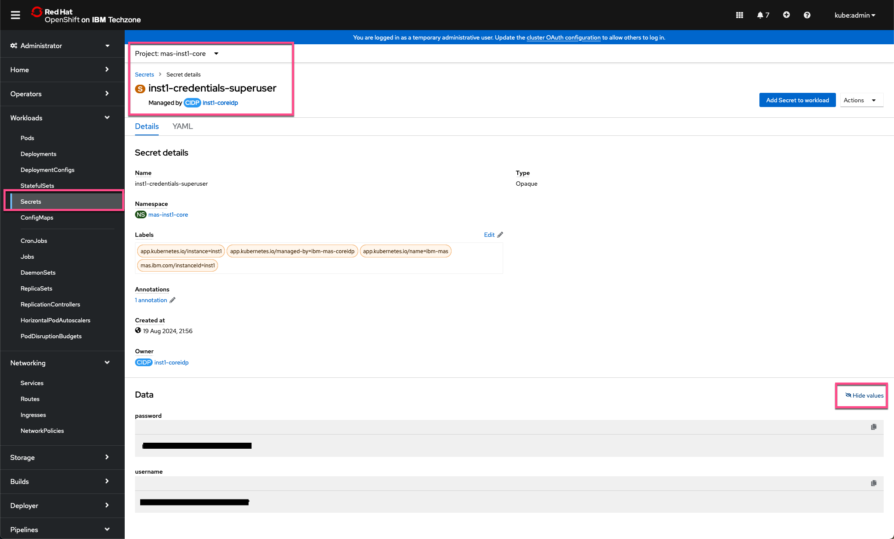
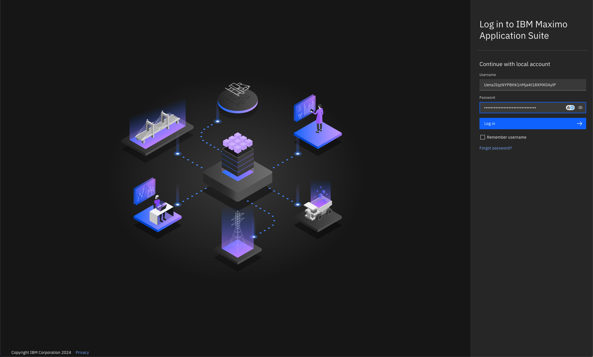
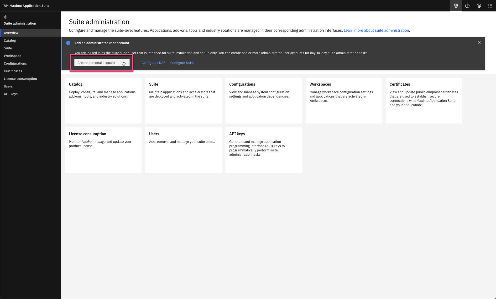
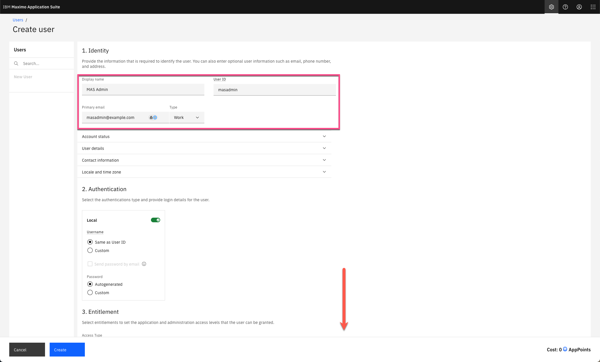
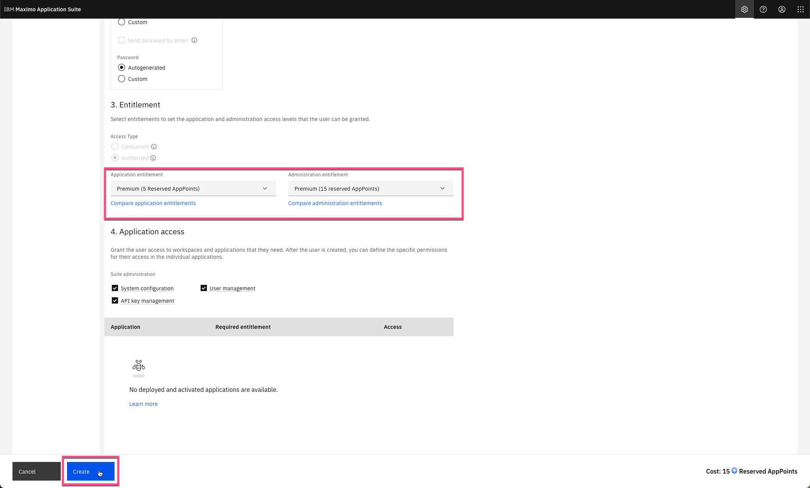
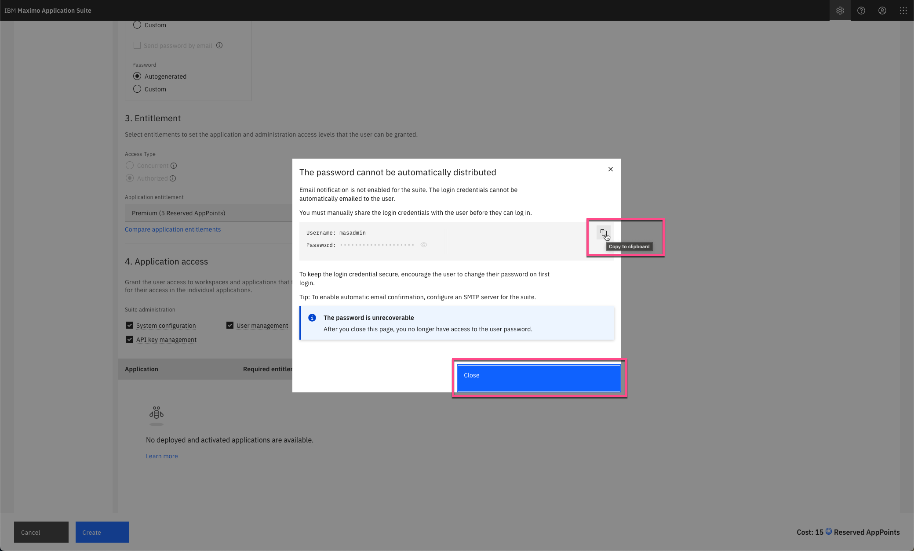
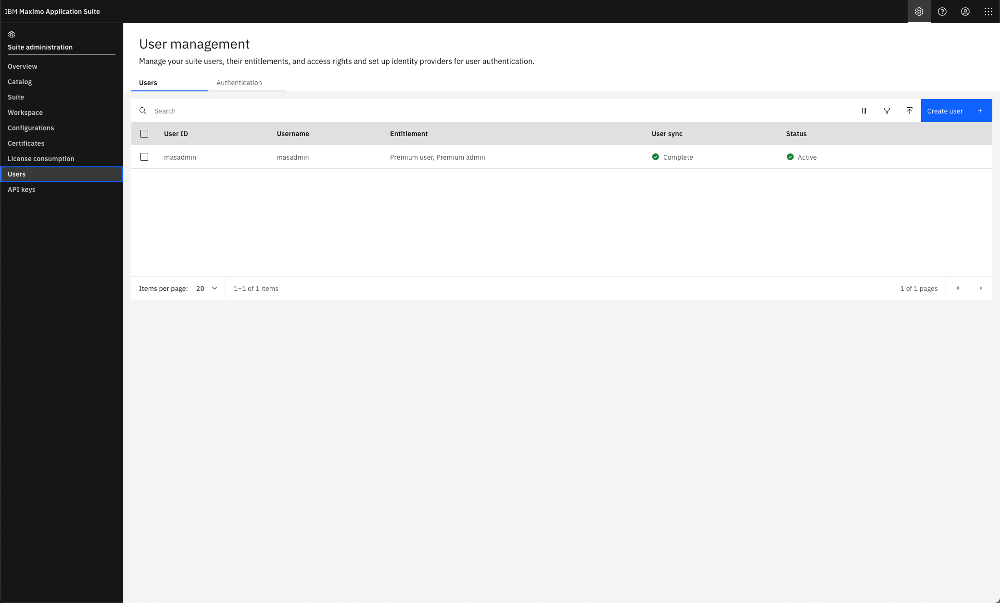

# 目标
在本练习中，您将学习如何在部署完成后执行第一步操作。

安装了 MAS Core 的 OpenShift 集群已启动并运行，下一步是准备 MAS Core 以供使用。 
这需要在 OpenShift 环境中找到套件超级用户的凭据，并在 MAS 套件管理页面中创建一个 MAS 管理员用户以供正常管理使用。 

---
*开始之前：*  
本练习要求您已经：

1. 完成[所有练习](prereqs.md)所需的前置条件
2. 完成之前的练习

---

登录安装了 MAS Core 的 OpenShift 集群。 
导航到 `Networking | Routes`。在顶部选择 `mas-inst1-core` 项目： 

  

点击 `inst1-admin` 路由的链接，它将在新选项卡中打开。 
导航到 `Workloads | Secrets`。确保选择了 `mas-inst1-core` 项目。使用名称 `superuser` 进行过滤。 
打开 `inst1-credentials-superuser` 密钥并点击 `Reveal values`： 

  

切换到最近打开的选项卡，使用 MAS 超级用户凭据登录以验证 MAS 安装： 

 

!!! note
    最佳实践是仅使用 MAS 超级用户账户创建第一个 MAS 管理员用户，然后继续使用新的 MAS 管理员用户。 

点击 `Create a personal account` 创建 MAS 管理员账户： 

  

填写身份字段 `Display name`、`User ID` 和 `Primary email` - 然后向下滚动： 

  

添加适当的授权，至少需要高级管理授权。点击 `Create`： 

  

!!! tip
    您可以将鼠标悬停在三个套件管理选项上，查看它们授予的访问类型。

复制并将凭据保存到其他地方以供以后使用。点击 `Close`： 

  

新用户将被同步。点击左上角的 `Users` 面包屑链接： 

  

!!! tip "提示"
    * 退出套件管理页面并使用新的 MAS 管理员凭据登录以验证其可以使用。

    * 您现在可以继续进行[更新 MAS 练习](update_mas.md) [推荐] - 或者 - 您可以按照 [MAS Devops Ansible Collection](https://ibm-mas.github.io/ansible-devops/){target=_blank} 安装各种 Maximo Application Suite 应用程序，然后再进行更新。 

---
恭喜您已成功实例化 MAS Techzone 认证基础镜像并准备好使用。 
