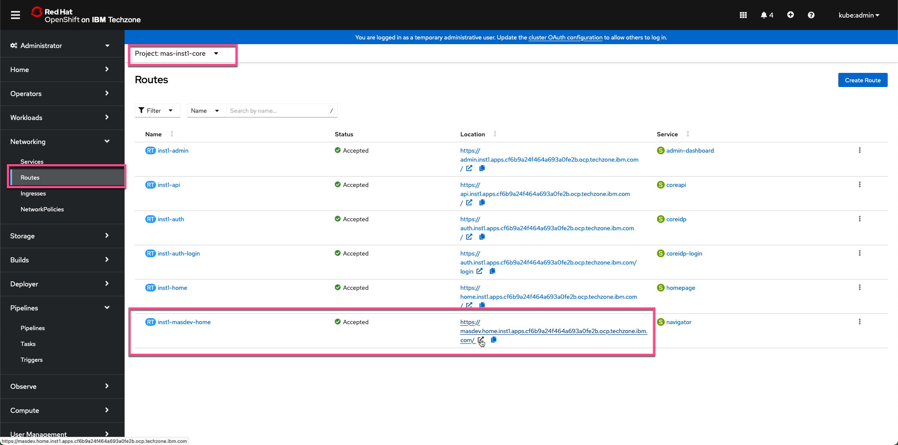
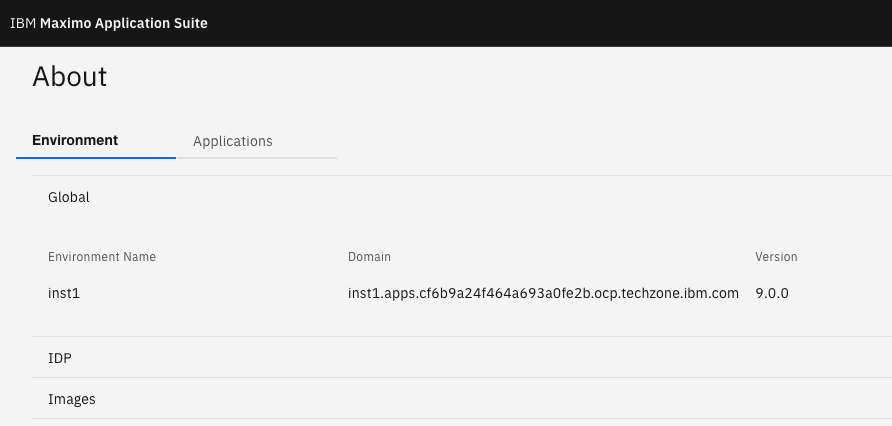
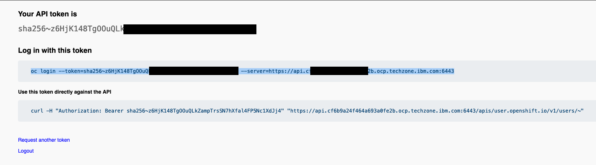
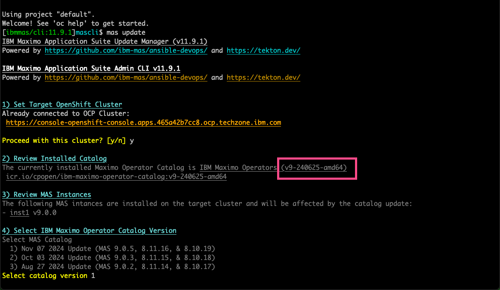
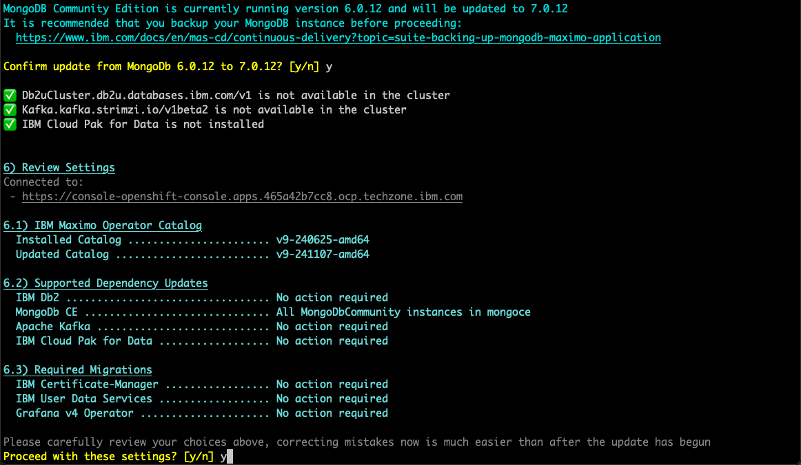
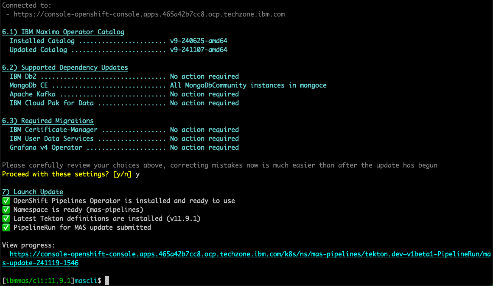
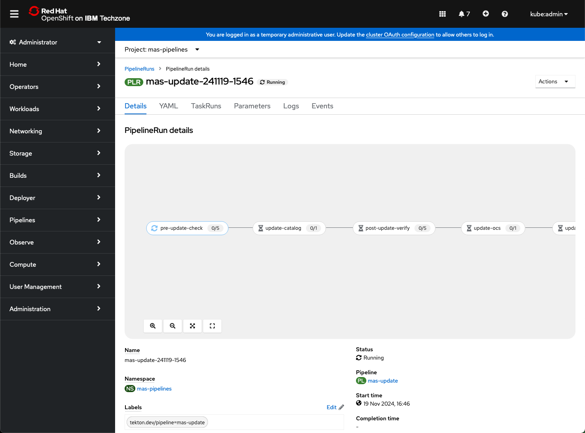
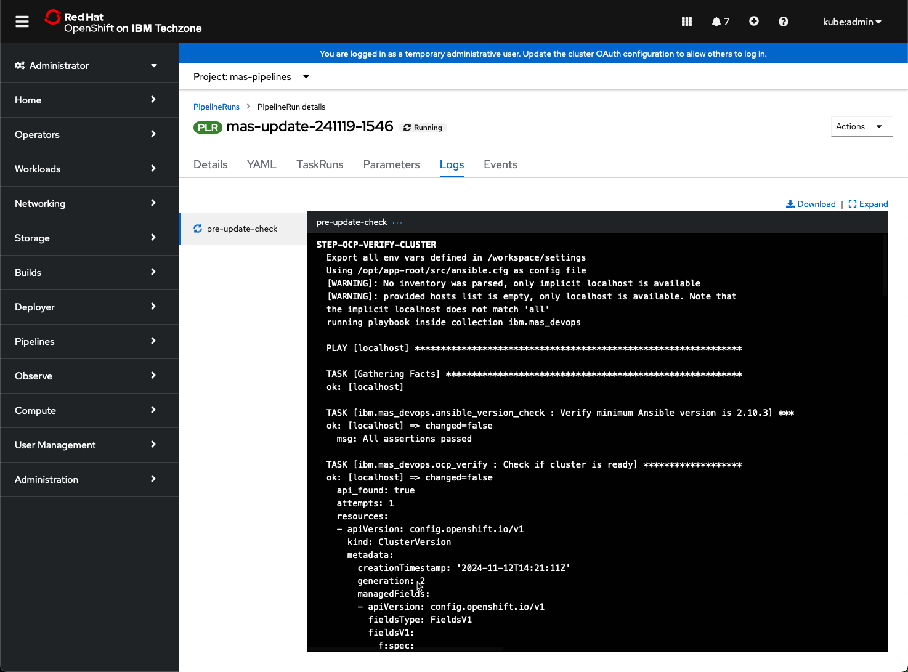
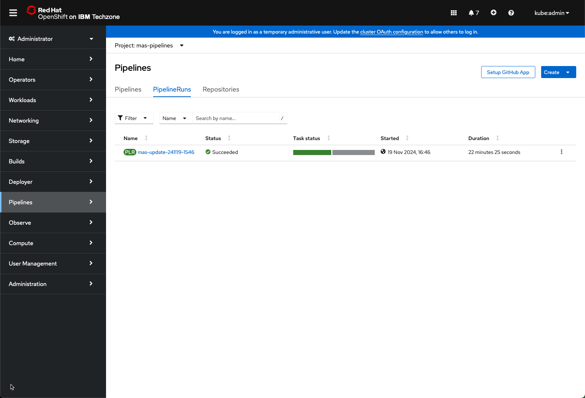
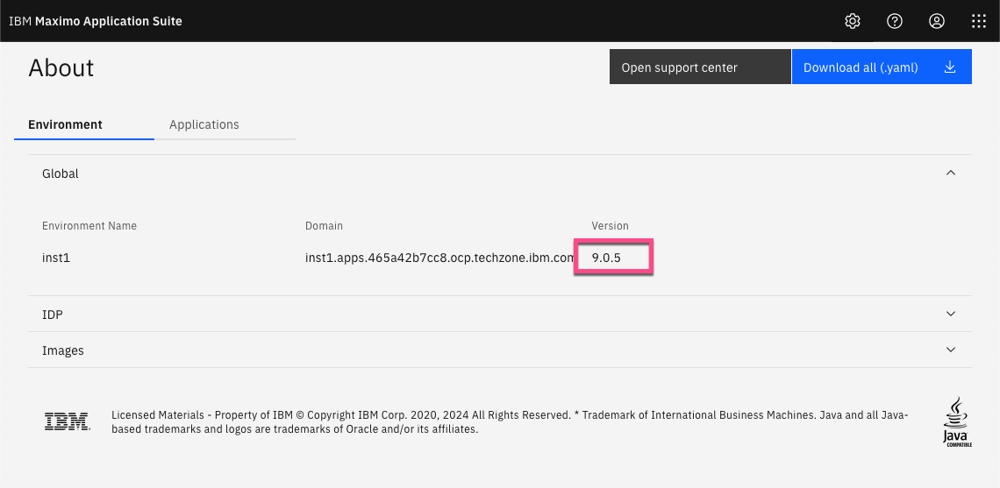

# 目标
在本练习中，您将学习如何将 MAS 更新到最新版本。

!!! attention
    如果您想更新到 9.0.1 或 9.0.2，您应该转到[练习 4。](upgrade_mas.md)</br>

!!! tip
    您可以在此处查看发布说明：[Maximo Application Suite 发布信息](https://www.ibm.com/support/pages/node/6570601){target=_blank}</br>


---
*开始之前：*  
本练习要求您已经：

1. 完成[所有练习](prereqs.md)所需的前置条件
2. 完成之前的练习

---

使用新的 MAS 管理员账户通过 MAS 主页链接登录 MAS：</br>
</br></br>

点击右上角的 `About`：</br>
</br></br>

在本例中是 MAS 9.0.0：</br>
</br></br>

现在我们需要确定使用了哪个 MAS 9.0 OpenShift 目录以及是否有更新的版本可用。</br>
首先打开终端并运行 docker 命令启动 MAS CLI docker 容器：
````
docker run -ti --rm --pull always quay.io/ibmmas/cli
````
</br>
</br></br>

使用您的 kubeadmin 账户登录 OpenShift 集群并点击 `Copy login command`：</br>
</br></br>

点击 `Display Token` 并完整复制 `oc login` 命令：</br>
</br></br>

在 MAS CLI docker 中运行该命令：</br>
</br></br>

现在 MAS CLI docker 已针对您的 OCP 集群进行了身份验证。执行 `mas update` 并输入 `y` 以继续使用此集群。</br>
注意已使用的 Maximo Operator Catalog - 在本例中为 `v9-240625-amd64`，即 MAS 9.0.0。</br>
还要注意有更新的版本可用：</br>
</br></br>

按 `Enter` 选择默认值，即 1。</br>
将执行步骤 5）依赖项更新检查。

!!! tip
    如果依赖项更新检查"挂起"，只需在另一个窗口中重新运行它。</br>

选择 `y` 确认更新 MongoDb，并选择 `y` 继续使用这些设置：</br>
</br></br>

稍后，Pipeline Run 已提交以执行 MAS 更新：</br>
</br></br>

点击链接，您将能够看到 MAS 更新的进度：</br>
</br></br>

点击 Logs 查看进度的更多详细信息：</br>
</br></br>

点击 PipelineRuns 以跟踪整体进度。一段时间后（在本例中约 22 分钟），MAS 更新已成功：</br>
</br></br>

登录 MAS 并检查 `About` 信息，您应该看到 MAS Core 已更新到所选版本：</br>
</br></br>


!!! tip
    您现在可以按照 [MAS Devops Ansible Collection](https://ibm-mas.github.io/ansible-devops/){target=_blank} 安装各种 Maximo Application Suite 应用程序，</br>
    它们也将是最新版本。</br>


---
恭喜您已成功实例化和更新 MAS Techzone 认证基础镜像并准备好使用。</br>
