# 目标
在本练习中，您将学习如何将 MAS 更新到 9.0.1 或 9.0.2。

无法使用 MAS CLI docker 来更新或升级通过 TechZone 提供的 MAS 安装。经过大量尝试，我找到了一种更复杂但有效的方法 - 至少从 MAS 9.0.0 到 9.0.2 是可行的，本练习就是基于此构建的</br>

!!! attention
    如果您想更新到 MAS 9.0.3 或更高版本，您应该转到[练习 3。](update_mas.md)</br>


!!! tip
    您可以在此处查看发布说明：[Maximo Application Suite 发布信息](https://www.ibm.com/support/pages/node/6570601){target=_blank}</br>

---
*开始之前：*  
本练习要求您已经：

1. 完成[所有练习](prereqs.md)所需的前置条件
2. 完成之前的练习

---

使用新的 MAS 管理员账户通过 MAS 主页链接登录 MAS：</br>
</br></br>

点击右上角的 `About`：</br>
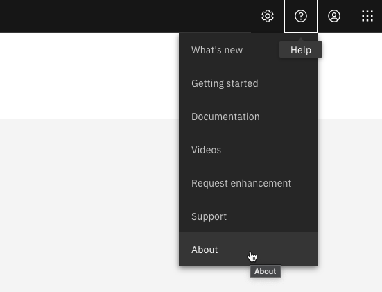</br></br>

在本例中是 MAS 9.0.0：</br>
</br></br>

现在我们需要确定使用了哪个 MAS 9.0 OpenShift 目录以及是否有更新的版本可用。</br>
首先打开终端并运行 docker 命令启动 MAS CLI docker 容器：
````
docker run -ti --rm --pull always quay.io/ibmmas/cli
````
</br>
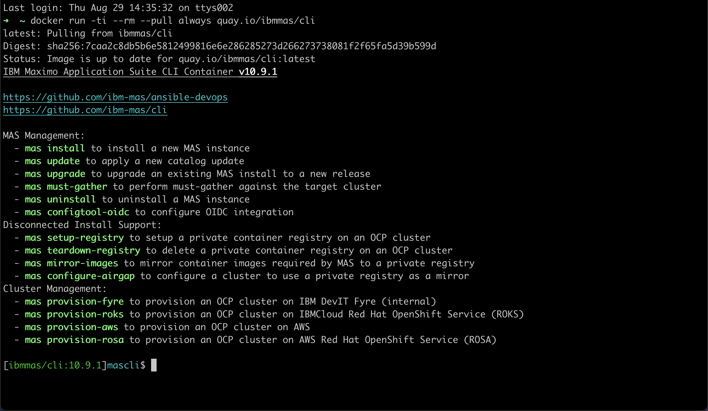</br></br>

使用您的 kubeadmin 账户登录 OpenShift 集群并点击 `Copy login command`：</br>
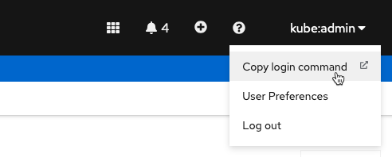</br></br>

点击 `Display Token` 并完整复制 `oc login` 命令：</br>
</br></br>

在 MAS CLI docker 中运行该命令：</br>
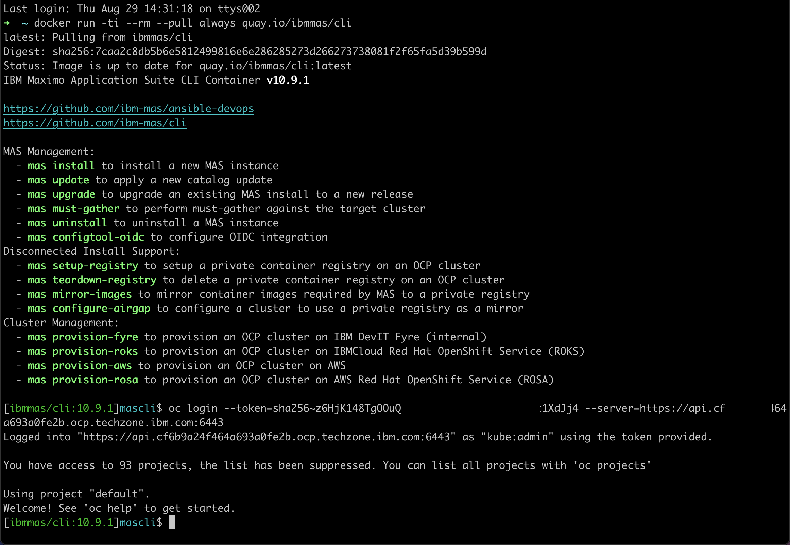</br></br>

现在 MAS CLI docker 已针对您的 OCP 集群进行了身份验证。执行 `mas update` 并在步骤 1 中输入 `yes`。</br>
注意已使用的 Maximo Operator Catalog - 在本例中为 `v9-240625-amd64`，即 MAS 9.0.0。</br>
还要注意有两个更新的版本可用（8月底），其中 9.0.2 是最新的：</br>
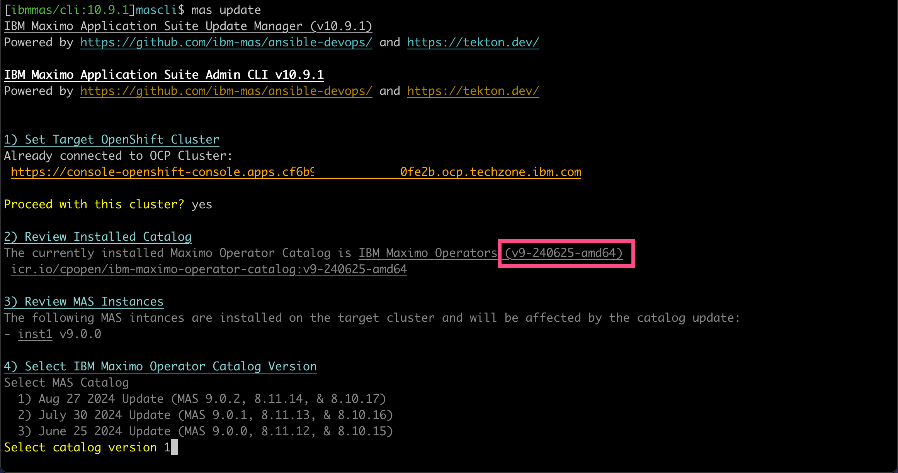</br></br>

按 `Enter` 选择默认值，即 1。</br>
将执行步骤 5）依赖项更新检查。

!!! tip
    如果依赖项更新检查"挂起"，只需在另一个窗口中重新运行它。</br>

您稍后将需要 `Installed Catalog` 和 `Updated Catalog` 值。</br>
不要从这里继续 - 输入 `n` 和 `Enter` 退出 `mas update` 执行。</br>
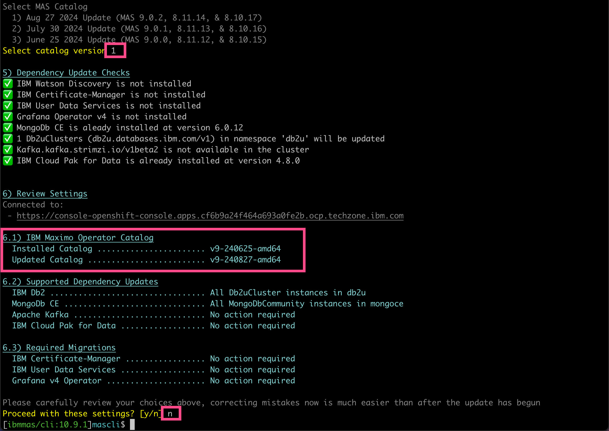</br></br>

转到您的 OCP 并选择 `Pipelines`。如果您没有看到 `mas-masdevops-deploy` 管道，请选择 `All Projects` 并搜索它。</br>
打开 `mas-masdevops-deploy` 管道并点击 `YAML` 选项卡：</br>
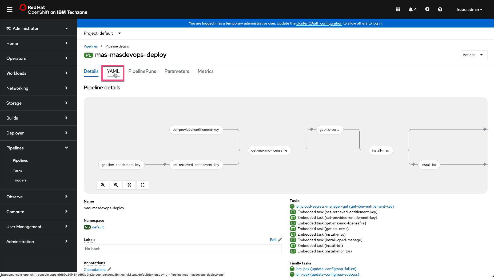</br></br>

向下滚动直到找到 Maximo operator catalog 版本的 `Installed Catalog` 默认值：</br>
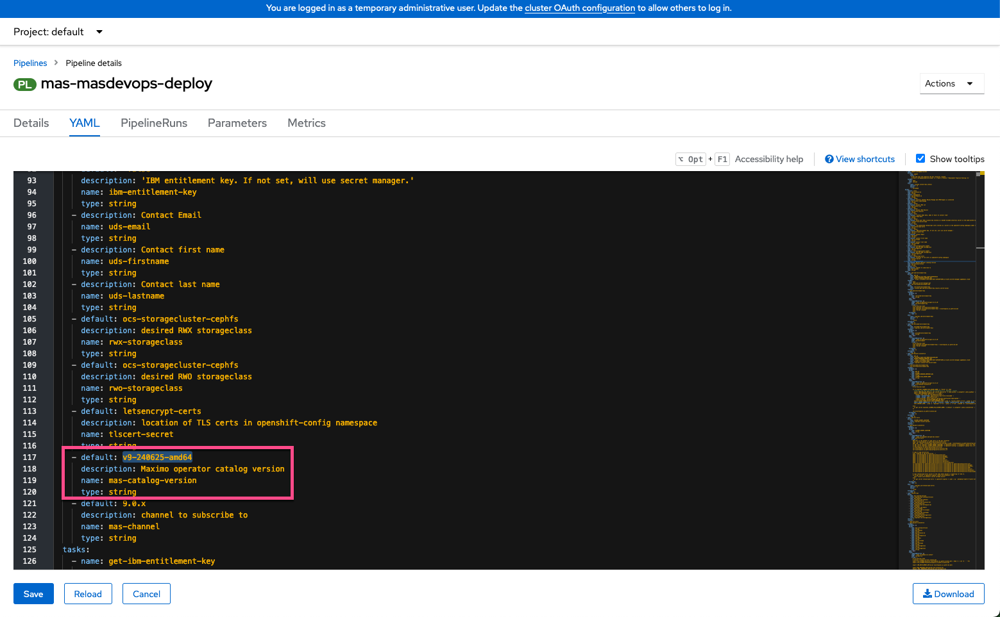</br></br>

现在将默认值替换为 `mas update` 命令中的 `Updated Catalog` 值并点击 `Save`：</br>
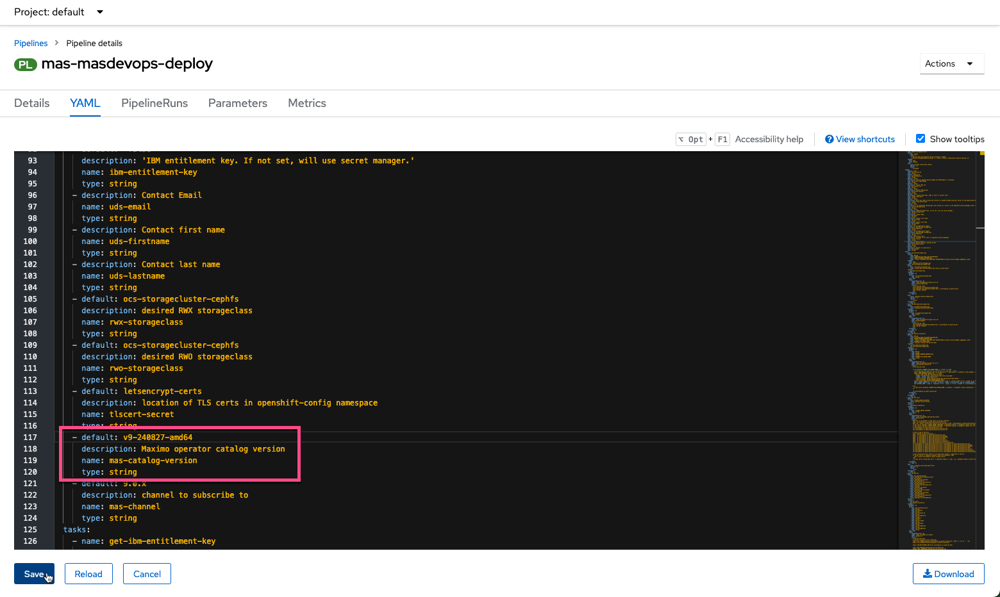</br></br>

现在 YAML 已更新。点击面包屑中的 pipelines：</br>
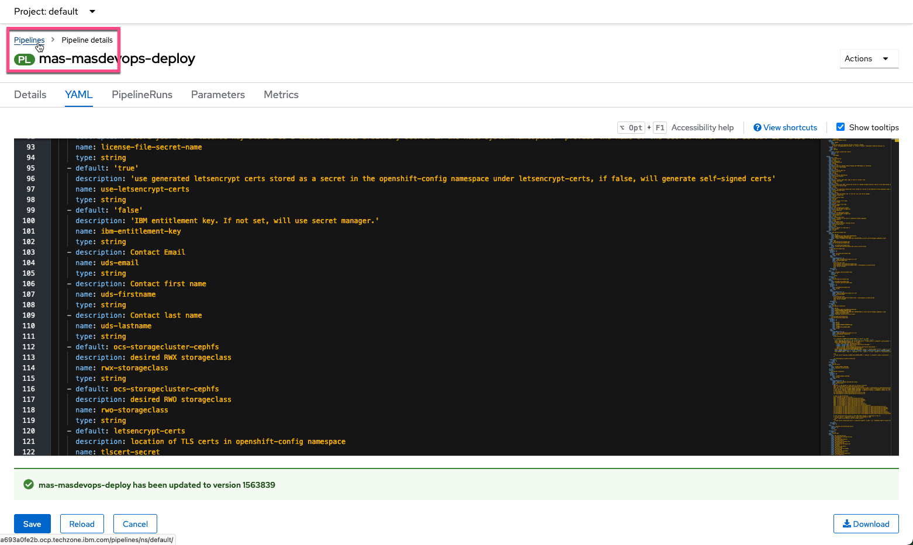</br></br>

选择 `PipelieRuns` 选项卡：</br>
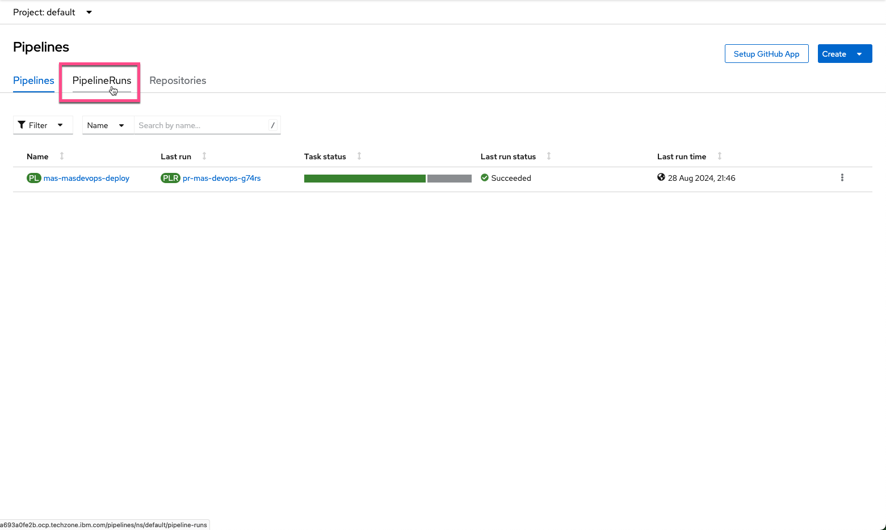</br></br>

您需要重新运行管道以升级到您选择的版本：</br>
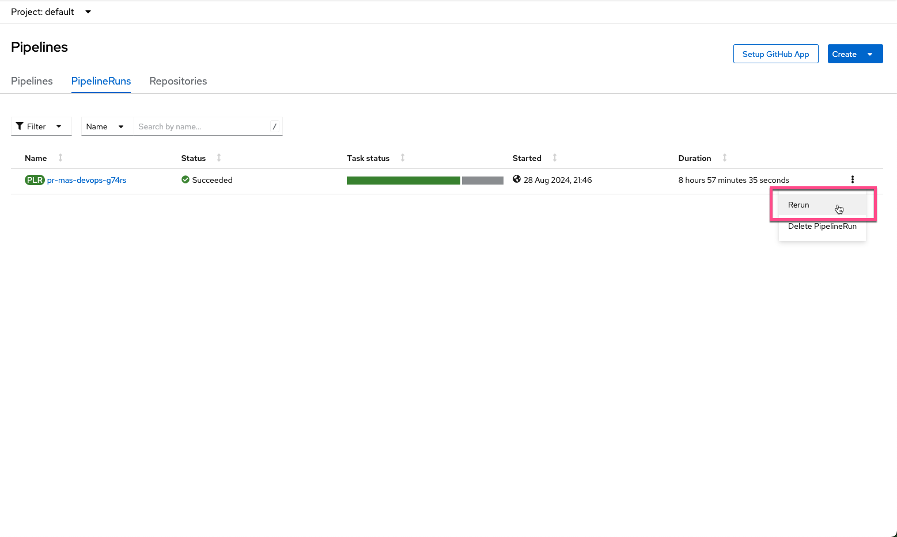</br></br>

现在您看到原始的成功管道和重新运行启动的管道。点击任务状态：</br>
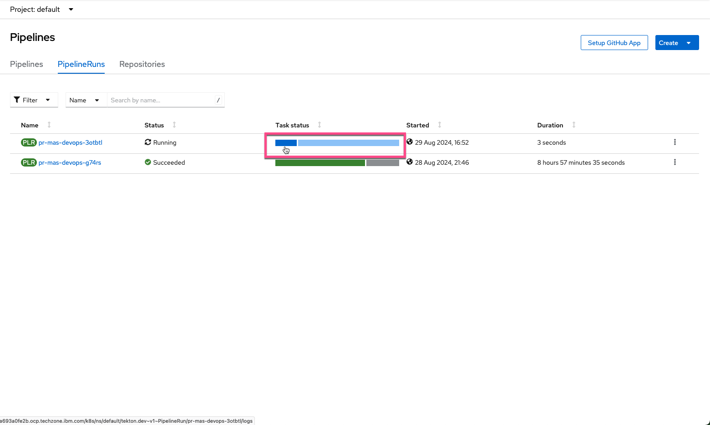</br></br>

您将看到管道的执行已开始。稍后您将进入 `install-mas` 部分。</br>
当您注意到 `FAILED - RETRYING ....` 消息时不要害怕，它们会出现多次：</br>
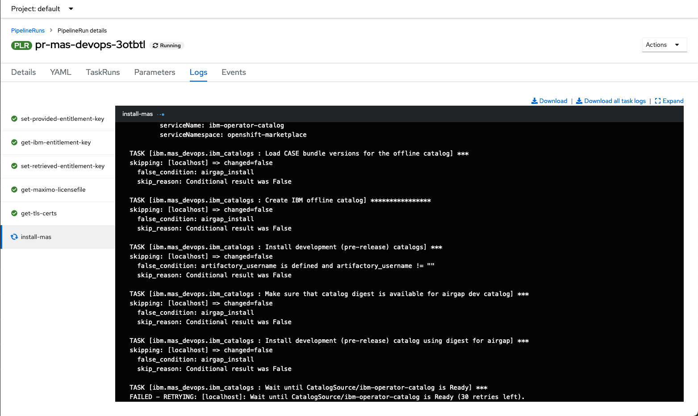</br></br>

相当长时间后，管道中的所有步骤都将重新运行。这将花费几乎与您第一次实例化</br>
TechZone MAS 9.0 认证基础镜像一样长的时间。在本例中是 MAS 9.0 Core + Manage</br>
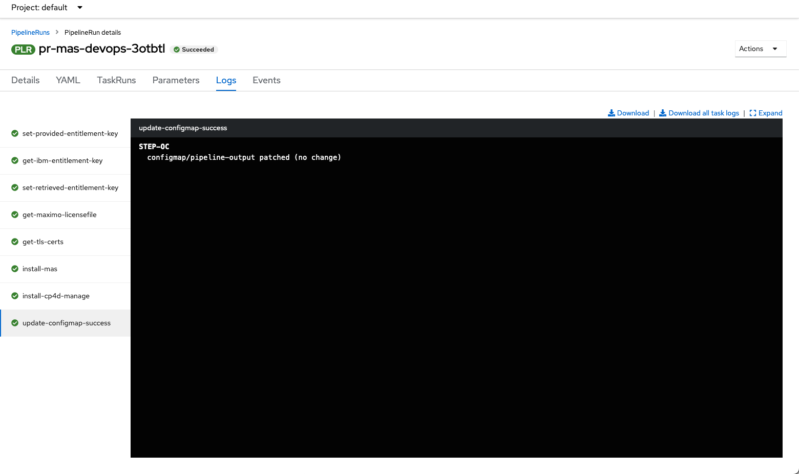</br></br>

登录 MAS 并检查 `About` 信息。MAS Core 已升级到 9.0.2：</br>
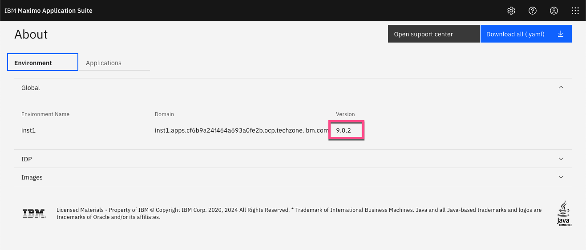</br></br>

MAS Manage 也是如此：</br>
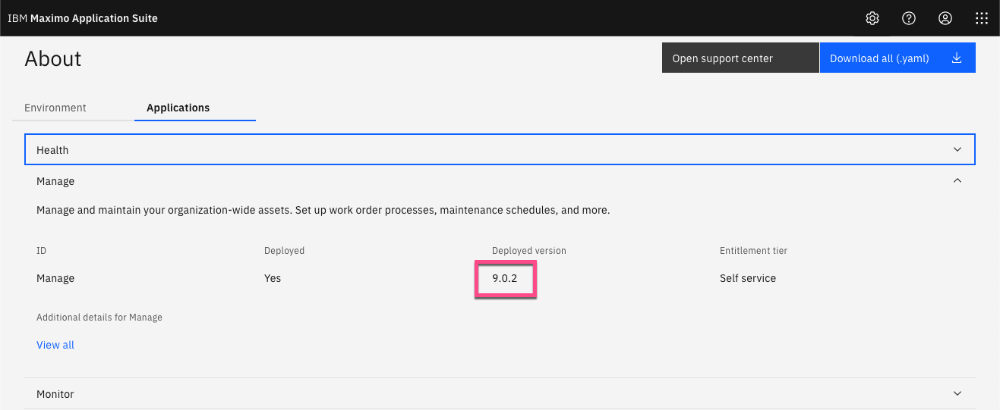</br></br>


!!! tip
    您现在可以按照 [MAS Devops Ansible Collection](https://ibm-mas.github.io/ansible-devops/){target=_blank} 安装各种 Maximo Application Suite 应用程序，</br>
    它们也将是最新版本。</br>


---
恭喜您已成功实例化和升级 MAS Techzone 认证基础镜像并准备好使用。</br>
