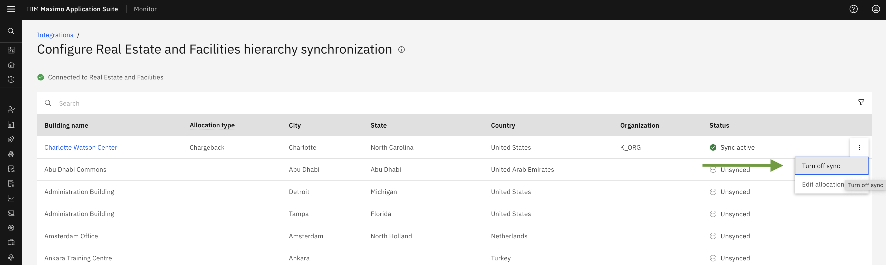
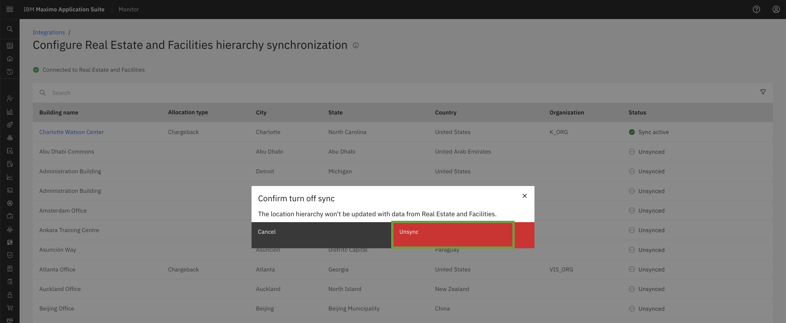
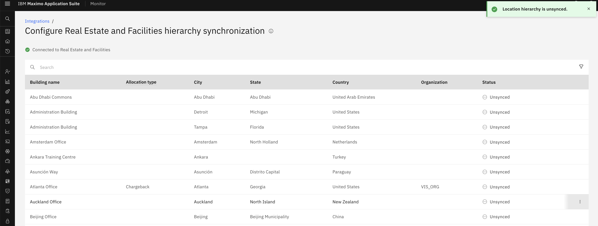
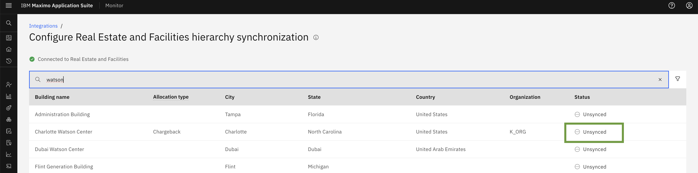
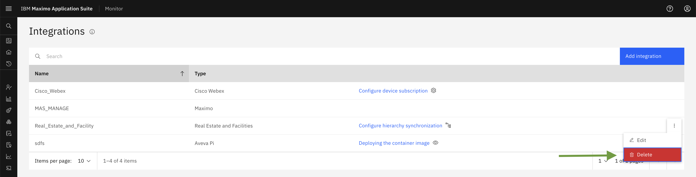
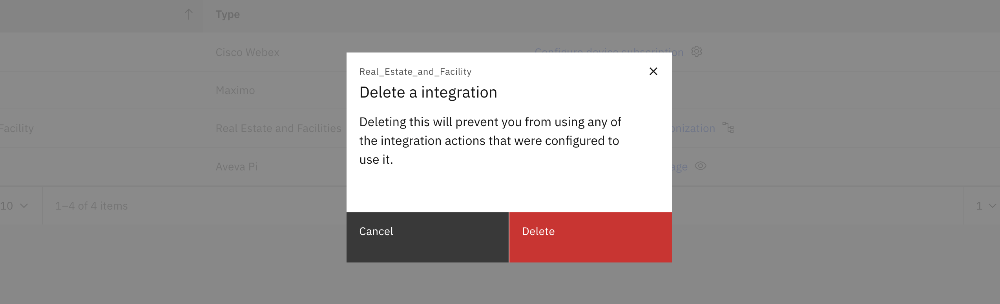

# 目标
在本练习中，您将学习如何关闭同步并删除 Maximo 房地产与设施管理建筑。

---
*开始之前：*  
本练习要求您已经：

1. 完成[所有实验](prerequisite.md)所需的前置条件

---

## 关闭 Maximo 房地产与设施管理建筑的同步

您可以通过关闭 MREF 集成中建筑的同步功能来停止从 Tririga 实例同步建筑数据。这将阻止任何进一步的数据同步。

禁用建筑同步：分步指南  
要关闭特定建筑的同步，请按照以下步骤操作：

1. 导航到集成菜单。
2. 点击房地产与设施管理的配置层次结构同步。
3. 点击要禁用同步的建筑旁边的 3 点操作菜单。
4. 从操作菜单中选择关闭同步。

​

将出现一个弹出窗口。点击 `Unsync` 按钮以确认您要关闭所选建筑的同步。

​

点击取消同步按钮后，它将 `Unsync` 建筑并显示成功消息 `Location hierarchy is Unsynced`。

​

 现在建筑的状态将显示为 `Unsync`

​

!!! note 
    一旦禁用建筑同步，将不会从您的 Tririga 实例同步新数据。

## 删除 Maximo 房地产与设施管理配置

要删除 Maximo 房地产与设施管理配置，您需要确保所有建筑都已取消同步。

我们在房地产与设施管理配置的省略号上有一个删除按钮。您可以从这里删除配置。

​

​

这将从 Monitor 中删除所有 Maximo 房地产与设施管理建筑。

---
恭喜，您已成功了解 MREF 建筑关闭同步和删除。本实验到此结束。 