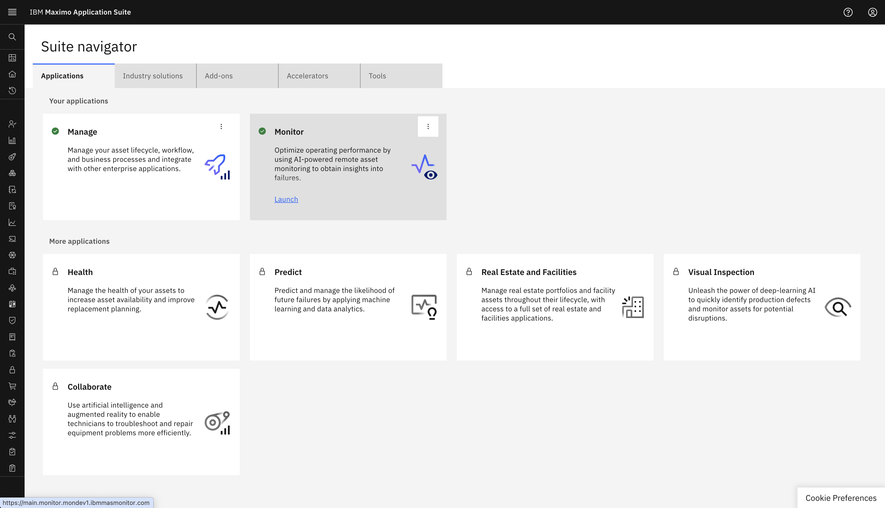
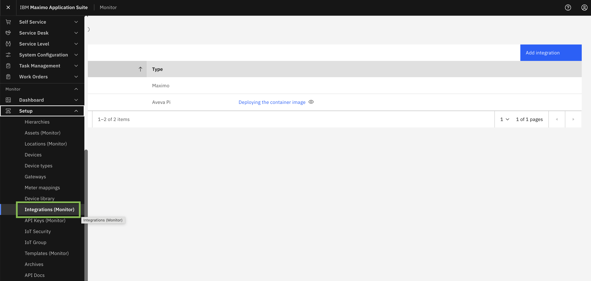
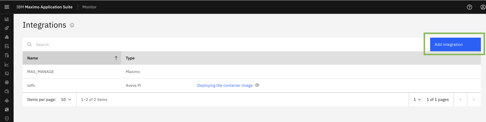
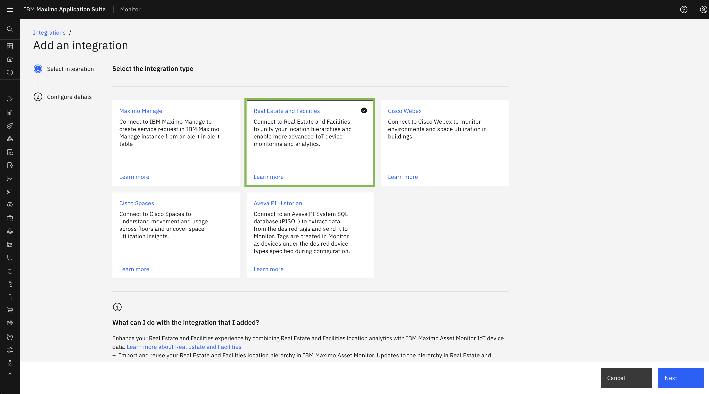
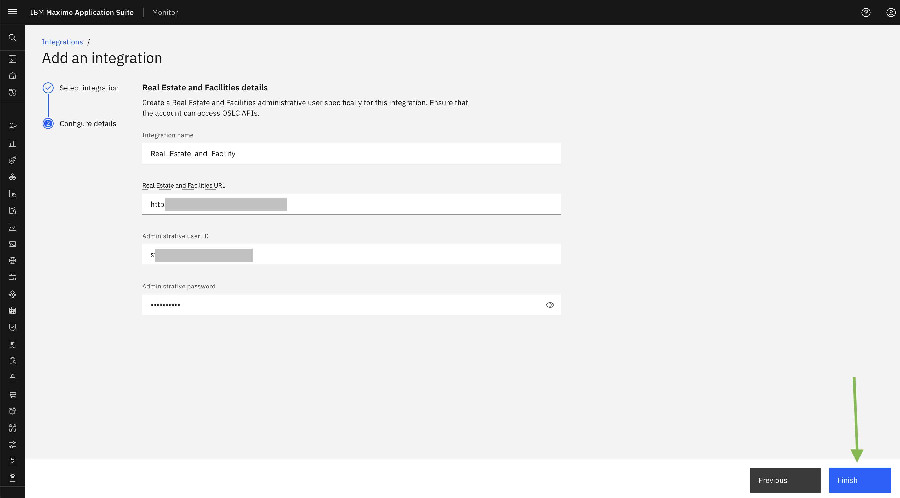
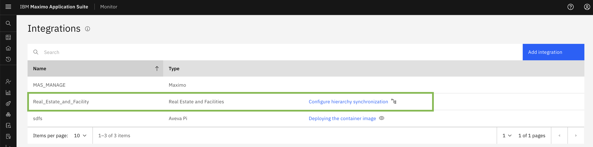
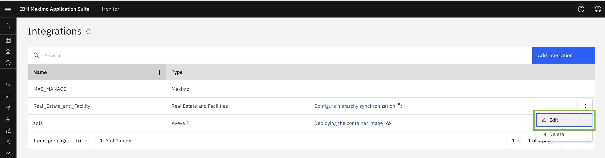
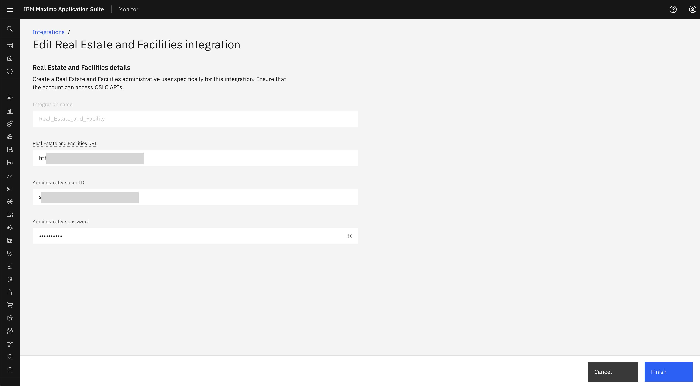

# 目标
在本练习中，您将学习如何配置 Maximo 房地产与设施管理集成。

---
*开始之前：*  
本练习要求您已经：

1. 完成[所有实验](prerequisite.md)所需的前置条件
2. 完成之前的练习

---

您只能配置一个与 Maximo 房地产与设施管理的集成。 

登录 MAS：  
  

导航到集成页面：  
  

您可以从添加集成按钮添加新集成  
  

从集成类型列表中选择 `Real Estate and Facilities` 并点击 Next。  
  

在这里，在 `INTEGRATION NAME` 字段中指定一个名称。
在 Maximo `Real Estate and Facilities URL` 字段中，指定您的 Maximo 房地产与设施管理实例的 URL。
在 `Administrative user ID` 字段中，指定管理用户的 ID。
在 `Administrative password` 字段中，指定管理用户的密码。
点击 Finish： 

 

恭喜您已成功配置 Maximo 房地产与现实集成。 

MREF 集成将显示在集成列表中：  
 

您可以从配置提供的编辑按钮编辑 Maximo 房地产与设施管理配置。 

 

您可以从 TRIRIGA 实例更新房地产与设施管理 URL、用户 ID 和密码。
您将无法编辑集成名称。

 
