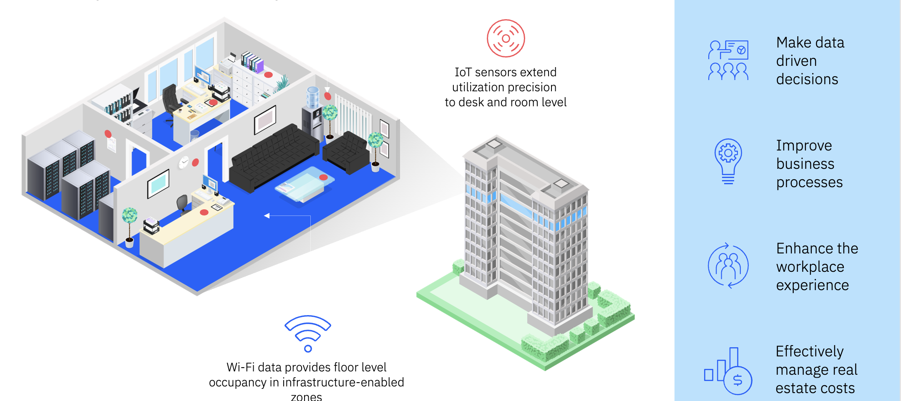
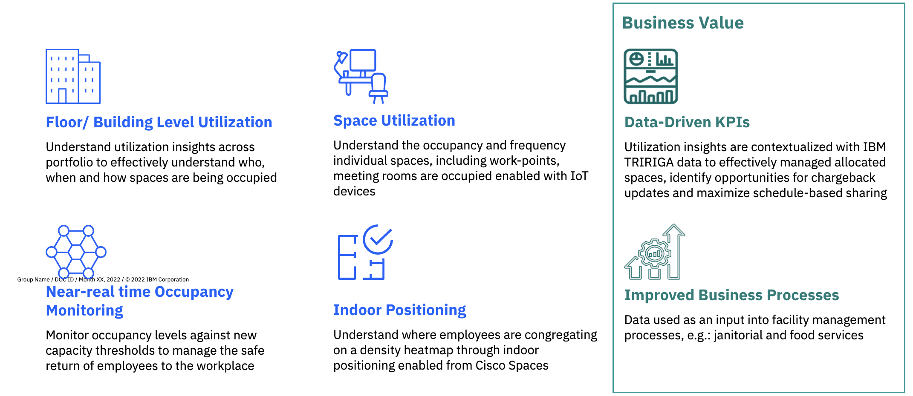

# 欢迎来到 Maximo Monitor 9.1 Maximo 房地产与设施管理集成实验

!!! info
    本 Maximo Monitor 实验演示了 Maximo 房地产与设施管理的集成。

在本实验中，您将学习如何配置 Maximo 房地产与设施管理，以统一您的位置层次结构并实现更高级的 IoT 设备监控和分析。 

房地产是大多数大型组织的第二大成本负担。在不断发展的运营环境驱动下，企业正在迅速转向集中化模式。这需要企业级解决方案来降低成本、增强响应能力和优化效率。IBM MREF 解决方案提供了一个集成的工作场所管理系统（IWMS），在单一技术平台内集成了房地产、资本项目、设施、工作场所运营、投资组合数据以及环境和能源管理等功能模型。
 

MREF 连接到现有的 WI-FI 基础设施，并结合传感器使规划人员能够在多个用例中主动监控其设施：

1. 占用监控
2. 空间利用
3. 楼层/建筑级别利用
  

MREF 企业 IoT 和 AI 如何增强组织响应其需求的能力

  

在 MAS Monitor 中使用 Maximo 房地产与设施管理的目的是什么

  

练习将涵盖：

* 配置 MREF 集成
* 为 MREF 建筑启用同步
* MREF 位置详情 - 维度、模板、计算指标
* 工作场所分析仪表板
* 清理
* 享受乐趣

!!! note
    完成整个实验的预计时间：1 小时

---

**更新时间：2025-07-07**

---