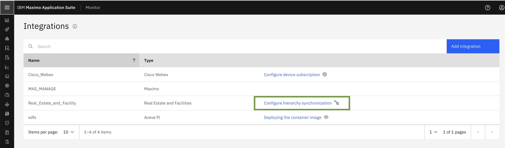
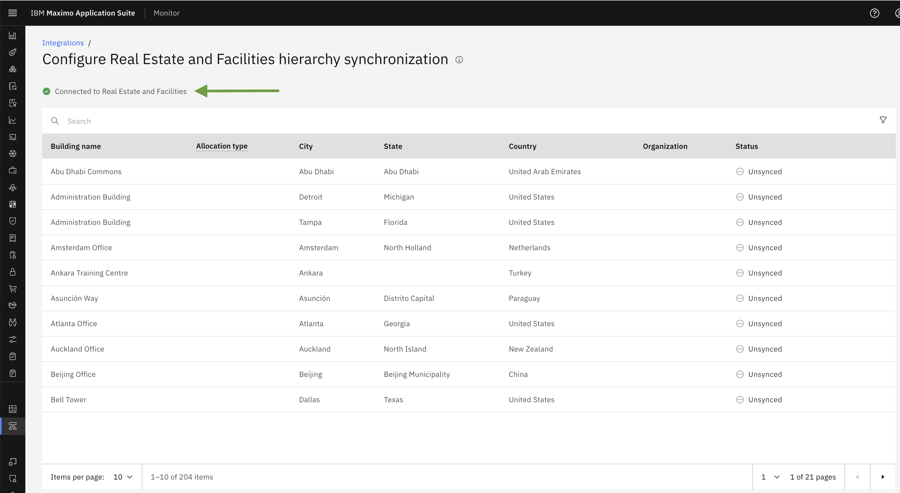
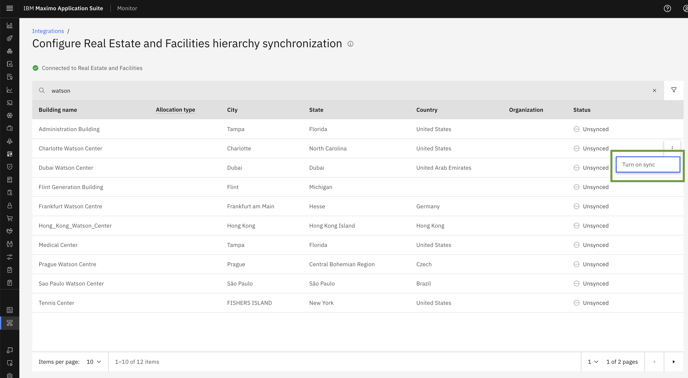
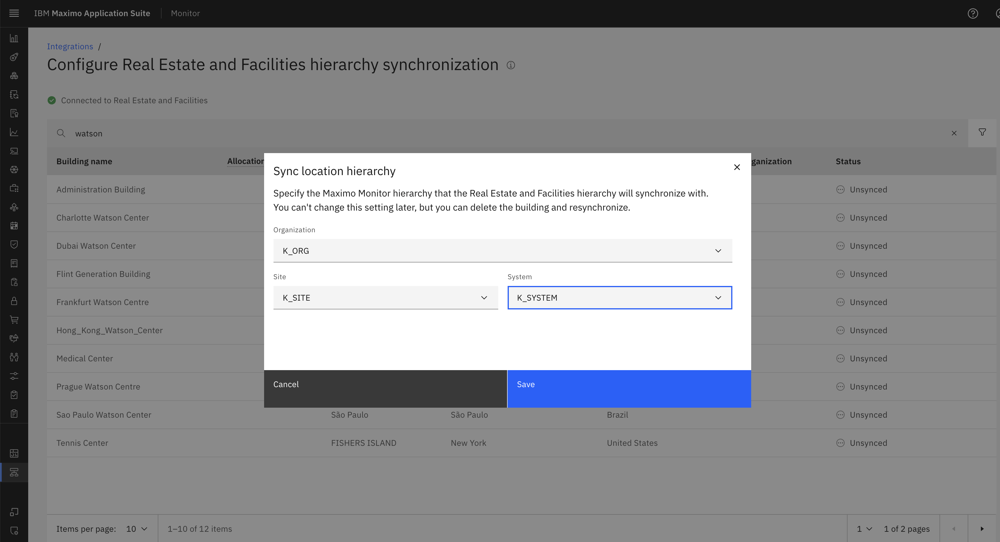
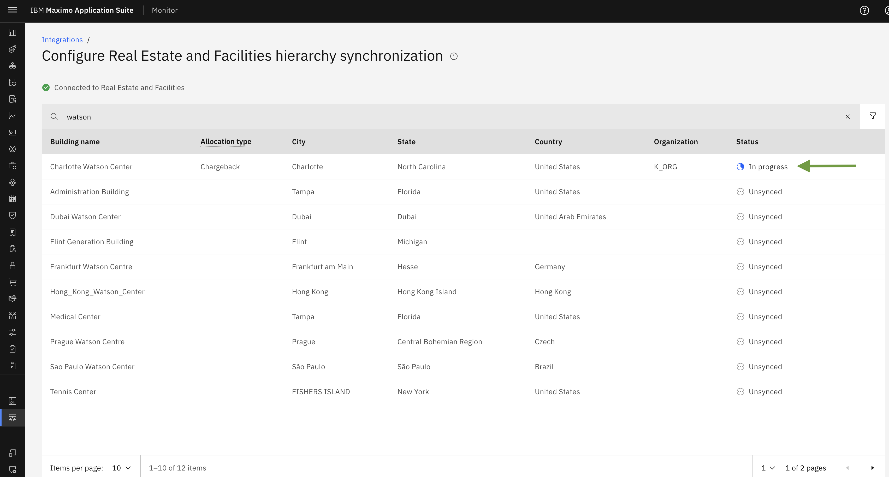
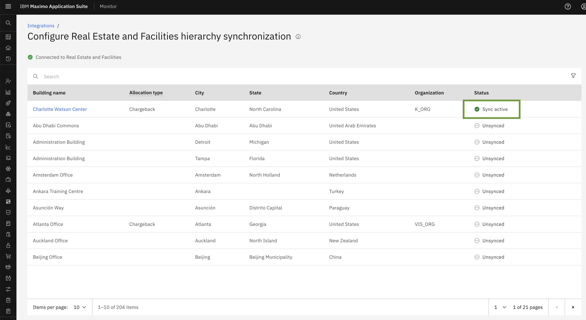
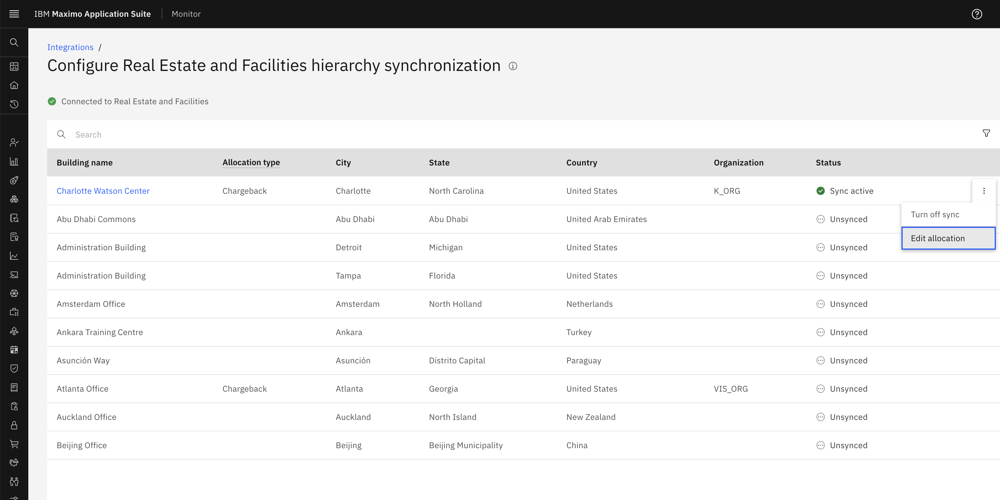
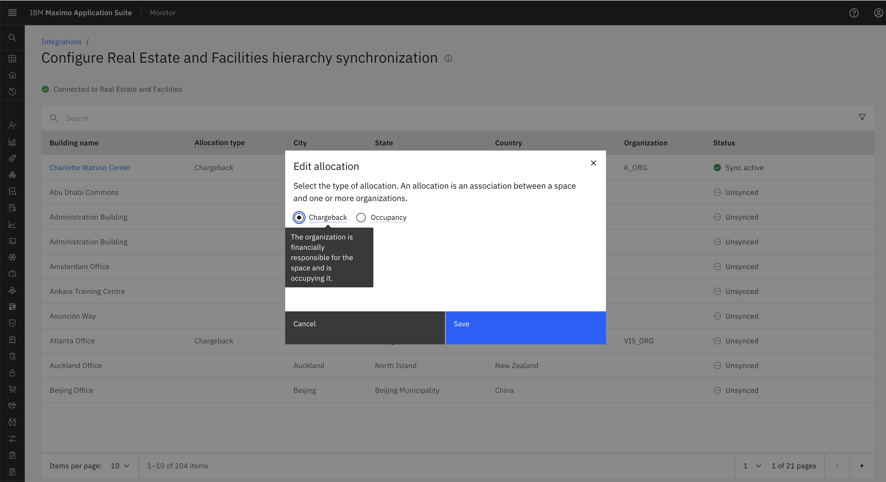

# 目标

在本练习中，您将看到 Maximo 房地产与设施管理建筑列表，并学习如何在 MREF 建筑上启用同步。

---
*开始之前：*  
本练习要求您已经：

1. 完成[所有实验](prerequisite.md)所需的前置条件
2. 完成之前的练习

---
一旦我们成功创建 Maximo 房地产与设施管理配置，它将与 TRIRIGA 建立连接。这将在内部触发建筑同步调度程序，从 TRIRIGA 获取房地产建筑。

!!! note 
     配置完成后，建筑可能需要一些时间才能出现或可用。

点击配置层次结构同步。

   

在这里，您将看到配置状态已连接到房地产与设施管理，并且将显示从 TRIRIGA 检索的所有建筑列表。

   

#### 如何为建筑启用同步并选择位置层次结构

一旦从 TRIRIGA 获取 Maximo 房地产与设施管理建筑，您将能够启用同步。

启用建筑同步：分步指南

- 点击要启用同步的建筑旁边的三点菜单。
- 将出现 `Turn on Sync` 选项。点击它以继续。

 

- 将出现一个弹出窗口，允许您配置同步位置层次结构。
- 输入 Maximo Monitor 层次结构所需的详细信息：组织、站点和系统

 

选择组织、站点和系统后，一旦用户点击 `SAVE`，它将开始同步建筑的所有详细信息，状态将从未同步更改为 `IN PROGRESS`。

 

当层次结构同步时，Maximo 房地产与设施管理中层次结构中的所有建筑、楼层和空间都会在 Maximo Monitor 中复制。对 Maximo 房地产与设施管理中这些建筑、楼层或空间的更改将在 Maximo Monitor 中可用。

!!! note 
     最初填充表可能需要几分钟时间。从 Maximo 房地产与设施管理检索新数据最多可能需要一个小时。表中包括草稿和活动的建筑、楼层和空间。
    
建筑、楼层和空间显示在该层次结构的系统节点下。您以后无法更改此设置，但可以取消同步层次结构、删除节点，然后重新同步。

恭喜您已成功在建筑上启用同步。

 

#### 编辑分配

编辑分配类型 - 分配类型是空间与一个或多个组织之间的关联。要编辑类型，请点击三点菜单，然后点击 `Edit allocation`。

 

 默认情况下，分配类型为 Chargeback。点击 Save 以更新分配类型。

 