# 目标
在本练习中，您将看到 Maximo 房地产与设施管理位置的详细信息：

* 已同步的位置详情将在层次结构和位置部分中可用
* 在位置详情中 - 概览、模板、维度、设备、计算指标

---
*开始之前：*  
本练习要求您已经：

1. 完成[所有实验](prerequisite.md)和本练习所需的前置条件
2. 完成之前的练习
3. 验证建筑已同步激活[练习 2](mref_buildings.md){target=_blank}

---

## 在层次结构和位置部分查看位置

一旦房地产与设施管理建筑同步完成，您就可以看到该建筑的整个层次结构。

已同步的建筑现在可在 monitor 的 `Hierarchies` 和 `Locations` 部分中找到。

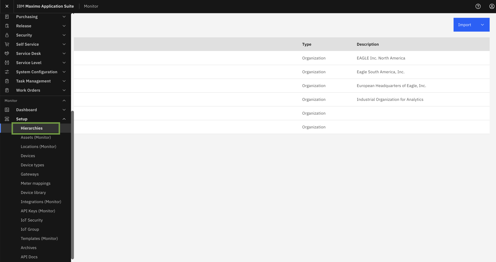  

在层次结构部分，您可以看到整个 monitor 位置层次结构

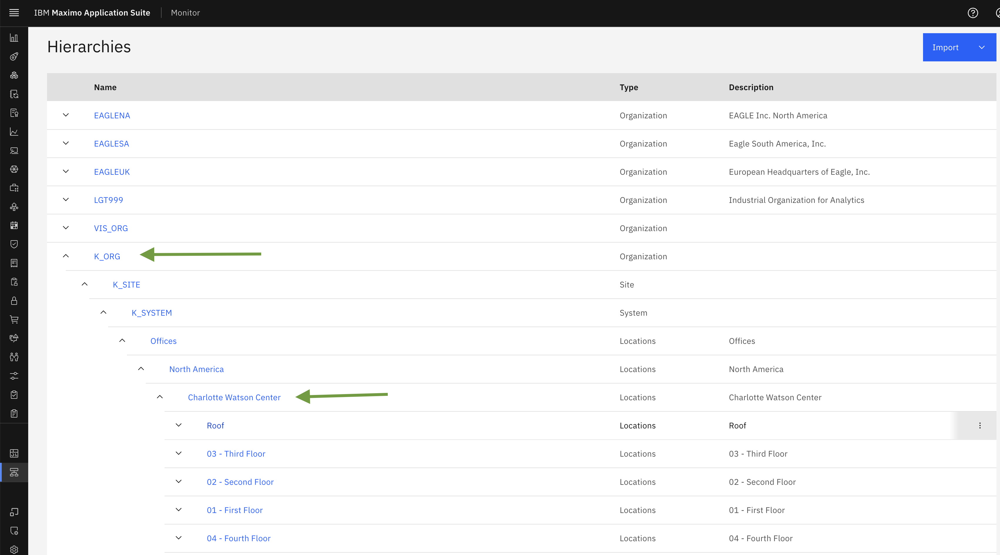  

您可以从侧边菜单导航到位置。

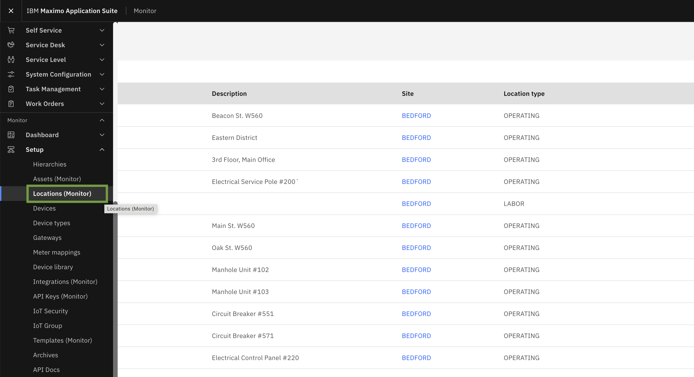  

在这里，您可以搜索已同步的位置名称，结果将显示位置名称和类型为 `building`。

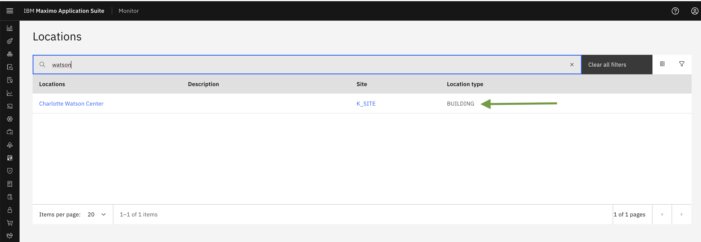  

## 查看建筑详情

您可以从省略号按钮查看位置和层次结构部分中任何位置的详细信息，如屏幕截图所示。`view details`。

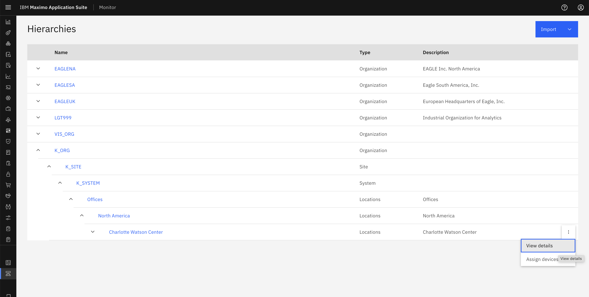  

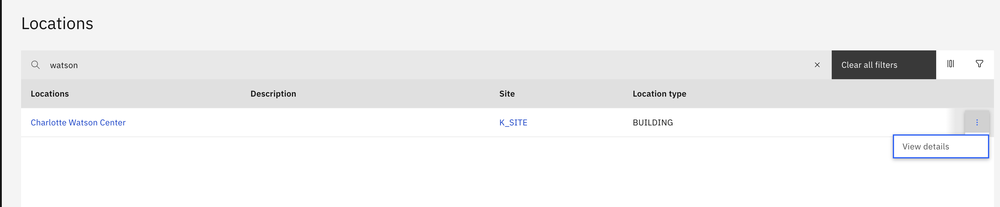  

点击 `View Details` 操作菜单后，您将被重定向到位置详情页面。此页面分为几个选项卡，提供位置的全面概览。

以下选项卡可用：

- Data
- Overview
- Calculated Metrics
- Template
- Dashboard

让我们探索每个选项卡下提供的信息。

### Overview 选项卡

下面，您将找到建筑的概览，包括其名称、站点、位置类型和父位置详情。子位置部分列出了可用的楼层及其位置类型为 `Floor`，您可以点击楼层查看其详情页面。

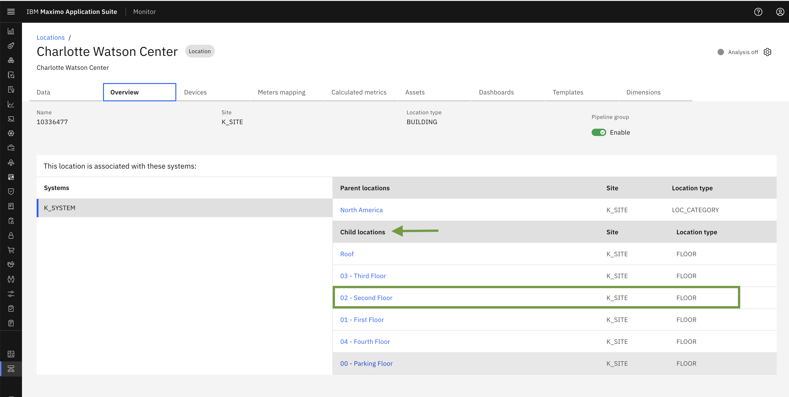  

同样，您可以访问楼层和空间详情页面。在楼层的子位置部分，您将看到关联空间的列表及其位置类型为 `Space`。您可以点击空间查看其详情页面。
在楼层的父位置中 - 您将看到关联的建筑名称。

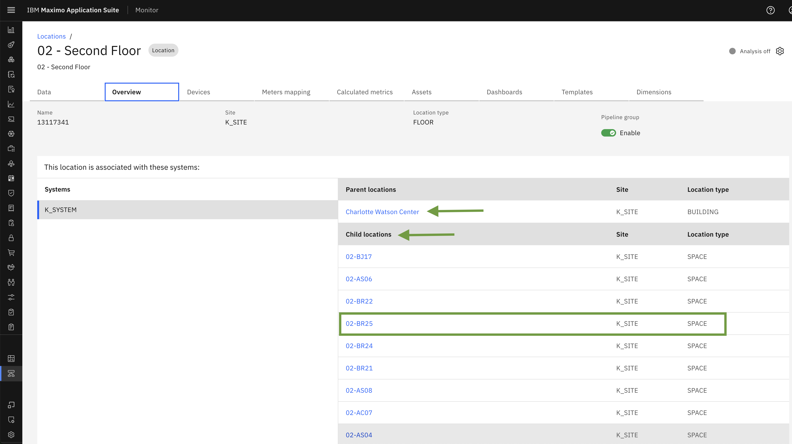  

空间详情 -

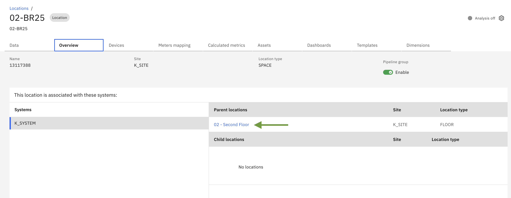  

  

###  Template 选项卡

在这里，您可以查看所有可用模板的列表。与特定建筑类型对应的 Tririga 模板将在该建筑同步后应用于空间、楼层和建筑。

建筑模板 -

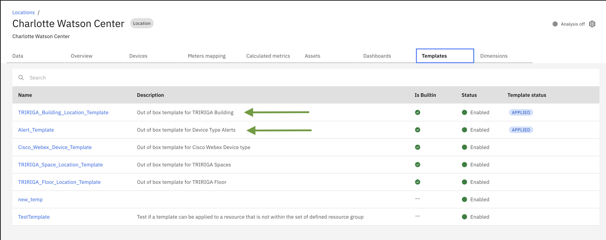

楼层模板 -

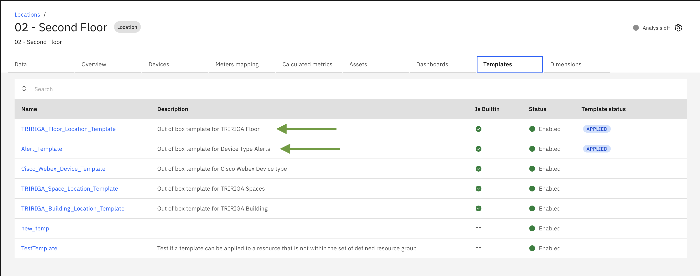

空间模板 - 

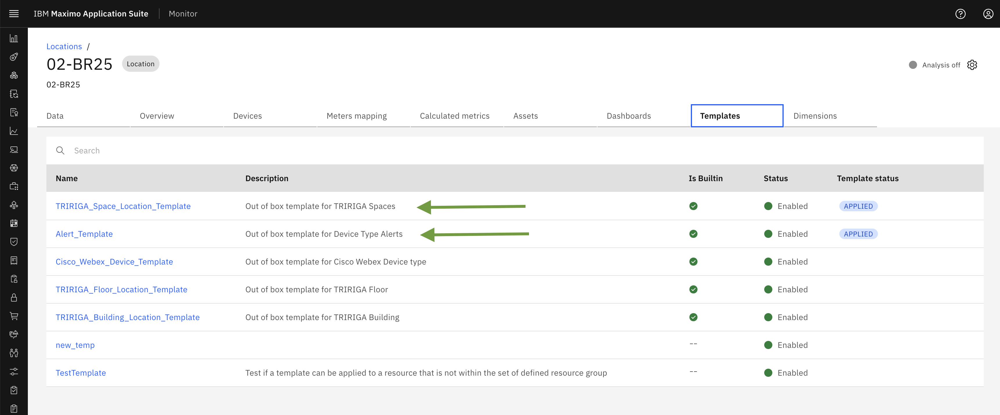

!!! info
    应用的模板包含开箱即用的 KPI（计算指标）和工作场所分析仪表板的集合，这些将在您将设备分配给空间后生成。

 

###  Device 选项卡

在分配设备之前，完成以下步骤 -  
与 Cisco Spaces 集成。有关更多信息，请参阅与 Cisco Spaces 集成。 
与 Cisco Webex 集成。有关更多信息，请参阅与 Cisco Webex 集成。

一旦完成 Cisco Spaces 和 Cisco Webex 的配置，您可以将订阅的 `Cisco Webex` 设备分配给空间，以跟踪占用详情，包括空间中的人数和占用率。一旦分配了设备，它将开始生成有价值的见解和数据，包括空间、楼层和建筑的计算指标和仪表板。

!!! note 
     您只能将设备类型 `Cisco Webex` 设备分配给 MREF 建筑。

要将 Cisco Webex 设备分配给空间，请按照以下步骤操作 -  

点击 `Assign devices` 按钮

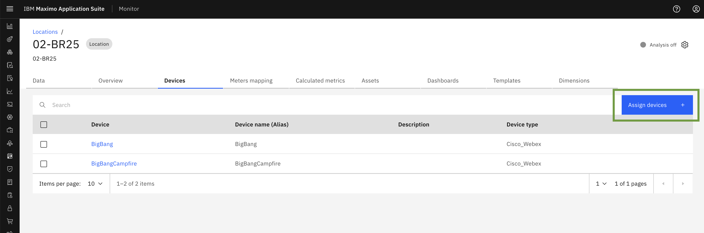

将出现一个弹出窗口，使您能够分配设备。您可以：

按名称搜索设备 
通过选中相应的复选框选择要分配的多个设备

点击 `Save` 

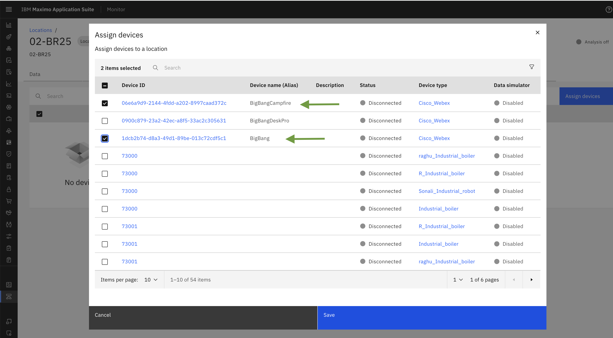

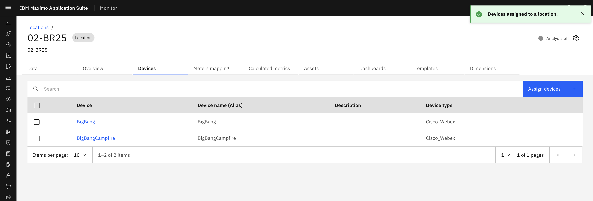

恭喜您已成功在位置中分配设备。

您还可以通过操作菜单中的 `remove` 选项从位置中删除已分配的设备。

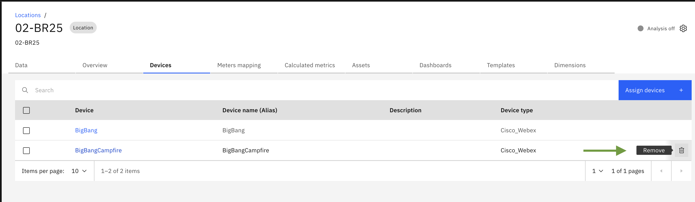

  

### Dimension 选项卡

此选项卡显示与建筑、楼层和空间关联的维度列表。这些维度在建筑成功同步时自动生成。维度来自配置的 Tririga 实例，确保准确和最新的信息。

!!! note 
     - 自动生成的维度无法编辑或删除。
     - 您可以灵活地手动添加新维度。
     - 手动创建的维度可以根据需要进行编辑或删除。

建筑维度 -

楼层维度 -

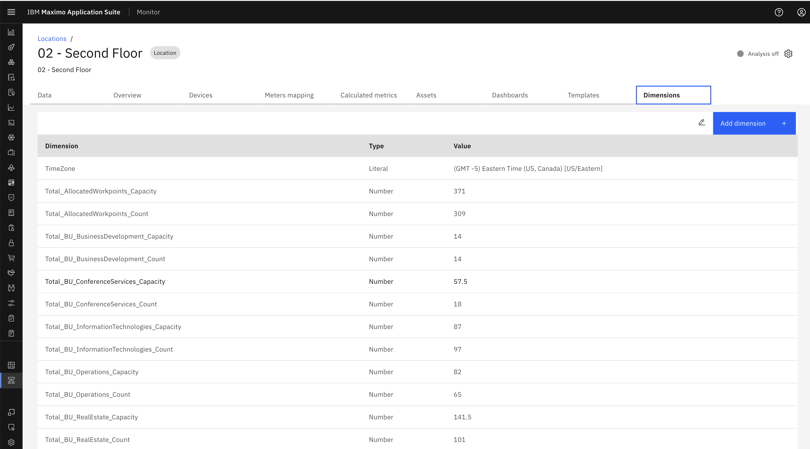

空间维度 -

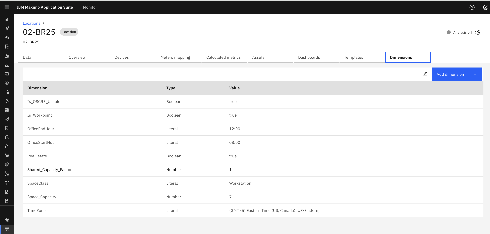

​  
### Calculated Metrics 选项卡

此部分显示与建筑、楼层和空间关联的计算指标列表，这些指标源自模板。这些指标用于测量各种参数，包括：占用计数、占用率、持续时间（按分钟、小时、天和周）等。

!!! note
      计算指标只有在将 Cisco Webex 设备分配给空间后才会生成。请在设备分配后留出一些时间以生成指标。

建筑计算指标 -

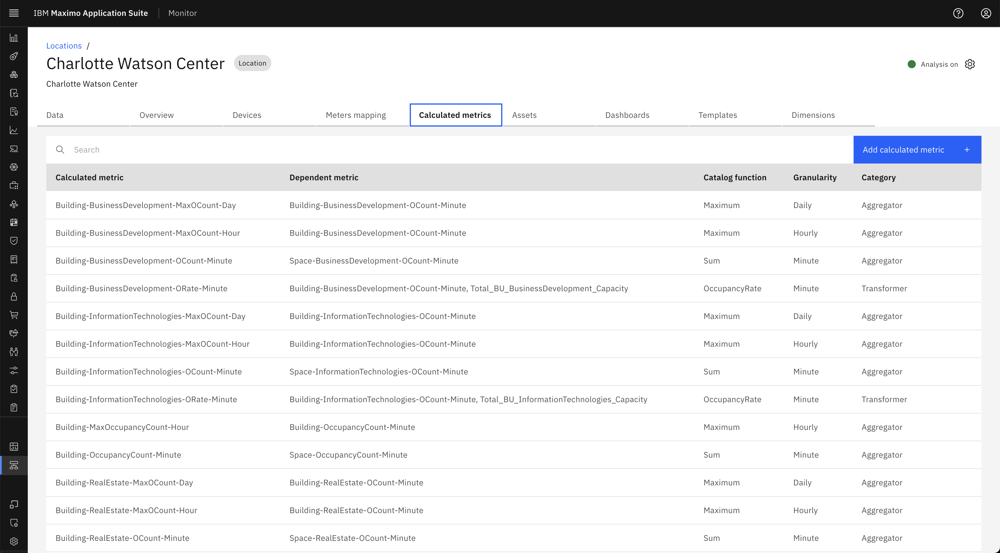

楼层计算指标

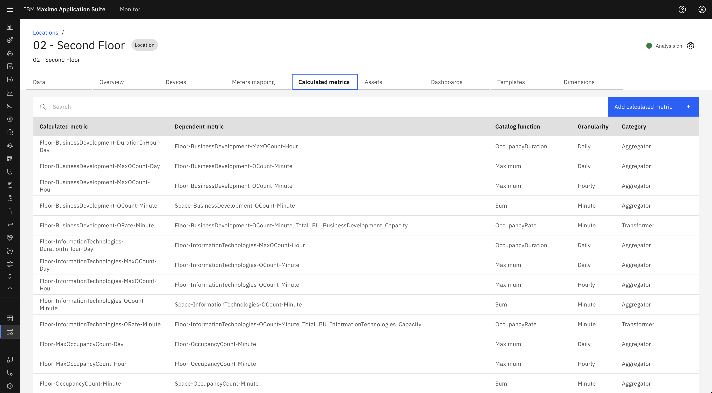

空间计算指标

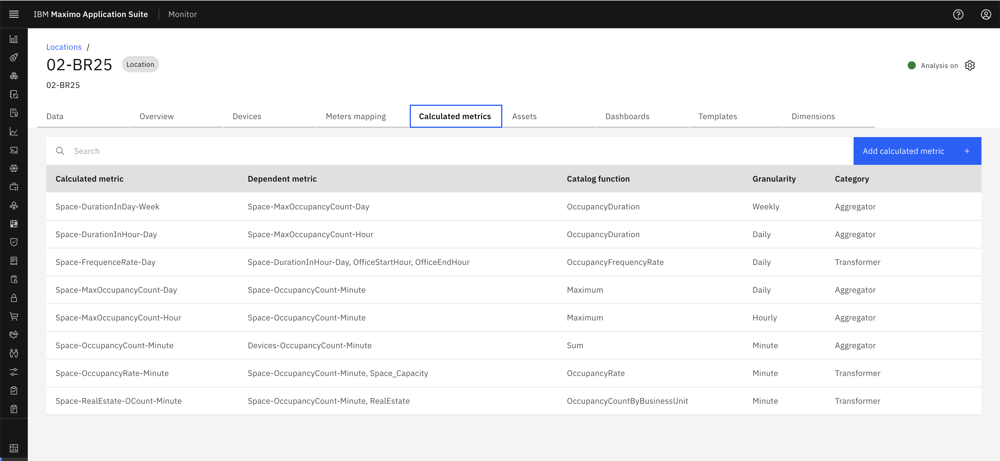

  

### Data 选项卡

此选项卡提供维度和计算指标数据的详细视图。您可以：

通过交互式图表可视化指标和维度值 
以表格格式查看每个指标和维度的详细数据，允许进行单独分析和洞察。

  **建筑计算指标和维度详情 -**

下面是计算指标列表。作为示例，让我们看一下指标 `Building-MaxOccupancyCount-Day`。

此指标显示一个图表，显示建筑在给定日期的最大占用计数。该图表提供最大占用计数的可视化表示，使您能够轻松跟踪和分析数据。

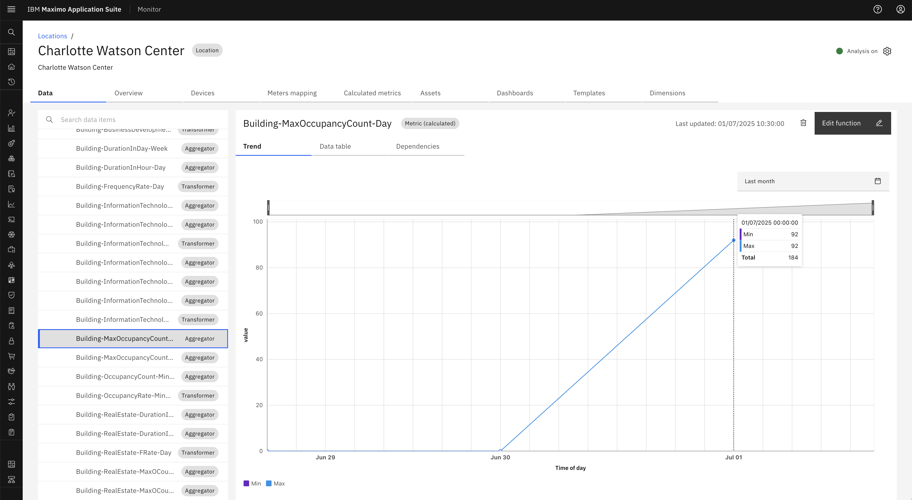

除了图表视图外，您还可以以表格格式查看计算指标。为此，请导航到数据表选项卡。
此表格视图允许您轻松比较指标，使其成为图表视图的有用替代方案。

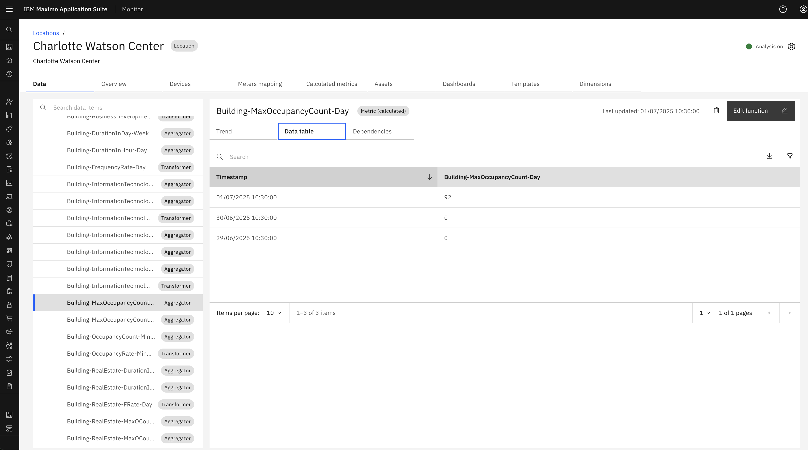

下面是维度列表，显示其相应的值。

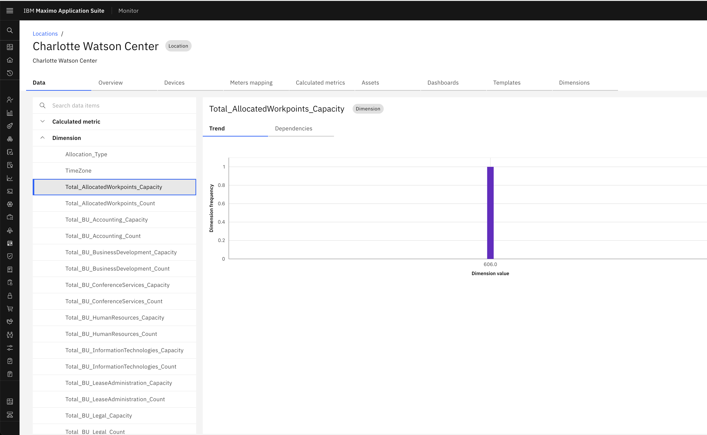

**楼层计算指标和维度详情 -**

下面是楼层的计算指标列表。作为示例，让我们看一下指标 `Floor-MaxOccupancyCount-Day` 和 `Floor-MaxOccupancyRate-Minute`。在这里，它显示了计算指标数据的图表和表格格式。

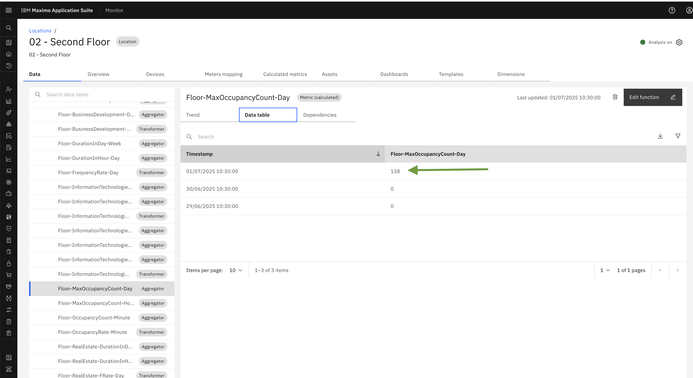

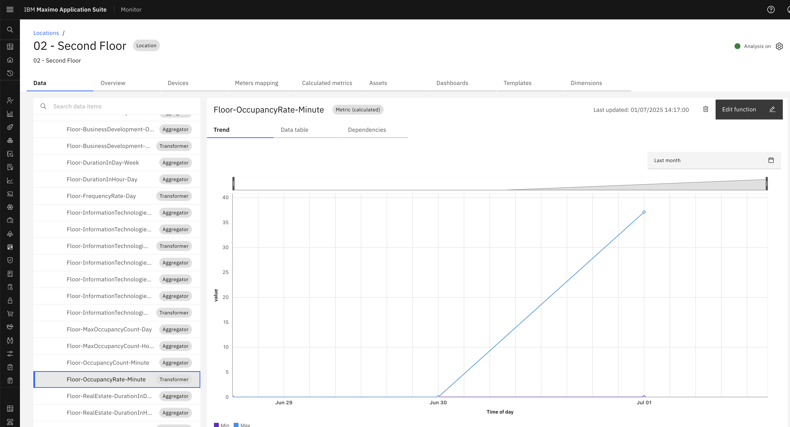

下面是楼层的维度列表，显示其相应的值。

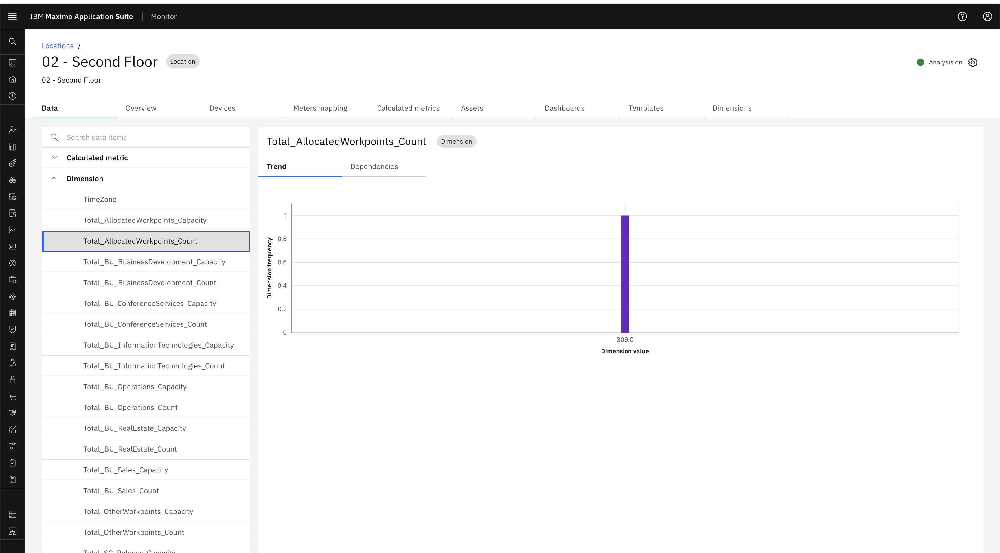

**空间计算指标和维度详情 -**

下面是楼层的计算指标列表。作为示例，让我们看一下指标 `Space-MaxOccupancyCount-Hour` 和 `Floor-MaxOccupancyCount-Day`。在这里，它显示了计算指标数据的图表和表格格式。

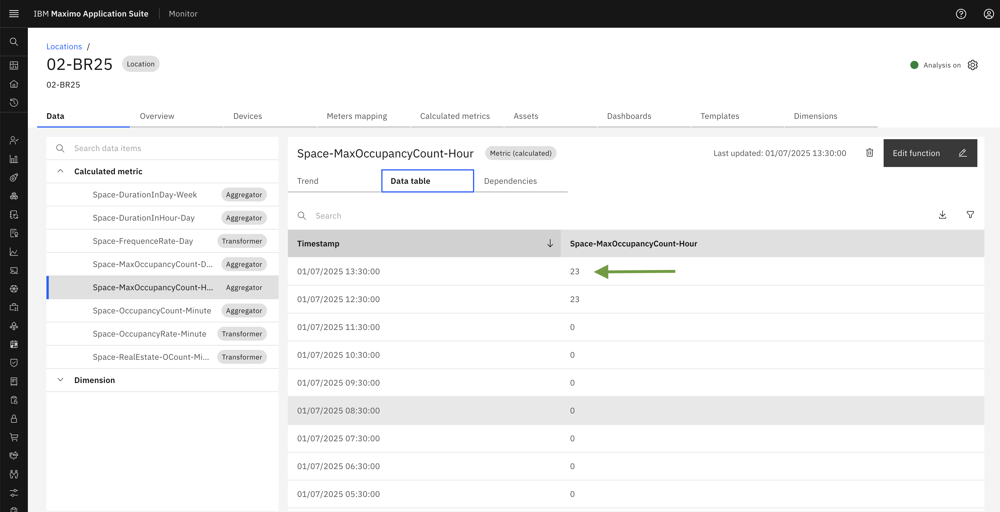

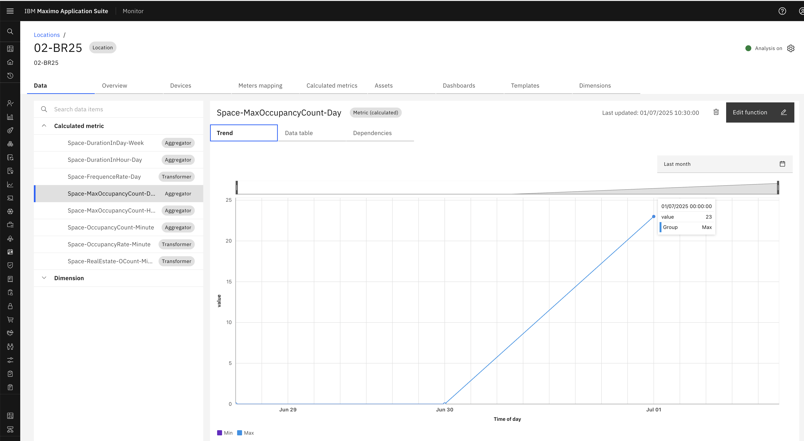

下面是空间的维度列表，显示其相应的值。

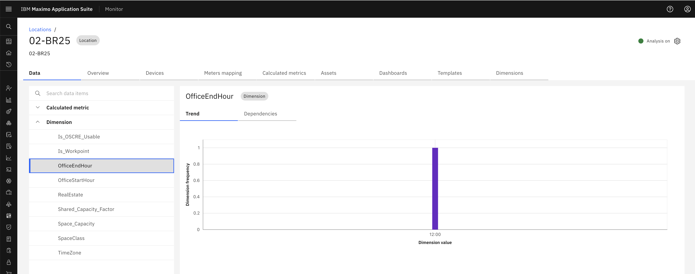

  
### Dashboard 选项卡

此选项卡列出了在建筑同步后自动生成的工作场所分析和警报仪表板。这些仪表板来自应用的模板。

建筑仪表板列表

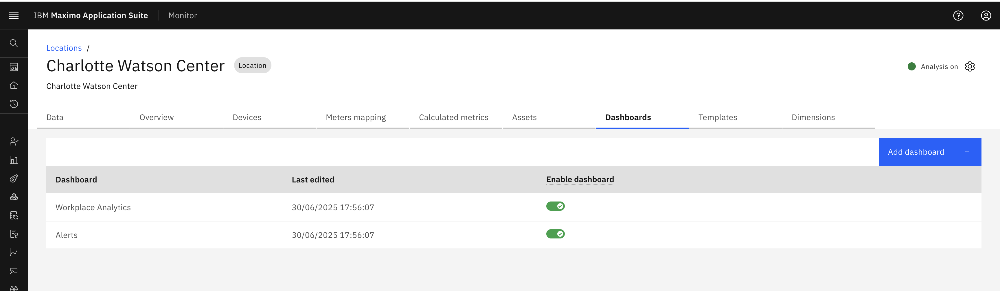

楼层仪表板列表

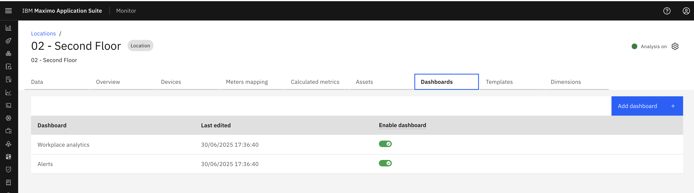

空间仪表板列表

---
恭喜，您已成功了解 MREF 位置详情。 
