# 目标
在本练习中，您将了解 Maximo 房地产与设施管理工作场所分析仪表板详情。

---
*开始之前：*  
本练习要求您已经：

1. 完成[所有实验](prerequisite.md)所需的前置条件

---
Maximo 房地产与设施管理仪表板在 monitor 的仪表板菜单 - 层次结构和位置部分中可用。

在层次结构仪表板中，您将能够查看之前在为该建筑启用同步时配置的扩展层次结构的仪表板。

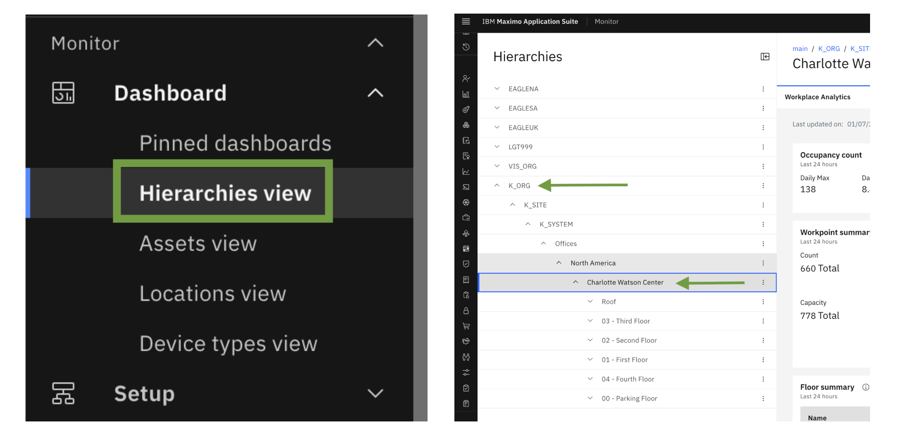 
</br>

在位置仪表板中，您可以按名称搜索特定位置以查看其仪表板详情。

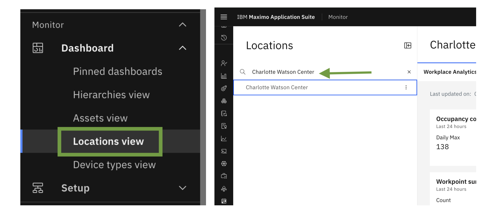


工作场所分析仪表板中提供以下数据：

**占用率** </br>
与空间容量相比，空间的占用程度，以百分比表示。使用以下公式计算占用率：</br>

```
[汇总的每日峰值占用计数 / 空间容量] * 100
```

**频率率**</br>
空间被占用的平均时间与空间可用时间相比，以百分比表示。使用以下公式计算频率率：</br>

```
空间占用 / 空间可用性 x 100
```

**占用计数**</br>
在场的总人数。

**访客计数**</br>
wifi 网络上未知人员的数量。

**已分配工作点**</br>
分配给建筑、楼层或组织的工作点数量。

**总工作点**</br>
可能的工作点总数。

**已分配工作点容量**</br>
已分配工作点的总容量。此值由工作点为 TRUE 的空间的总已分配占用者确定。

**总工作点容量**</br>
工作点的总容量。此值由工作点为 TRUE 的空间的所有占用者确定。

**每周平均占用天数**</br>
工作点每周被占用的平均天数。使用以下公式计算每周平均占用天数：

```
(占用天数) / (工作日) * 每周工作日
```

**每天平均占用小时数**</br>
空间每天被占用的平均小时数。

**空间容量**</br>
Maximo 房地产与设施管理空间记录中定义的每个空间的容量。


您还可以访问数据摘要，例如按楼层、空间或组织。您可以访问热图，该热图汇总了 Maximo Monitor 设备或 Cisco Webex 设备的数据。


接下来，我们将看到建筑、楼层和空间的仪表板详情


## 建筑仪表板

在这里您可以看到建筑仪表板卡片，其中包含占用计数/率、频率率、建筑时区、房间摘要、楼层摘要、每日平均值、工作点摘要、业务单位摘要和空间类别摘要。此外，您可以应用过滤时间范围来查看仪表板数据。

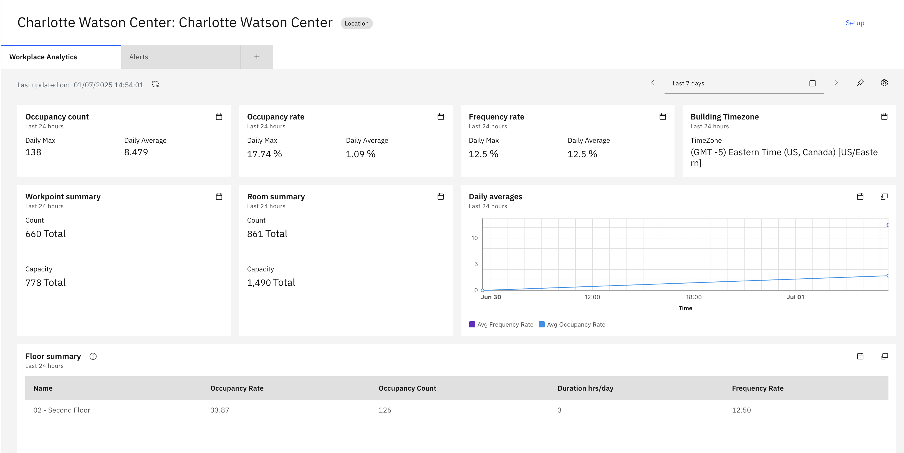 

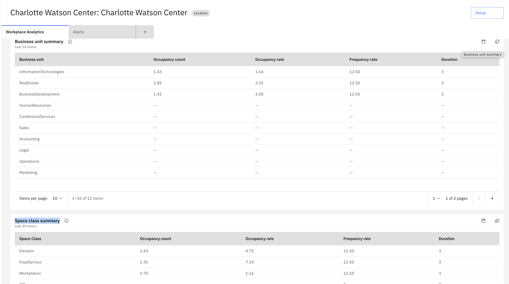 


您还可以从设置图标编辑或删除仪表板。

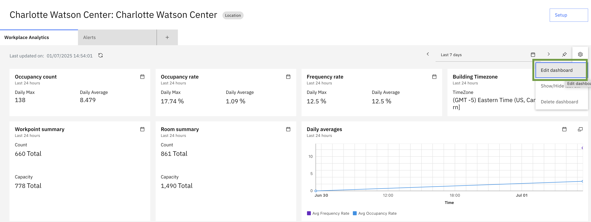 

在编辑仪表板页面上，您可以通过更新以下元素来修改单个卡片内容：

- 标题：将卡片的标题更改为适合您需求的名称。
- 描述：编辑卡片的描述以提供更多上下文。
- 大小：调整卡片的大小以适应您的仪表板布局。
- 数据项：更新与卡片关联的数据项。
- 时间范围：更改卡片数据的时间范围。
- JSON 编辑器：编辑卡片的 JSON 配置。
  
此外，您还可以添加具有针对您特定需求定制的自定义配置的新卡片。


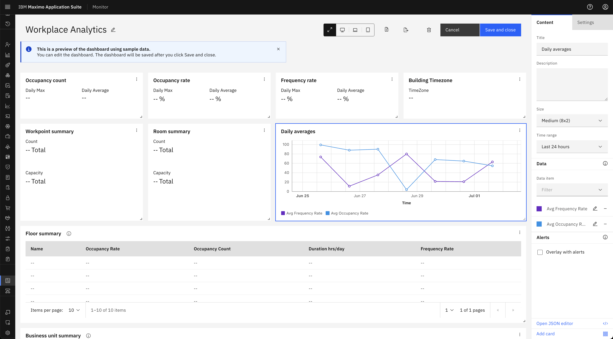 


## 楼层仪表板

在这里您可以看到楼层仪表板卡片，其中包含楼层平面图、占用计数/率、频率率、房间摘要、每小时占用计数图表、工作点数量、工作点空间类别摘要、单个空间摘要和业务单位摘要

下面是从配置的 Tririga 实例检索的楼层平面图图像。该图像具有带有彩色高亮的叠加层，代表以下空间指标：

- 占用计数/率：占用每个空间的人数。
- 频率率：每个空间的使用频率。
- 持续时间：每个空间被占用的时间长度。
  
彩色叠加层指示楼层平面图上当前占用的空间。

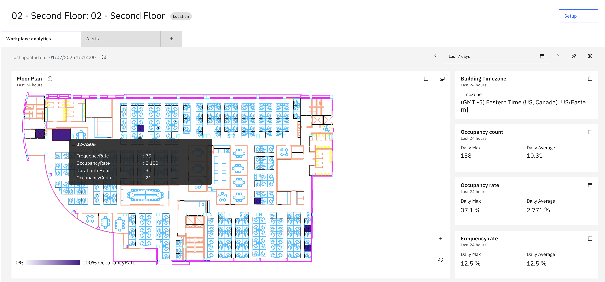 

!!!note
    只有当楼层平面图 SVG 包含 id 属性设置为 triSpaceLayer 或 triSubSpaceLayer 的元素时，Tririga 楼层平面图空间叠加层或热图才会出现在楼层仪表板中。

</br>

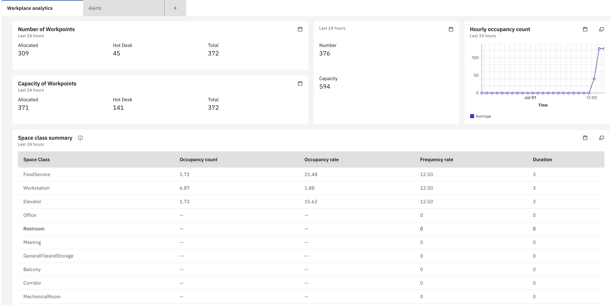 

</br>
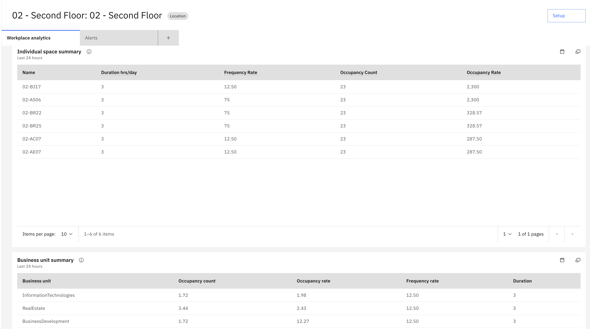 

## 空间仪表板

在这里您可以看到空间仪表板卡片，其中包含空间类别、空间容量、占用计数、是否为工作点、频率率、按天持续时间图表。
</br>

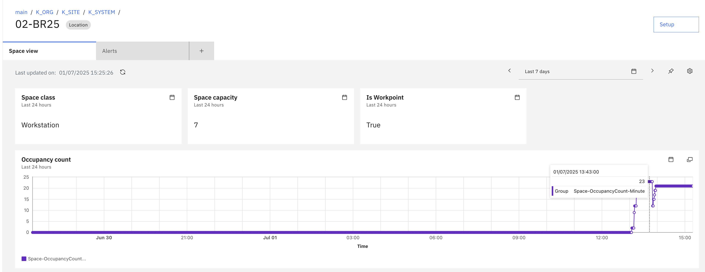 

</br>

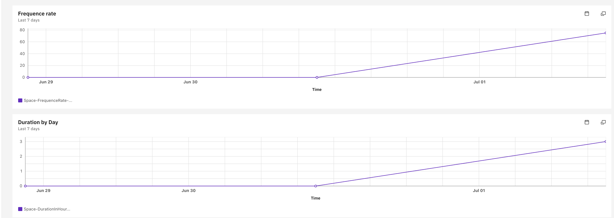 

---
恭喜，您已成功了解 MREF 位置仪表板详情。</br></br>