# 目标
在本练习中，您将学习如何在 Monitor 层级中创建和管理告警。

---
*开始之前：*  

确保您已：

* 查看了 Monitor 层级实验以了解 Monitor 中层级的概念。
* 在 Monitor 中设置了示例层级。

在本实验中，已配置了一个资产，包含两个设备，两者都在运行模拟。
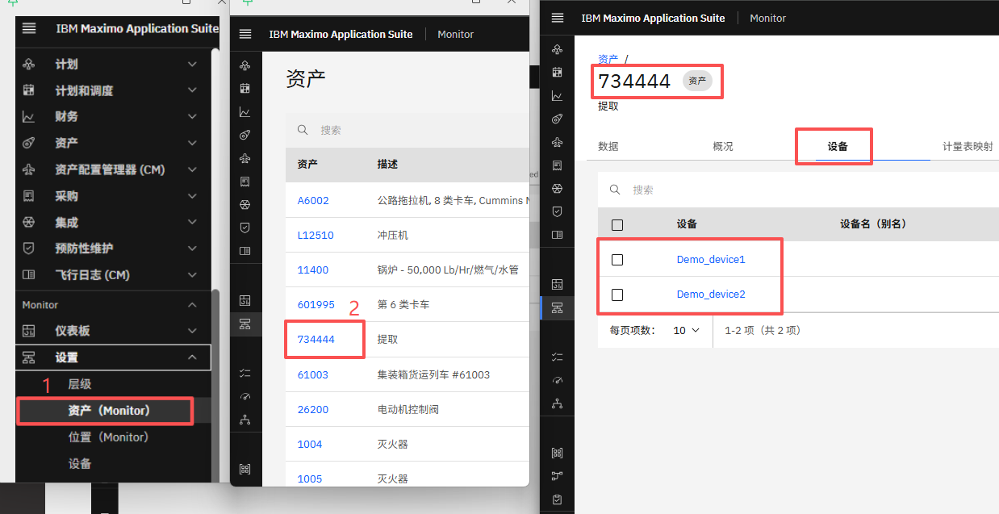 
在资产级别添加了一个名为 asset_pressure_sum 的计算指标，用于每分钟计算来自设备的压力值总和。
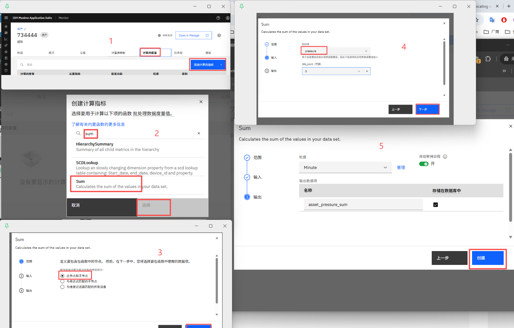
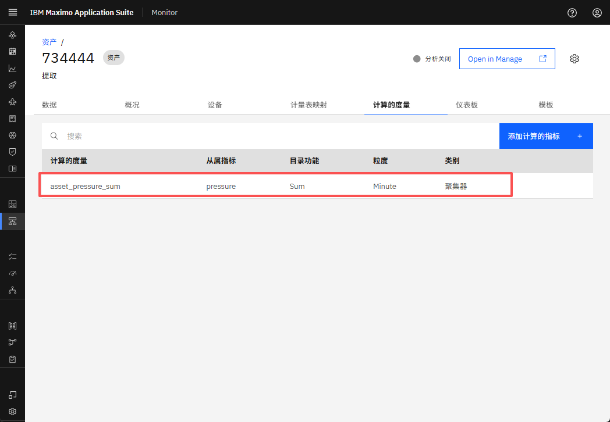 

---

在本实验中，您将在资产级别配置告警。同样，可以在任何层级级别（如站点、系统、位置或组织）配置告警。

#### 设置告警

1. 导航到资产设置页面并搜索资产。
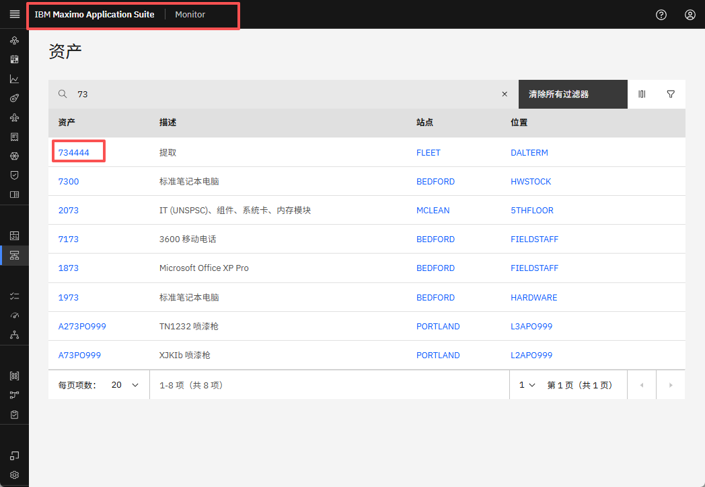 
2. 点击资产。它将打开其详细信息页面。
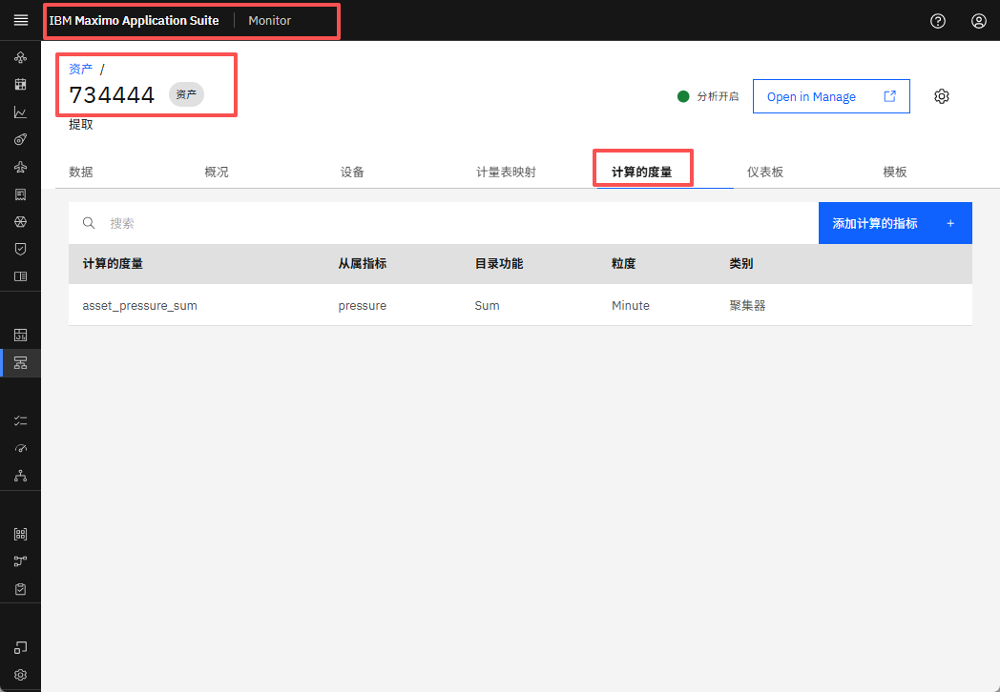 
3. 转到计算指标选项卡并点击"添加计算指标"按钮。
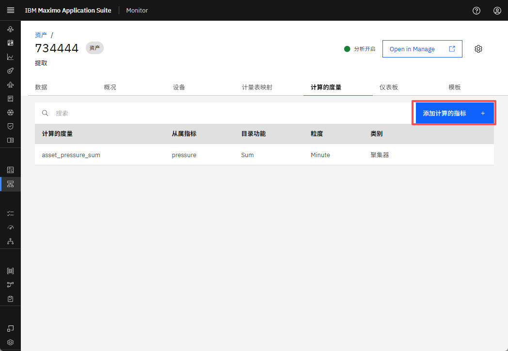 
5. 在弹出窗口中，搜索"Alert"。
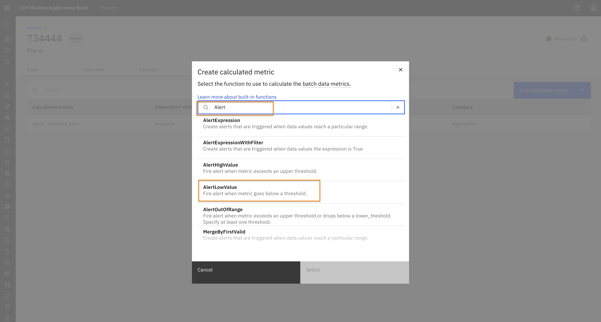 
6. 选择 AlertLowValue 并点击"下一步"。
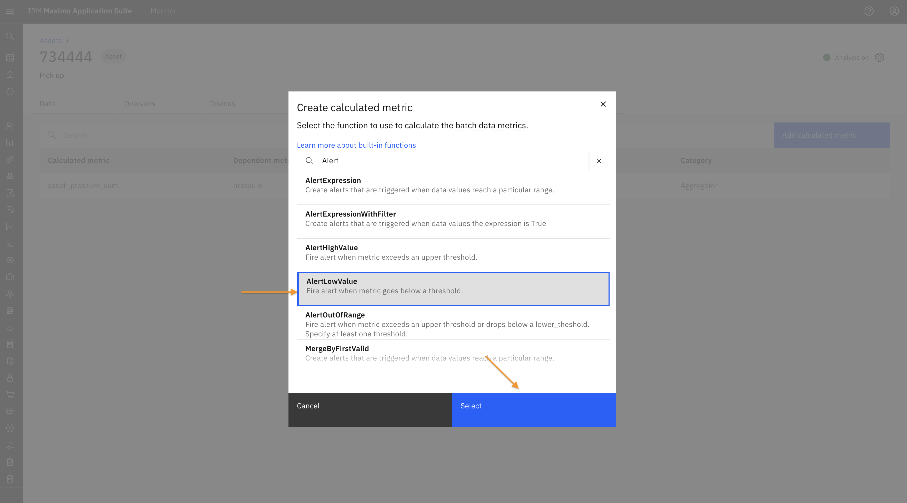 
7. 选择"此节点和子节点"并点击"下一步"。
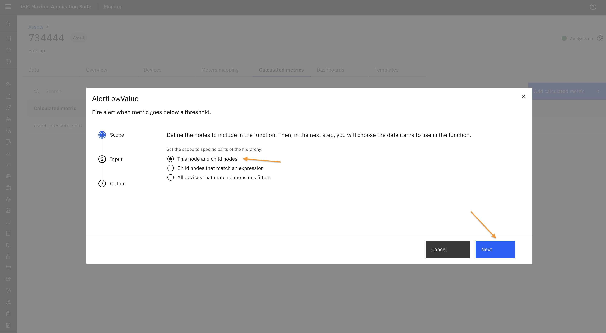 
8. 选择要为其生成告警的计算指标。输入下限阈值、严重性和状态。点击"下一步"。
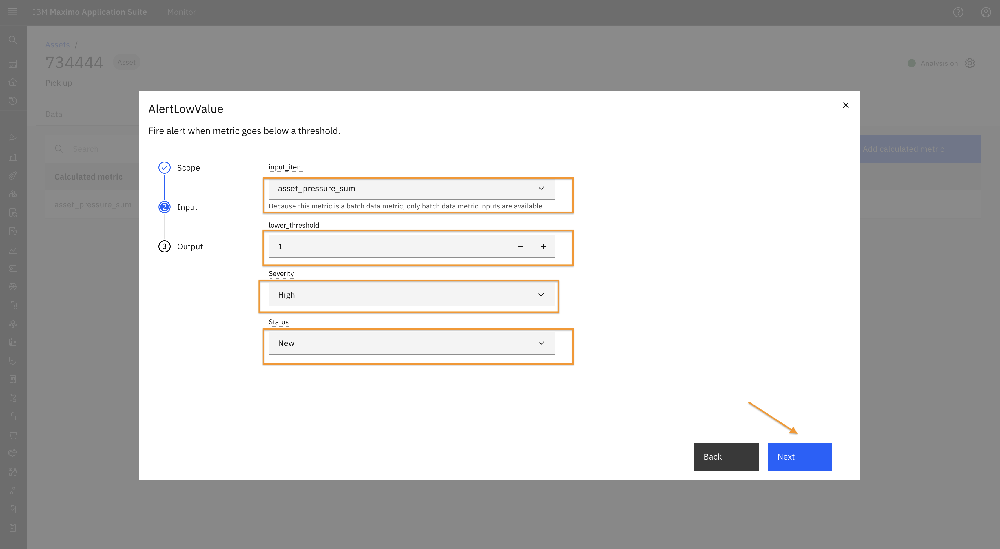 
9. 为告警提供名称并点击"创建"。
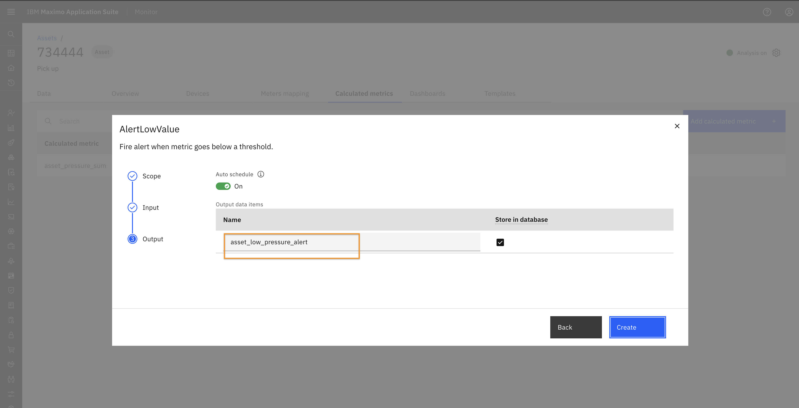 
10. 告警现在将出现在计算指标表中。
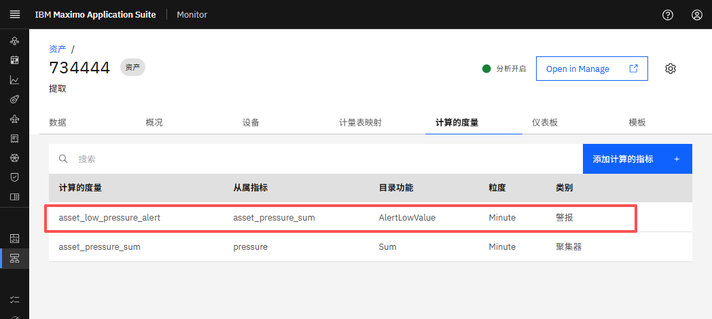 

#### 查看告警

管道将运行，当满足阈值条件时将触发告警。

您可以在"告警"仪表板中查看生成的告警，该仪表板在资产配置了任何告警时会自动创建。

1. 从左侧边栏导航到资产仪表板视图。
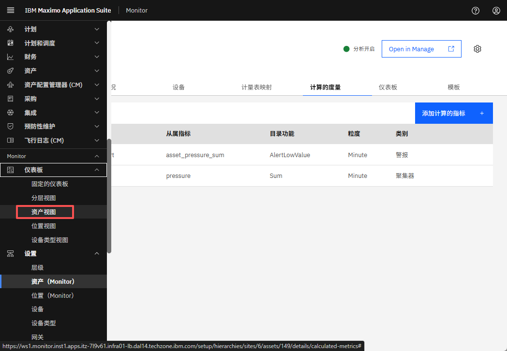 
2. 搜索所需的资产并点击它以打开详细信息。
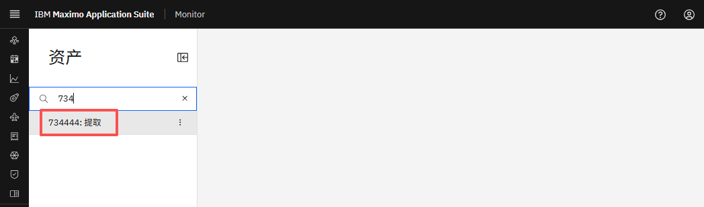 
3. 您将看到告警仪表板，其中显示告警表。此表列出了与资产及其连接设备相关的所有告警。
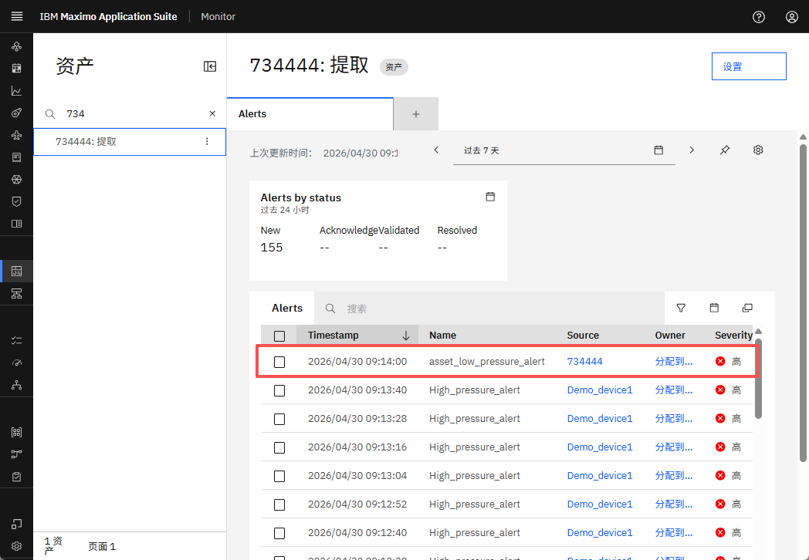 
4. 您可以使用过滤器图标根据特定条件过滤告警。
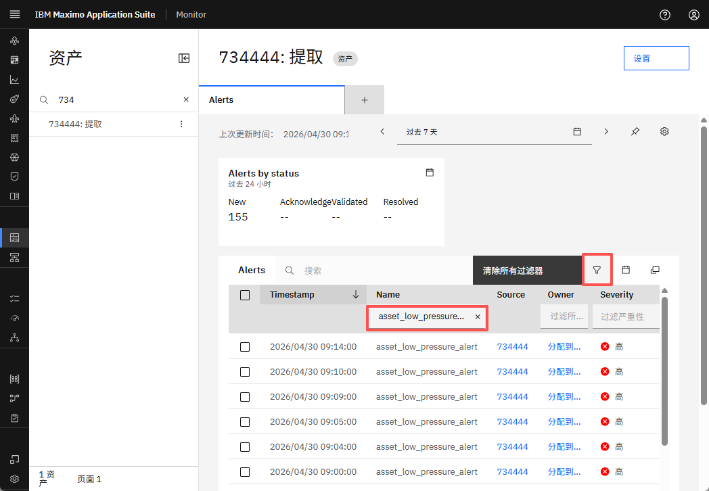 

您还可以使用资产设置页面中的仪表板选项卡创建自定义仪表板。按照本实验系列[练习 2](./view_alert.md#custom-dashboard) 中概述的相同步骤操作。
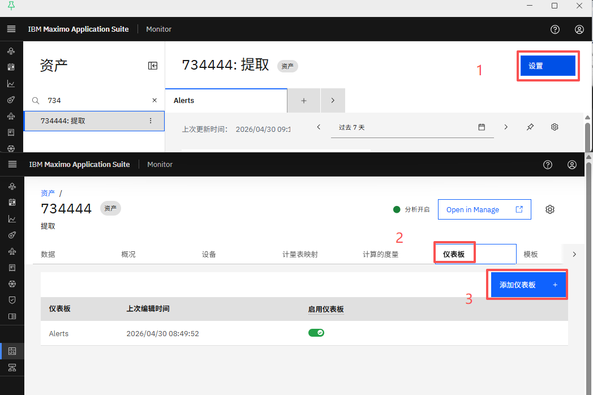 

---

🎉 恭喜！您已成功完成在 Monitor 中不同层级级别设置和查看告警的练习。 