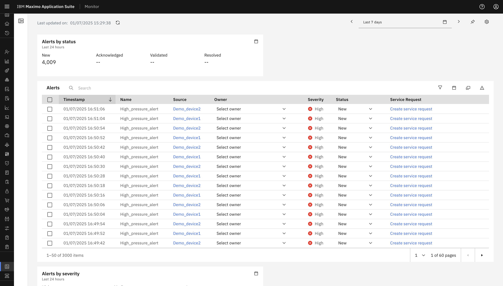
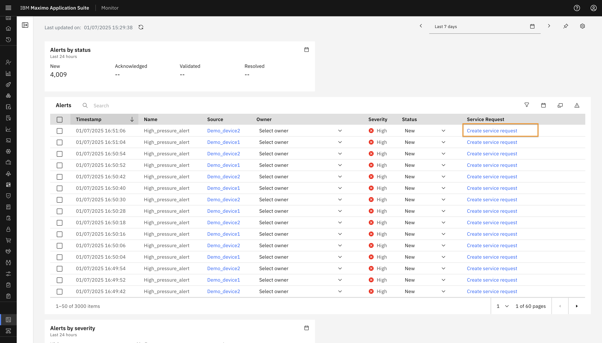
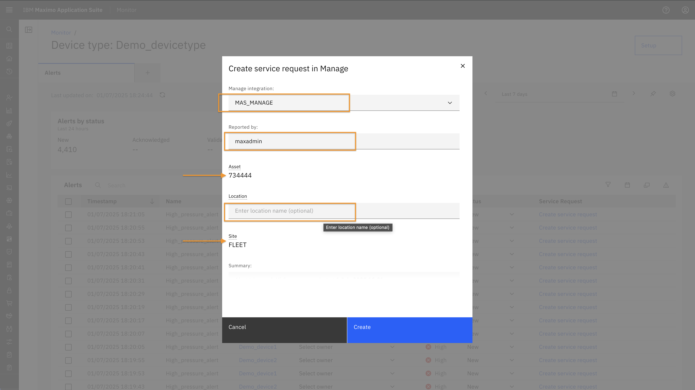
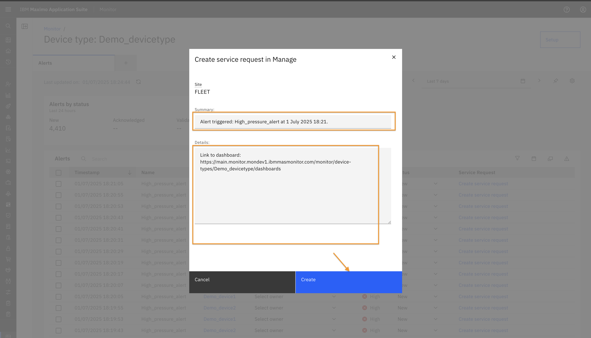
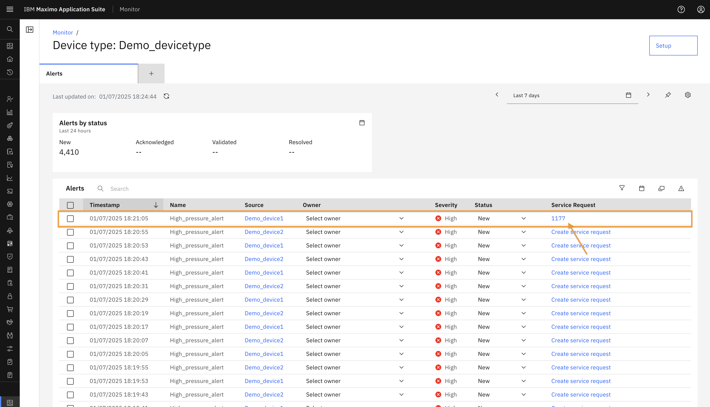
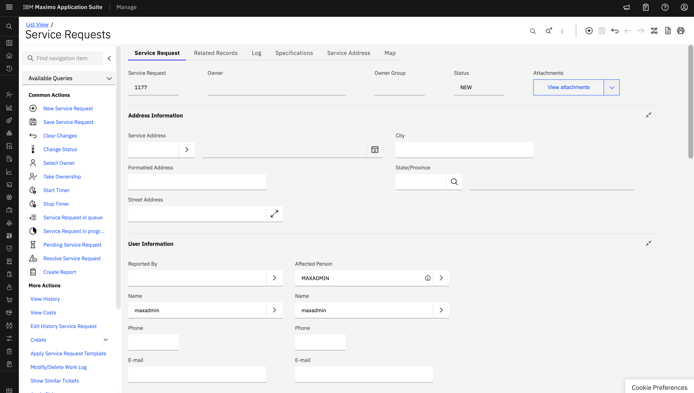

# 目标
在本练习中，您将学习如何为告警创建服务请求。

---
*开始之前：*  
本练习要求您：

1. 完成[所有实验前提条件](prereqs.md)中列出的前提条件。
2. 完成本实验系列中的前面练习。

---

如前面练习所示，告警仪表板包含一个告警表，提供有关每个告警的详细信息。

 
该表显示以下列：

* 时间戳 – 生成告警的时间。
* 名称 – 告警的名称。
* 源 – 指示触发告警的源（设备或资产或其他层级级别，即站点、系统、位置）。点击源将重定向到相应的源详细信息页面。
* 所有者 – 允许您为告警分配所有者。
* 严重性 – 指示告警的严重性级别。
* 状态 – 默认为新建，但可以更新为已验证、已确认或已解决。
* 服务请求 – 点击"创建服务请求"会打开一个弹出窗口，以在 Manage 中启动请求。
 

在创建服务请求弹出窗口中：

* 选择 Manage 集成。
* 填写报告人字段。
* 如果找到所选告警的链接，资产和站点字段将根据层级自动填充。
 
* 您还可以提供其他位置详细信息。
* 为摘要和详细信息字段提供了默认文本，您可以根据需要进行修改。
* 点击创建以提交服务请求。
 

创建后，服务请求编号将出现在告警表的服务请求列中。
 
您可以点击请求编号直接导航到 Manage 中的相应服务请求。
 

---
恭喜您已成功完成练习，从而完成了本 Maximo 实验。🤗 