# 目标
在本练习中，您将学习如何：

* 在设备类型级别设置告警 KPI

---
#### 开始之前  
本练习要求您：

* 查看 [Monitor 设备类型和设备](../../monitor_device_devicetype_setup_9.1/) 实验，以获得对设备类型和设备的基础理解。
* 设置一个示例设备类型和相应的设备。

在本实验中，已配置了一个设备类型，包含两个指标：温度和压力。
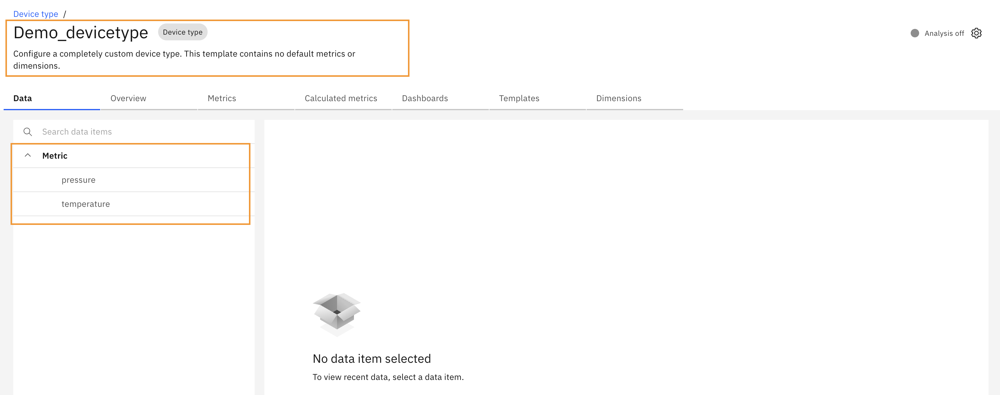 

还向该设备类型添加了一个示例设备，并已启动模拟器。
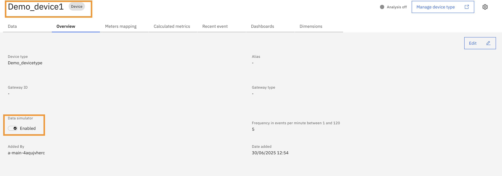 

---

在本练习中，您将为设备类型配置告警 KPI。

#### 告警设置

导航到您创建的设备类型。点击计算指标选项卡。
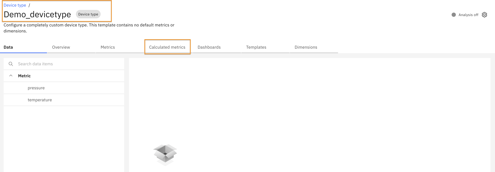 

点击"添加计算指标"按钮。
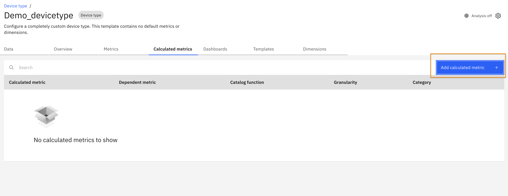 

在搜索框中，输入"Alert"。
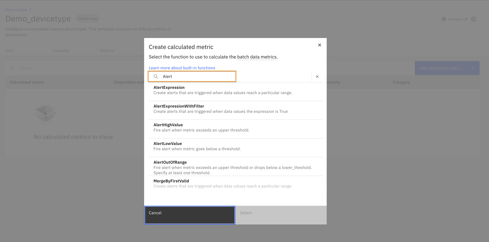 

从列表中选择 AlertHighValue 并点击"选择"。
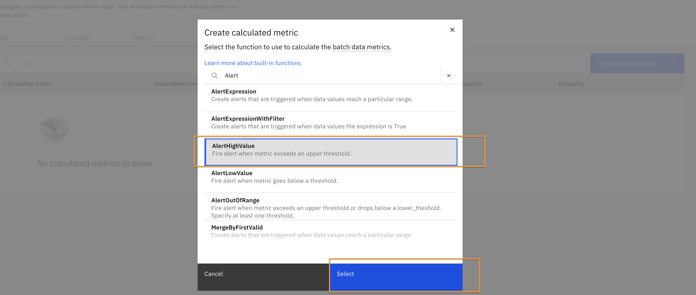

选择"此类型的所有设备"并点击"下一步"。
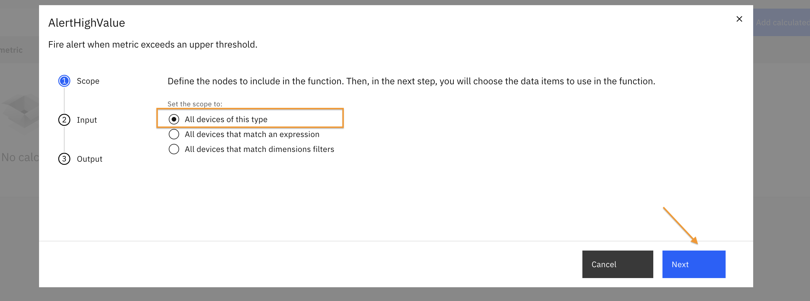     

选择要为其配置告警的输入项。指定阈值、严重性和状态。点击"下一步"。
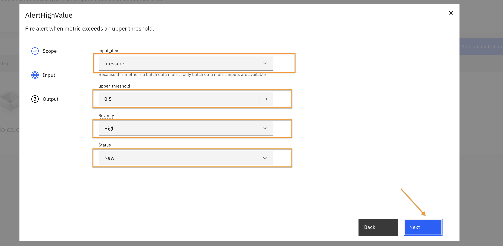 

为告警提供名称并点击"创建"。
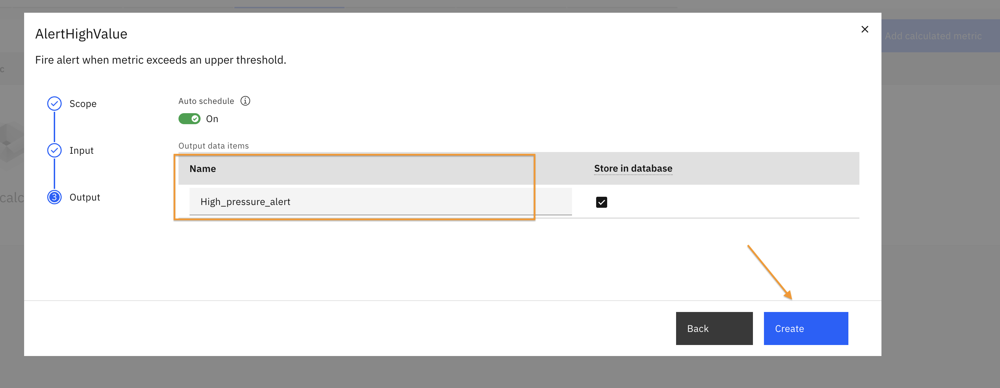 

您现在应该能在计算指标部分看到新创建的告警，如下所示。
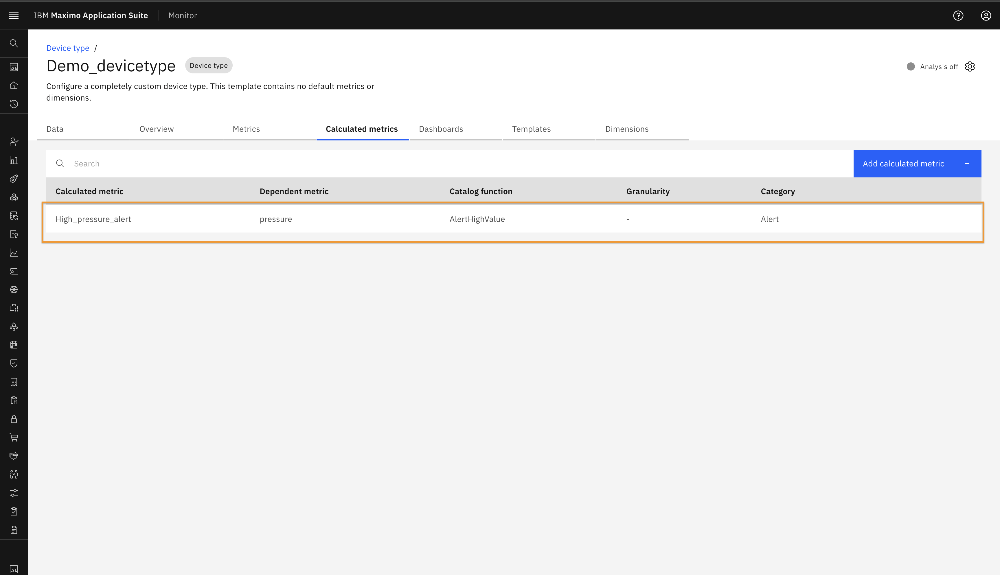 

在设备类型级别设置告警会自动将相同的告警配置应用于与该类型关联的所有设备。您还将在单个设备级别看到相同的计算指标。

您应该也能看到为设备创建的相同计算指标。
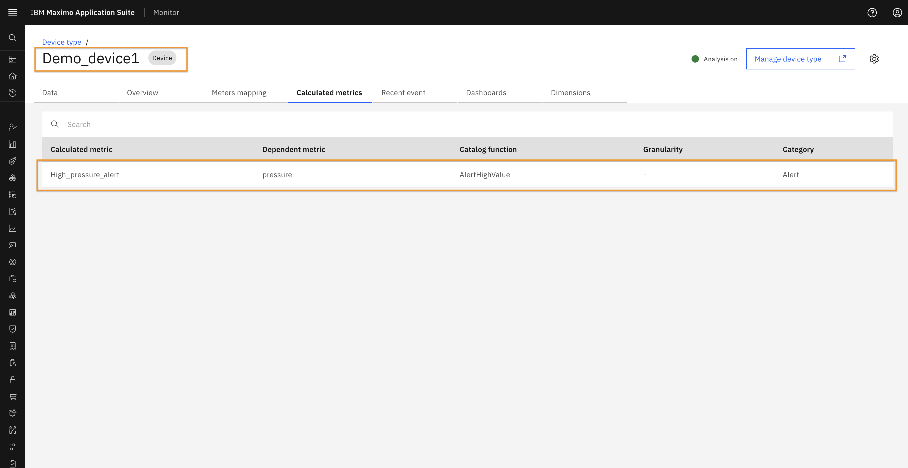 

当超过阈值时，管道将运行并在一段时间后生成告警。

!!! tip "提示"
    在本练习中，我们使用了 AlertHighValue KPI。同样，您可以探索其他告警类型，例如： 
    - AlertLowValue 
    - AlertExpression 
    - AlertOutOfRange。 
    您可以在[此处](https://www.ibm.com/docs/en/masv-and-l/maximo-monitor/cd?topic=data-alerts){target=_blank}阅读有关这些告警类型的更多信息。

---
恭喜您已成功在设备类型级别设置告警 🤗。 