# 目标
在本练习中，您将学习如何在 Monitor 仪表板中查看告警。

---
*开始之前：*  
本练习要求您：

1. 完成[所有实验前提条件](prereqs.md)中列出的前提条件。

2. 完成本实验系列中的前面练习。

---

### 默认仪表板

在设备类型级别配置告警 KPI 后，将自动向设备类型添加名为"告警"的仪表板。

从左侧边栏导航到设备类型仪表板视图。
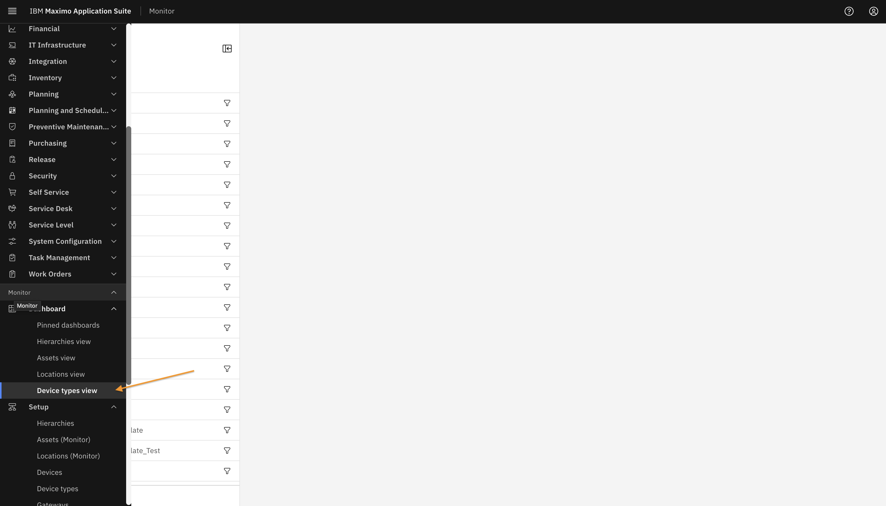 
搜索设备类型并点击它以打开详细信息。
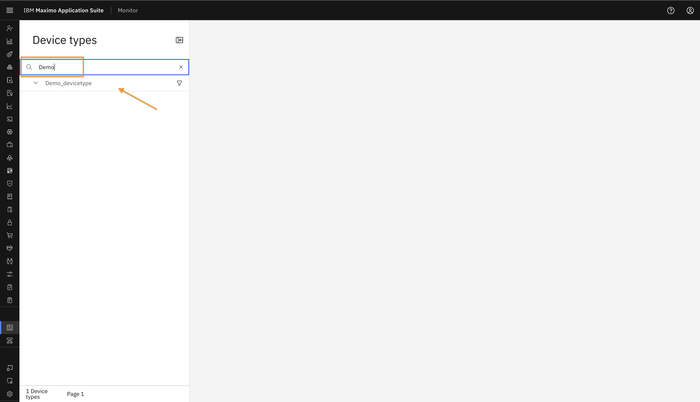 
您将看到如下所示的告警仪表板。
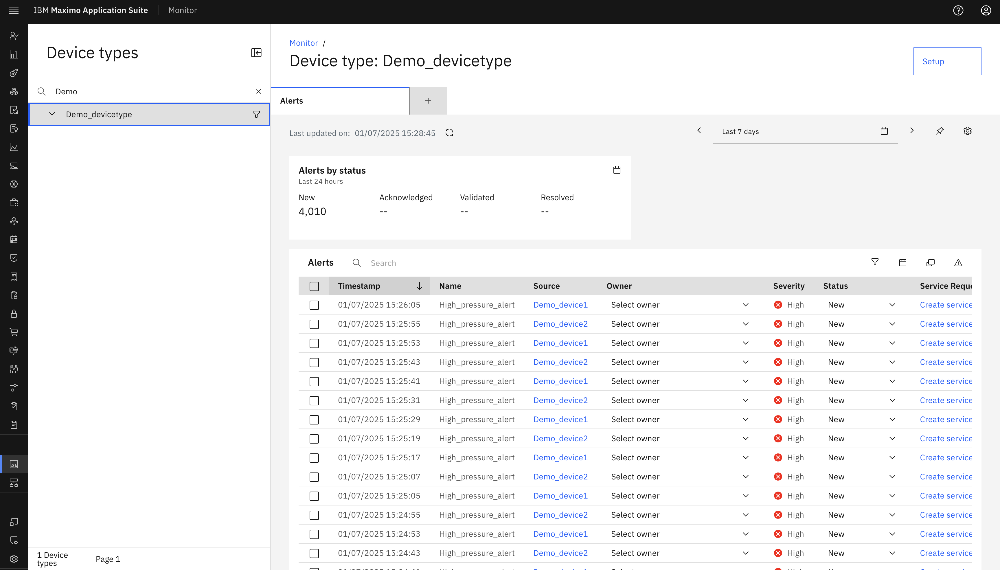 
告警表显示与设备类型及其关联设备相关的所有告警。您可以点击源链接直接导航到触发告警的设备。

### 自定义仪表板

您可以为设备类型和单个设备创建自定义仪表板。在本练习中，我们将为特定设备创建自定义仪表板。

导航到设备并打开其设备详细信息页面。
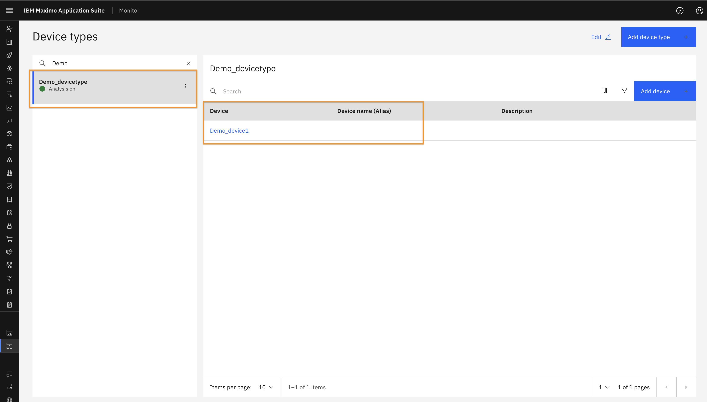 
点击仪表板选项卡，然后点击"添加仪表板"按钮。
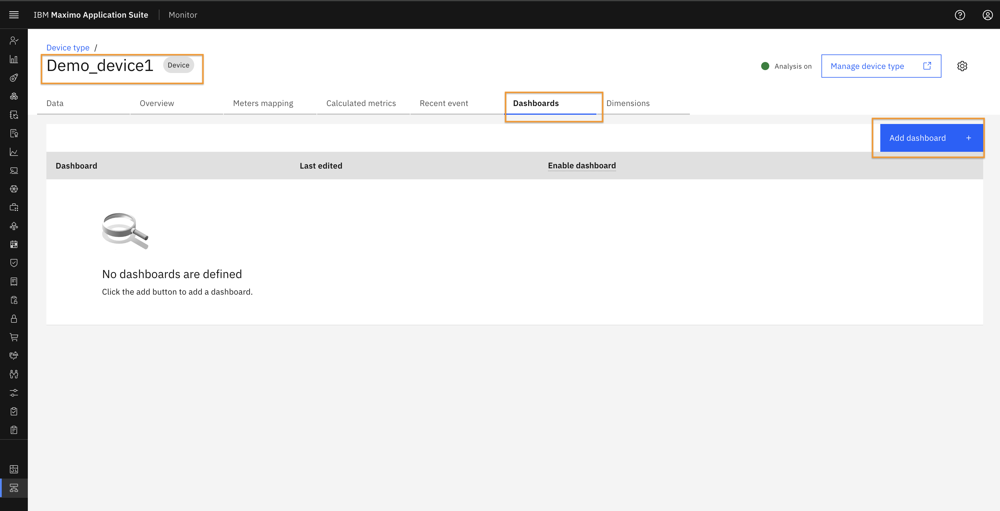 
输入仪表板标题并点击"配置仪表板"。
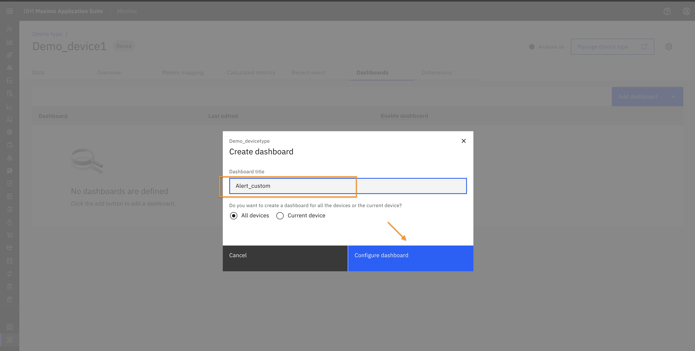 
仪表板编辑器将打开。从右侧边栏中选择"告警表"。
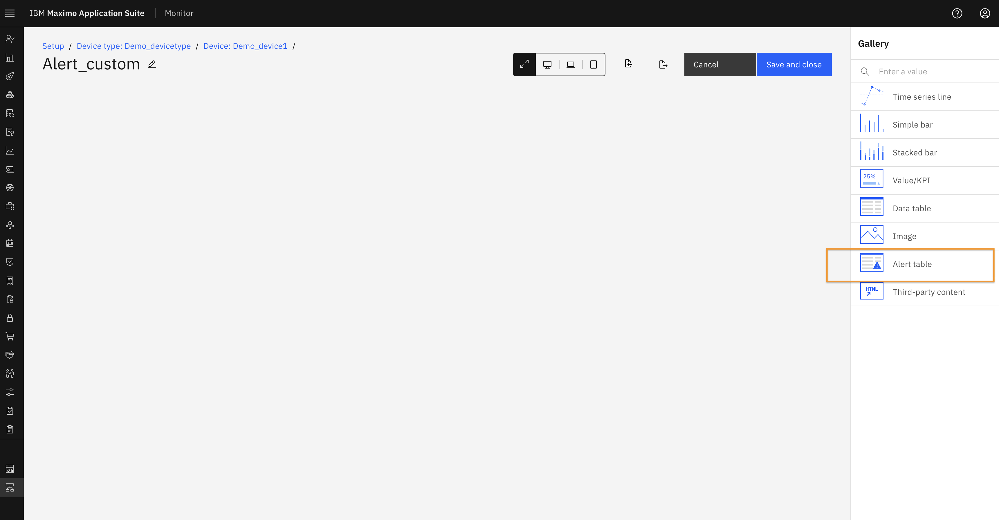 
为告警提供标题和描述。选择数据的时间范围并点击"添加卡片"。
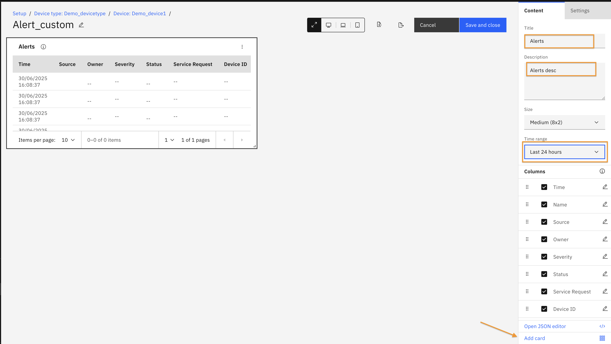 
从右侧边栏中选择"时间序列线"。输入标题，启用告警叠加，选择告警名称，点击"添加卡片"。
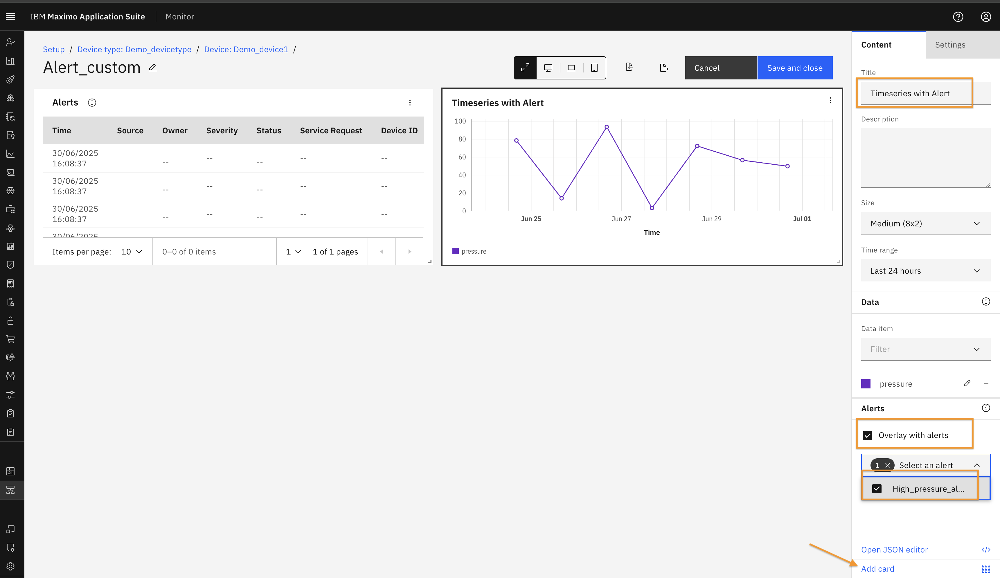 
点击"保存并关闭"。
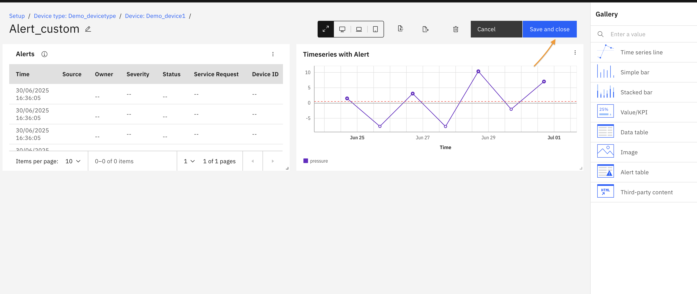 
新创建的告警仪表板现在将出现在仪表板选项卡中。
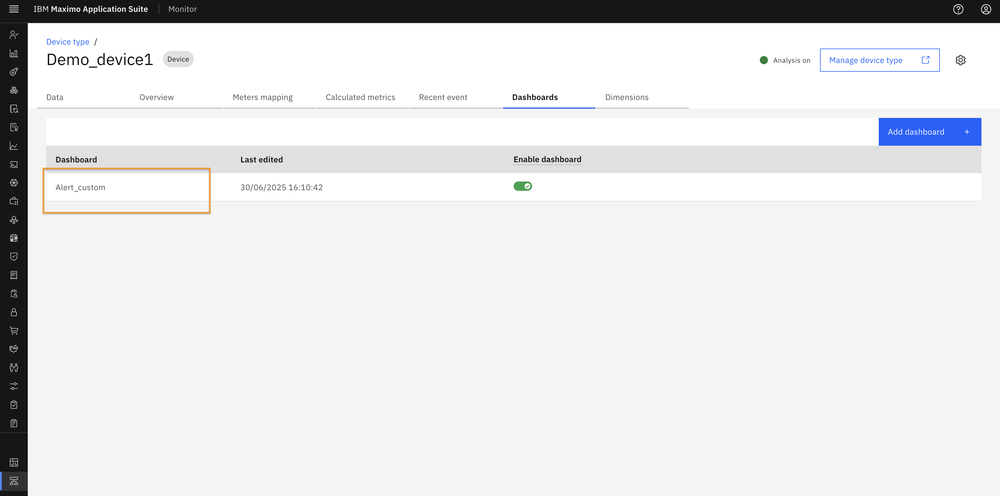 
要从设备类型级别查看它，从左侧边栏导航到设备类型视图。
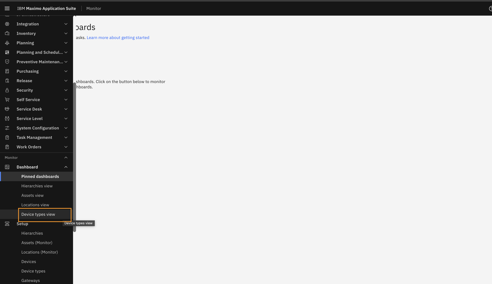 
搜索您的设备类型，点击下拉箭头，然后选择设备。
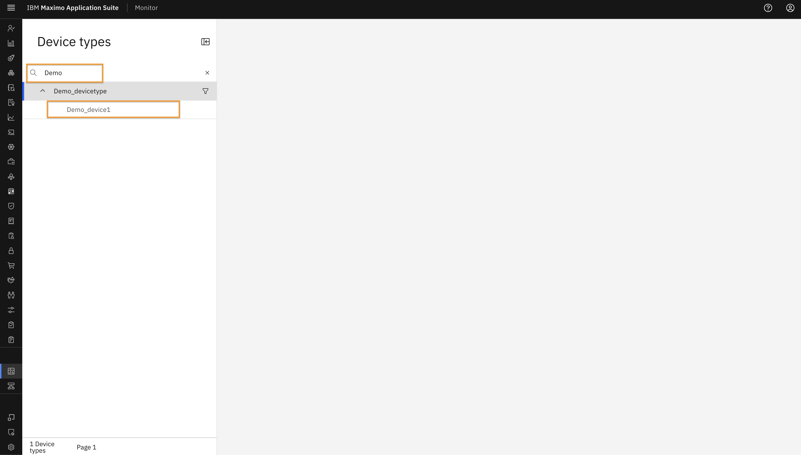 

您现在将看到一个精美定制的告警仪表板。

* 您可以根据需要重新排列卡片并调整其大小。
* 在时间序列卡片中，告警显示为红色标记。将鼠标悬停在它们上面以查看指标和告警值。

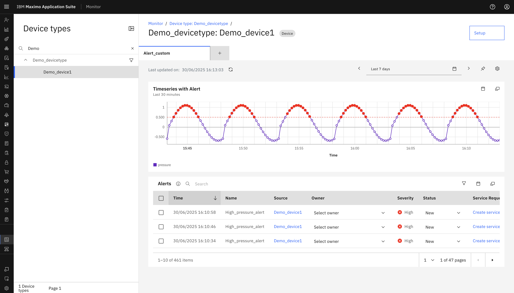 

---
恭喜您已成功创建告警仪表板🤗。 