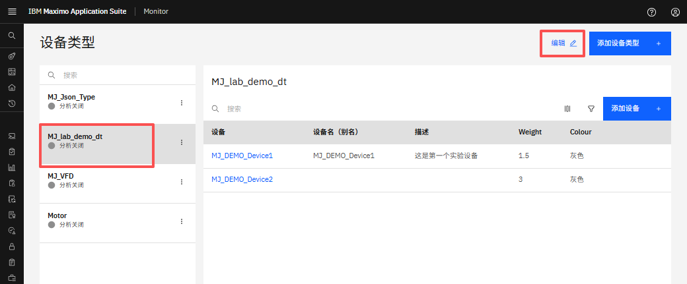
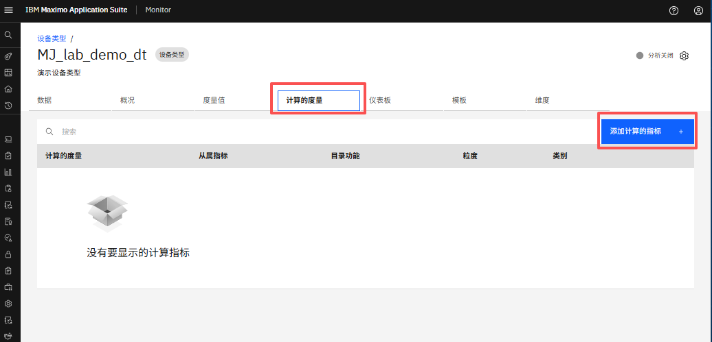
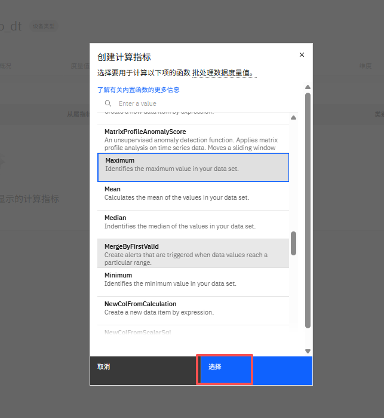
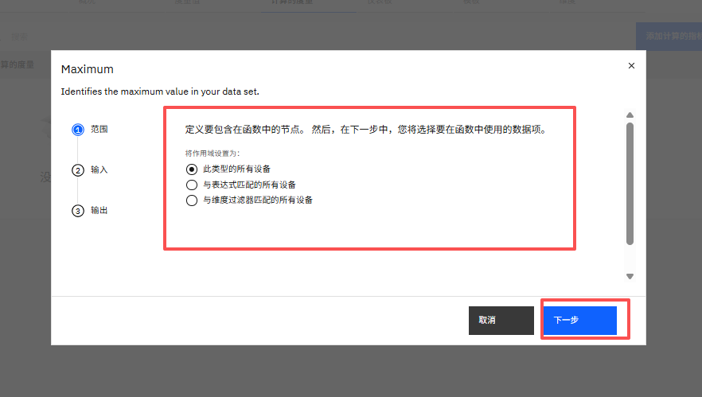
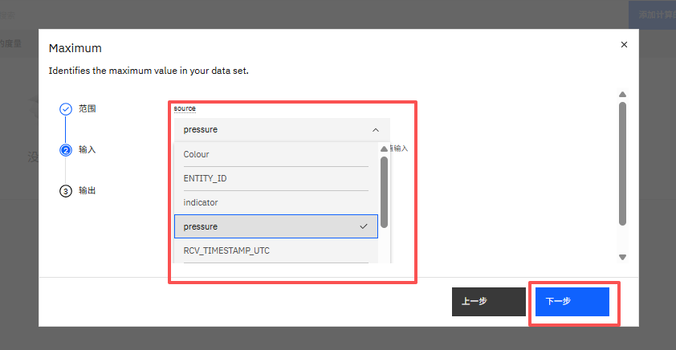
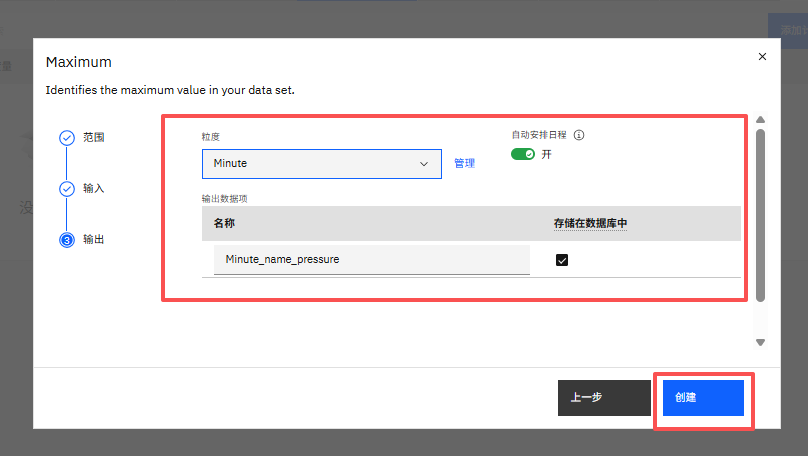
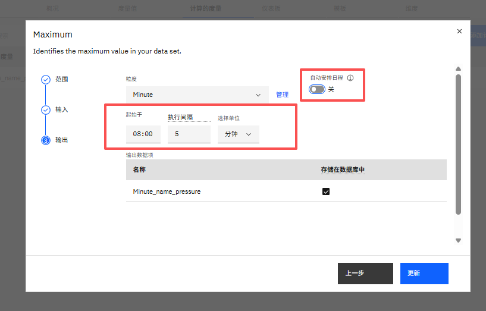
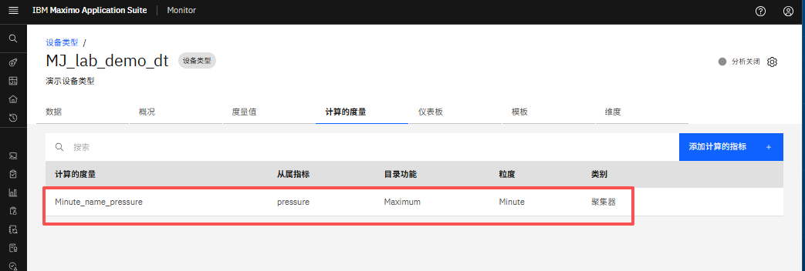
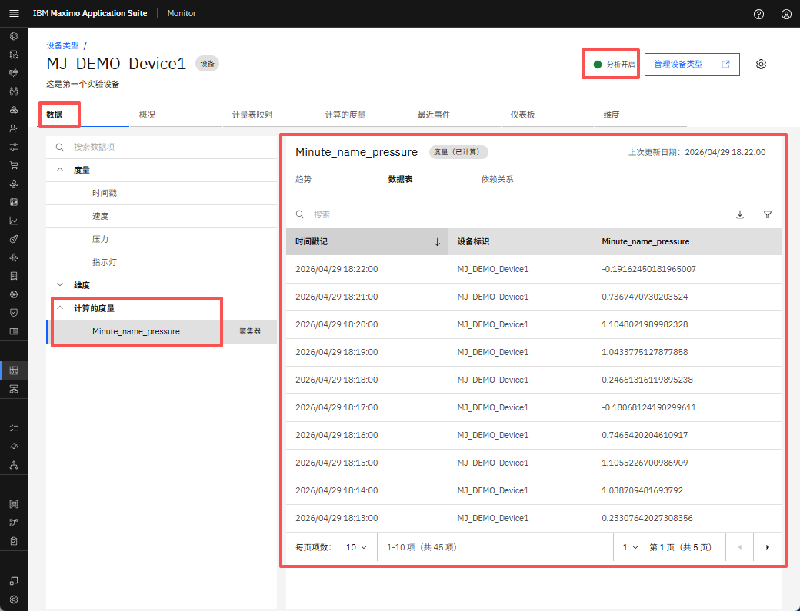

# 目标
在本练习中，您将学习如何在设备类型中添加计算度量。

---
*开始之前：*  
本练习要求您：

1. 完成[所有实验](prereqs.md)所需的前提条件
2. 完成前面的练习
 
---

## 添加计算度量

导航到所需"设备类型",点击编辑，
  

点击“计算的度量”选项卡，然后点击 `添加计算的指标`。
  

从可用选项列表中选择所需的计算函数，然后点击 `选择` 以应用它。
  

从列出的选项中定义要包含在函数中的节点。
  

从下拉列表中选择要在计算中使用的输入数据项。
  

选择所需的粒度级别，然后输入输出计算度量的名称。 
最后，点击 `创建` 以生成计算度量数据。
  

（可选）切换"自动调度"选项以配置计算度量的开始时间和执行间隔。
  

计算度量已成功添加到设备类型中。
  

## 查看计算数据

导航到设备的数据页面。点击计算度量旁边的箭头以展开列表。 
选择要查看数据的计算度量名称。点击数据表以显示计算度量数据。 
如果已创建多个计算度量，则每个度量都将有可用数据，可以单独查看。 
位于设备类型页面右上角的 `分析开启` 选项表示管道执行已开始。
**需要一些时间来启动计算。**
  

---
恭喜您已成功在设备类型中添加计算度量。 