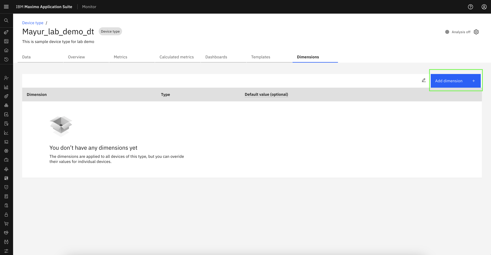
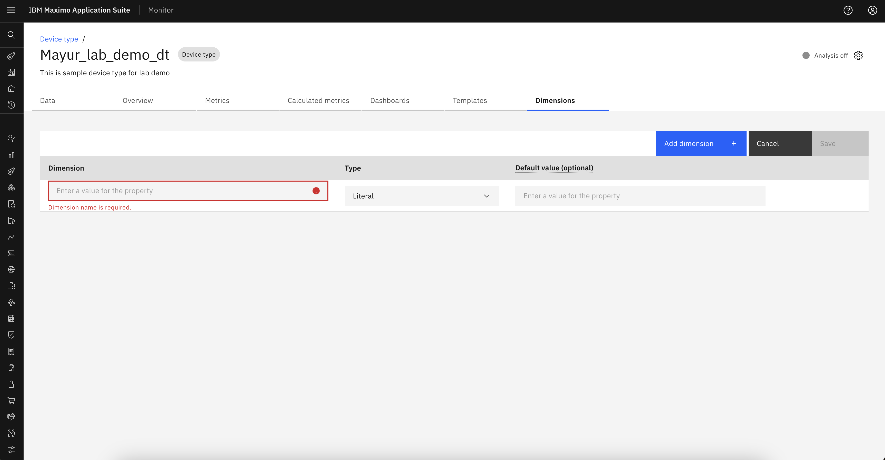
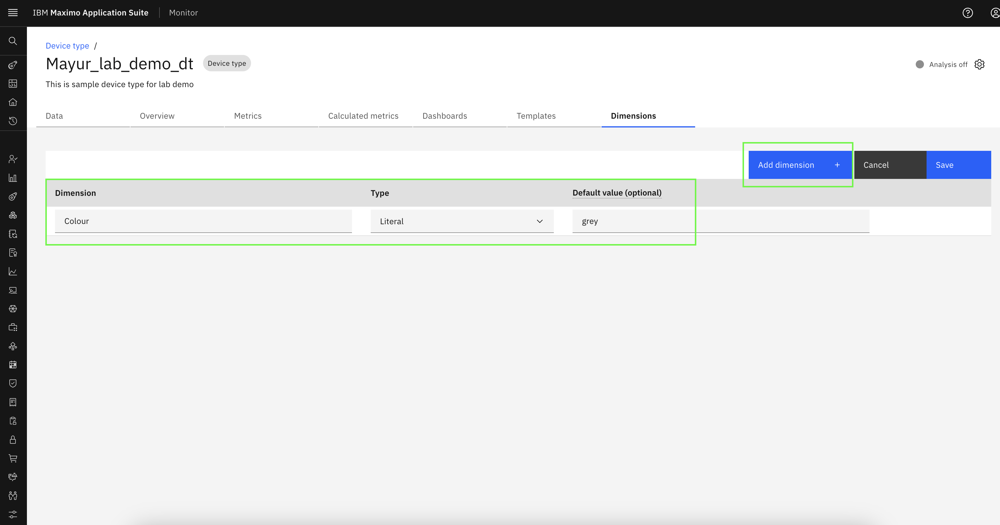
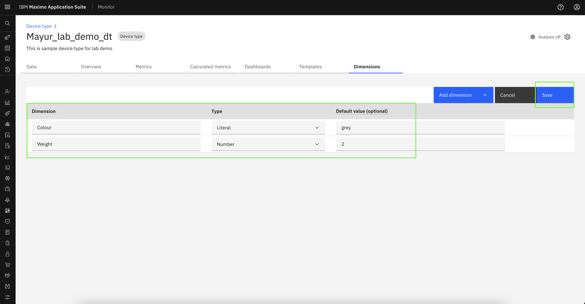
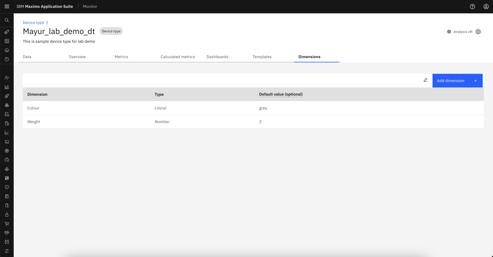
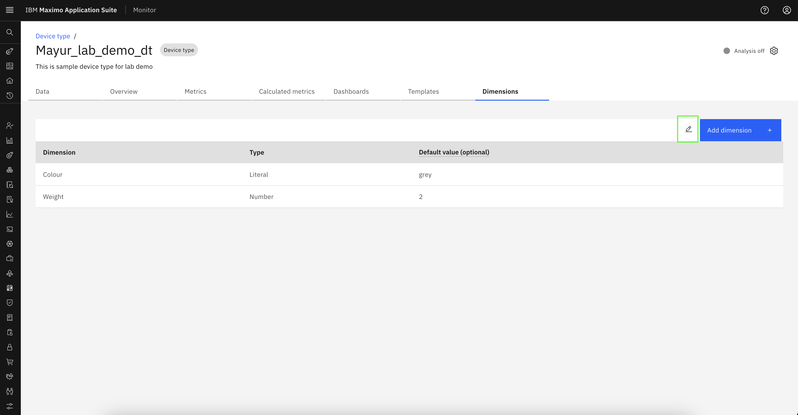
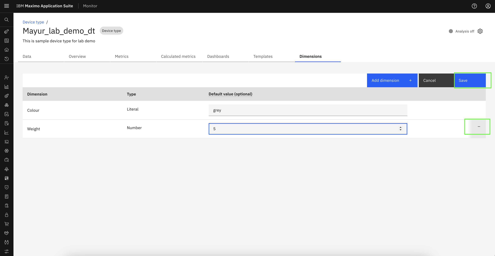
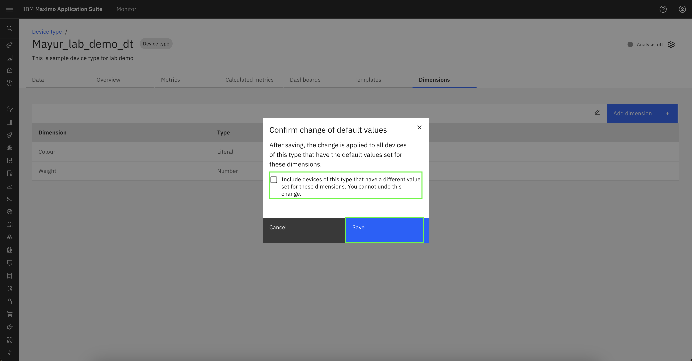

# 目标
在本练习中，您将学习如何在设备类型中添加/编辑维度。

---
*开始之前：*  
本练习要求您：

1. 完成[所有实验](prereqs.md)所需的前提条件
2. 完成前面的练习
 
---

## 添加维度

导航到所需设备类型中的维度选项卡。
  

点击 `添加维度` 以启动维度创建过程。
  

输入维度名称、类型和默认值。要添加另一个维度，再次点击 `添加维度` 并重复输入过程。
  

输入第二个维度的维度名称、类型和默认值。最后，点击 `保存` 以存储所选设备类型的维度数据。
  

维度数据保存成功。
  

## 编辑维度

点击编辑图标以修改现有维度数据。
  

点击 `-` 删除整个事件行或修改现有值。
  

点击 `保存` 以应用并更新设备类型的维度数据。
!!! note "注意"
     如果您希望覆盖此设备类型的所有设备的维度值，请选中标记为 `包括此类型中为这些维度设置了不同值的设备。您无法撤消此更改` 的复选框。
  

---
恭喜您已成功在设备类型中添加和修改维度。 