# 目标
在本练习中，您将学习如何在设备类型中添加/编辑度量。

---
*开始之前：*  
本练习要求您：

1. 完成[所有实验](prereqs.md)所需的前提条件
2. 完成前面的练习
 
---

## 添加度量

导航到所需设备类型中的“度量值”选项卡，然后点击 `添加度量`。
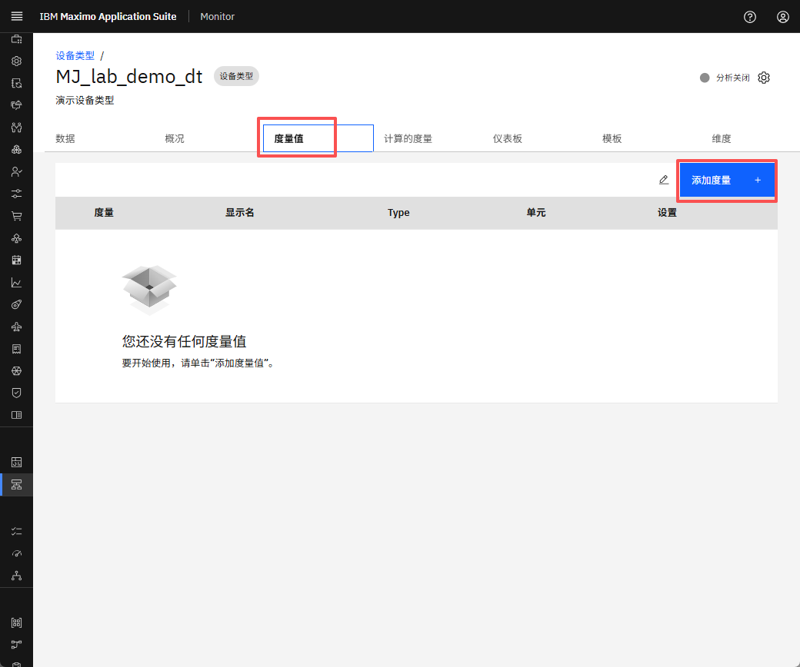  

在弹出窗口中点击 `添加度量` 以启动度量创建过程。
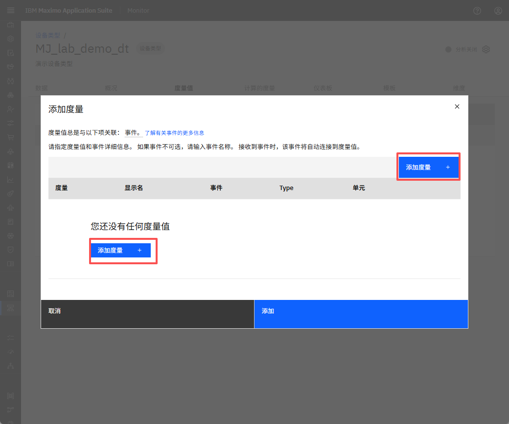  

在弹出窗口中，输入度量名称、显示名称、事件名称、类型和单位。
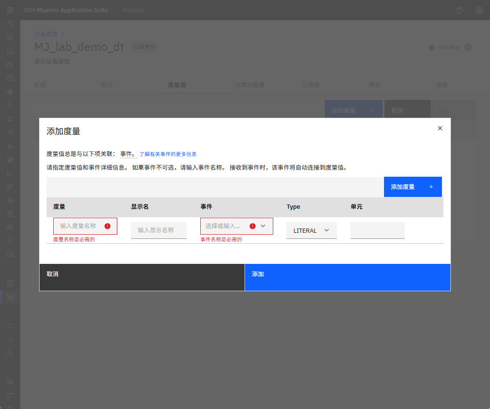  

要添加另一个度量，再次点击 `添加度量` 并重复输入过程。
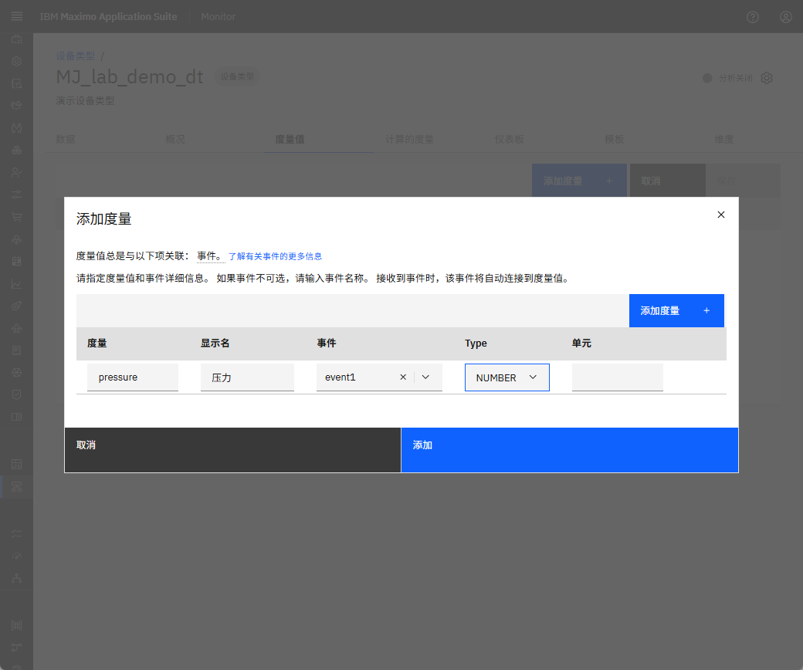  

输入第二个度量的度量名称、显示名称、事件名称、类型和单位数据。点击 `添加` 将所有度量包含在表中。
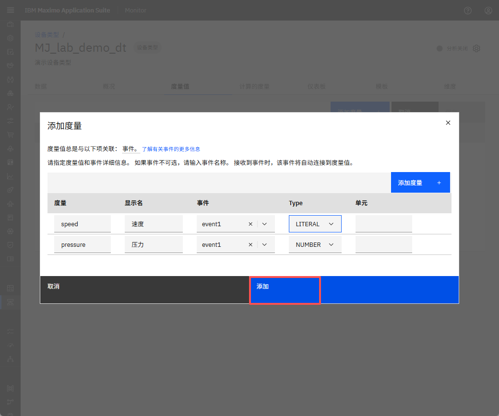  

添加后，度量数据将在表中可见。
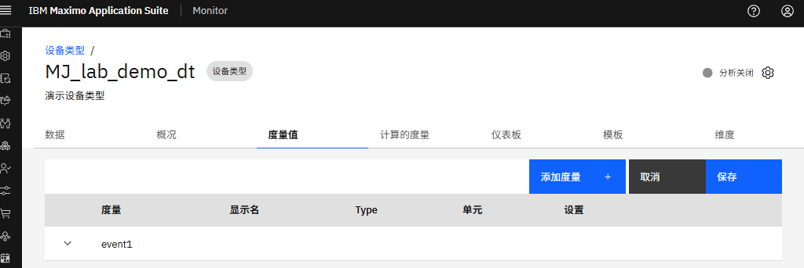  

点击箭头图标预览数据。最后，点击 `保存` 以存储所选设备类型的度量数据。
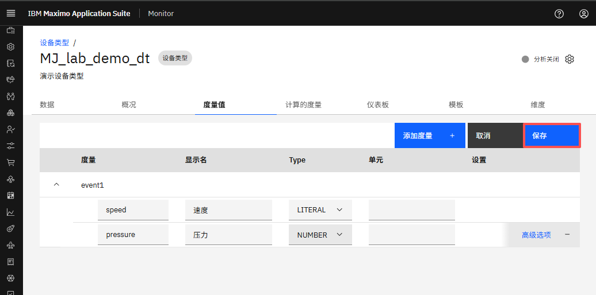  

## 添加第二个事件

再次点击 `添加度量` 以包含其他事件。
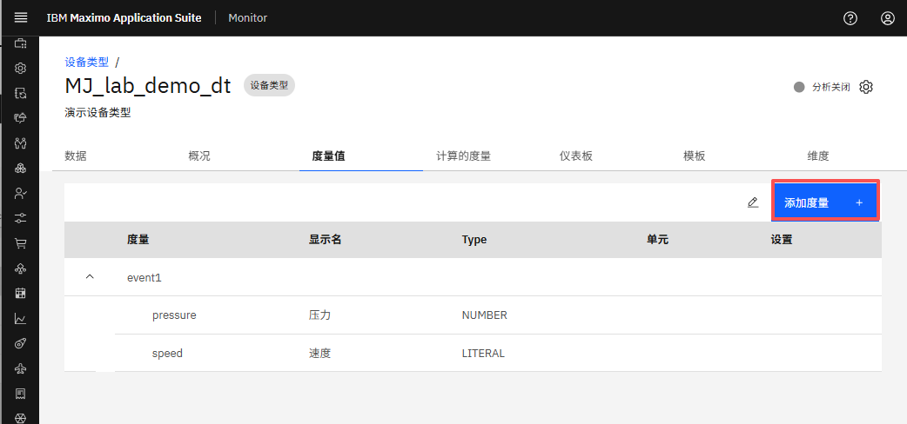  

在弹出窗口中，将显示设备类型先前保存的度量数据。点击弹出窗口中的 `添加度量` 以在表中插入新的空白行。
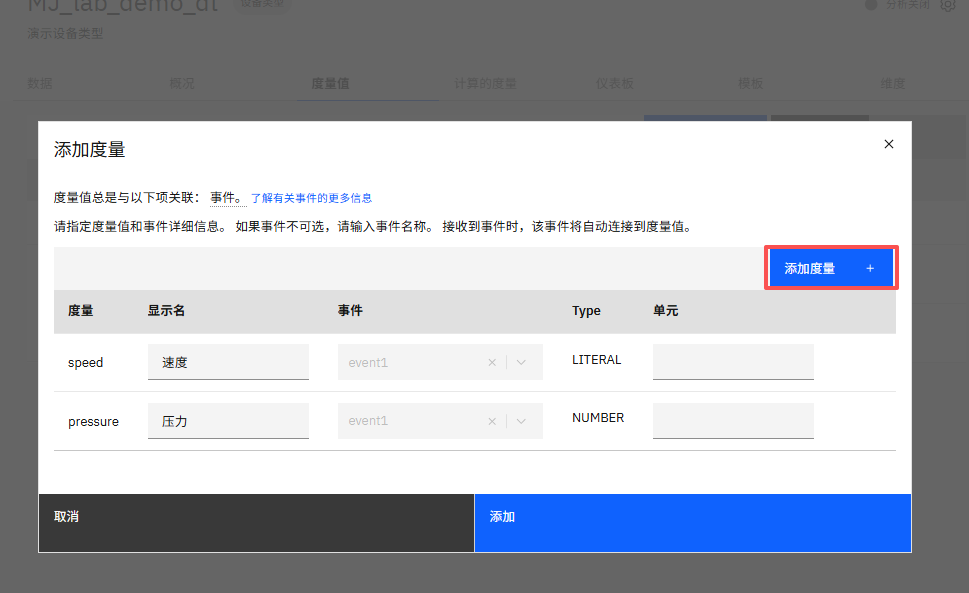  

输入新度量的度量名称、显示名称、事件名称、类型和单位。输入所有必需的度量后，点击 `添加` 将它们包含在表中。
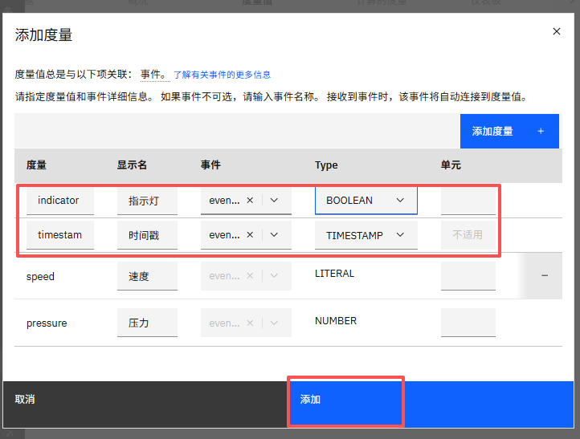  

最后，点击 `保存` 以存储设备类型的更新度量数据。
!!! note "注意"
     要将度量指定为传入事件的默认时间戳，请选中 `将此用作默认时间戳` 复选框。此选项仅适用于 TIMESTAMP 类型的度量。
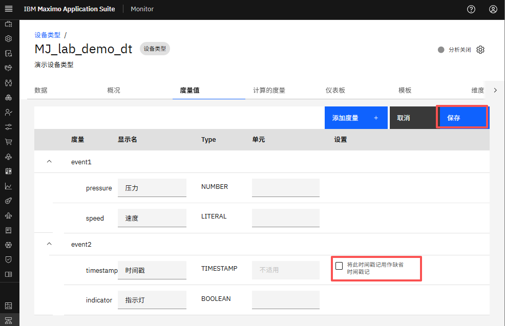  

## 编辑度量

点击编辑图标以修改现有度量数据。
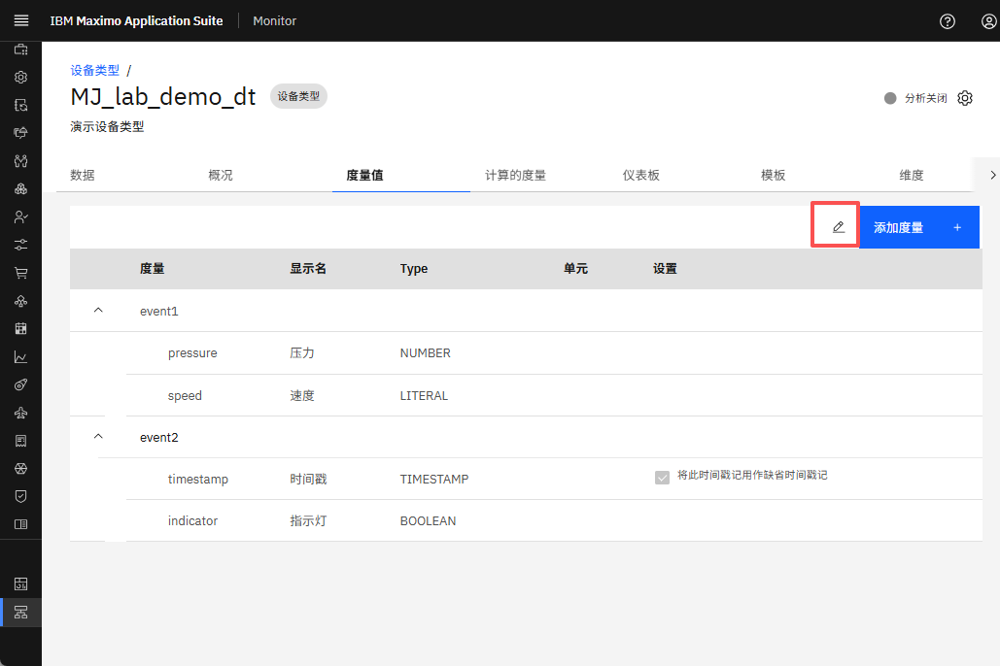  

点击 `-` 删除整个事件行。
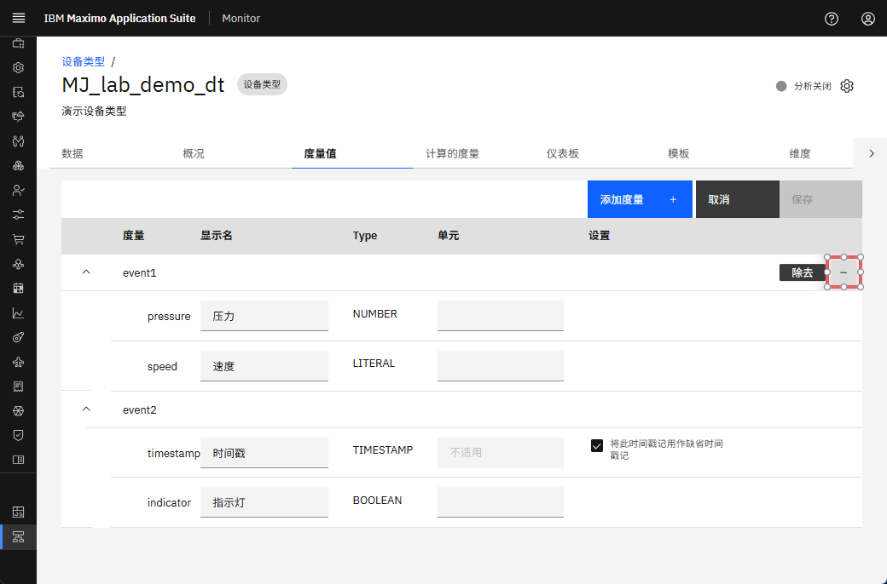  

要删除事件中的特定度量，请点击该度量旁边的 `-` 图标。点击 `高级选项` 打开弹出窗口以配置 JSON 路径和键。
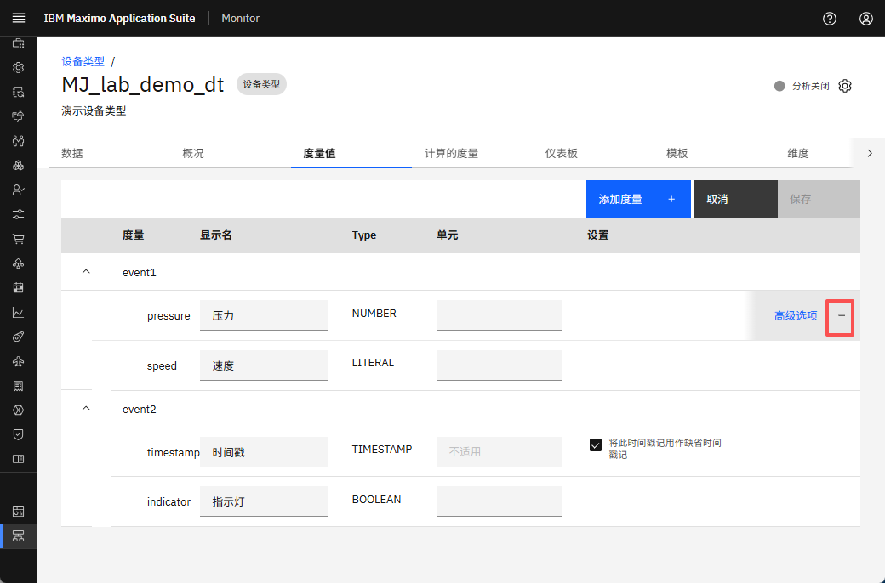  

根据需要输入 JSON 路径和键。请参考提供的示例以获取指导（此步骤是可选的）。
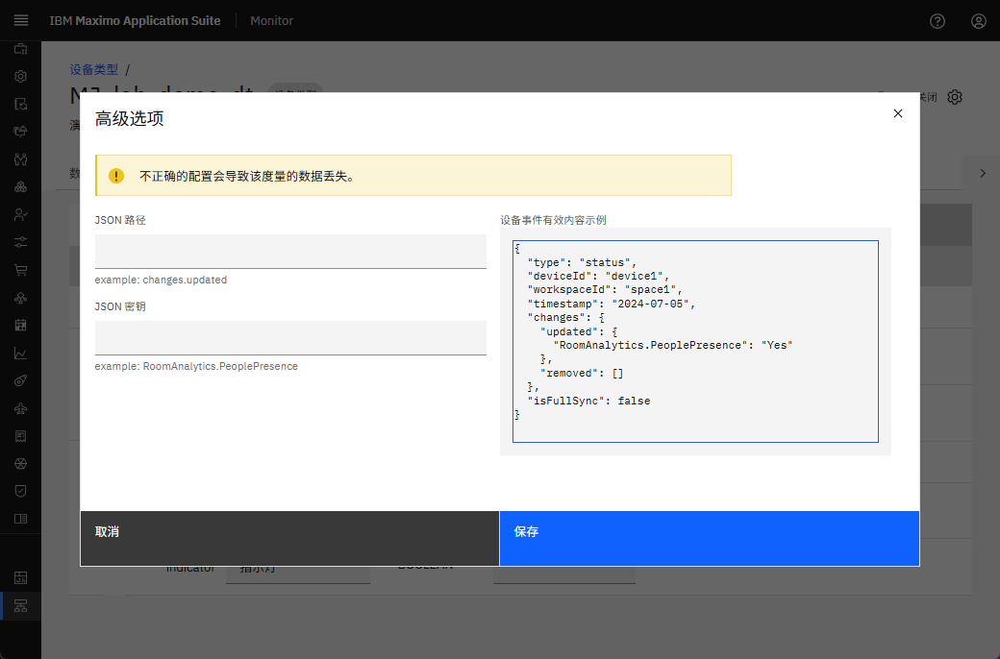  

点击 `保存` 以应用并更新设备类型的度量数据。
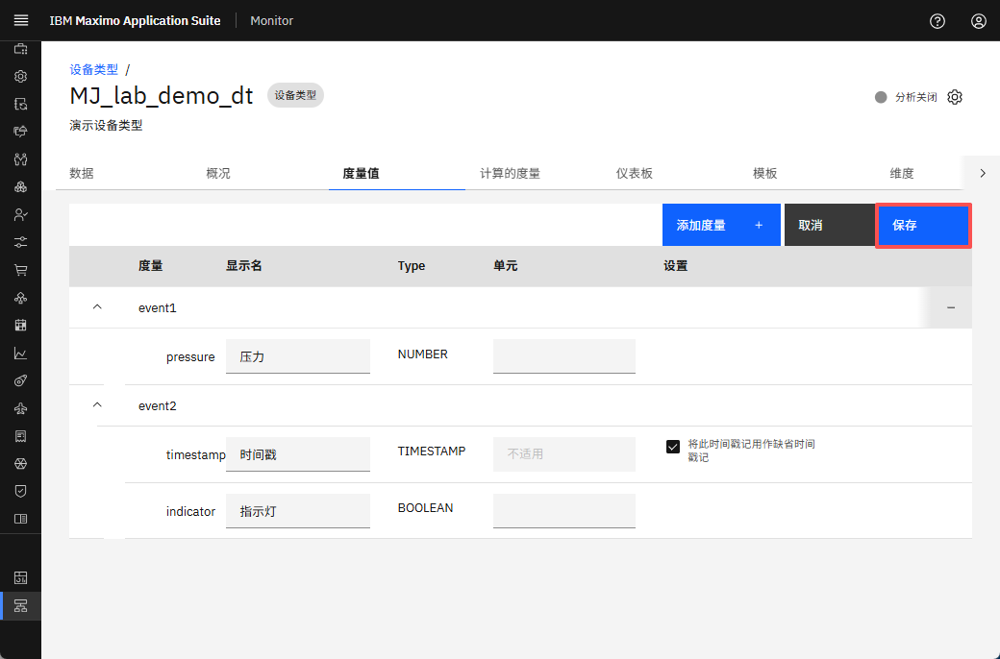  

---
恭喜您已成功在设备类型中添加和修改度量。 