# 目标
在本练习中，您将学习如何归档和恢复/删除设备类型。

---
*开始之前：*  
本练习要求您：

1. 完成[所有实验](prereqs.md)所需的前提条件
2. 完成前面的练习
 
---
## 取消分配设备
!!! note "注意"
     只有当此设备类型的设备未分配给任何资产或位置时，我们才能归档设备类型。

要从资产或位置取消分配设备，请搜索相关设备类型并选择先前分配给资产或位置的设备。 
导航到设备概览页面。在"关系"部分下，如果设备已分配给资产，请点击每行对应的删除图标以删除分配。
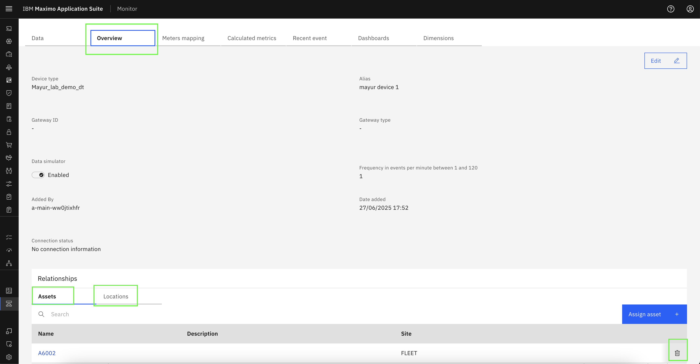  

点击 `确认` 以完成从资产取消分配设备。
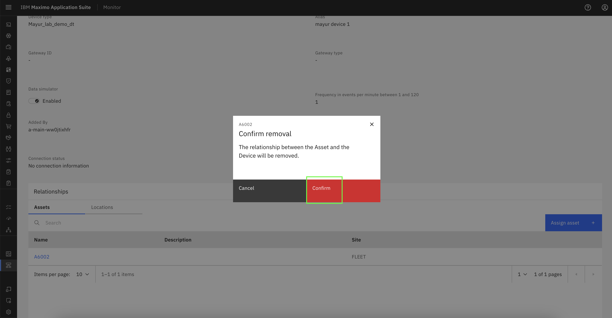  

在"概览"选项卡下的"关系 → 位置"部分重复相同的步骤，以从位置取消分配设备。

## 归档设备类型

要归档设备类型，请从左侧面板导航到设置 → 设备类型并搜索相关设备类型。 
点击设备类型名称旁边的三点菜单，然后选择 `归档` 以继续归档设备类型。
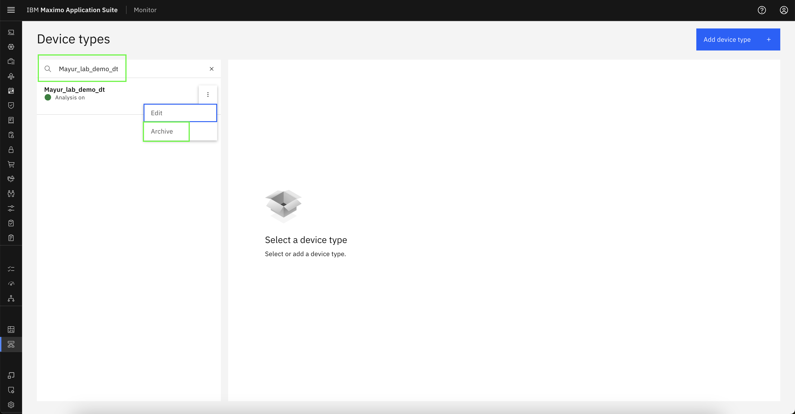  

在确认弹出窗口中，点击"归档"以归档设备类型。
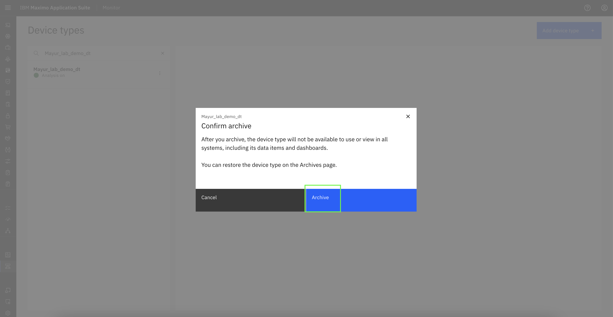  

## 查看已归档的设备类型

要查看已归档的设备类型，请从左侧面板导航到设置 → 归档。
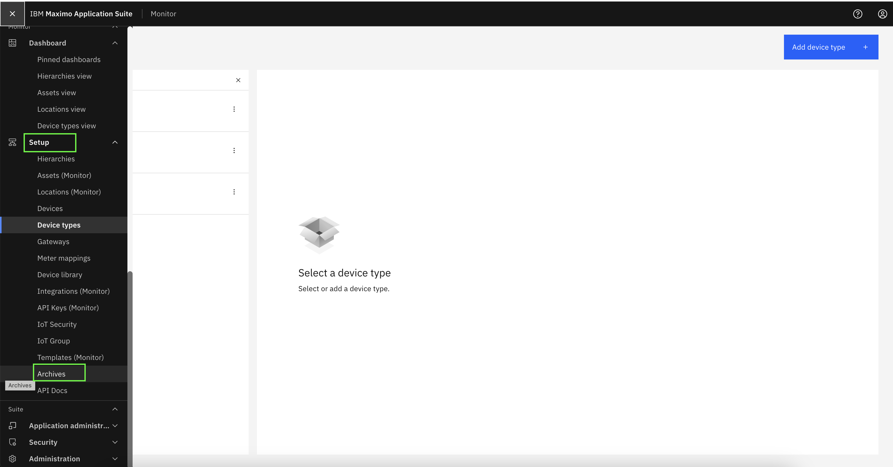  

您现在应该能够查看已归档的设备类型。如果未显示，请尝试使用搜索栏按名称搜索。
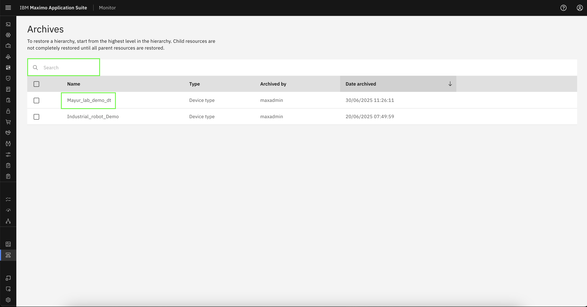  

对于每个表行，您将看到 `恢复` 和 `删除` 选项。您可以按照下面概述的步骤之一选择任一操作。
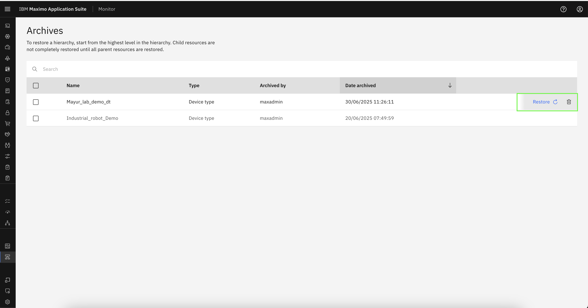  

## 恢复设备类型（可选）

点击已归档设备类型旁边的 `恢复` 以恢复它。
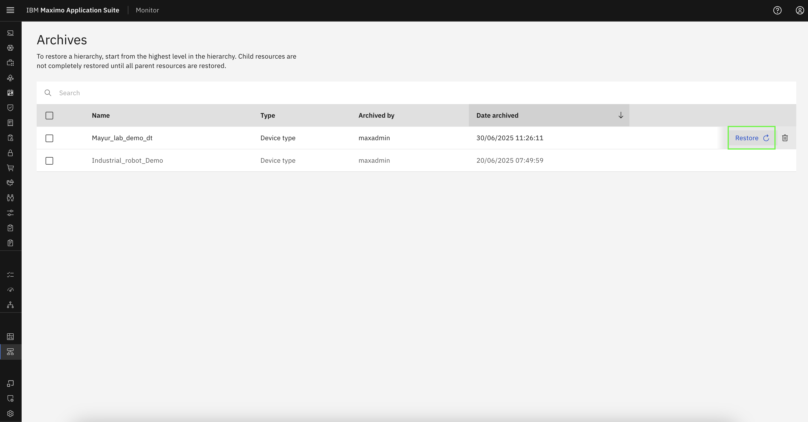  

在确认弹出窗口中，点击 `恢复` 以完成设备类型恢复过程。
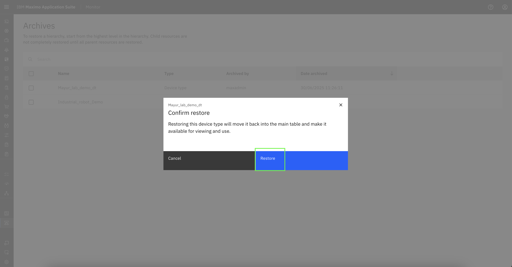  

## 删除设备类型（可选）

!!! note "注意"
     请注意，设备类型必须在删除之前归档。

点击已归档设备类型旁边的删除图标以删除它。
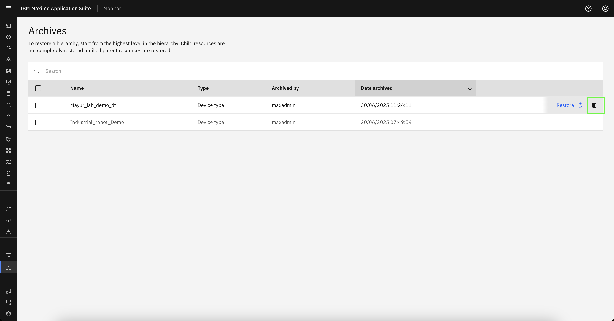  

在确认弹出窗口中，输入设备类型名称并点击 `确认` 以从 Monitor 中删除此设备类型。
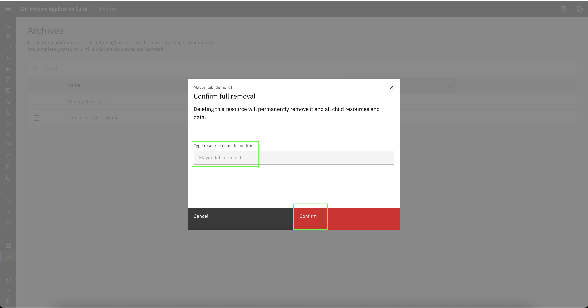  

---
恭喜您已成功归档和恢复/删除设备类型。 