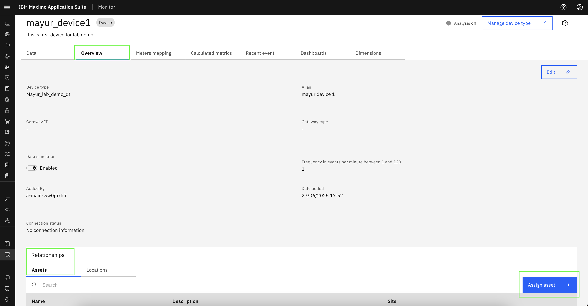
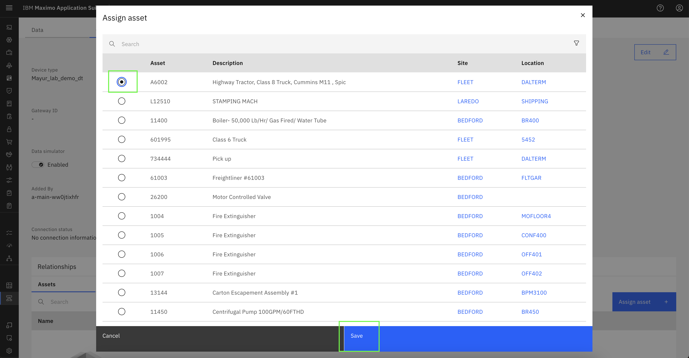
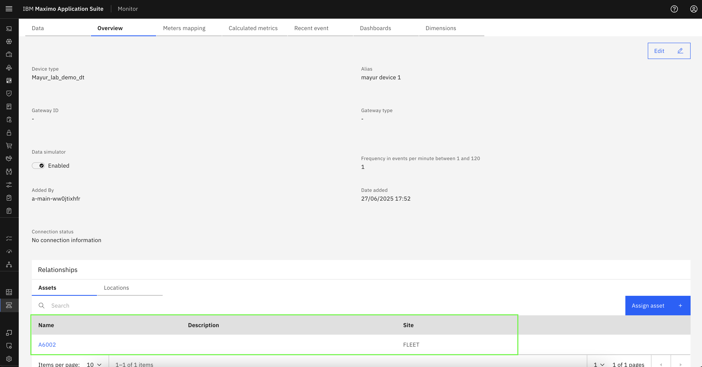
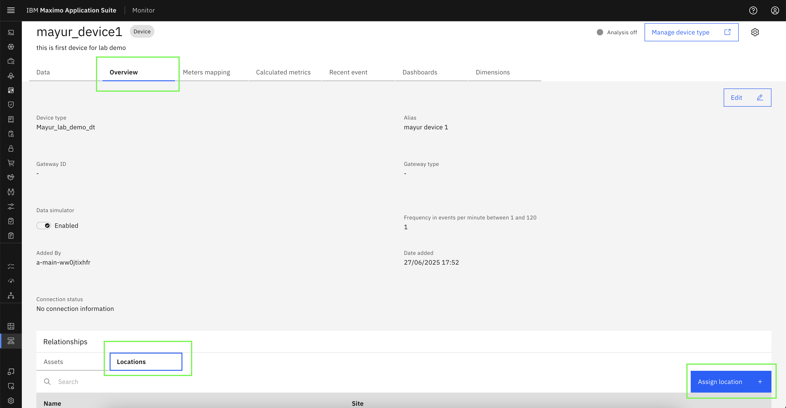
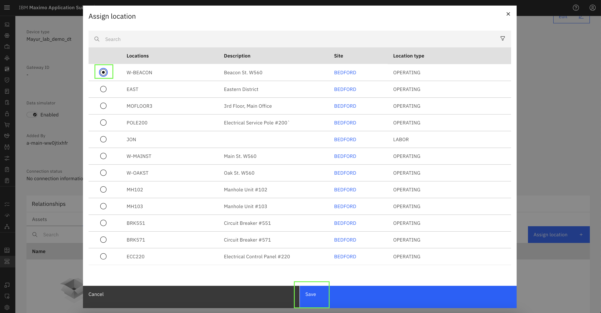
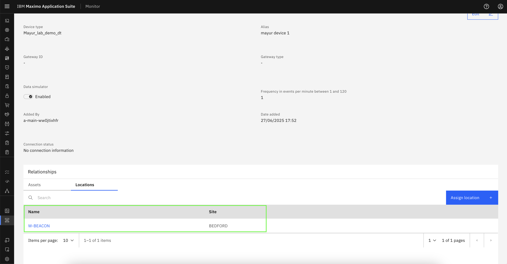
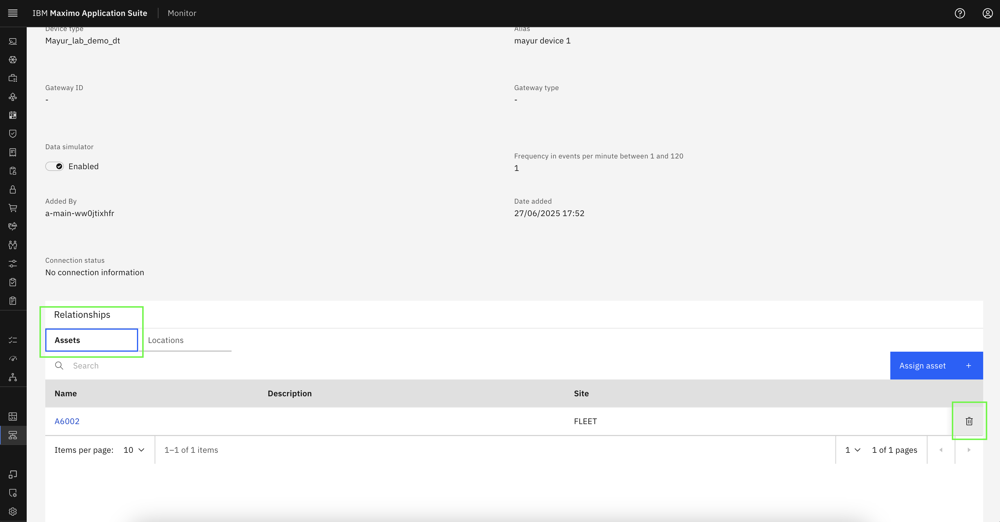
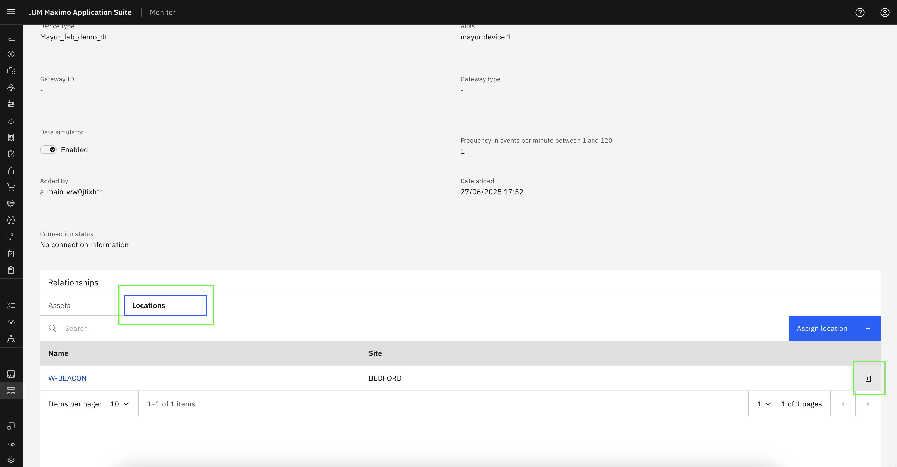

# 目标
在本练习中，您将学习如何将设备分配给资产/位置。

---
*开始之前：*  
本练习要求您：

1. 完成[所有实验](prereqs.md)所需的前提条件
2. 完成前面的练习
 
---

## 将设备分配给资产

导航到所需设备的概览选项卡。在资产关系部分，点击 `分配资产` 按钮以将设备链接到资产。
  

选择要将设备分配到的资产，然后点击 `保存` 按钮以确认分配。
  

设备已成功分配给所选资产。
  

## 将设备分配给位置

导航到所需设备的概览选项卡。在位置关系部分，点击 `分配位置` 按钮以将设备链接到位置。
  

选择要将设备分配到的位置，然后点击 `保存` 按钮以确认分配。
  

设备已成功分配给所选位置。
  

## 从资产取消分配设备

要从资产中删除已分配的设备，请导航到资产关系部分，然后点击相应行旁边的删除图标。
  

## 从位置取消分配设备

要从位置中删除已分配的设备，请导航到位置关系部分，然后点击相应行旁边的删除图标。
  

---
恭喜您已成功将设备分配给资产/位置并从资产/位置中删除设备。 