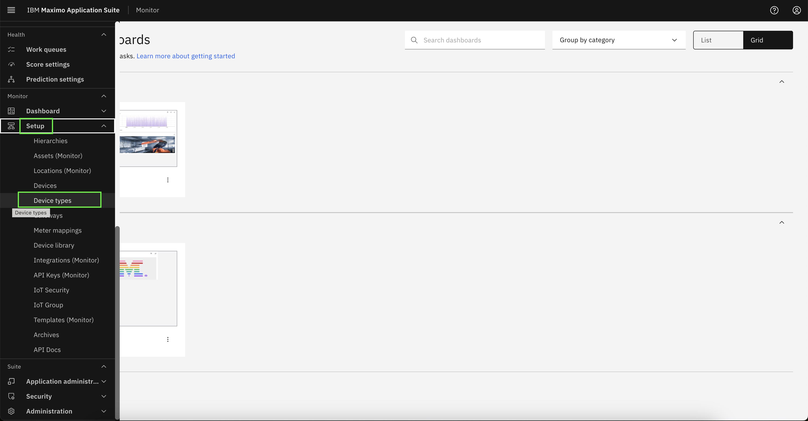
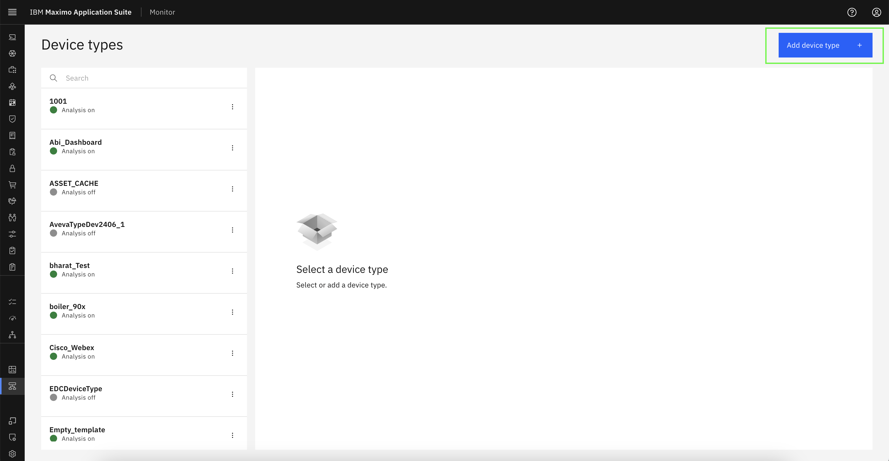
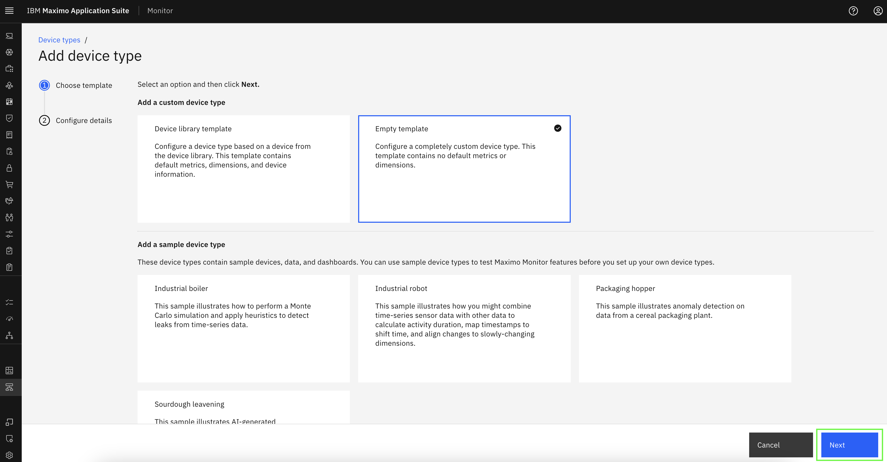
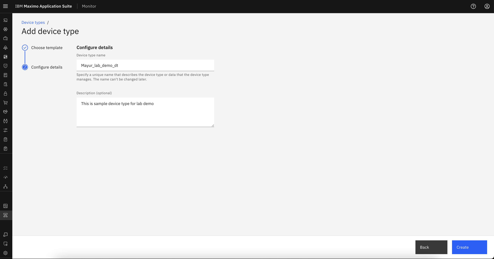
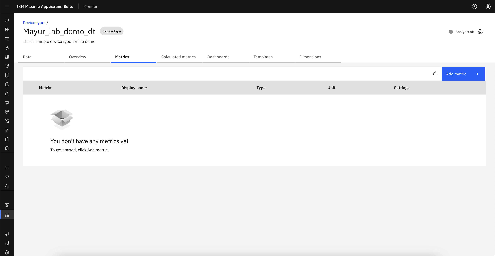
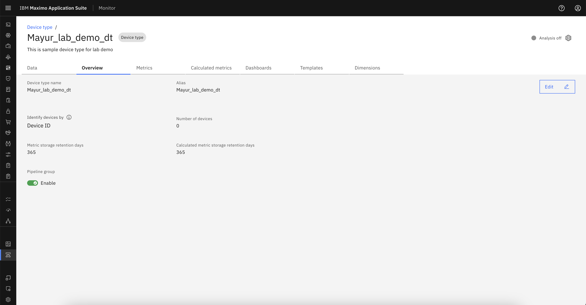
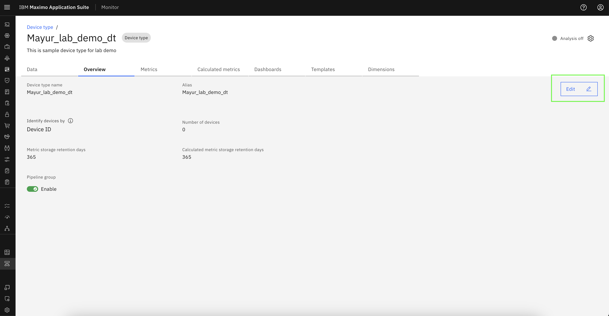
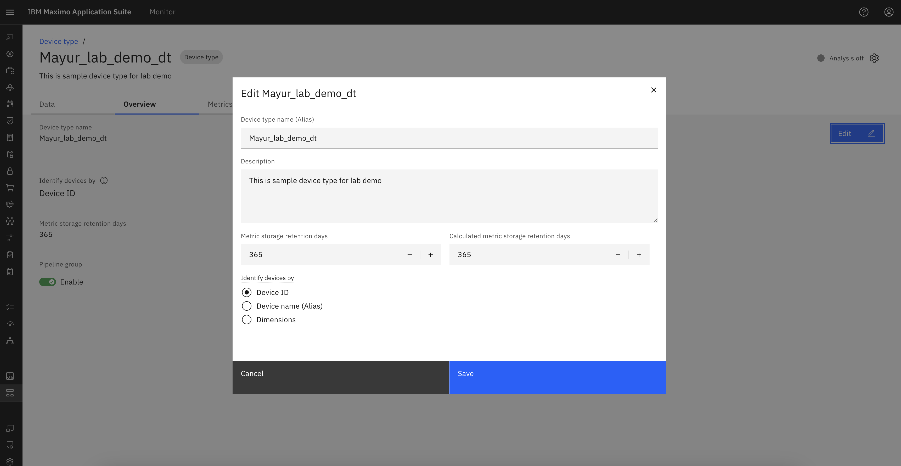

# 目标
在本练习中，您将学习如何：

* 在 MAS Monitor 中创建设备类型。

---
*开始之前：*  
本练习要求您：

1. 完成[所有实验](prereqs.md)所需的前提条件

---

## 创建设备类型

要创建设备类型，请登录 IBM MAS Monitor 并导航到设置 -> 设备类型。

  

点击屏幕右上角的 `添加设备类型` 按钮。

  

自定义设备类型和示例设备类型下有不同的模板可用。然后，选择一个选项并点击 `下一步`。

  

提供基本配置详细信息，包括设备类型名称、设备类型描述。然后，点击 `创建`。
!!! attention "注意"
     指定一个描述设备类型或设备类型管理的数据的唯一名称。该名称以后无法更改。

  

这将创建设备类型并重定向到指标页面。

  

 

## 查看概览选项卡

此选项卡提供设备类型的详细描述。我们可以看到管道组状态，对于新创建的设备类型，该状态默认启用。

  

## 编辑设备类型数据

通过编辑选项，我们可以编辑别名、使用不同类别标识设备以及设备类型中可用的指标和计算指标的保留天数。但是，一旦创建设备类型名称，我们就无法编辑它。

点击 `编辑` 按钮。
  

在编辑弹出窗口中更新必要的字段，然后点击 `保存` 以应用更改。
  

---

恭喜您已成功设置设备类型，从概览选项卡查看和修改了设备类型数据。 
