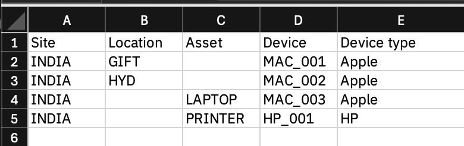
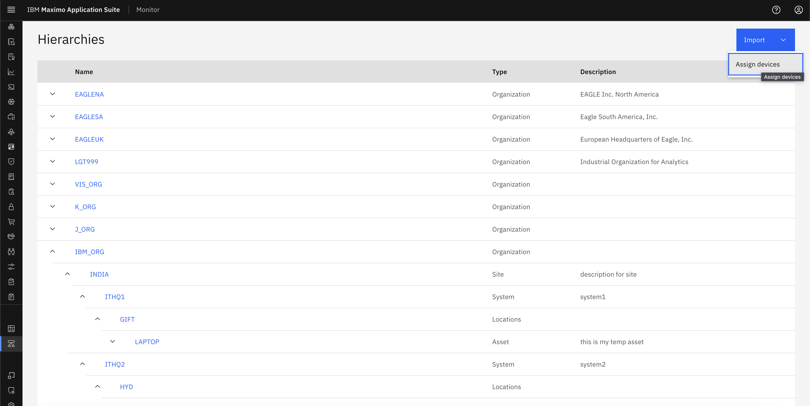
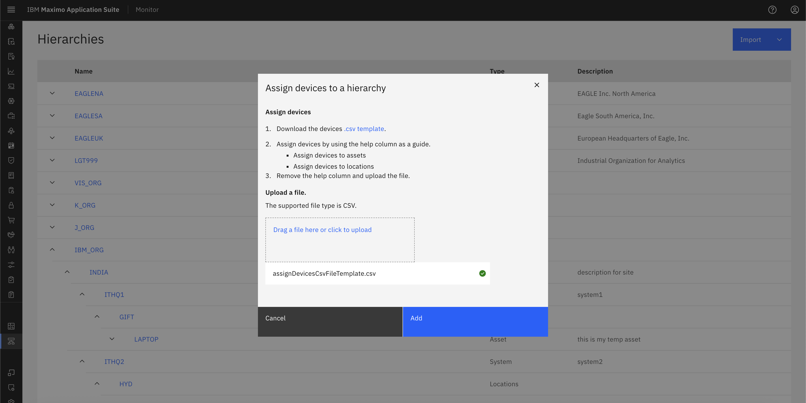

# 目标
在本练习中，您将学习如何：

* 将设备分配给层次结构

---
*开始之前：*  
本练习要求您已：

1. 完成[所有实验](prereqs.md)所需的前提条件
2. 完成之前的练习

---

!!! info
    使用 CSV 模板文件将 IT 设备分配给资产并导入。设备始终按其设备类型分组。

## 
管理运输网络的功能公司的设备分配 CSV 文件如下所示：
&nbsp;&nbsp;

### 编辑分配设备 CSV 以匹配您的层次结构
1. 将 [.CSV 模板](assignDevicesCsvFileTemplate.csv)下载到您的本地系统。
2. 在您喜欢的文本编辑器中打开文件
3. 查找/替换 -MLL 为 -<您的首字母缩写\>
4. 保存文件

### 分配设备

1. 打开 Monitor 设置页面
2. 点击导入按钮，然后选择"分配设备"
&nbsp;&nbsp;
3. 使用上一节中的 CSV 文件，将 CSV 拖到蓝色框中或点击从文件系统中选择 CSV 文件
4. 系统将验证您的 CSV 文件
5. 点击添加
&nbsp;&nbsp;

6. 您可以在层次结构中看到设备

---

!!! note
    您还可以通过另一种方式分配设备，请参阅[分配设备](../../monitor_device_devicetype_setup_9.1/device_relation)。

