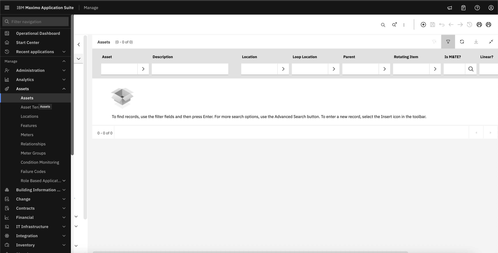
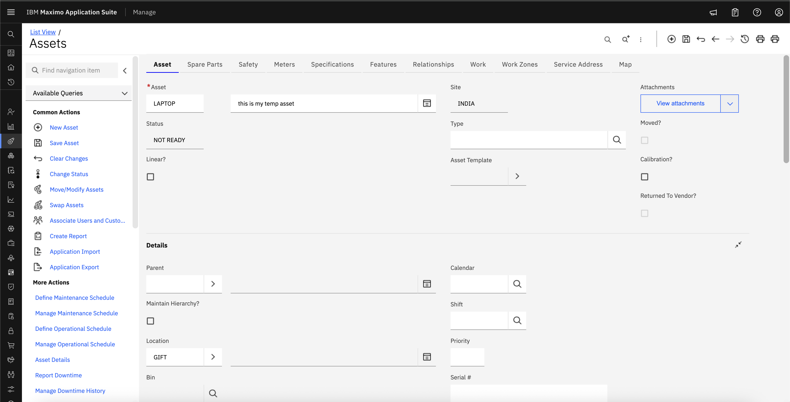

# 目标
在本练习中，您将学习如何：

* 创建资产

---
*开始之前：*  
本练习要求您已：

1. 完成[所有实验](prereqs.md)所需的前提条件
2. 完成之前的练习

---

!!! info
    资产是您维护和修理的资源，例如设备、机械或技术。要查看、添加或编辑资产信息，请使用管理资产工作中心中的资产页面。

1. 从左侧菜单栏的资产下导航到资产。
&nbsp;&nbsp;

2. 设置资产名称、描述、父级和位置并保存
&nbsp;&nbsp;

---