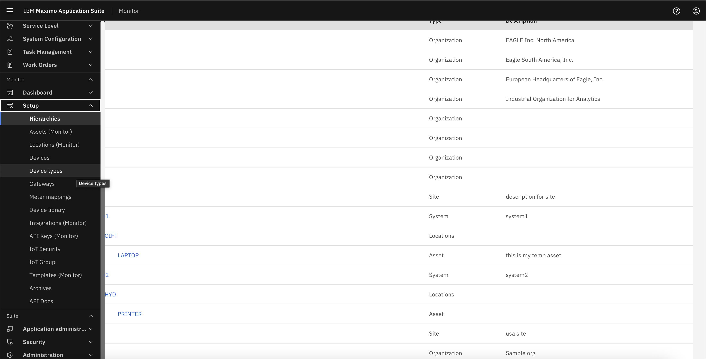
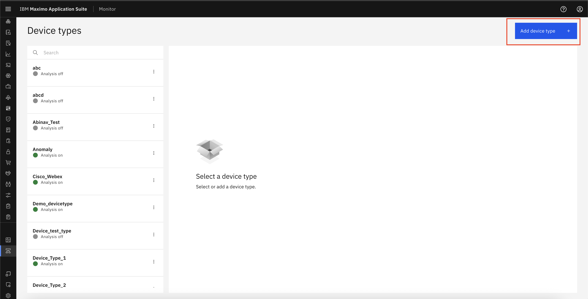
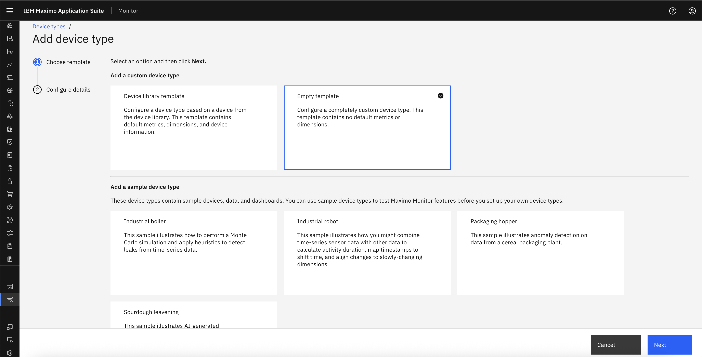
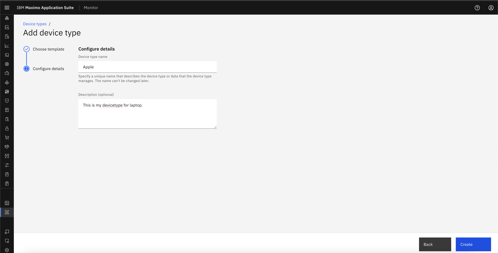
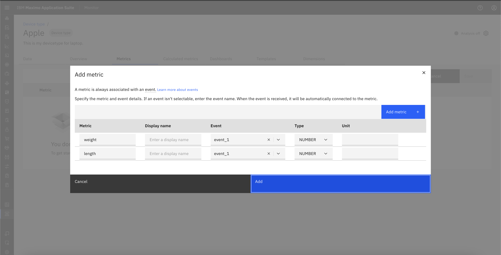
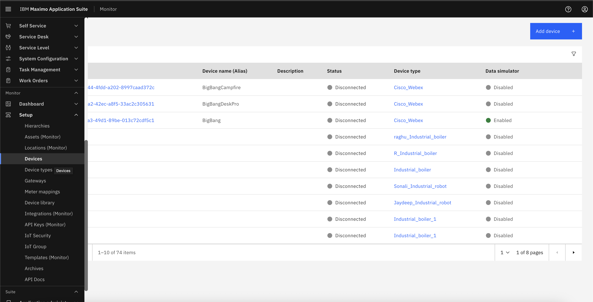
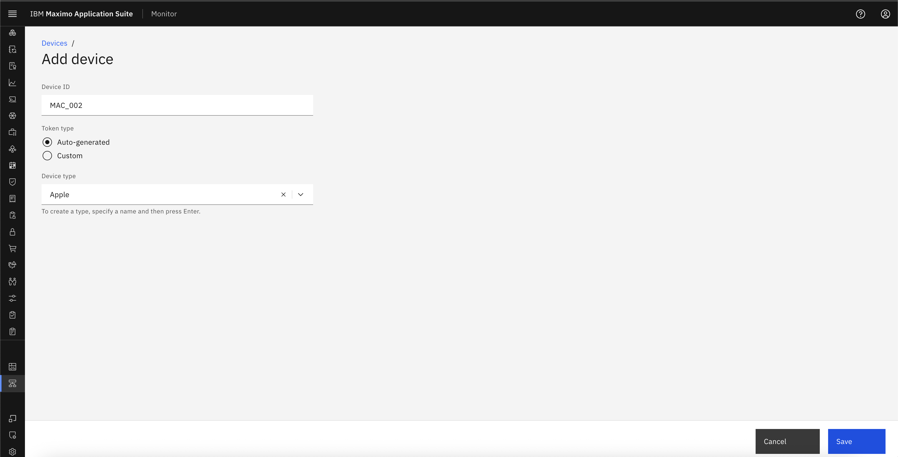

# 目标
在本练习中，您将学习如何：

* 创建设备类型和设备

---
*开始之前：*  
本练习要求您已：

1. 完成[所有实验](prereqs.md)所需的前提条件
2. 完成之前的练习

---

!!! info
    设备类型可能代表设备的物理类型，或代表设备用于的资产或实体的类型。

1. 在 Monitor 部分下导航到设置并点击设备类型。
&nbsp;&nbsp;

2. 选择添加设备类型。
&nbsp;&nbsp;

3. 选择任意模板
&nbsp;&nbsp;

4. 配置设备类型的详细信息
&nbsp;&nbsp;

5. 添加一些指标。
&nbsp;&nbsp;

### 创建设备
1. 在 Monitor 部分下导航到设置并点击设备。
&nbsp;&nbsp;

2. 点击添加设备并填写设备详细信息并保存。
&nbsp;&nbsp;

!!! note
    要了解有关设备和设备类型创建的更多信息，请转到[创建设备类型](../../monitor_device_devicetype_setup_9.1)。

---