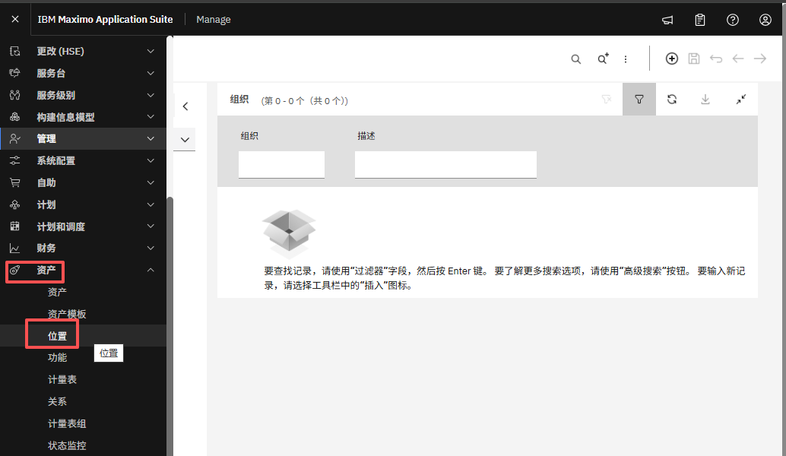
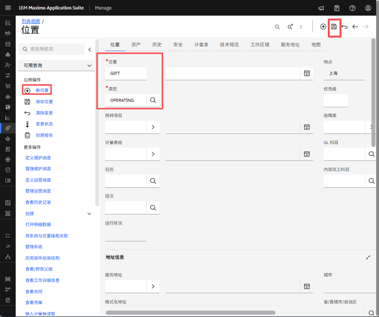
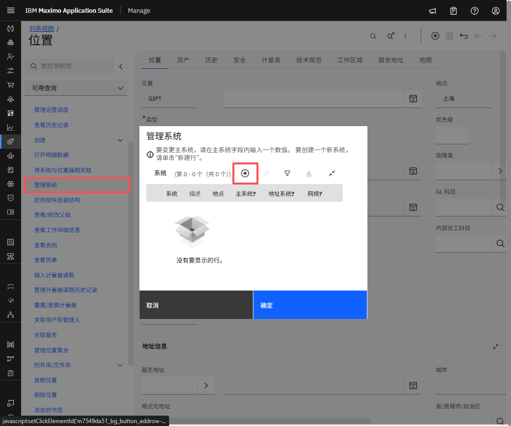
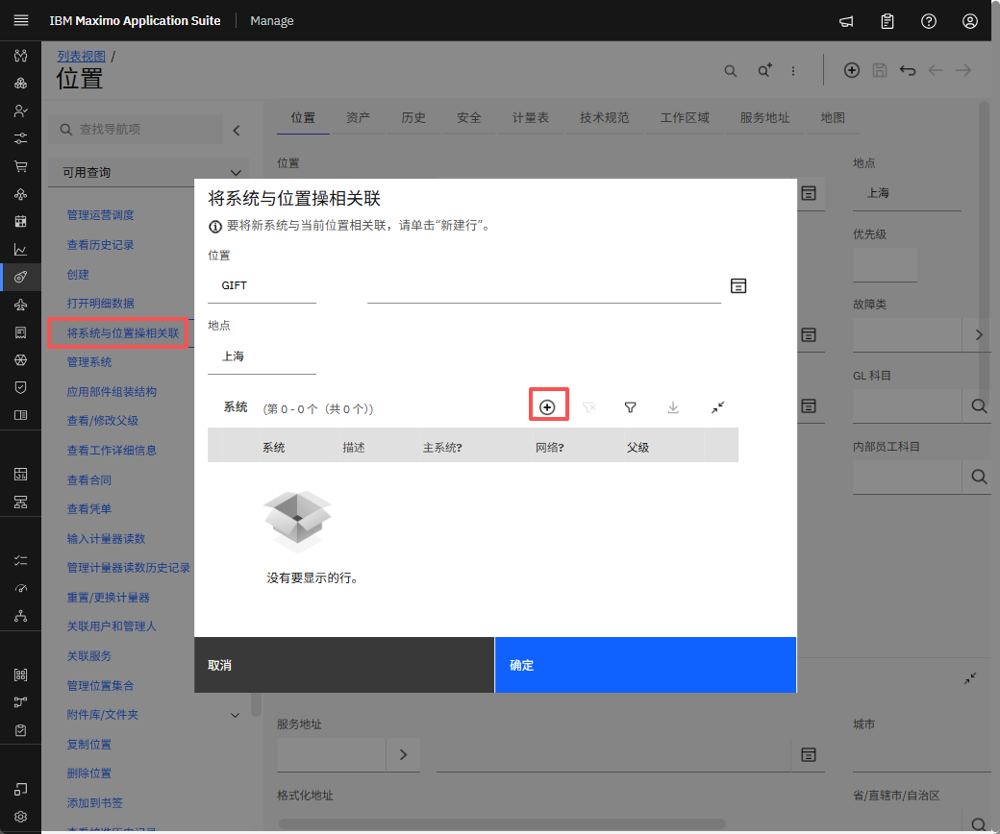
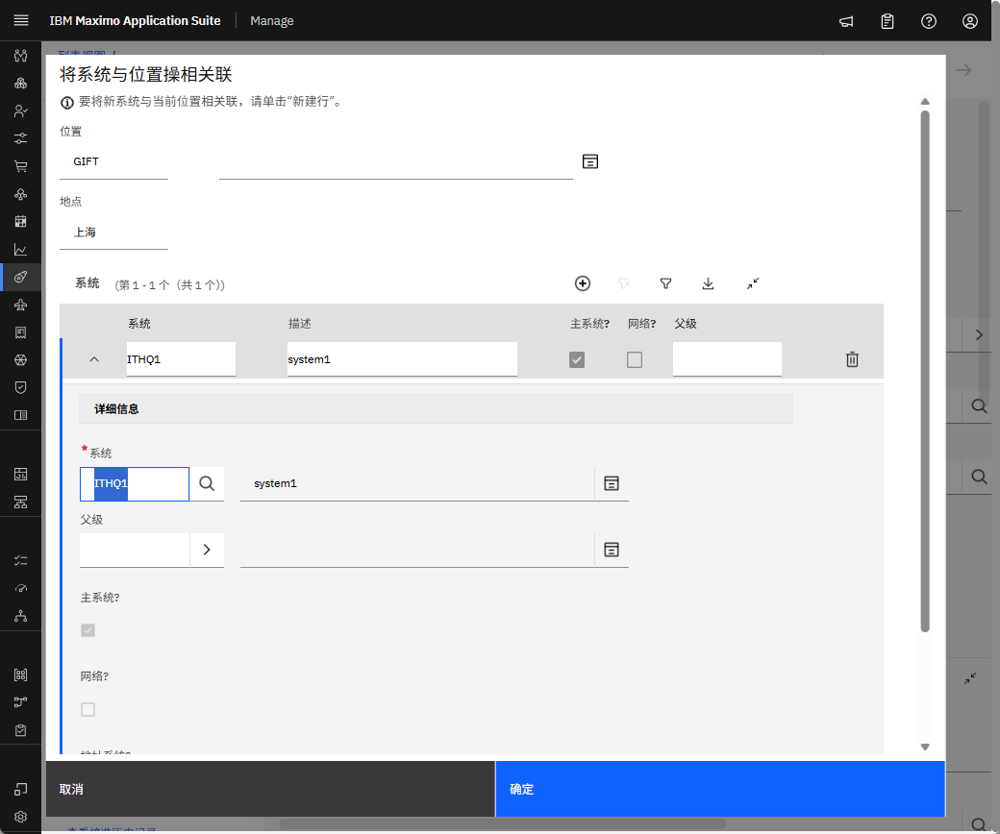

# 目标
在本练习中，您将学习如何：

* 创建位置、系统

---
*开始之前：*  
本练习要求您已：

1. 完成[所有实验](prereqs.md)所需的前提条件
2. 完成之前的练习

---

!!! info
    将位置分配给系统以确保其在我们的 Maximo Application Suite 中正确集成和可访问。

1. 在“资产”部分下导航到“位置”。
&nbsp;&nbsp;

2. 设置位置名称和类型,保存。
&nbsp;&nbsp;

3. 导航到“管理系统”，点击“加号图标”并创建新系统
&nbsp;&nbsp;
&nbsp;&nbsp;

4. 点击“将系统与位置关联”，您还可以根据需要定义父位置。
&nbsp;&nbsp;

---