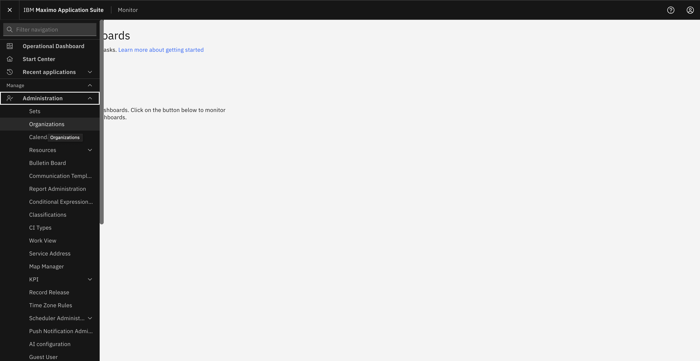
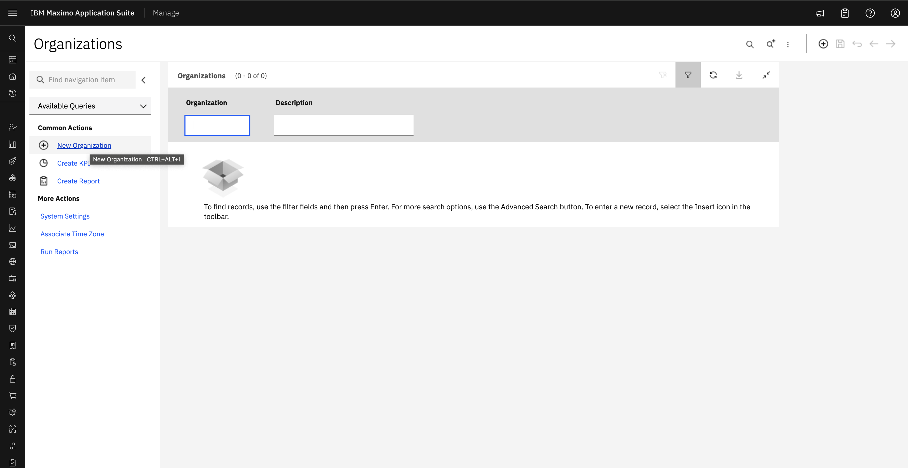
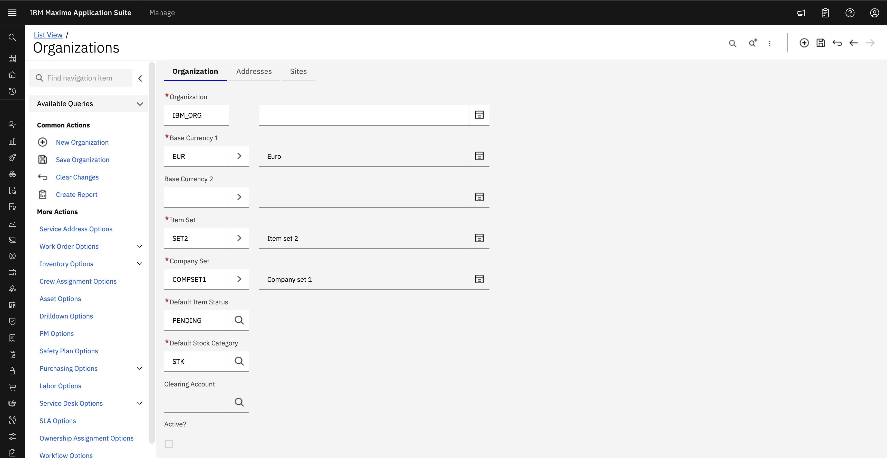
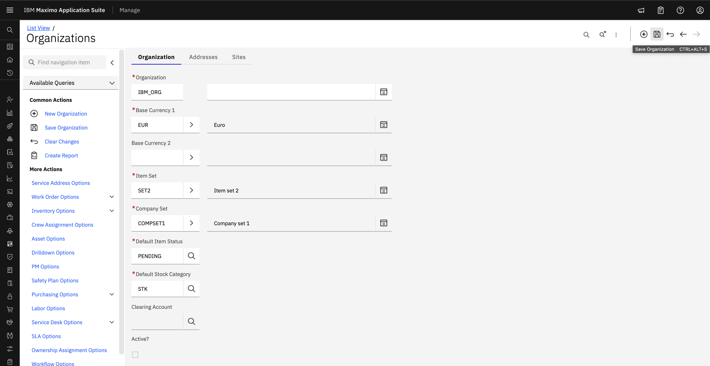

# 目标
在本练习中，您将学习如何：

* 创建组织

---
*开始之前：*  
本练习要求您已：

1. 完成[所有实验](prereqs.md)所需的前提条件
2. 完成之前的练习

---

!!! info
    组织是一个顶级实体，代表负责管理一组资产、位置和财务记录的业务或运营单位。

1. 在管理部分下导航到组织。点击新建组织。
&nbsp;&nbsp;
&nbsp;&nbsp;

2. 设置组织名称、组织描述。
&nbsp;&nbsp;

3. 为您的基础货币指定基础货币代码 1。
&nbsp;&nbsp;

4. 可选：指定基础货币 2。

5. 指定要与当前组织关联的项目集和公司集。Maximo 利用集的概念允许跨组织共享数据。
&nbsp;&nbsp;

6. 在默认项目状态字段中，选择您想要的状态。
&nbsp;&nbsp;

7. 点击保存组织。
&nbsp;&nbsp;

!!! note
    组织在创建后必须[激活](../activate_organization)。

---

恭喜您已成功创建组织。 