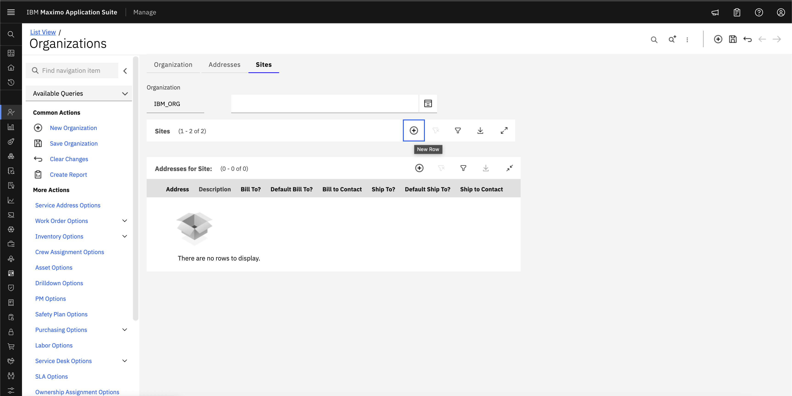
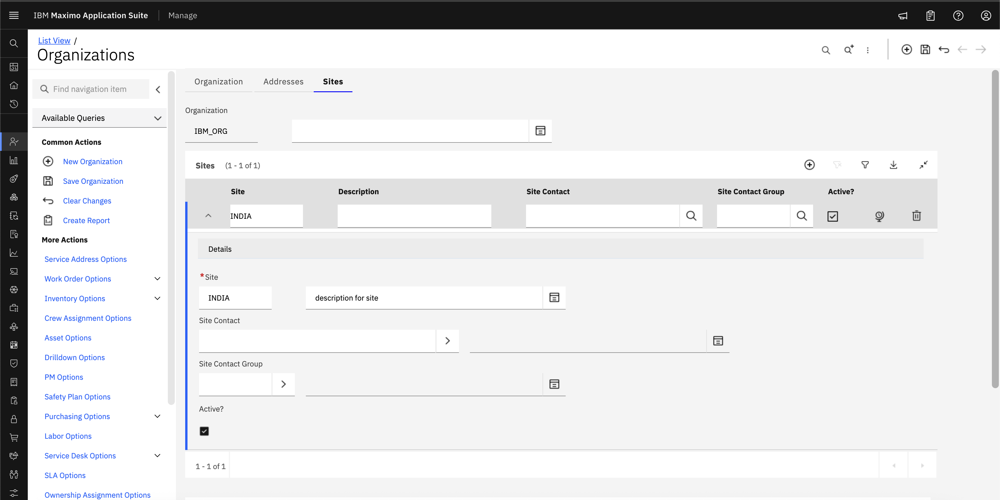
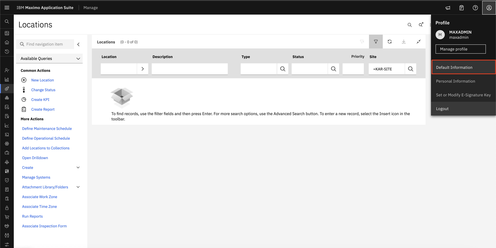
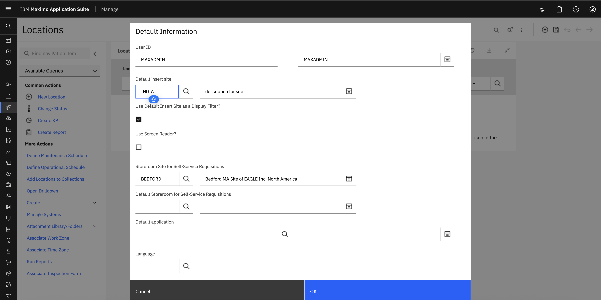
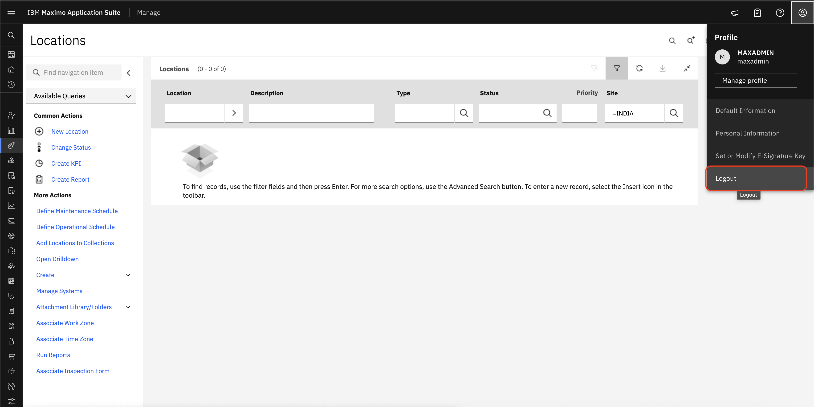

# 目标
在本练习中，您将学习如何：

* 创建站点

---
*开始之前：*  
本练习要求您已：

1. 完成[所有实验](prereqs.md)所需的前提条件
2. 完成之前的练习

---

!!! info
    在 Maximo 应用程序中，在组织下配置的每个站点都从组织级别继承信息和设置。每个组织可以有多个站点。

1. 在左侧菜单中，导航到组织并选择要添加站点的组织。
&nbsp;&nbsp;

2. 添加站点名称、描述并点击保存。
&nbsp;&nbsp;

3. 要设置默认插入站点，请转到配置文件部分并选择默认信息。
&nbsp;&nbsp;

4. 点击默认插入站点。
&nbsp;&nbsp;

5. 注销应用程序并重新登录以使更改生效。
&nbsp;&nbsp;

---