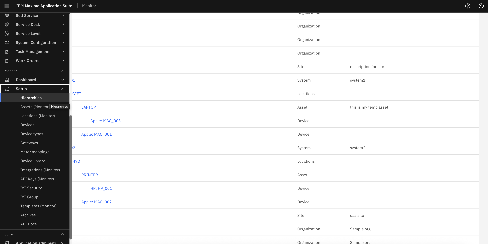
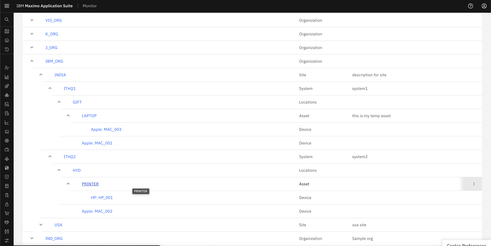

# 目标
在本练习中，您将学习如何：

* 探索层次结构视图

---
*开始之前：*  
本练习要求您已：

1. 完成[所有实验](prereqs.md)所需的前提条件
2. 完成之前的练习

---

1. 导航到 Monitor 的层次结构部分。
&nbsp;&nbsp;

2. 观察我们在 Manage 中创建的层次结构现在与 Monitor 同步，您可以从层次结构中探索 Monitor 的每个功能。
&nbsp;&nbsp;

!!! note
    现在有了这个层次结构，您可以探索 Monitor 的所有功能。

---

