# 目标
在本练习中，您将学习如何将 Json-over-http 设备添加到设备库。

---
*开始之前：*  
本练习要求您已：

1. 完成[所有实验](prereqs.md)所需的前提条件
2. 完成之前的练习

---

!!! note "MAS 9.1 中的新功能"
    您可以添加自定义设备，例如 PLC 或 OPC-UA 服务器，或支持 Modbus、BACnet 和 Json 协议的工业设备，这些设备在 Maximo Monitor 设备库中不可用。稍后，在设备页面上创建设备的任何人都可以使用相同的设备。</br>

## 1. 为 GET 方法添加设备

由于 Json-over-http 非常可定制，您需要通过以给定格式上传 CSV 文件将新设备添加到设备库，而不是使用设备库中的预配置设备。</br>

- 导航到设备库页面：</br>
</br>

- 可以使用 CSV 文件格式的设备设置添加 Modbus 设备。</br>
点击 `Add device to library` 并选择 `Import device settings` 选项：</br>
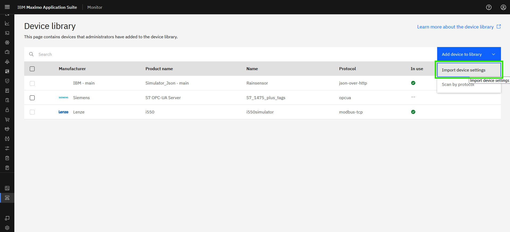</br>

- 选择协议为 `JSON Over HTTP`</br>
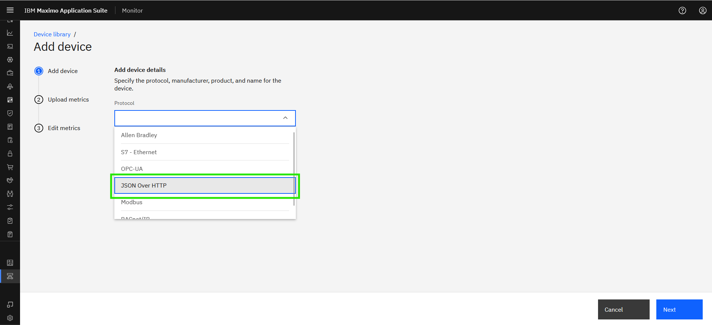</br>

- 输入设备详细信息并点击 `Next`：</br>
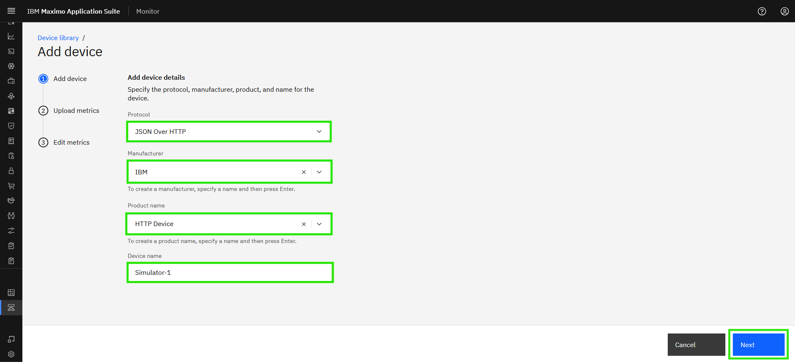</br>

!!! tip
    * 如果在选项中找不到制造商，可以添加新制造商。
    * 如果其他人在同一 Maximo Application Suite 环境中遵循本实验，设备名称中的 XX 应该是您的首字母缩写。

- 下载 `example.xlsx file`</br>
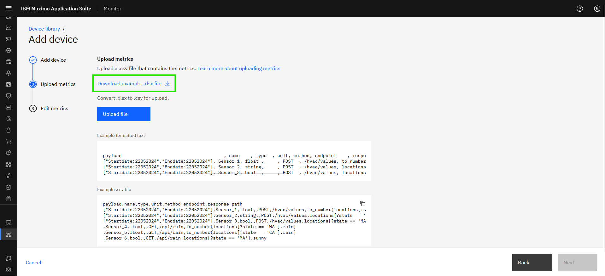</br>

- 打开 Excel 文件以在 `metrics` 工作表中填写数据点，模板中的每一列都提供了有关其目的的上下文以及完成相应单元格值的说明。重要的是要注意，CSV 中的每一行代表一个 json-over-http 数据点。
</br>

# csv 模板的输入示例

| Column_Name&emsp;&emsp;&emsp;&emsp;&emsp;| Description&emsp;&emsp;&emsp;&emsp;&emsp;&emsp;&emsp;&emsp;&emsp;&emsp;&emsp;&emsp;&emsp;&emsp;&emsp;&emsp;&emsp;&emsp;&emsp;&emsp;&emsp;&emsp;&emsp;&emsp;&emsp;&emsp;&emsp;&emsp;&emsp;&emsp;&emsp;&emsp;&emsp;&emsp;&emsp;&emsp;&emsp;&emsp;&emsp;&emsp;&emsp;&emsp;&emsp;&emsp;&emsp;&emsp;&emsp;&emsp;&emsp;&emsp;&emsp;&emsp;&emsp;&emsp;&emsp;&emsp;&emsp;&emsp;&emsp;&emsp;&emsp;&emsp;&emsp;&emsp;&emsp;&emsp;&emsp;&emsp;&emsp;&emsp;&emsp;&emsp;&emsp;&emsp;&emsp;&emsp;&emsp;|
|----------------------------------------------------------------|------------------------------------------------------------------------------------|
| <i>Payload</i> | 指定 POST API 调用所需的 JSON 主体以检索所需的数据点。此有效负载由表示标准 JSON 数据类型（对象、数组、字符串、数字、布尔值、null）的键值对组成。此字段仅在 HTTP 方法设置为 POST 时适用。|
| <i>Name</i> | 应在此列中添加数据点的名称。该值将在 Monitor 中用作相关指标名称。`Actual Torque` |
| <i>Type</i>   | 指示数据点的数据类型，使 EDC 工具能够正确解释传入值。支持的类型包括：`float`、`string` 和 `bool`。`float:` 带小数点的数值（例如，电压读数：254.5698）。</br> `string:` 字母数字值（例如，型号名称、固件版本："V52.1.4"）。</br> `bool:` 线圈地址表示布尔值，存储简单的二进制数据（0 或 1）。|
| <i>Unit</i>     | 此列指示特定数据点报告数据的单位。这是一个可选参数，因为并非所有数据点都需要单位。|
| <i>Method</i>     |指定用于与 API 交互的 HTTP 方法。GET 和 POST 是唯一可接受的值。</br> `GET` 从服务器检索记录。</br> `POST` 发送数据以在服务器上创建新记录。|
| <i>Endpoint</i>     |指 API URL，它充当检索或发送数据的访问点。这将附加到基本 URL 以定义目标资源。例如：`/device-1` |
| <i>Response_Path</i>     |指定用于从 API 响应有效负载中提取所需值的路径。使用 JMESPath 表达式导航 JSON 结构。有关语法和示例的更多信息，请参阅 [Jmespath.org](https://jmespath.org/) |

- 从浏览器复制 json 有效负载
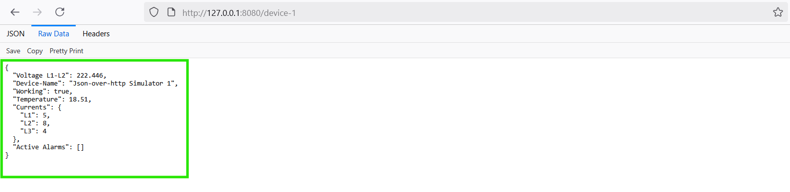</br>
- 可以在 [JMESPath](https://jmespath.org/) 中评估 Json-over-http 数据点的响应路径表达式
- 将有效负载粘贴到 `JSON data` 中，并在搜索框中输入表达式以查看 JMESPath 的实际效果，并在结果窗格中查看结果
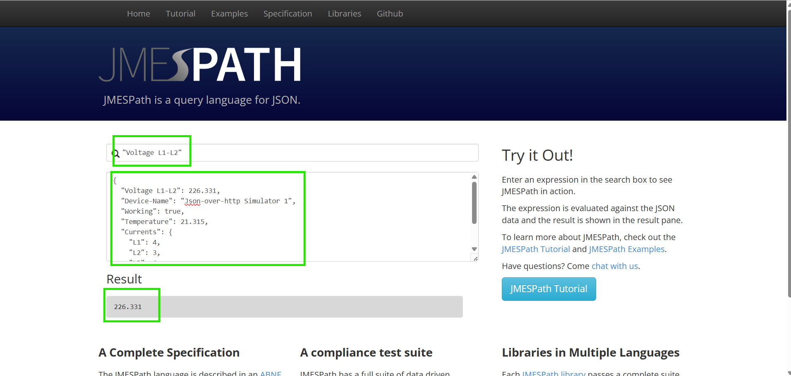</br>
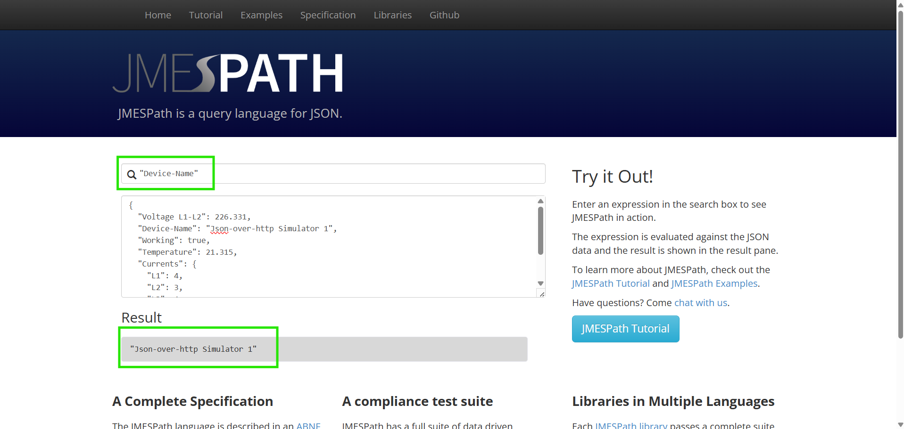</br>
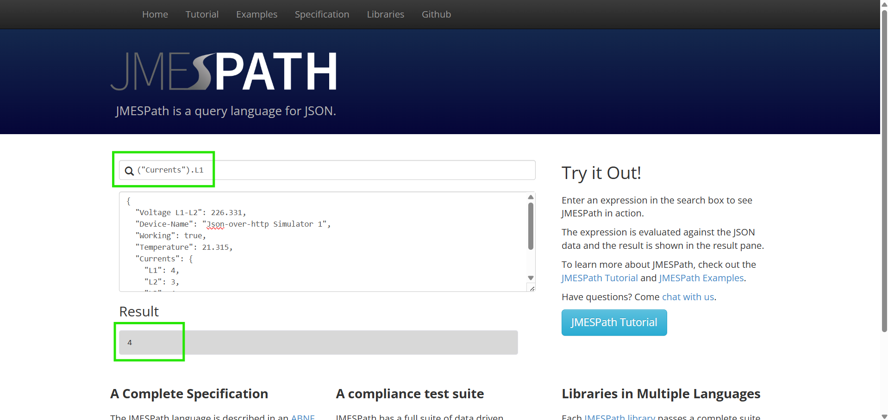</br>

- 使用详细信息填写 `Metrics` 工作表：
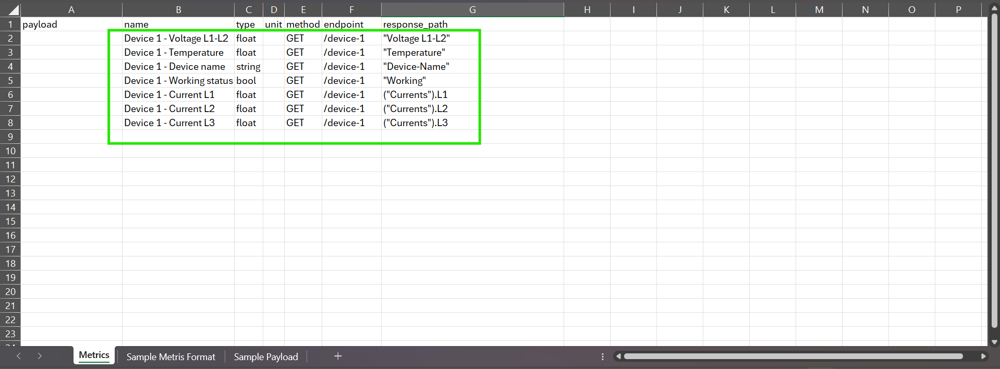</br>

- 要填写 `metrics` 工作表，您可以参考 `Sample Metrics Format` 工作表。
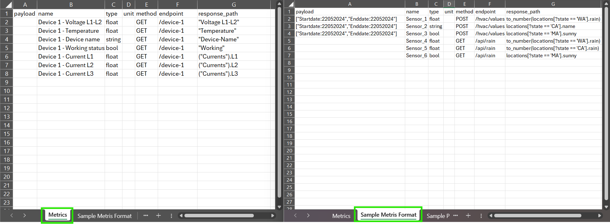</br>

!!! note
    将所需的数据点详细信息填写到 Metrics 工作表后，请将 Metrics 工作表保存为 CSV 格式以进行上传。</br>

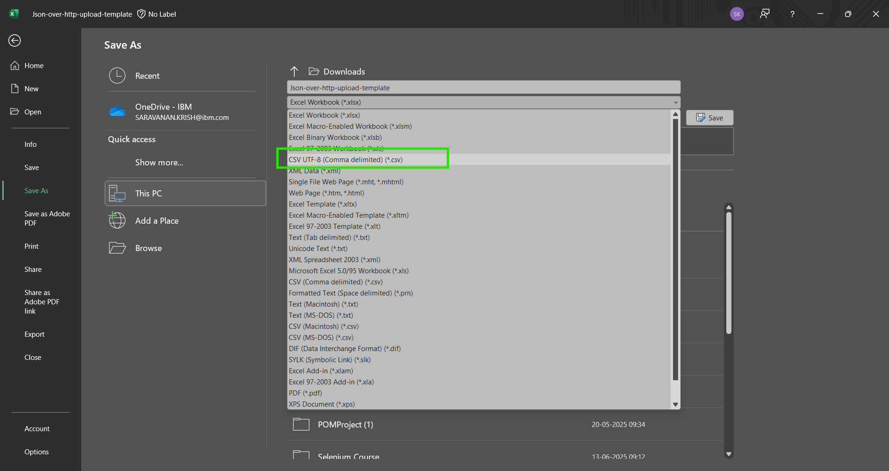</br>

- 上传 CSV 文件并选择 `Next`
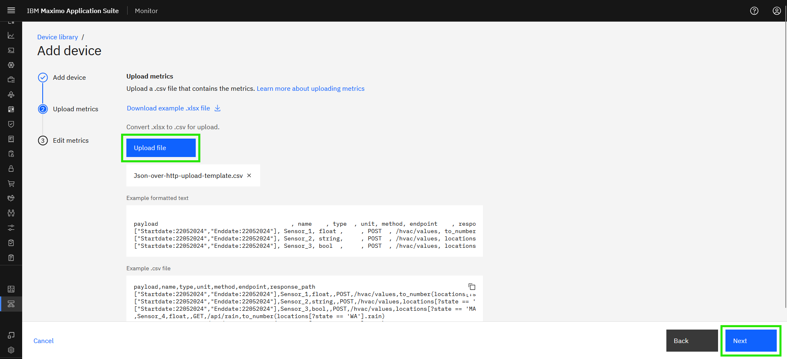</br>

- 您可以看到数据点的摘要，如果需要，您可以在此处删除指标。完成后点击 `Finish`：</br>
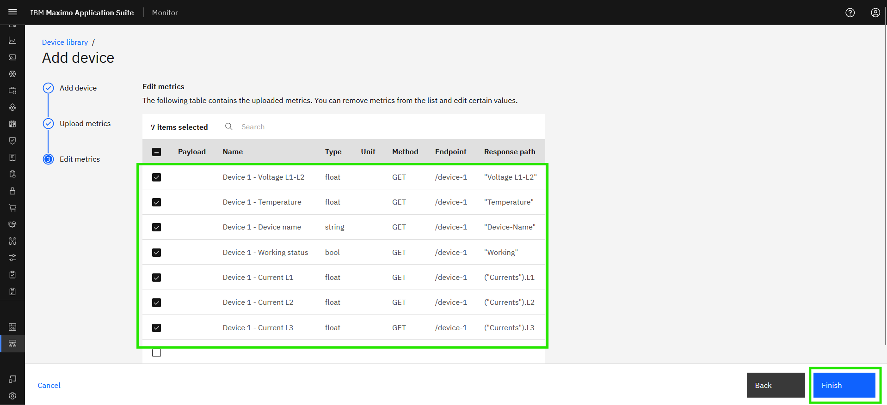</br>

!!! attention
    如果在上传 CSV 文件时看到 `Bad Request` 错误，</br>
    那么您可能需要检查 CSV 文件中的每个指标，您可能缺少详细信息或格式可能无效。

- 您可以在设备库中看到新添加的设备：</br>
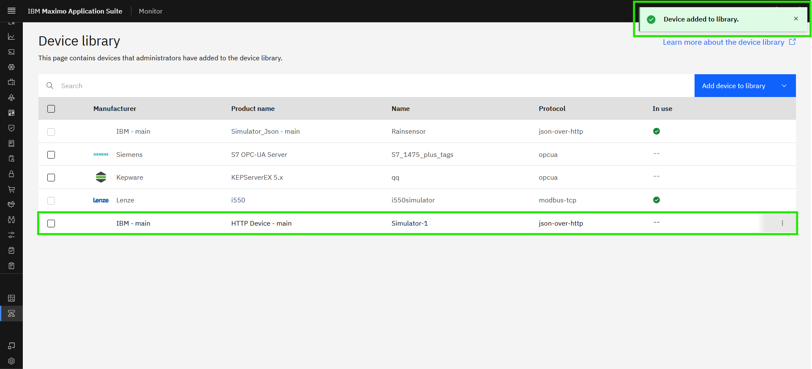
 
!!! note
    如果创建了新制造商，它将与 OrganizationID 一起附加。`IBM - Main`</br>
    例如 - 如果 OrganizationID 是 `MASPROD`，那么制造商将是 `XXXXX - MASPROD`</br>

现在设备已准备好使用。尽情享受吧！！！🤗。</br>
    
## 2. 为 POST 方法添加设备

- 打开 Excel 文件以在 `metrics` 工作表中填写数据点，模板中的每一列都提供了有关其目的的上下文以及完成相应单元格值的说明。重要的是要注意，CSV 中的每一行代表一个 json-over-http 数据点。
</br>

- 要获取响应有效负载，请使用 `curl` 命令
``` json 
curl -X POST -d "['Temperature','Voltage L1-L2','Device-Name','Working','Active Alarms']" http://localhost:8080/device-3
```
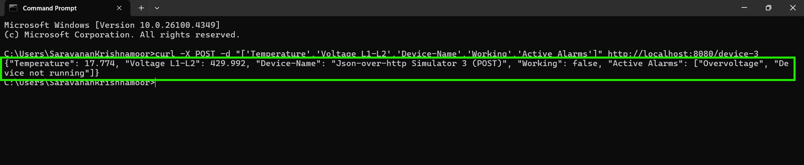</br>

- 可以在 [JMESPath](https://jmespath.org/) 中评估 Json-over-http 数据点的响应路径表达式
- 从终端或命令窗口复制响应
- 将有效负载粘贴到 `JSON data` 中，并在搜索框中输入表达式以查看 JMESPath 的实际效果，并在结果窗格中查看结果。
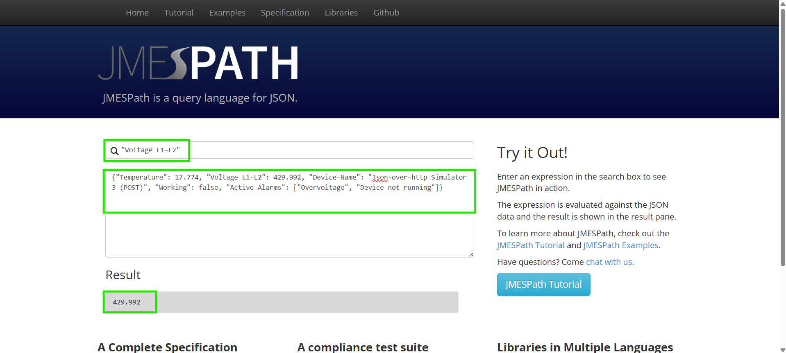</br>
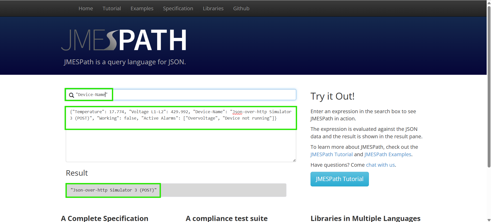</br>
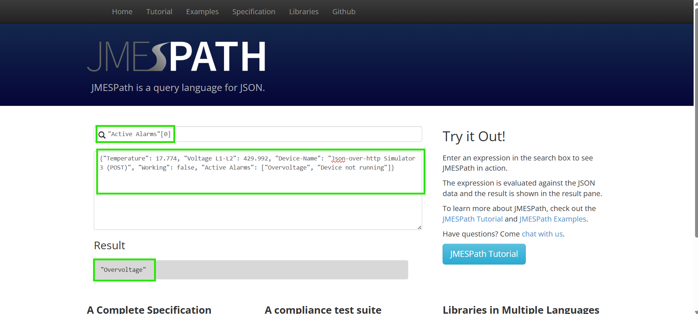</br>

- 使用详细信息填写 `Metrics` 工作表：
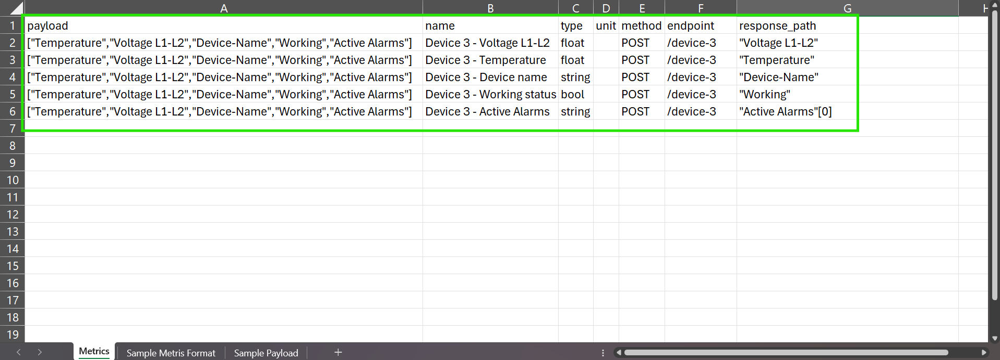</br>

- 将 Metrics Excel 文件保存为 CSV，并按照前面的步骤在设备库中创建新设备。
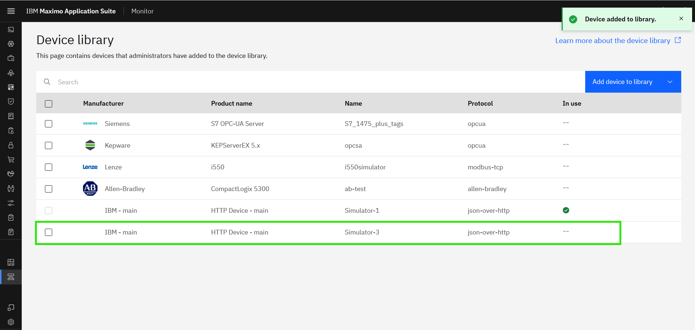</br>

现在设备已准备好用于托管网关。尽情享受吧！！！🤗

---
恭喜您已成功将设备添加到设备库。</br>