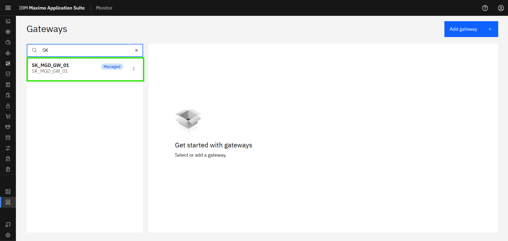
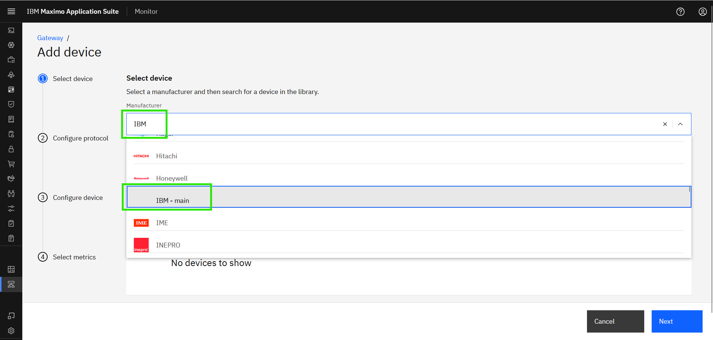
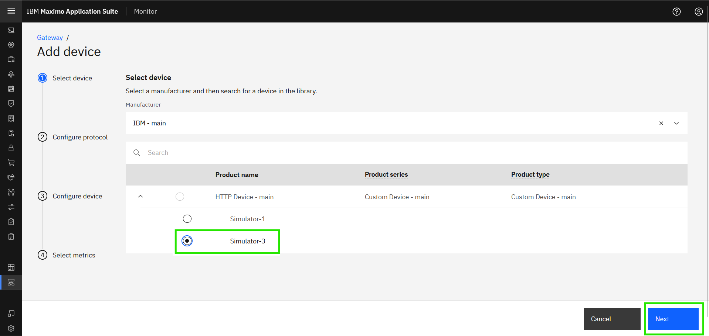
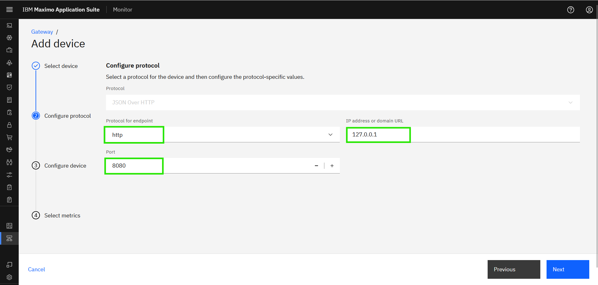
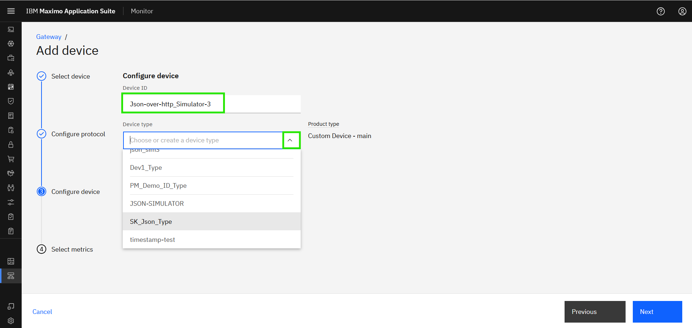
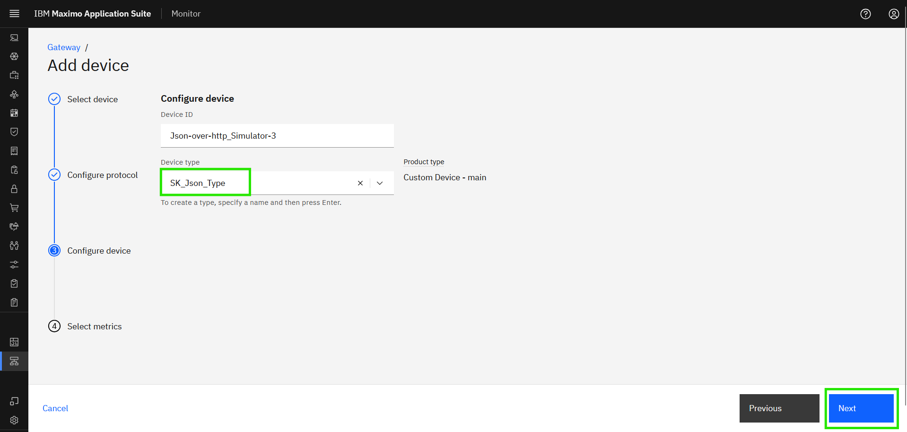
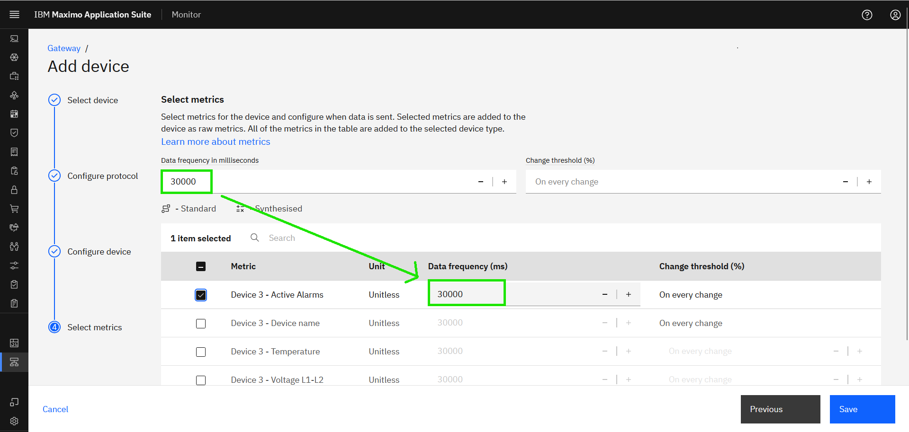
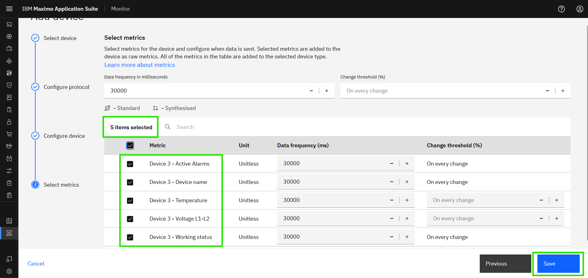
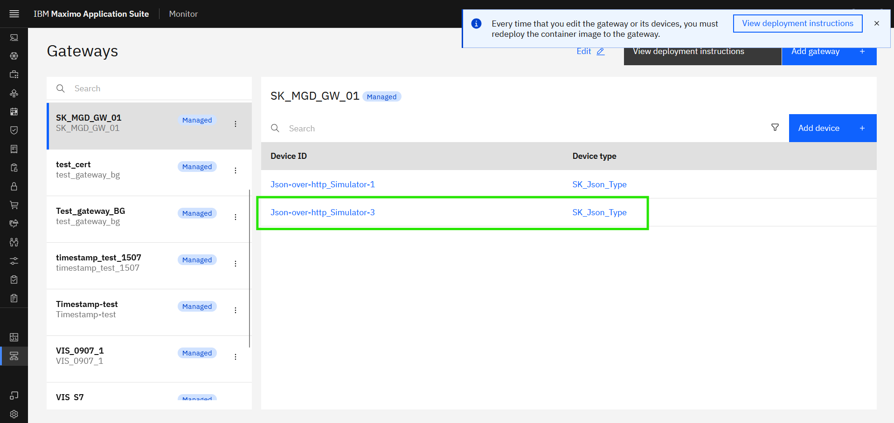

# 目标
在本练习中，您将学习如何将第二个模拟器设备添加到托管网关。 

---
*开始之前：*  
本练习要求您已：

1. 完成[所有实验](prereqs.md)所需的前提条件
2. 完成之前的练习
 
---

过滤以查找并选择您的网关 
- 选择它，您还应该看到由您的托管网关处理的设备： 
  

在托管网关中点击 `Add device`： 
[![添加设备]][添加设备]{target=_blank} 

`Use device library` 将自动被选中，因为托管网关仅支持来自库的设备。只需点击 `Continue`：
[![使用设备库]][使用设备库]

!!! note
    网关类型定义了可以添加到网关的设备类型。 
    这由 Monitor 自动处理。  
    托管网关：来自设备库的 OT 设备。 
    标准/特权网关：IoT 设备作为自定义设备添加。 

 
是时候添加 Json simulator-3 设备了。 
在制造商下拉列表中搜索 `IBM` 并选择它。点击 `Next`： 
  

选择 HTTP Device - main 产品，选择 `Simulator-3` 并点击 `Next`： 
  

为端点选择 `http` 协议： 

!!! tip 
    模拟器在我们的本地计算机上运行，地址为 http://localhost:8080 或 http://127.0.0.1:8080。 

 
现在是时候使用模拟器的 IP 地址和端口号 `127.0.0.1`、`8080` 了。 
点击 `Next`；

!!! tip 
    URL 的上下文路径应在 CSV 上传期间添加到 `endpoint` 列中的数据点。 

 
将设备 ID 定义为 `Json-over-http_Simulator-3`。 
您可以看到产品类型为自定义设备，即添加到设备库的所有自定义设备的产品类型。 
点击 `Device type`，您应该看到：
  

您可以选择旧设备类型或创建新设备类型： 
点击 `XX_Json_Type` 并点击 `Next`：

!!! tip 
    创建设备类型后，您可以从下拉列表中选择自己的设备类型。 

 
将数据频率定义为 30000（30 秒），当您选择指标时它将自动使用： 
  

选择所有指标。点击 `Save`：

 
您现在将看到您的第二个设备成为托管网关的一部分：
  

---
恭喜您已成功将另一个模拟器设备添加到您的托管网关。 

[添加设备]: img/2nd_device_02.png
[使用设备库]: img/2nd_device_03.png