# 目标
在本练习中，您将学习如何在 Monitor 中创建托管网关并添加您已添加到设备库的新设备。

---
*开始之前：*  
本练习要求您已：

1. 完成[所有实验](prereqs.md)所需的前提条件
2. 完成之前的练习

---

#### 添加托管网关

登录到 MAS：
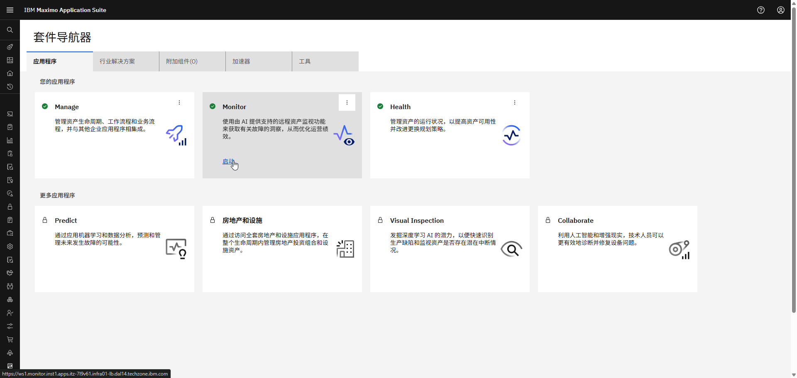  

在左侧菜单的 Monitor 部分下展开设置并选择网关：
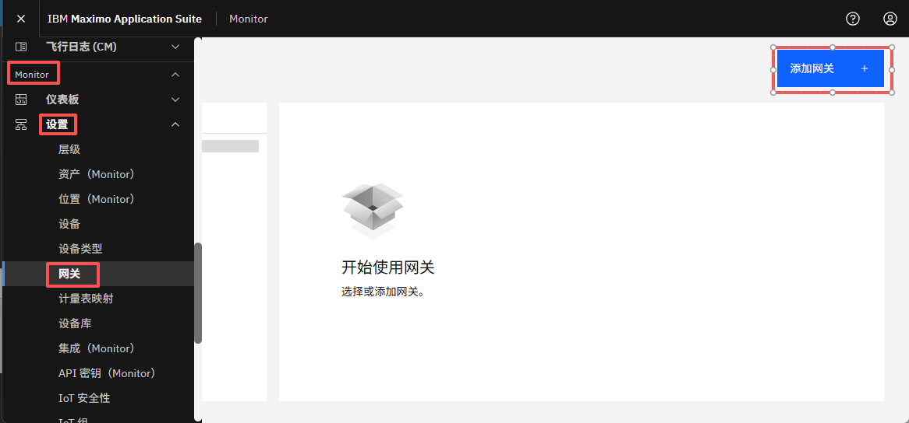

!!! note "MAS 9.1 中的新功能"
    Monitor 不再有主主页。与 Monitor 的所有交互都从左侧菜单的 Monitor 部分启动 

 
选择 `添加网关`：
  

定义网关 ID `XX_MGD_GW_01` 和网关类型 `XX_MGD_GW_01`。

!!! tip
    如果其他人在同一 Maximo Application Suite 环境中遵循本实验，网关 ID 和类型中的 XX 应该是您的首字母缩写。

确保网关配置为托管并点击 `保存`：
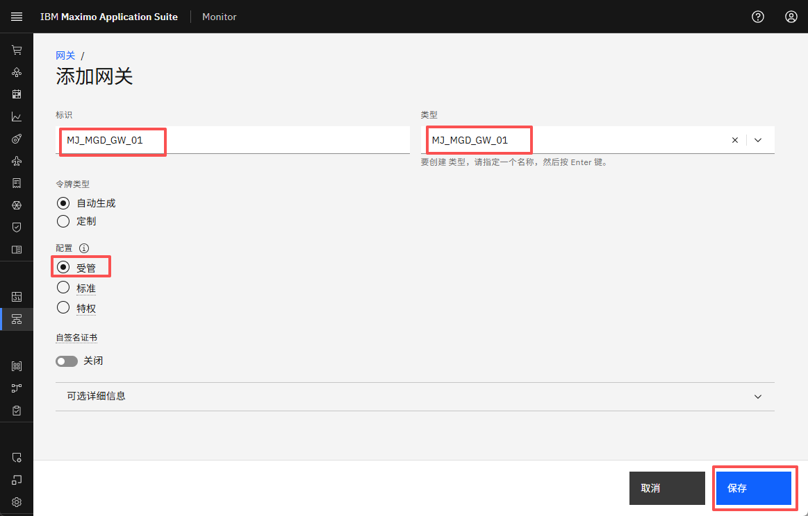  

您现在将看到您的新托管网关，包括网关列表和网关定义中的 `受管` 标签：
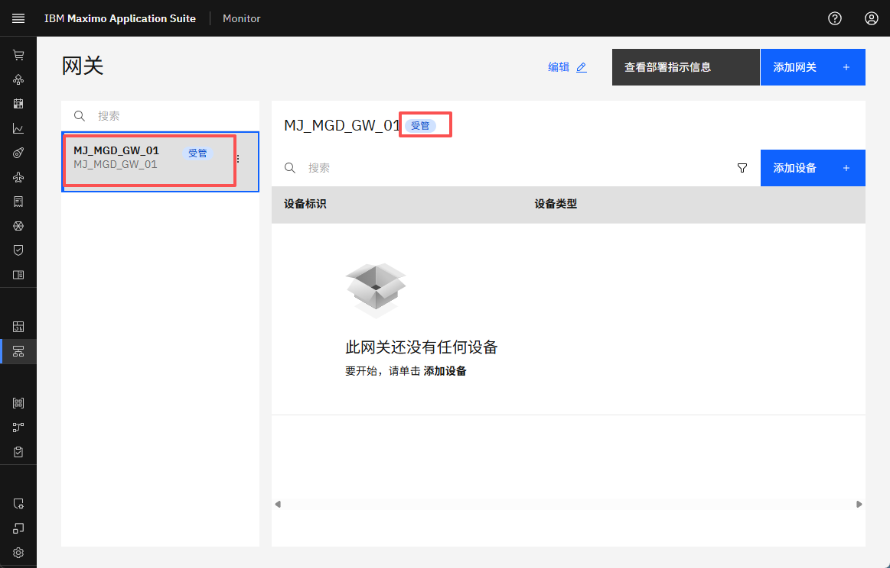 

!!! note
    凭据会自动"嵌入"到托管网关的 docker 镜像中。 
    这意味着凭据不会呈现给您，就像其他网关配置类型一样。 

 

#### 将您的新设备添加到托管网关

在托管网关中点击 `添加设备`： 
[![添加设备]][添加设备]{target=_blank} 

`设用设备库` 将自动被选中，因为托管网关仅支持来自库的设备。只需点击 `继续`：
[![使用设备库]][使用设备库]

!!! note
    网关类型定义了可以添加到网关的设备类型。 
    这由 Monitor 自动处理。  
    托管网关：来自设备库的 OT 设备。 
    标准/特权网关：IoT 设备作为自定义设备添加。 

 
是时候添加 Json 模拟器设备了。 
在制造商下拉列表中搜索 `IBM` 并选择它。点击 `下一步`： 
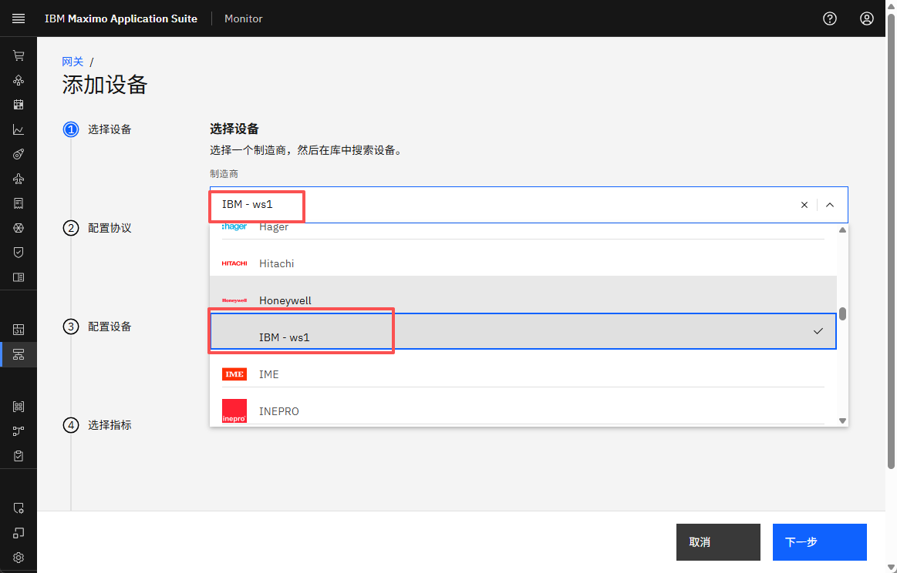  

选择 HTTP Device - main 产品，选择 `Simulate-Device-01` 并点击 `下一步`： 
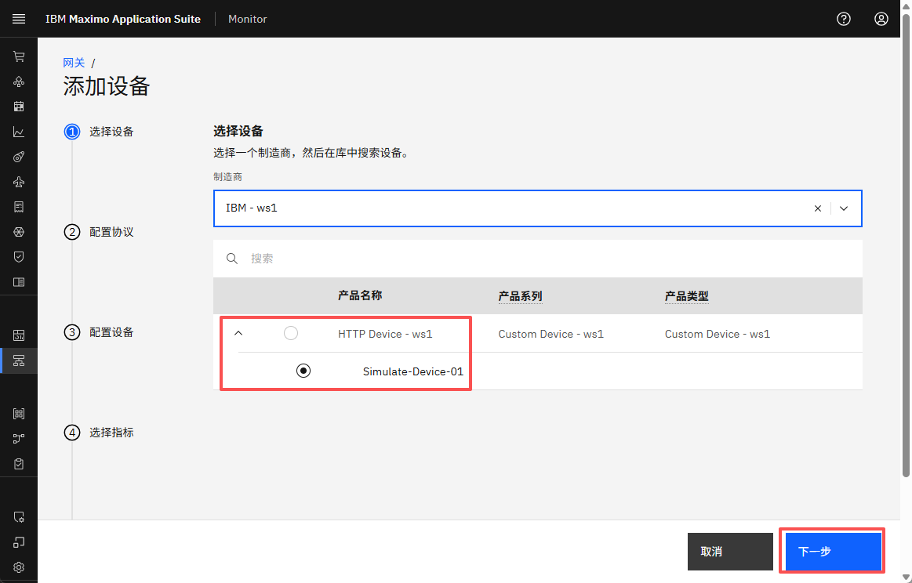  

为端点选择 `http` 协议： 

!!! tip 
    模拟器在我们的本地计算机上运行，地址为 http://localhost:8080 或 http://127.0.0.1:8080。 

 
现在是时候使用模拟器的 IP 地址和端口号 `127.0.0.1`、`8080` 了。 
点击 `下一步`；
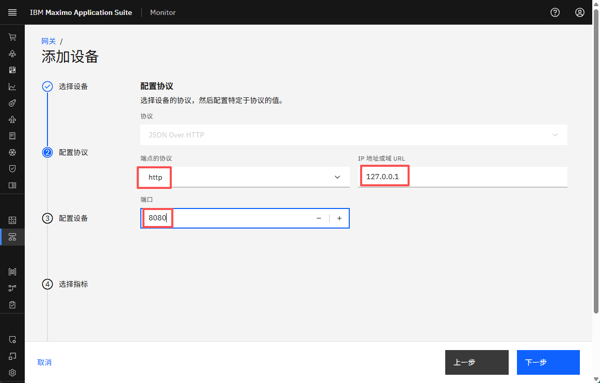

!!! tip 
    URL 的上下文路径应在 CSV 上传期间添加到 `endpoint` 列中的数据点。 

 
将设备 ID 定义为 `Json-over-http_Simulator-1`。 
您可以看到产品类型为自定义设备，即添加到设备库的所有自定义设备的产品类型。 
点击 `Device type`，您应该看到：
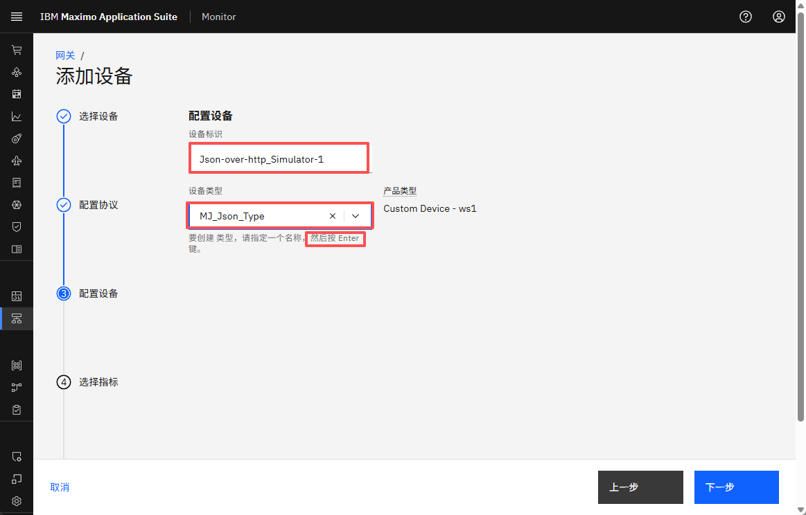  

您将创建自己的设备类型。由于您尚未这样做，您只需键入 `XX_Json_Type`，其中您将 XX 替换为您的首字母缩写： 
点击新设备类型以创建它并点击 `下一步`：

!!! tip 
    创建设备类型后，您可以从下拉列表中选择自己的设备类型。 

 
将数据频率定义为 30000（30 秒），当您选择指标时它将自动使用： 
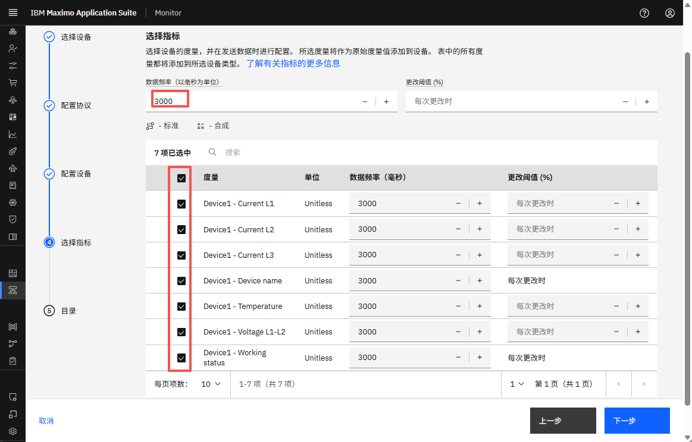  

选择所有指标。点击 `保存`：
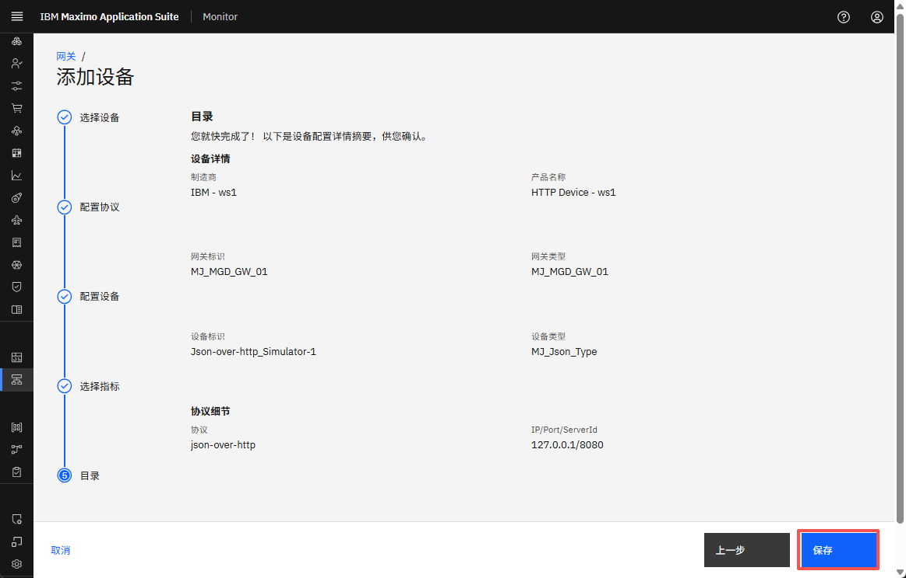

 
您现在将看到您新添加的设备成为新托管网关的一部分：
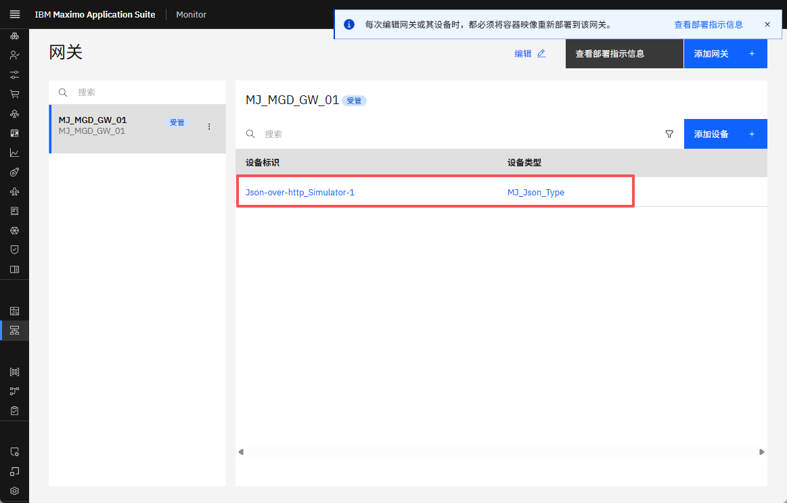  

---
恭喜您已成功在 Monitor 中创建托管网关并添加了设备库中新添加设备的实例。 

[添加设备]: img/add_device_01.png
[使用设备库]: img/add_device_02.png