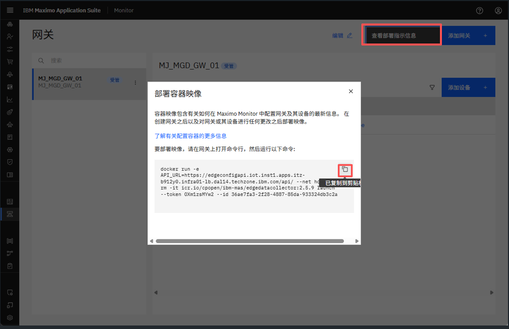
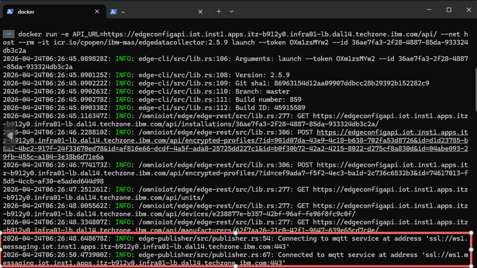
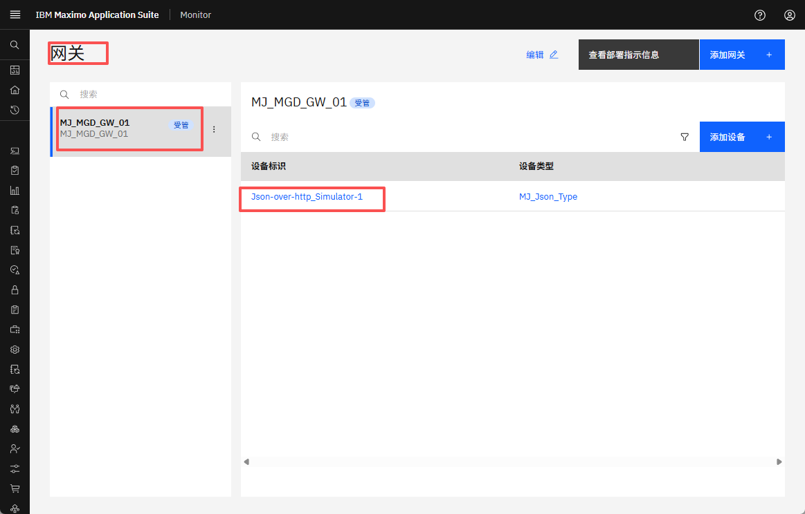
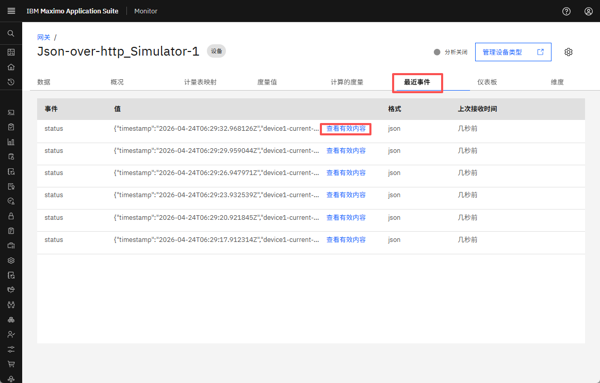
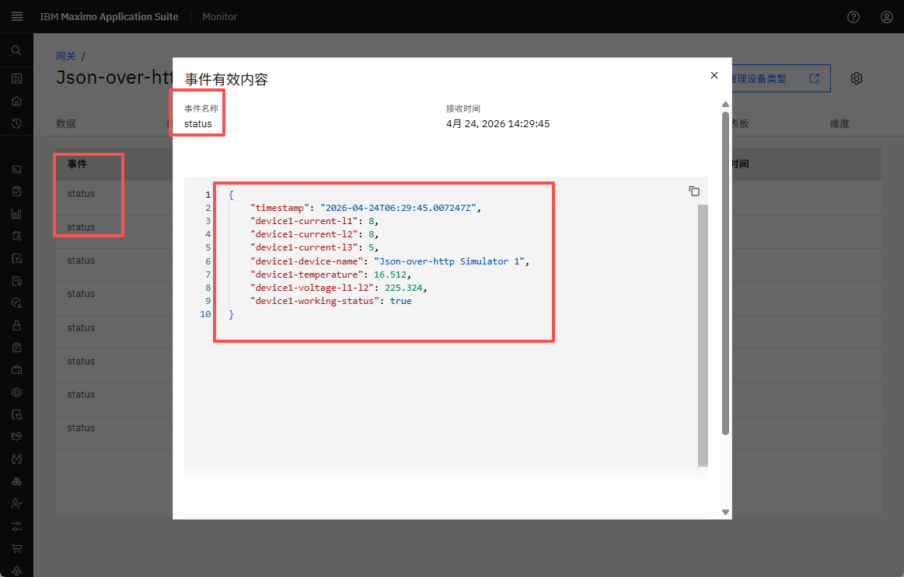
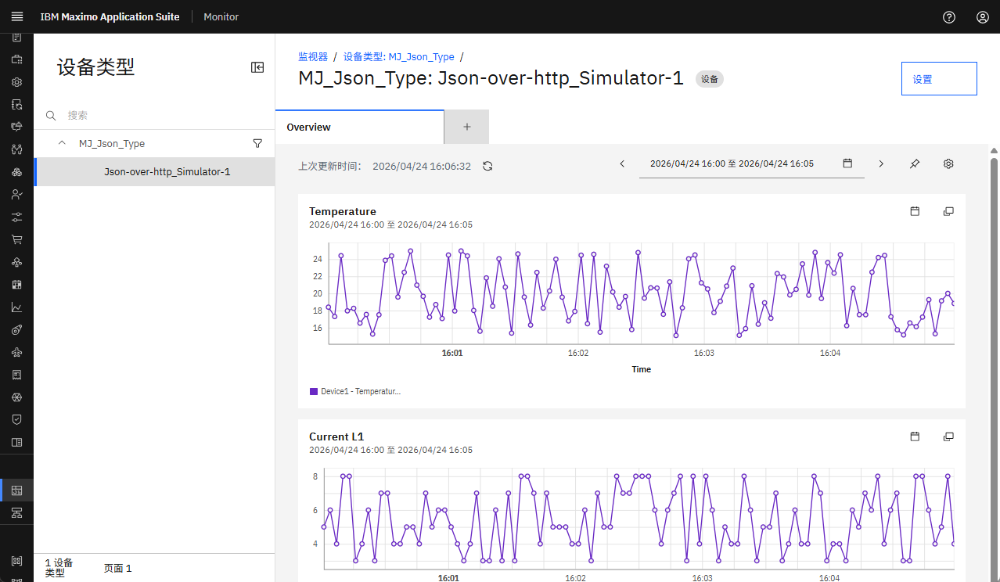

# 目标
在本练习中，您将学习如何：

* 部署托管网关
* 验证连接和数据流入

---
*开始之前：*  
本练习要求您已：

1. 完成[所有实验](prereqs.md)和本练习所需的前提条件
2. 完成之前的练习
3. 验证模拟器正在运行，如[练习 1](setup_simulator.md){target=_blank}中所述

---

## 部署托管网关

在网关列表中查看您的托管网关时，按 `查看部署指示信息`。</br>
点击 docker 命令将其复制到剪贴板：
</br></br>

打开您想要运行托管网关的终端窗口（Mac/Linux）或命令窗口（Windows），然后从剪贴板粘贴 docker 命令行。点击回车执行它，您应该看到类似以下内容：


!!! tip "提示"
	您可以看到托管网关已成功建立与 Json 模拟器的连接。</br>
	其次，您还可以看到托管网关和 Maximo Monitor 之间建立了 MQTT 连接</br>
	
	第一次部署时，您可能会收到如下响应：`Unable to find image 'icr.io/cpopen/ibm-mas/edgedatacollector:2.5.7' locally`</br>
	请耐心等待 Edge Data Collactor docker 容器下载并启动。</br>

    如果网关/设备中进行了任何更改。我们需要重新部署 docker 命令。在重新部署之前，请使用 `docker stop <Container ID>` 停止旧的 docker 容器

    要获取容器 ID，请使用 `docker ps`，它将提供正在运行的 docker 容器列表。


## 验证 Json-over-http 设备数据正在流入 Monitor


点击打开 `Json-over-http_Simulator-1` 设备：
</br></br>

导航到 `最近事件` 并等待半分钟（您知道添加设备时定义的那 30000 毫秒），直到第一条消息传入。</br>
</br></br>

点击 `查看有效内容` 并查看发送到事件名称 `status` 的数据点：</br>
</br></br>

这些是您在将设备添加到托管网关时选择的数据点：

``` json
{
    "timestamp": "2025-07-15T13:09:29.243654Z",
    "device-1-current-l1": 7,
    "device-1-current-l2": 8,
    "device-1-current-l3": 8,
    "device-1-device-name": "Json-over-http Simulator 1",
    "device-1-temperature": 21.153,
    "device-1-voltage-l1-l2": 227.97,
    "device-1-working-status": true
}
```
</br>


存储的数据可能会用于设备的仪表板：</br>
</br></br>

---
恭喜您已成功部署并验证了连接和数据流入。