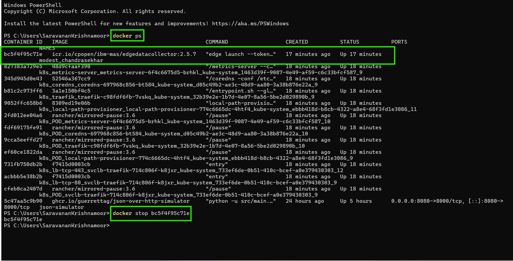
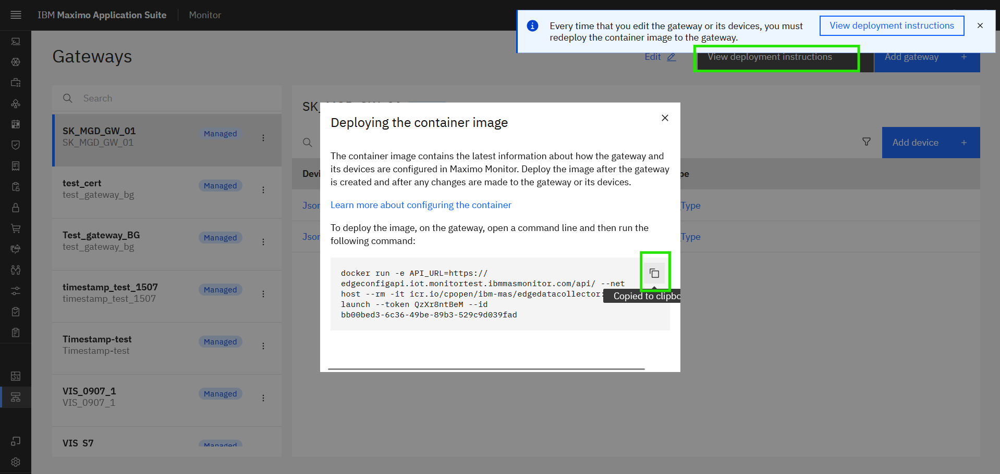
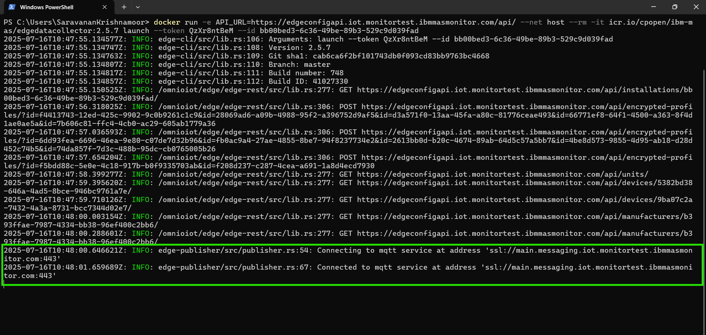
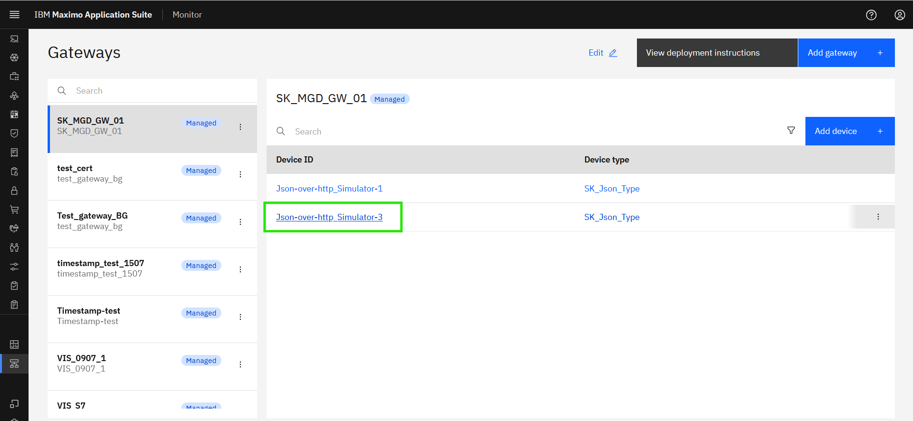
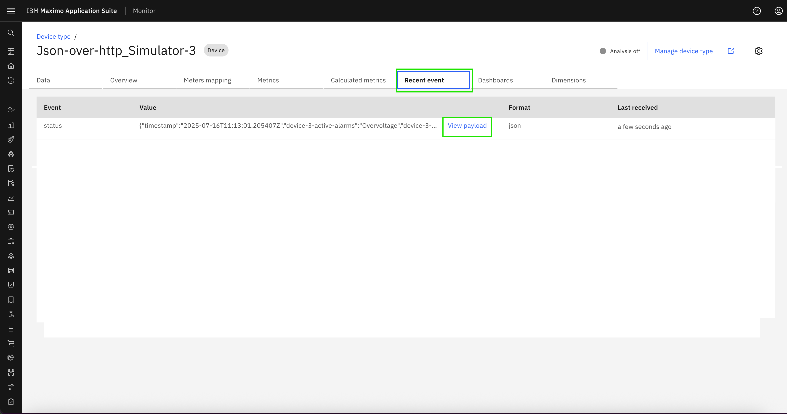
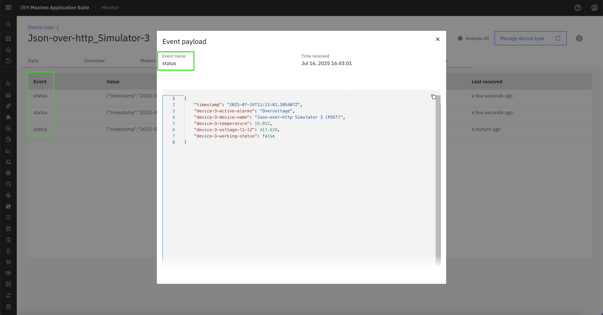
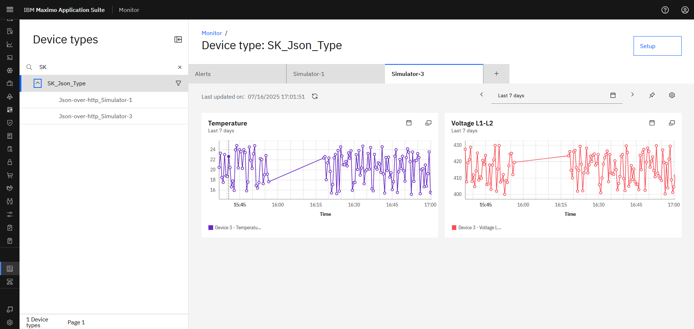

# 目标
在本练习中，您将学习如何：

* 停止并重新部署托管网关
* 在 Monitor 仪表板中查看传入数据

---
*开始之前：*  
本练习要求您已：

1. 完成[所有练习](prereqs.md)和练习 4 所需的前提条件
2. 完成之前的练习
3. 验证模拟器正在运行，如[练习 1](setup_simulator.md){target=_blank}中所述

---

## 重新部署托管网关

转到新的终端或命令窗口，使用 `docker ps` 命令查看正在运行的 docker 容器。 
找到正在运行的托管网关容器的 CONTAINER ID（查找 `edgedatacollector`）- 这里是 `bc5f4f95c71e`。 
使用 `docker stop <CONTAINER ID>` 命令停止 docker 容器。
  

导航回 Monitor 中的托管网关并按 `View deployment instructions`。 
点击 docker 命令将其复制到剪贴板：
  

返回终端，然后从剪贴板粘贴 docker 命令行。 
点击回车执行它，您应该看到类似以下内容：
 

## 在设备数据表中查看数据

点击打开 `Json-over-http_Simulator-3` 设备：
  

导航到 `Recent event` 并等待半分钟（您知道添加设备时定义的那 30000 毫秒），直到第一条消息传入。 
  

点击 `View payload` 并查看发送到事件名称 `status` 的数据点： 
  

存储的数据可能会用于 Siemens S7 设备的仪表板： 
  

---
恭喜您已成功重新部署并在 Monitor 仪表板中查看了来自两个模拟器的数据。本实验到此结束。  