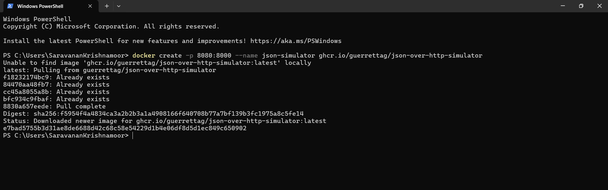
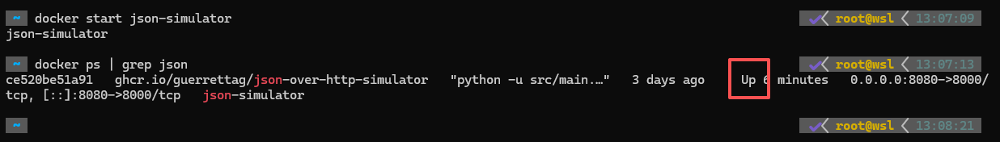

# 目标
在本练习中，您将学习如何使用 Docker 运行带有 json 模拟器的固定且就绪的 docker 容器。

---
*开始之前：*  
本练习要求您已：

1. 完成[所有实验](prereqs.md)所需的前提条件

---

!!! note
    创建的 docker 容器应该可以在以下架构上运行：</br>
    - x86 (Windows/Linux/macOS)</br>
    - ARM (Linux/macOS)。

## 1. 安装 Docker

根据软件包和操作系统的不同，有不同的方法来安装 Docker 引擎。</br>
一个多平台选项是 Rancher Desktop。安装 Rancher Desktop 相当容易，</br>
您只需遵循本指南：[本地运行 Docker](https://docs.rancherdesktop.io/getting-started/installation/){target=_blank}</br>

下载本次实验所需的docker镜像包：
http://imvp.site/mas/docker-images.tar

解压镜像包：

    tar -xvf docker-images.tar

将解压后的镜像包导入docker：

    docker load -i *.tar

## 2. 创建 Docker 容器
打开终端或命令窗口并运行以下命令：

    docker create -p 8080:8000 --name json-simulator ghcr.io/guerrettag/json-over-http-simulator

即使您看到以下消息，也请耐心等待：

    Unable to find image 'ghcr.io/guerrettag/json-over-http-simulator:latest' locally

它需要拉取 docker 镜像。它已被命名为：`josn-simulator`



## 3. 启动 Docker 容器

运行以下命令启动容器：

    docker start json-simulator

模拟器现在处于活动状态，随机和动态值将每 30 秒更改一次。
它将在后台运行，不会在终端/命令窗口中产生任何输出。

## 4. 停止并删除 Docker 容器

完成使用基于 docker 的模拟器后，您可以使用以下命令停止它：

    docker stop json-simulator

并使用以下命令删除容器：

    docker rm json-simulator

## 一个窗口中的所有 Docker 命令



!!! tip
    动态和随机值将在每次 `GET` 或 `POST` 请求时更改。</br>

## 模拟器

json-simulator 正在模拟 `GET` 方法的 2 个设备有效负载和 `POST` 方法的 1 个设备</br>
提供以下数据点：

# GET 方法的有效负载

设备 - 1：
``` json 
curl http://127.0.0.1:8080/device-1
```

``` json
{
  "Voltage L1-L2": 221.868,
  "Device-Name": "Json-over-http Simulator 1",
  "Working": true,
  "Temperature": 18.67,
  "Currents": {
    "L1": 3,
    "L2": 5,
    "L3": 8
  },
  "Active Alarms": []
}
```
设备 - 2：
``` json 
curl http://127.0.0.1:8080/device-2
```

``` json
{
  "Voltage L1-L2": 414.613,
  "Device-Name": "Json-over-http Simulator 2",
  "Working": false,
  "Temperature": 17.217,
  "Active Alarms": [
    "Overvoltage",
    "Device not running"
  ]
}
```
# POST 方法的有效负载

设备 - 3：
要从设备获取响应，请在终端或命令窗口中使用以下命令

``` json 
curl -X POST -d "['Temperature','Voltage L1-L2','Device-Name','Working','Active Alarms']" http://localhost:8080/device-3
```
响应应如下所示，
``` json
{"Temperature": 22.088, "Voltage L1-L2": 419.303, "Device-Name": "Json-over-http Simulator 3 (POST)", "Working": false, "Active Alarms": ["Overvoltage", "Device not running"]}
```

!!! Note
    所有三个设备都使用端口 8080。</br>
    因此您需要使用 localhost IP 地址以及端口号和端点详细信息。</br>
    GET - [127.0.0.1:8080/device-1](http://127.0.0.1:8080/device-1)</br>
    GET - [127.0.0.1:8080/device-2](http://127.0.0.1:8080/device-2)</br>
    POST - 使用上述 curl 命令获取值。

</br>

---
恭喜您已成功使用预配置的 docker 容器设置了 json 模拟器环境。</br>