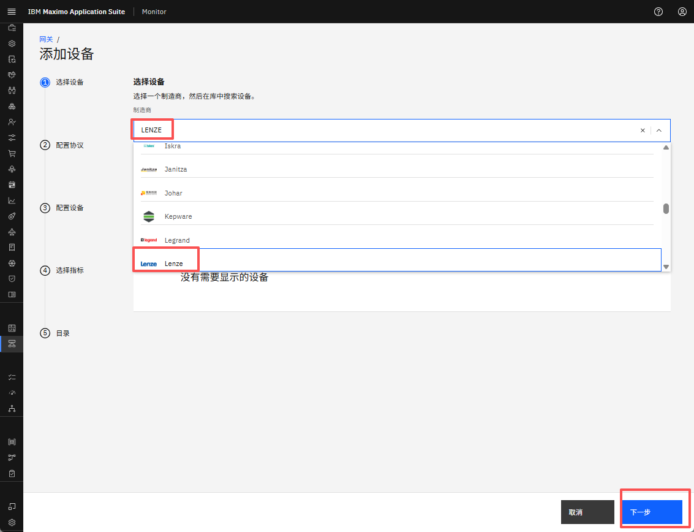
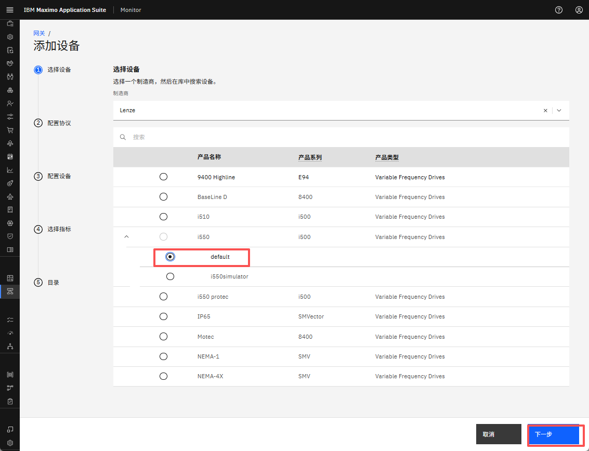
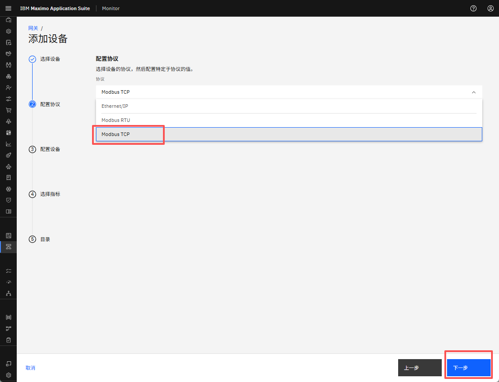
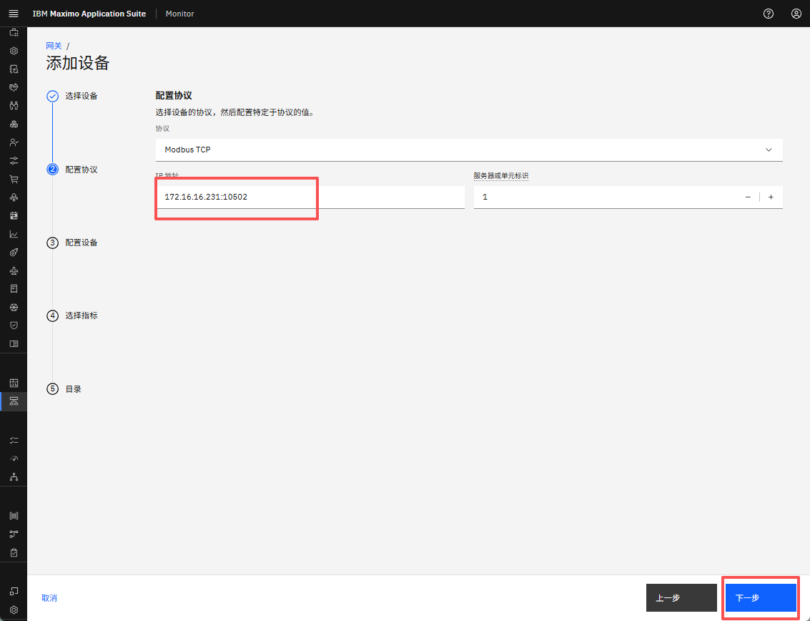
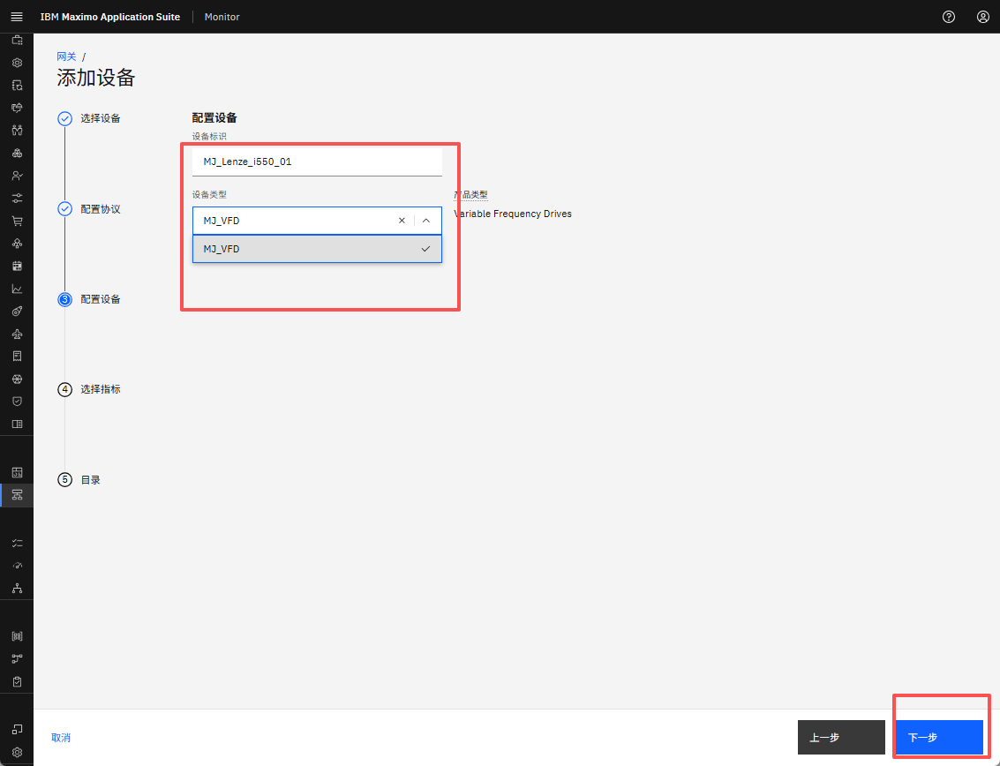
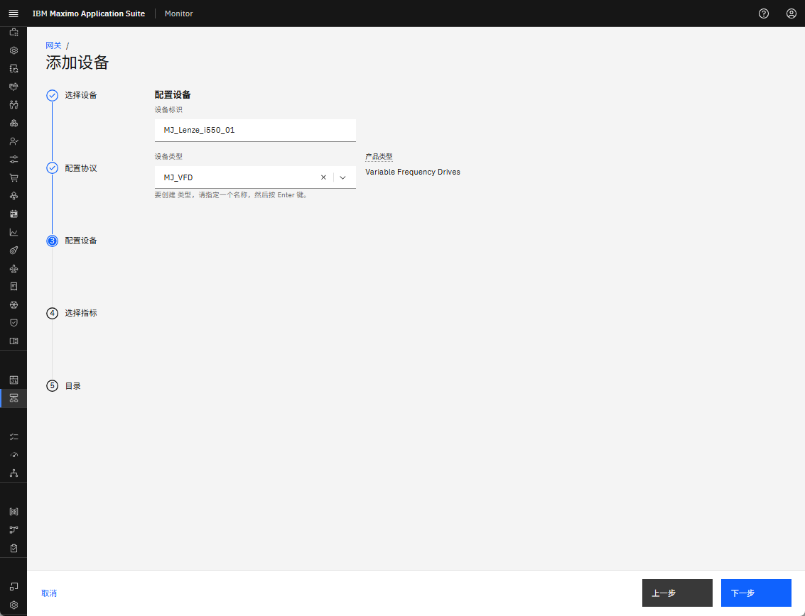
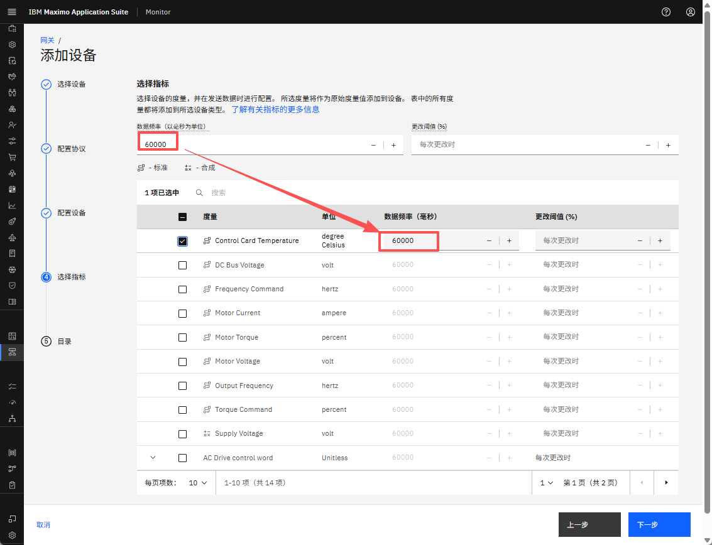
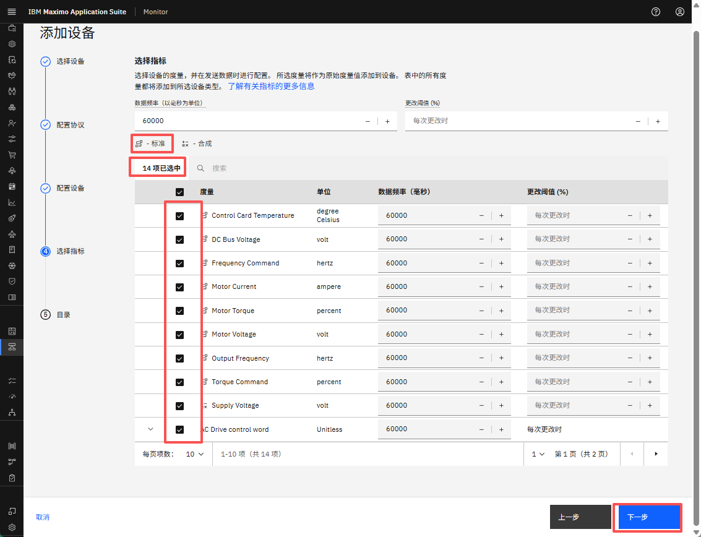
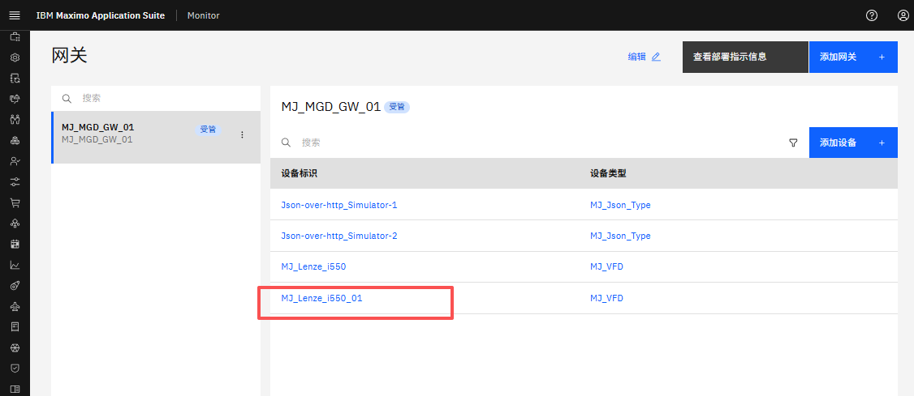

# 目标
在本练习中，您将学习如何向托管网关添加第一个工业设备。

---
*开始之前：*  
本练习要求您已：

1. 完成[所有实验](prereqs.md)所需的前置条件
2. 完成之前的练习
 
请找到运行 [Modbus 模拟器](setup_simulator.md)的机器的 IP 地址。
我在本地网络上的一台 IP 地址为 192.168.1.64 的机器上运行模拟器。

---

在网关列表中查看您的托管网关时，按 `添加设备`： 
[![添加设备]][添加设备]{target=_blank} 

`使用设备库` 将自动被选中，因为托管网关仅支持来自库的设备。只需点击 `继续`：  
[![使用设备库]][使用设备库]

!!! note
    网关类型定义了可以添加到网关的设备类型。 
    这由 Monitor 自动处理。  
    托管网关：来自设备库的 OT 设备。 
    标准/特权网关：IoT 设备作为自定义设备添加。 

 
现在是添加 Lenze i550 设备的时候了。 
在制造商下拉列表中搜索 `Lenze` 并选择它。点击 `下一步`： 
  

选择 i550 产品并点击 `下一步`： 
  

选择 `Modbus TCP` 协议。点击 `下一步`： 

!!! tip 
    模拟器仅支持 Modbus TCP 协议，因此如果您选择其他协议将会失败。 

 
现在是使用模拟器的 IP 地址并将其与端口号 10502 结合的时候了，用 `:` 分隔，如 `192.168.1.64:10502`。 
点击 `下一步`；

!!! tip 
    不要更改 `服务器或单元ID`，因为模拟器不支持它。 

 
将设备 ID 定义为 `XX_Lenze_i550_01`，其中您将 XX 替换为您的姓名首字母缩写。 
您可以看到您选择的工业设备的产品类型，即 Lenze i550 的变频驱动器。 
点击 `Device type`，您应该看到：
  

您将创建自己的设备类型。由于您尚未这样做，您只需输入 `XX_VFD`，其中您将 XX 替换为您的姓名首字母缩写： 
点击新设备类型以创建它并点击 `下一步`：

!!! tip 
    创建设备类型后，您可以从下拉列表中选择自己的设备类型。 

 
将数据频率定义为 60000（60秒），当您选择指标时它将自动使用： 
  

选择所有标准指标和一个额外的合成指标。点击 `保存`：

!!! tip 
    标准指标使用由托管网关在部署后统一的标签、单位和值。 
    合成指标是通过使用其他指标创建的。一些标准指标是合成的，但这些指标仅列为标准指标。

 
您现在已成功将第一个 OT 设备添加到您的托管网关：
  

---
恭喜您已成功向托管网关添加工业设备。 

[添加设备]: img/add_device_01.png
[使用设备库]: img/add_device_02.png