# 目标
在本练习中，您将学习如何向托管网关添加第二个工业设备。 
这次您将基于您的设备类型而不是从托管网关添加它。

---
*开始之前：*  
本练习要求您已：

1. 完成[所有实验](prereqs.md)所需的前置条件
2. 完成之前的练习
 
请找到运行 [Modbus 模拟器](setup_simulator.md)的机器的 IP 地址。
我在本地网络上的一台 IP 地址为 192.168.1.64 的机器上运行模拟器。

---

在左侧菜单的 Monitor 部分中展开设置并选择 `设备类型`： 
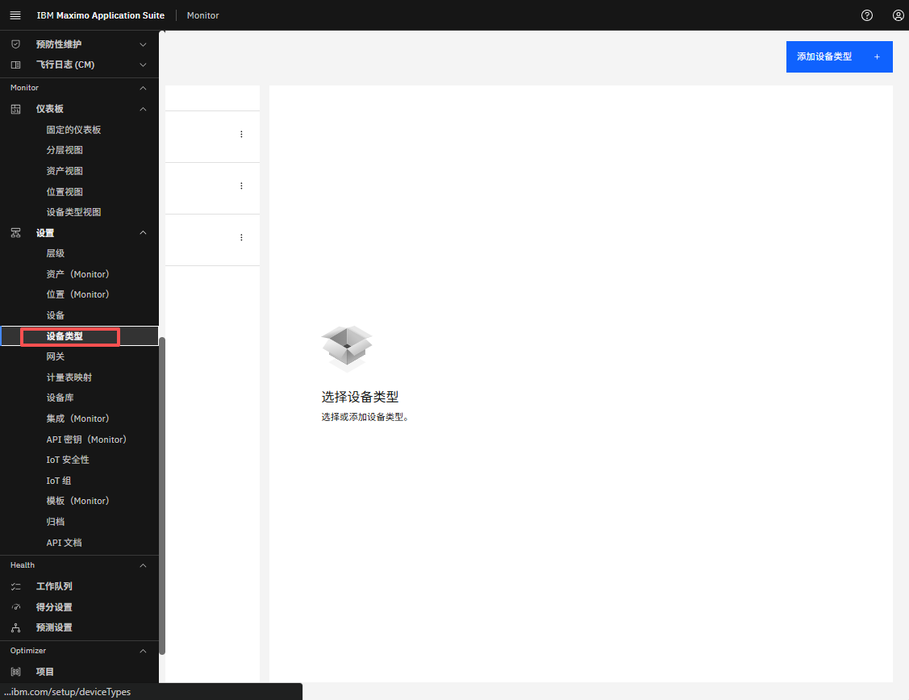  

按您的姓名首字母缩写筛选，选择您的 VFD 设备类型，然后点击 `添加设备`： 
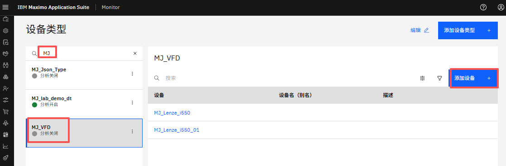  

` 使用设备库` 将自动被选中，因为此设备类型基于库中的设备。 
筛选以在第一个下拉列表中查找并选择您的网关类型： 
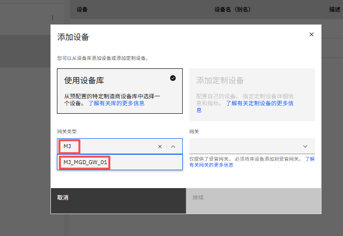  

在第二个下拉列表中选择您的托管网关： 
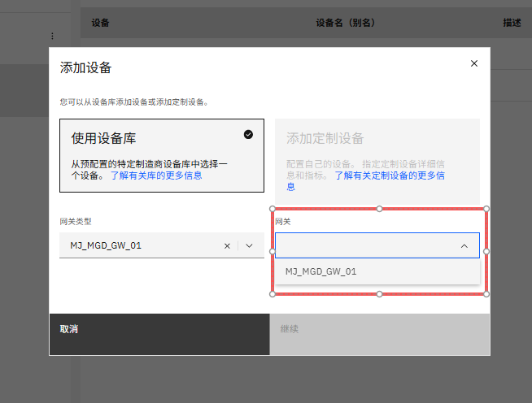  

您现在应该看到您的网关类型和名称。点击 `继续`： 
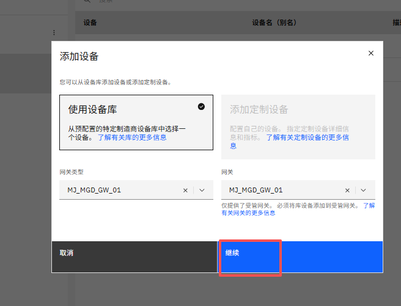

!!! note
    添加新设备并将其添加到托管网关作为流程的自然部分进行处理。这意味着第一个下拉列表中仅显示托管网关类型，第二个下拉框中仅显示所选托管网关类型的实例。

 
查找并选择 Lenze i550 设备并点击 `下一步`。 
选择 `Modbus TCP` 协议。 
使用模拟器的 IP 地址和端口 20502，如 `192.168.1.64:20502`。 
点击 `下一步`； 
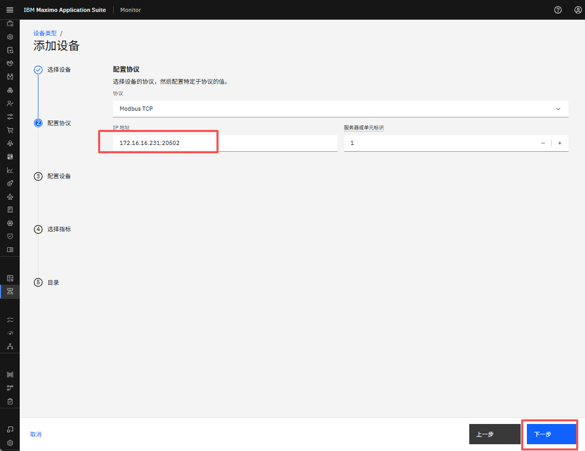  

将设备 ID 定义为 `XX_Lenze_i550_02`，其中您将 XX 替换为您的姓名首字母缩写。 
点击 `下一步`： 
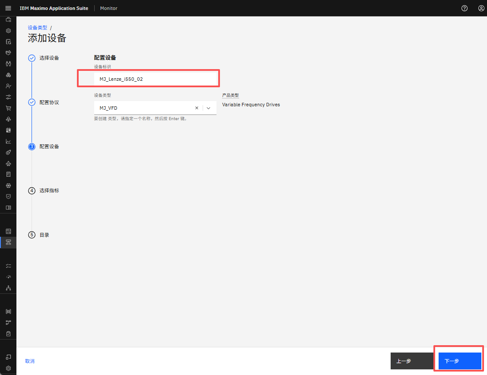

!!! tip 
    设备类型已被选择，因为流程知道新设备是基于设备类型添加的。 

 
将数据频率定义为 60000（60秒）。 
选择所有标准指标和一个额外的合成指标，这也是为第一个设备选择的。 
点击 `保存`： 
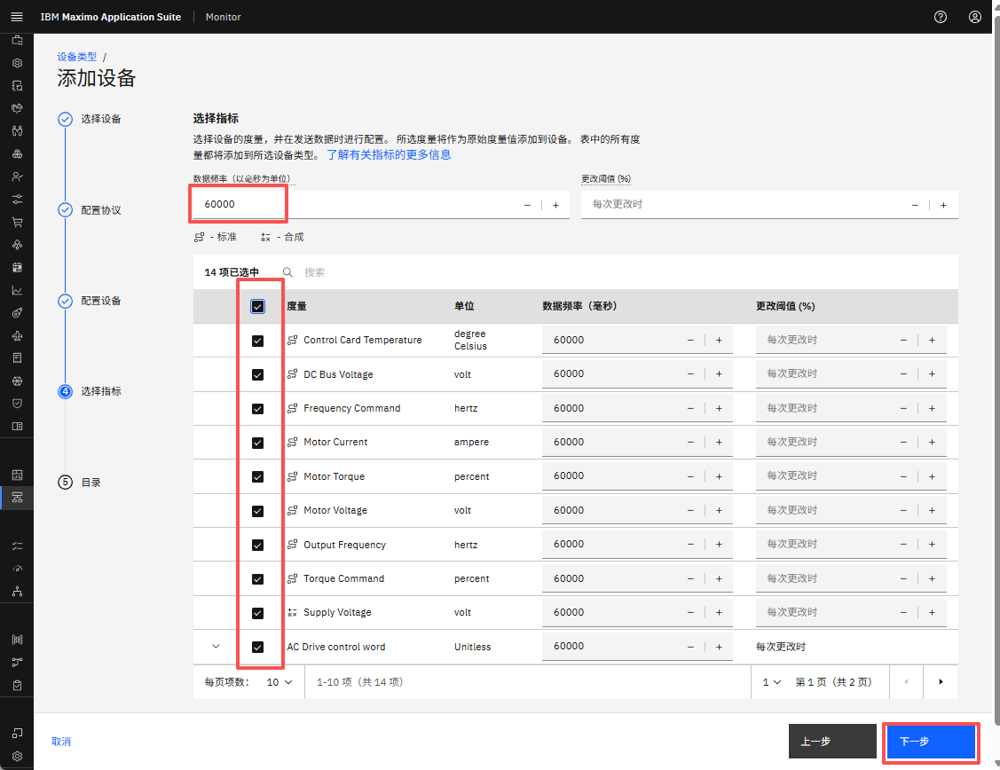  

您现在可以看到两个 VFD 设备： 
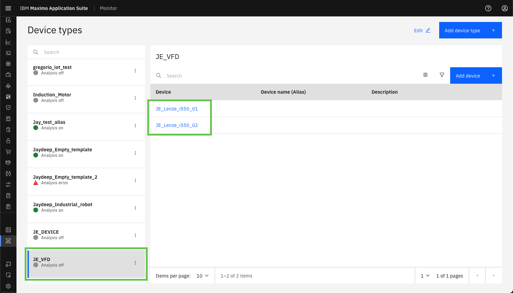  

在左侧菜单的 Monitor 部分中展开设置并选择 `网关`： 
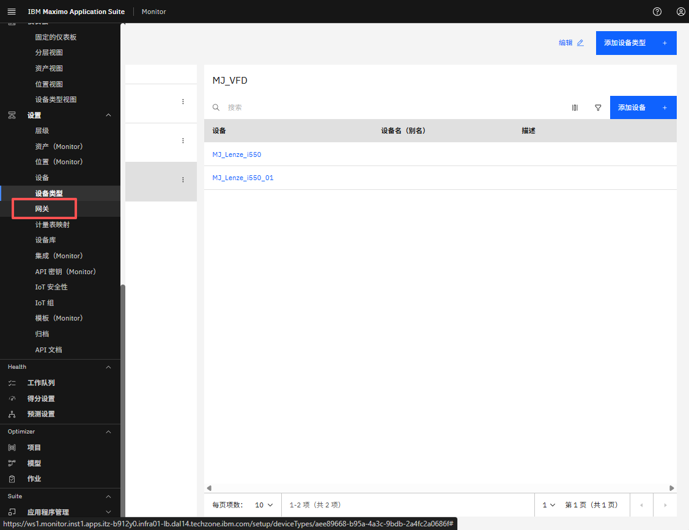  

筛选以查找并选择您的网关 
- 选择它，您还应该看到由您的托管网关处理的两个 VFD 设备： 
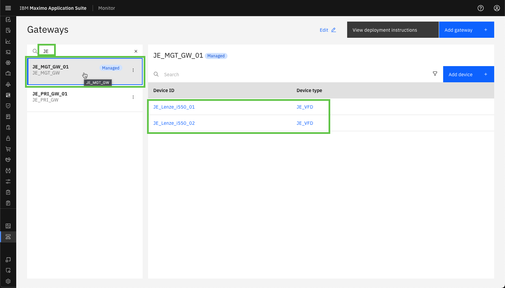  

---
恭喜您已成功向托管网关添加另一个工业设备。 