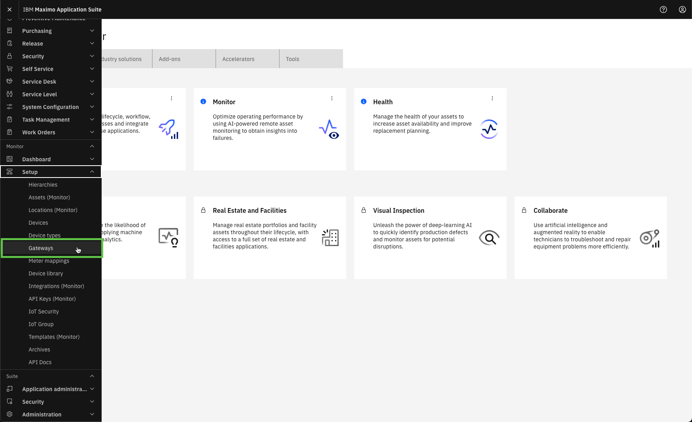
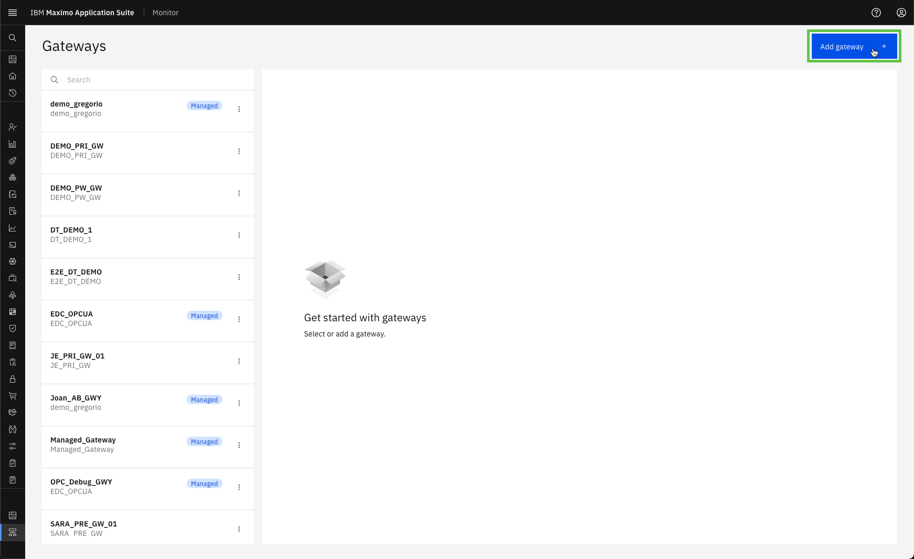
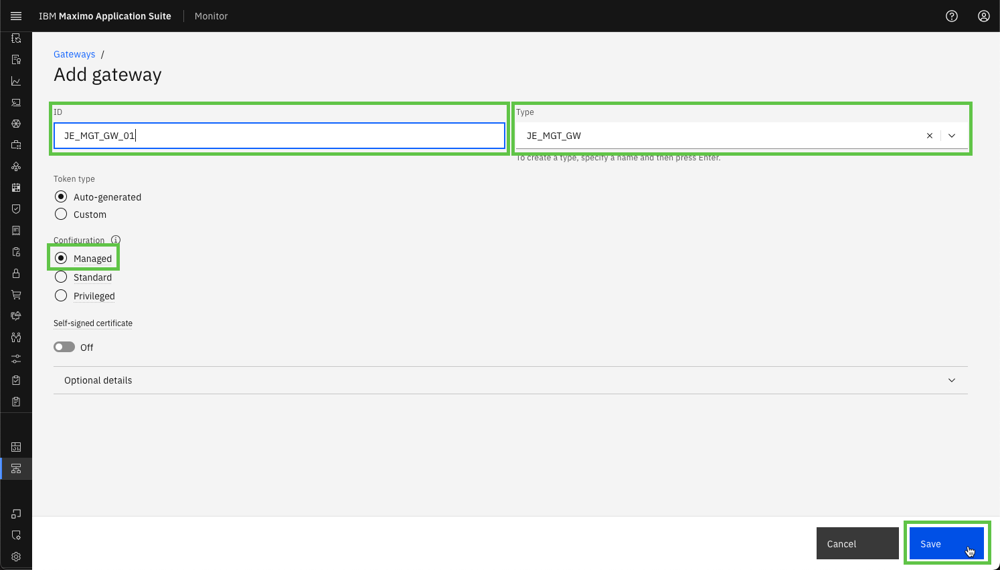
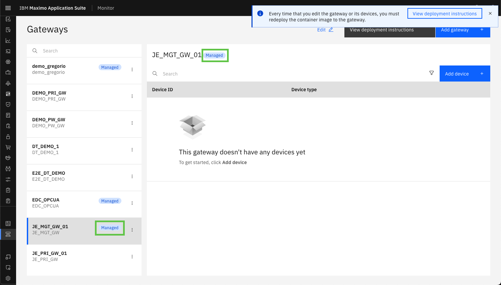

# 目标
在本练习中，您将学习如何在 Monitor 中创建托管网关。

---
*开始之前：*  
本练习要求您已：

1. 完成[所有实验](prereqs.md)所需的前置条件
2. 完成之前的练习

---

登录到 MAS：
  

在左侧菜单的 Monitor 部分下展开设置并选择网关：

!!! note "MAS 9.1 中的新功能"
    Monitor 不再有主页。与 Monitor 的所有交互都从左侧菜单的 Monitor 部分启动 

 
选择 `Add gateway`：
  

定义网关 ID `XX_MGT_GW_01` 和网关类型 `XX_MGT_GW`。

!!! tip
    如果其他人在同一个 Maximo Application Suite 环境中学习本实验，网关 ID 和类型中的 XX 应该是您的姓名首字母缩写。

确保网关配置为托管（Managed）并点击 `Save`：
  

您现在将看到您的新托管网关，在网关列表和网关定义中都包含 `Managed` 标签：
 

!!! note
    凭据会自动"嵌入"到托管网关的 docker 镜像中。 
    这意味着凭据不会像其他网关配置类型那样呈现给您。 

---
恭喜您已成功在 Monitor 中创建托管网关。 