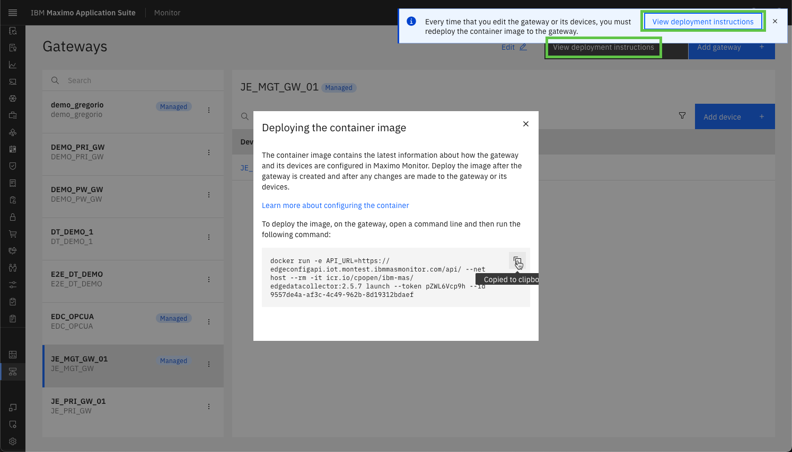
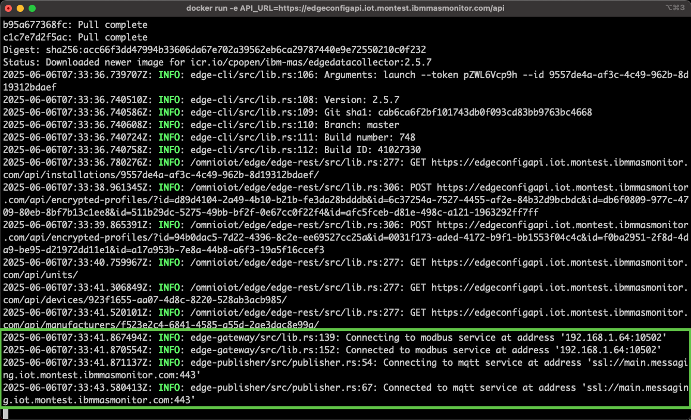
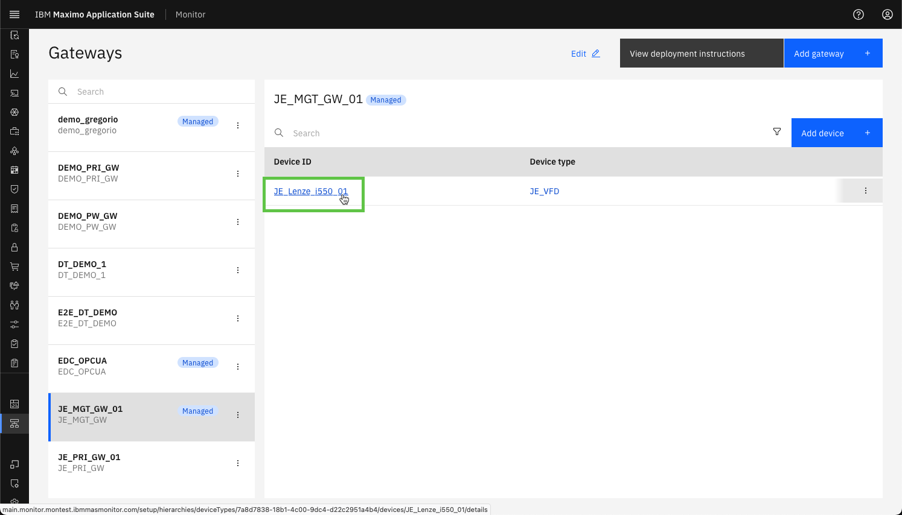
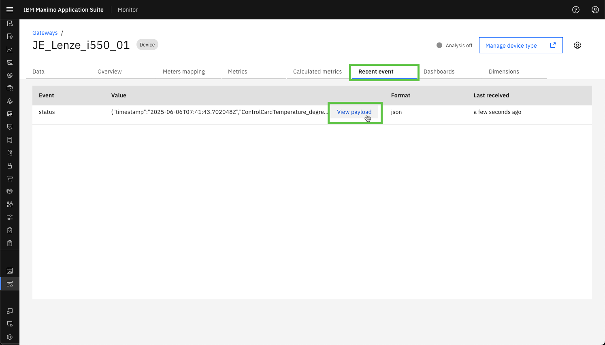
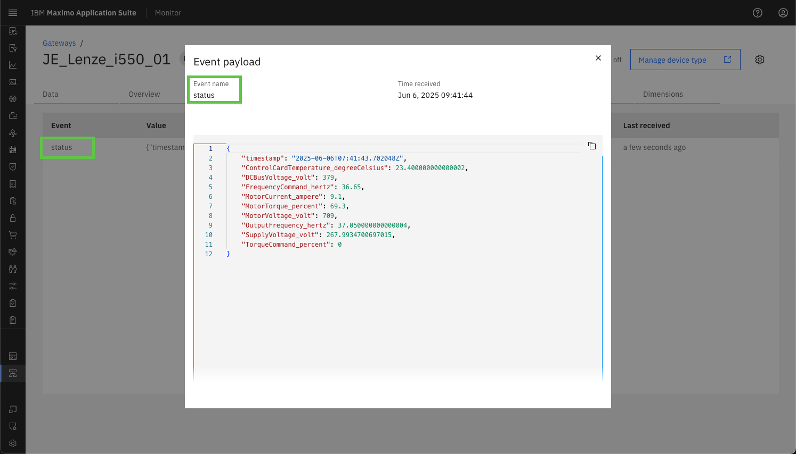

# 目标
在本练习中，您将学习如何：

* 部署托管网关
* 验证数据流入

---
*开始之前：*  
本练习要求您已：

1. 完成[所有实验](prereqs.md)和本练习所需的前置条件
2. 完成之前的练习
3. 验证模拟器正在运行，如[练习 1](setup_simulator.md){target=_blank}中所述

---

## 部署托管网关

在网关列表中查看您的托管网关时，按 `View deployment instructions`。</br>
点击 docker 命令将其复制到剪贴板：
</br></br>

打开一个终端窗口（Mac/Linux）或命令窗口（Windows），在您想要运行托管网关的位置，然后从剪贴板粘贴 docker 命令行。点击回车执行它，您应该看到类似以下内容：


!!! tip "提示"
	您可以看到托管网关已成功使用 modbus 协议建立与 Modbus 模拟器的连接。</br>
    其次，您还可以看到托管网关和 Maximo Monitor 之间建立了 MQTT 连接</br>
    
    第一次部署时，您可能会收到类似以下响应：`Unable to find image 'icr.io/cpopen/ibm-mas/edgedatacollector:2.5.7' locally`</br>
	请耐心等待，边缘数据收集器 docker 容器正在下载和启动。</br>


## 验证选定的 Lenze VFD 数据流入 Monitor

点击打开 `XX_Lenze_i550_01` 设备：
</br></br>

导航到 `Recent event` 并等待一分钟（您知道添加设备时定义的那 60000 毫秒），直到第一条消息传入。</br>
</br></br>

点击 `View payload` 并查看发送到事件名称 `status` 的数据点：</br>
</br></br>

这些是您在将设备添加到托管网关时选择的数据点：

``` json
{
    "timestamp": "2025-06-06T07:41:43.702048Z",
    "ControlCardTemperature_degreeCelsius": 23.400000000000002,
    "DCBusVoltage_volt": 379,
    "FrequencyCommand_hertz": 36.65,
    "MotorCurrent_ampere": 9.1,
    "MotorTorque_percent": 69.3,
    "MotorVoltage_volt": 709,
    "OutputFrequency_hertz": 37.050000000000004,
    "SupplyVoltage_volt": 267.9934700697015,
    "TorqueCommand_percent": 0
}
```


---
恭喜您已成功部署并验证数据流入。</br>