# 目标
在本练习中，您将学习如何：

* 停止并重新部署托管网关
* 在 Monitor 仪表板中查看传入数据

---
*开始之前：*  
本练习要求您已：

1. 完成[所有练习](prereqs.md)和练习 4 所需的前置条件
2. 完成之前的练习
3. 验证模拟器正在运行，如[练习 1](setup_simulator.md){target=_blank}中所述

---

## 重新部署托管网关

转到当前托管网关 docker 容器正在运行的位置。 
使用 `Ctrl-p & Ctrl-q` 返回到提示符。 
使用 `docker ps` 命令查看正在运行的 docker 容器。 
找到正在运行的托管网关容器的 CONTAINER ID（查找 `edgedatacollector`）- 这里是 `fd0e37d3ddb5`。 
使用 `docker kill <CONTAINER ID>` 命令停止 docker 容器。
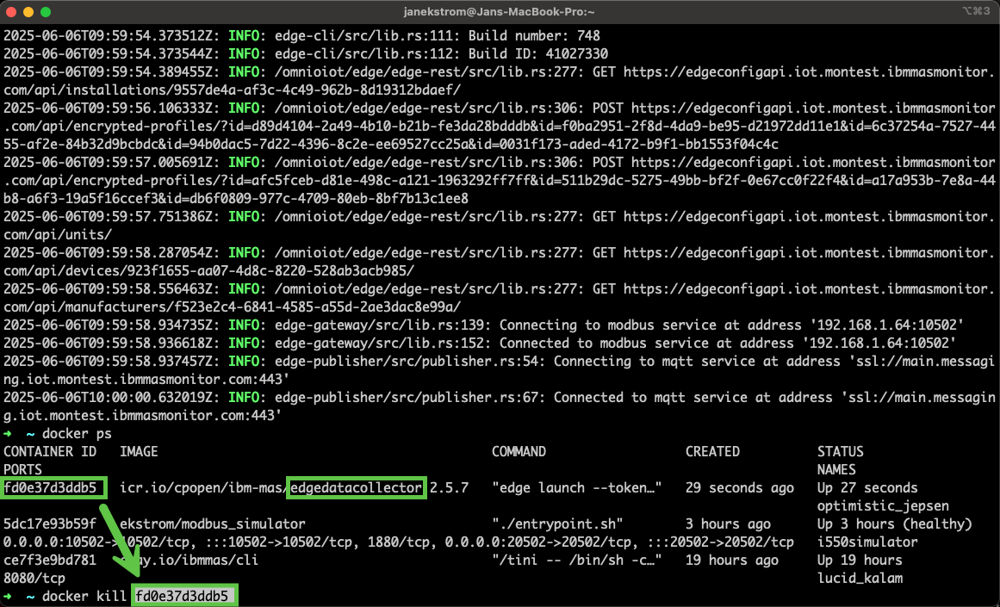  

导航回 Monitor 中的托管网关并按 `View deployment instructions`。 
点击 docker 命令将其复制到剪贴板：
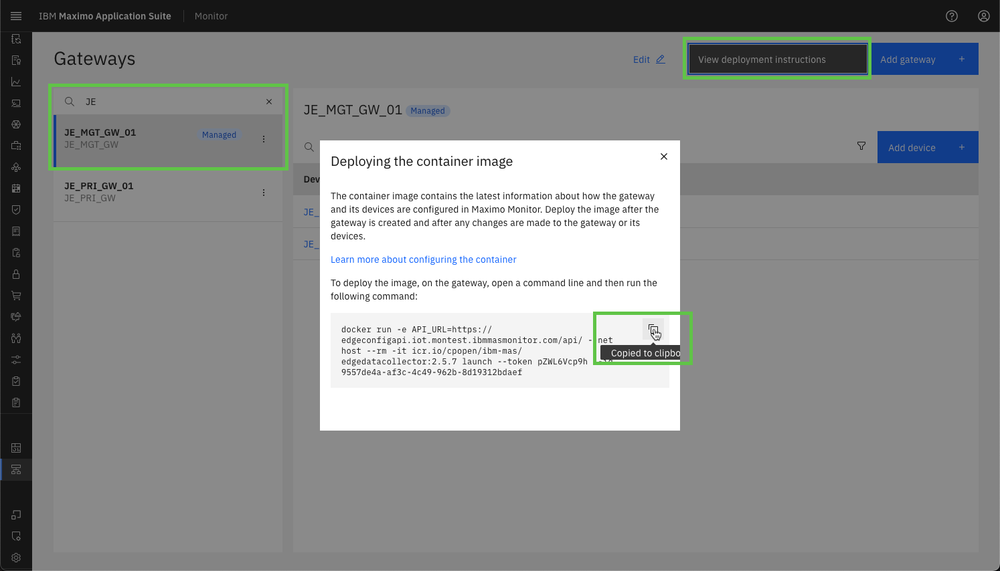  

返回终端，然后从剪贴板粘贴 docker 命令行。 
点击回车执行它，您应该看到类似以下内容：
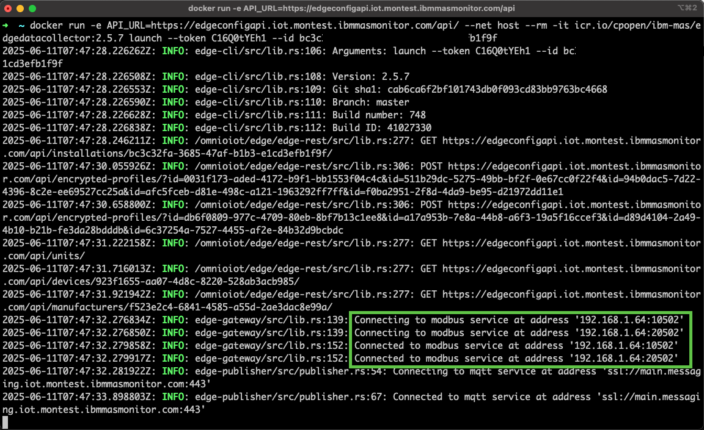 

!!! tip
	您可以看到您已成功连接到端口 10502 和 20502 上的两个模拟 Lenze i550 VFD。 

## 在 Monitor 仪表板中查看数据

导航到 Monitor 仪表板部分中的 `Device types view`：
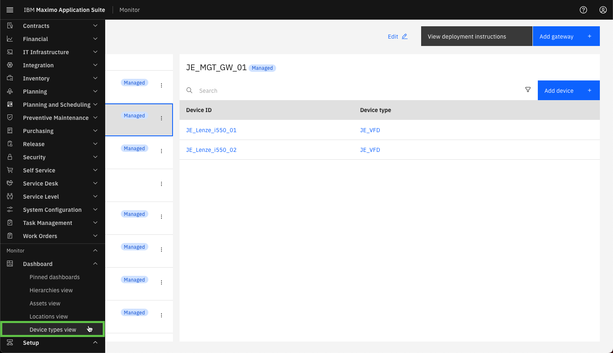  

按您的凭据筛选并打开以查看所有 VFD 设备。 
选择 `XX_Lenze_i550_01` 设备，然后点击 `Create dashboard`：
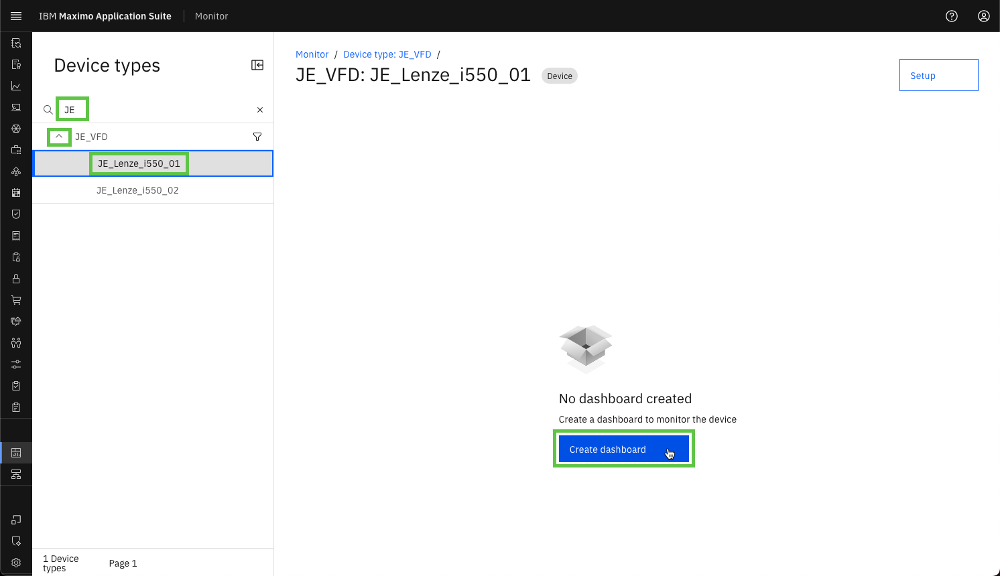  

为您的新仪表板命名并按 `Configure dashboard`： 
  

您现在将看到一个空的仪表板配置。通过点击它添加时间序列线卡： 
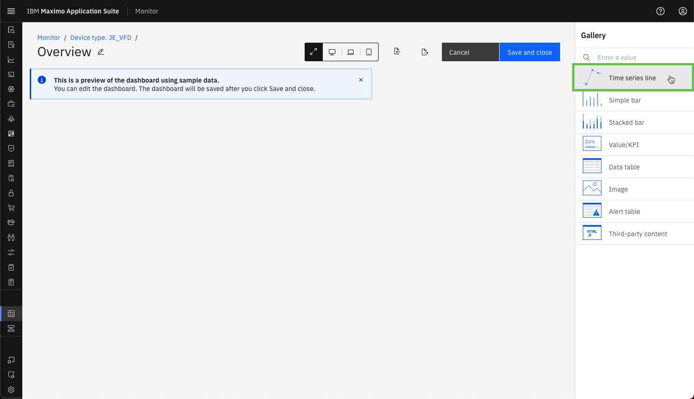  

在 `Data item` 下拉列表中找到 `Control Card Temperature` 并将时间范围更改为 `Last 24 hours`。 
为卡片命名，如 `Temperature [℃]`，并拖动右下角将卡片调整为全宽。 
完成后，再添加另一个时间序列线卡： 
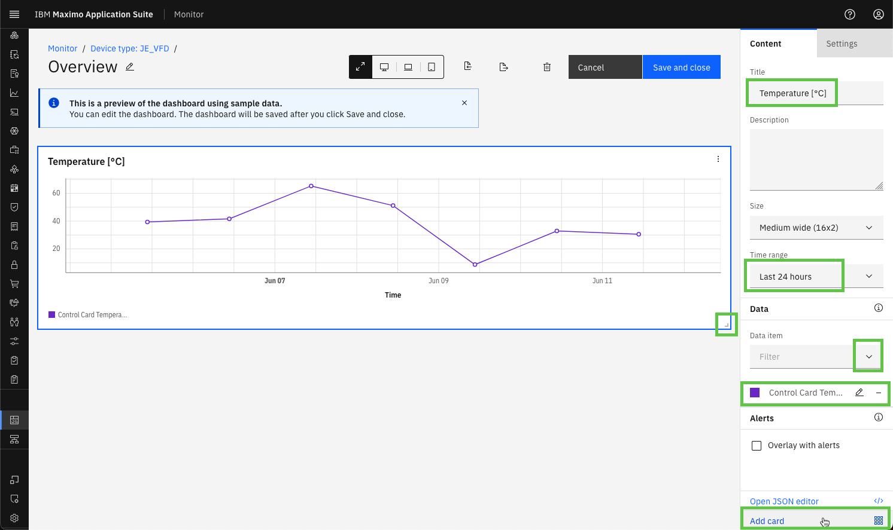  

根据下面的屏幕截图配置第二个时间序列线卡并按 `Save and close`：
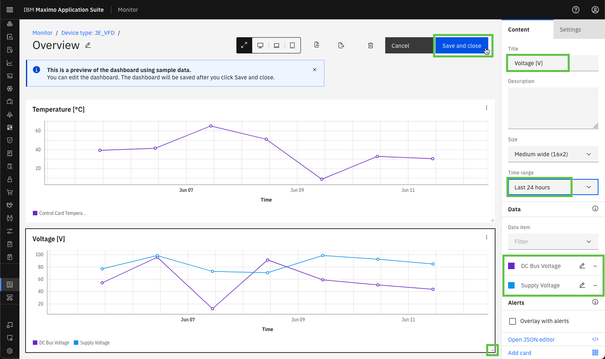  

您现在已创建一个简单的仪表板来查看 `XX_Lenze_i550_01` 的一些数据。 
选择第二个设备： 
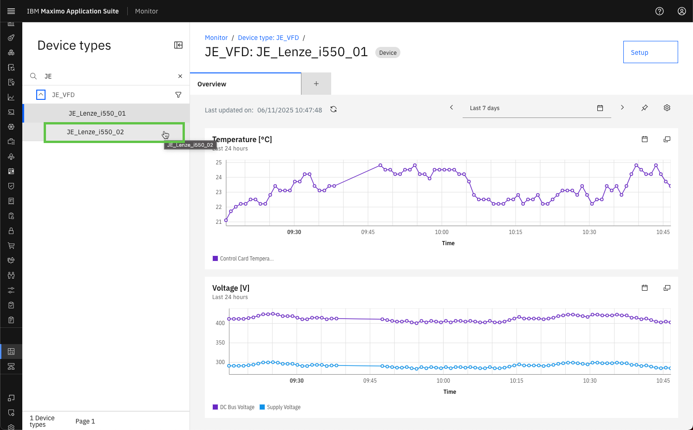  

请注意，仪表板是在设备类型级别配置的，因此也将用于 `XX_Lenze_i550_02` 设备  
- 但显然使用一些其他数据： 
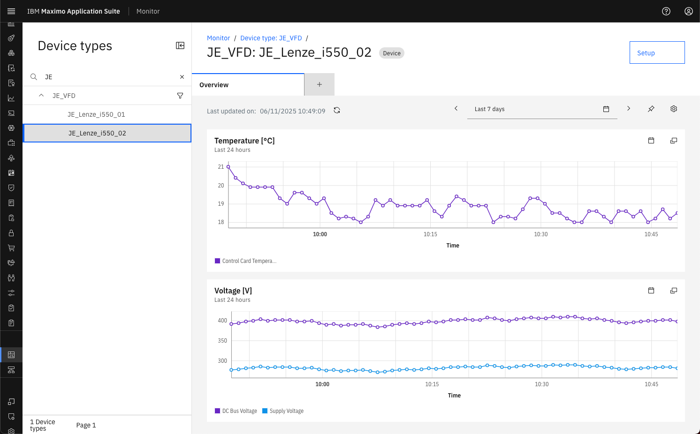  

您现在可以创建这样的仪表板 😎： 
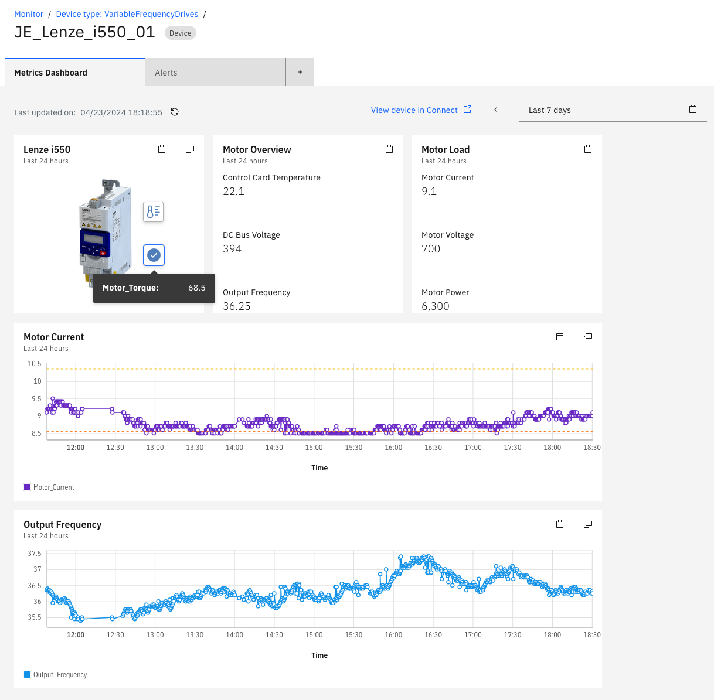 

!!! tip
    上面的仪表板还使用了一个图像卡和两个额外的值/KPI 卡。请尝试并享受乐趣 🤗

---
恭喜您已成功重新部署并在 Monitor 仪表板中查看来自两个 VFD 的数据。本实验到此结束。  