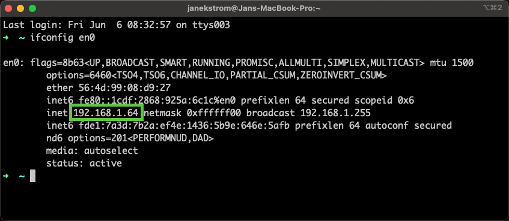
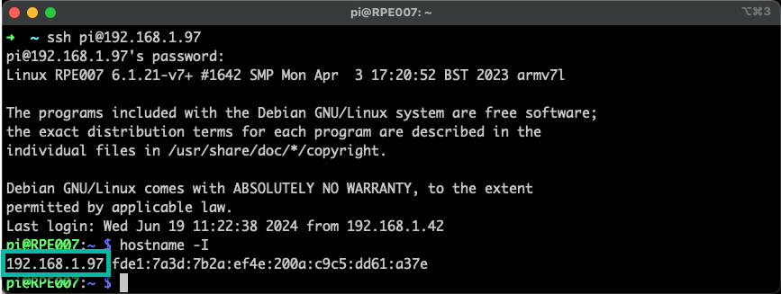
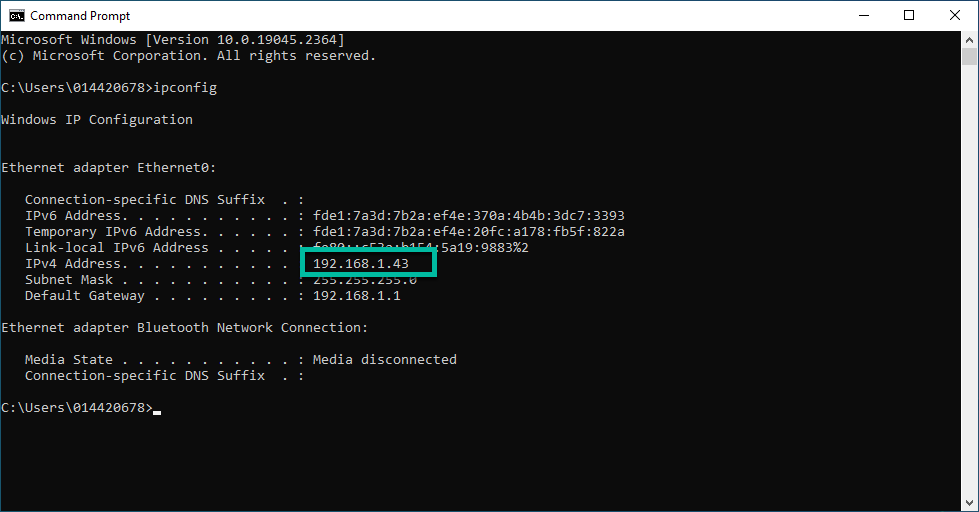

# 目标
在本练习中，您将学习如何：

* 安装 Modbus 模拟器

---
*开始之前：*  
本练习要求您已：

1. 完成[所有实验](prereqs.md)所需的前置条件

---

本练习中的模拟器使用动态多平台 Modbus 模拟器，您可以按照以下实验进行安装：</br>
[IBM Maximo Monitor Modbus 模拟器实验](../../monitor_modbus_simulator){target=_blank}

无论您使用哪个版本，都需要运行模拟器的机器的 IP 地址。稍后在配置托管网关时会用到它。

#### 在 macOS 上获取 IP 地址

使用以下命令：
```` bash
ifconfig en0
````



!!! tip
    如果您没有看到上述屏幕，请使用不带任何参数的 `ifconfig`，</br>
    然后在其他接口中搜索类似的 IP 地址。

</br>

#### 在 LINUX 上获取 IP 地址

使用以下命令： 
```` bash
hostname -I
````

</br></br>

#### 在 Windows 上获取 IP 地址

使用以下命令：
```` bash
ipconfig
````

</br>

---
恭喜您已成功设置模拟器环境。</br>