# 目标
在本练习中，您将学习如何在 Monitor 中创建托管网关并添加您已添加到设备库的新设备。

---
*开始之前：*  
本练习要求您已：

1. 完成[所有实验](prereqs.md)所需的前置条件
2. 完成之前的练习

---

#### 添加托管网关

登录到 MAS 并导航到 Monitor（如果尚未完成）：
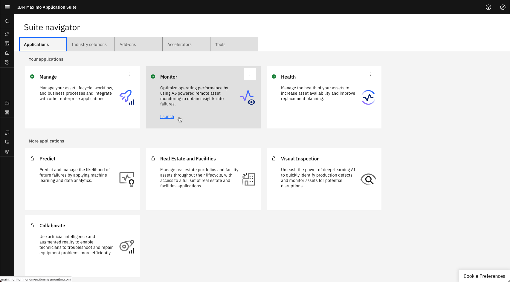  

在左侧菜单中展开 Monitor | 设置部分并选择网关：
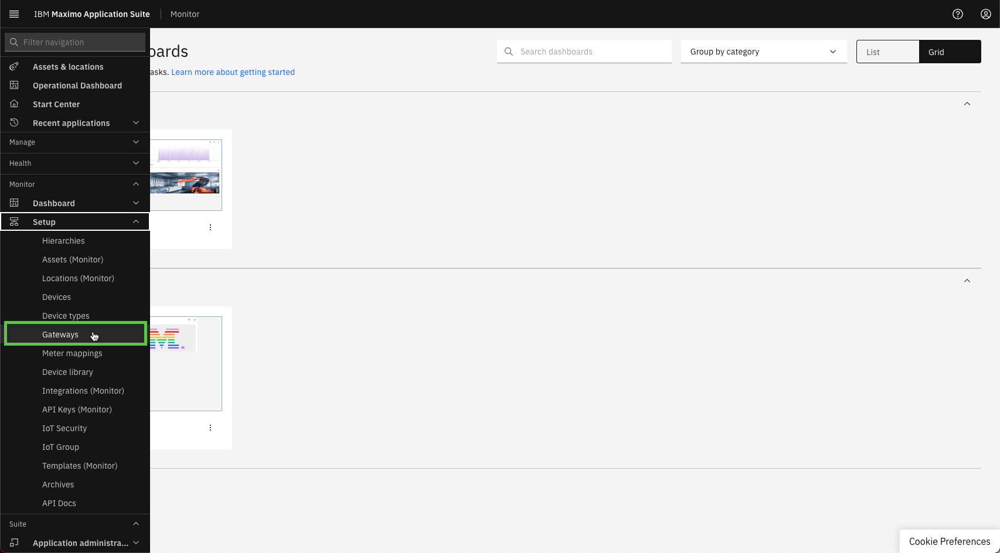 

!!! note "MAS 9.1 中的新功能"
    Monitor 不再有主页。与 Monitor 的所有交互都从左侧菜单的 Monitor 部分启动 

 
选择 `Add gateway`：
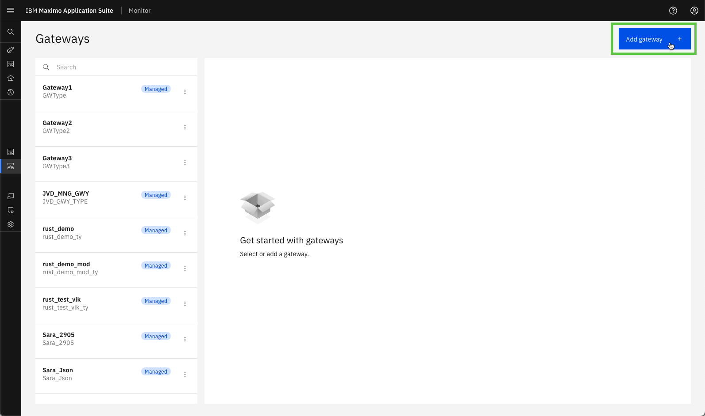  

定义网关 ID `XX_MGT_GW_01` 和网关类型 `XX_MGT_GW`。 

!!! tip
    如果其他人在同一个 Maximo Application Suite 环境中学习本实验，网关 ID 和类型中的 XX 应该是您的姓名首字母缩写。 

确保网关配置为托管（Managed）并点击 `Save`：
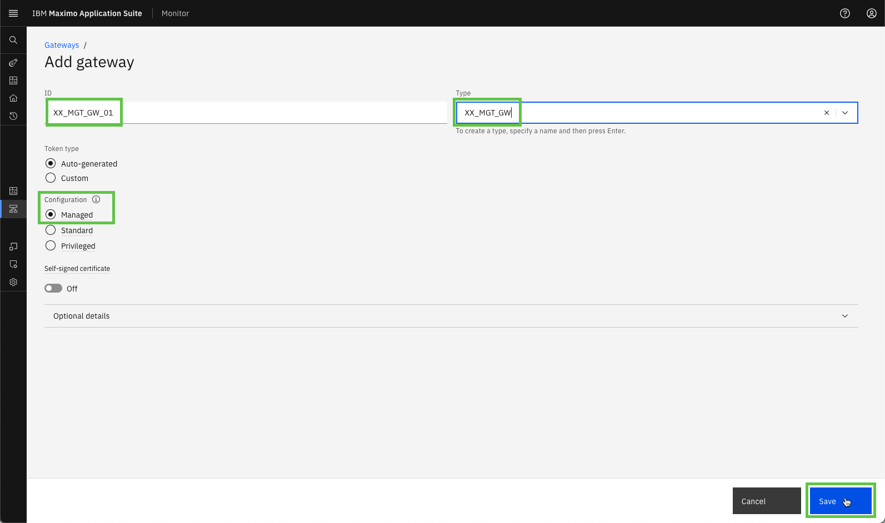  

您现在将看到您的新托管网关，在网关列表和网关定义中都包含 `Managed` 标签：
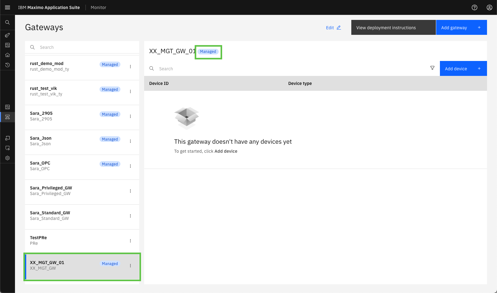 

!!! note
    凭据会自动"嵌入"到托管网关的 docker 镜像中。 
    这意味着凭据不会像其他网关配置类型那样呈现给您。 

 

#### 将您的新设备添加到托管网关

在托管网关中点击 `Add device`： 
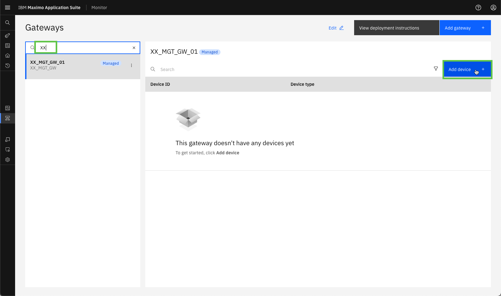  

由于这是托管网关，`Use device library` 会自动选中，因为只能使用设备库中的设备。 
只需点击 Continue 🤗 
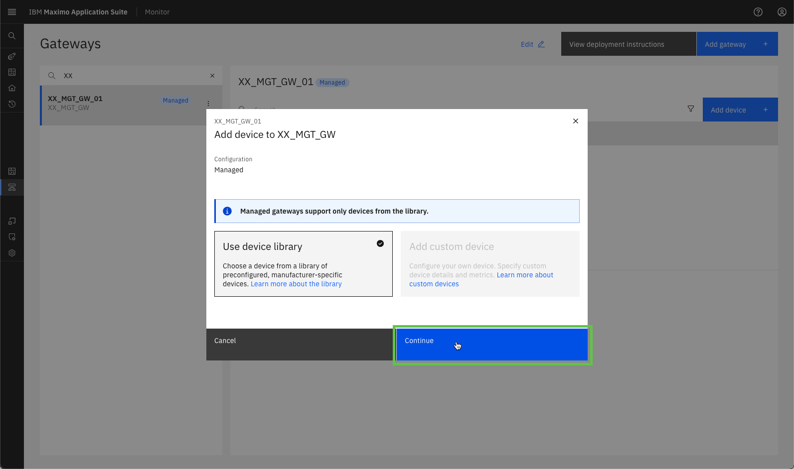  

在制造商列表中搜索 Siemens： 
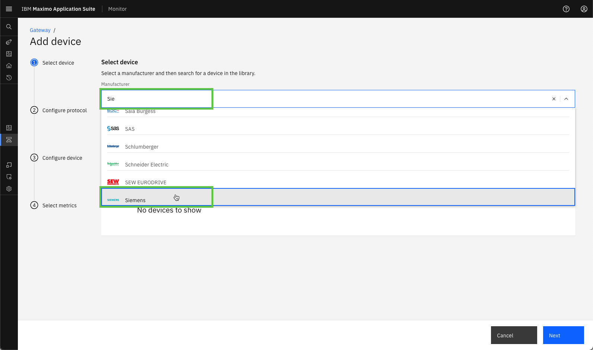  

然后在 Siemens 设备的长列表中搜索 S7 设备 - 在 `S7 OPC-UA Server` 下选择您新添加的设备，并点击 `Next`： 
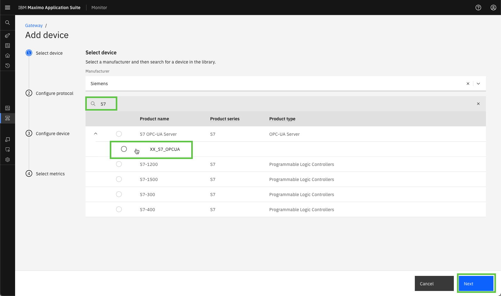  

添加 OPC UA 服务器 IP 地址和端口，并点击 `Next`： 
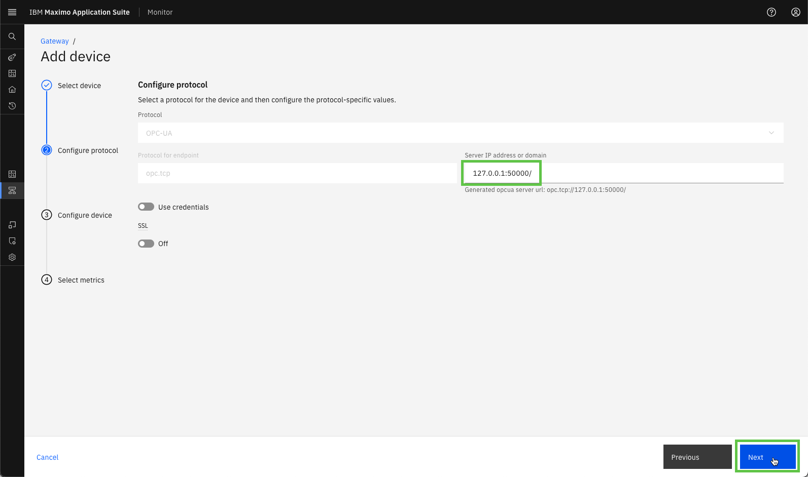  

定义设备类型和设备 ID（使用您的姓名首字母缩写代替 XX），并点击 `Next`： 
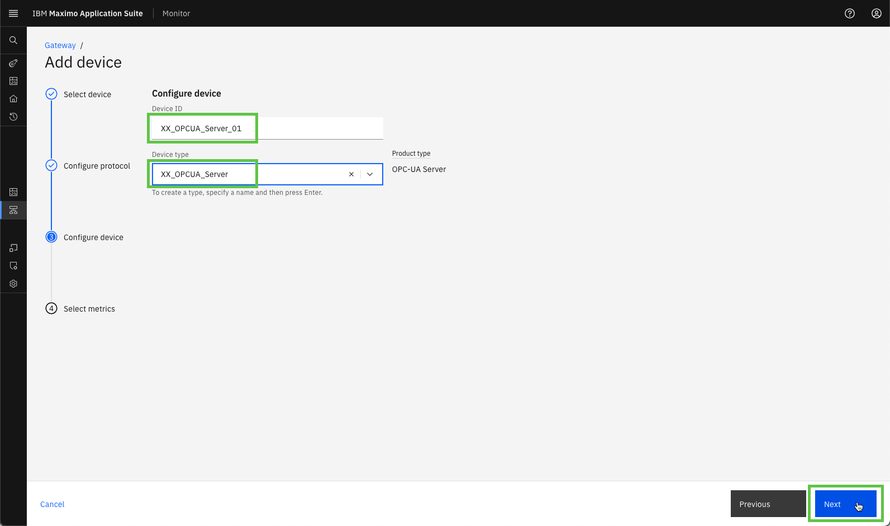  

将数据频率设置为 30000 毫秒（30秒）并选择以下 7 个数据标签作为 Monitor 中的指标。完成后点击 `Save`： 
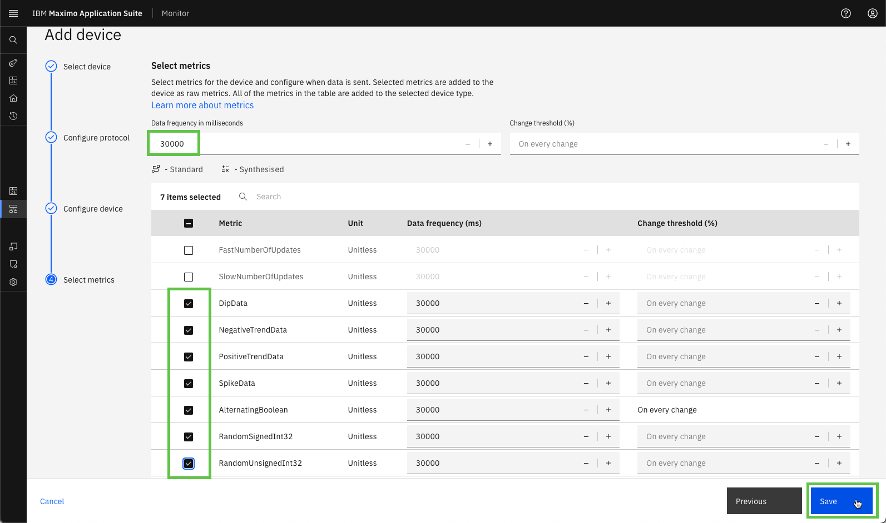  

您现在将看到您新添加的设备成为新托管网关的一部分： 
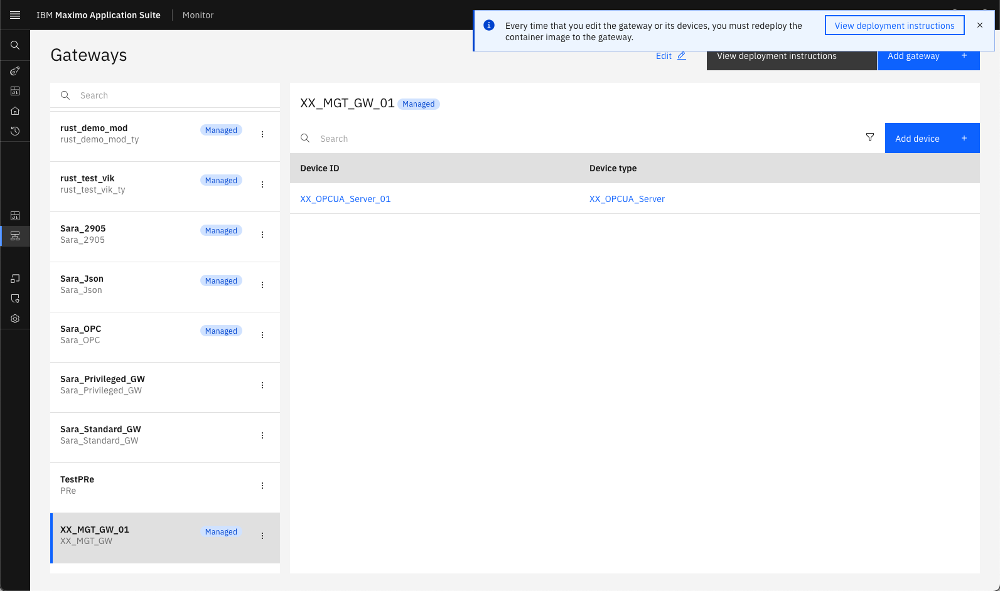  

---
恭喜您已成功在 Monitor 中创建托管网关并添加了设备库中新添加设备的实例。 