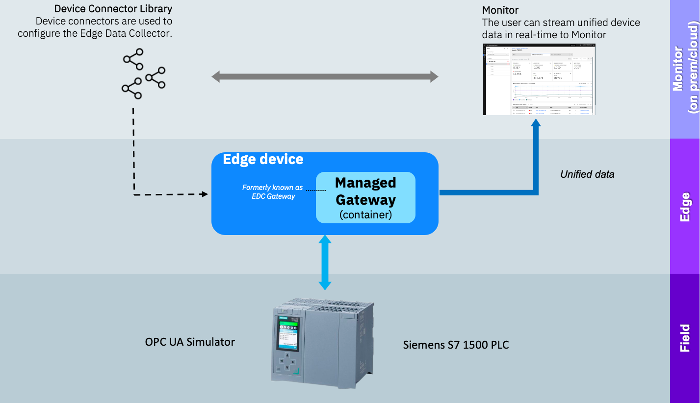

# 欢迎来到 Maximo Monitor 9.1 托管网关 OPC UA 实验

!!! info
    本 Maximo Monitor 实验演示如何使用设备库中的自定义设备。

在本实验中，您将学习成功使用 OPC UA 模拟器作为 Siemens S7 PLC 并使用托管网关将 Siemens S7 的数据传输到 Maximo Monitor 所需的步骤。  

  

!!! tip
    如果您想了解更多关于 OPC UA 服务器的信息，请访问 [OPC Foundation OPC UA 服务器页面](https://reference.opcfoundation.org/Core/Part1/v104/docs/6.3){target=_blank}

练习将涵盖：

* 设置 OPC UA 模拟器
* 通过利用设备扫描向设备库添加新设备
* 创建托管网关并添加设备
* 验证从 Siemens S7 PLC 通过 OPC UA 到 Maximo Monitor 的数据流
* 享受乐趣

!!! note
    完成整个实验的预计时间：1小时

---

**更新时间：2025-06-24**

---
