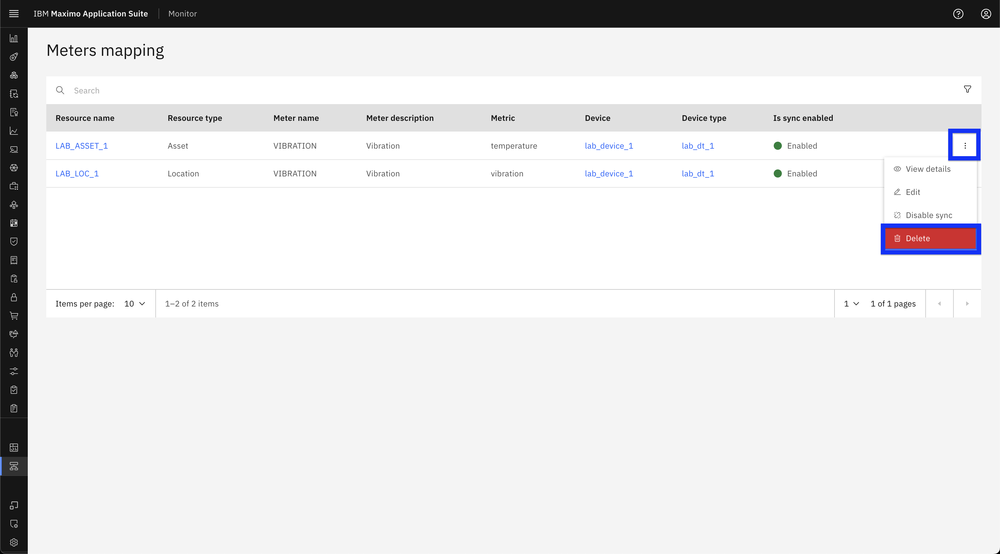
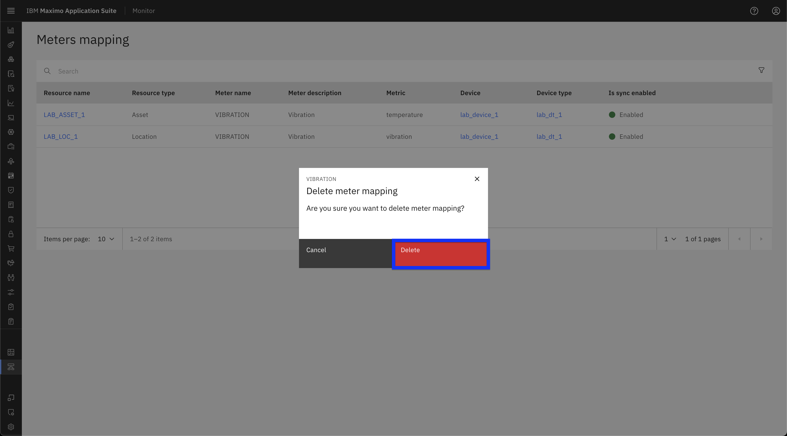

# 目标
在本练习中，您将学习如何：

* 删除仪表/指标映射

---
**开始之前：**

本练习要求您已经：

1. 完成[所有实验](prereqs.md)所需的前置条件
2. 完成[之前的练习](setup.md)
 
---

按照以下步骤删除仪表/指标映射：

1. 导航到 MAS Monitor UI 中的 Meter Mappings 页面。[参考之前的练习](setup.md/#访问仪表指标映射)。

2. 点击您要删除的仪表映射旁边的三点菜单。
3. 从下拉菜单中选择 **Delete**。
  

5. 点击 **Delete** 确认删除。
  

!!! Attention
    此操作是永久性的，无法撤消。请确保您删除的是正确的仪表映射。

---
🎉 恭喜！您已成功学会如何删除仪表/指标映射。